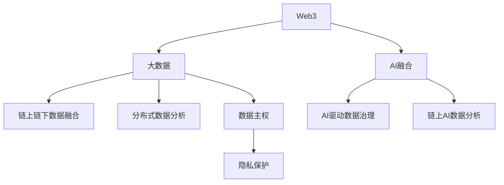

# 3. Web3大数据与AI融合

## 3.1 链上链下数据融合

- 区块链与传统大数据平台的数据互操作
- 数据采集、同步、清洗与融合

## 3.2 分布式数据分析与治理

- 分布式数据存储、分片、数据可用性
- AI驱动的数据治理、数据质量与一致性

## 3.3 数据主权与隐私保护

- 数据主权、数据确权、链上数据授权与访问控制
- 隐私保护与合规性分析

## 3.4 链上AI数据分析与智能合约

- AI驱动的链上数据分析、预测与决策
- 智能合约自动化数据处理与AI集成
- Rust/Golang+AI集成代码片段

## 3.5 行业案例与最佳实践

- Ocean Protocol、Fetch.ai、The Graph等Web3大数据与AI项目
- 行业最佳实践与标准化建议

## 3.6 Mermaid知识图谱示例

## 3.7 参考文献与外部链接

- [Ocean Protocol](https://oceanprotocol.com/)
- [Fetch.ai](https://fetch.ai/)
- [The Graph](https://thegraph.com/)
