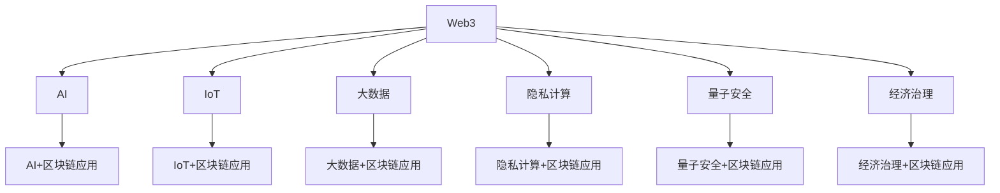

# 5. Web3跨领域综合

## 5.1 理论与架构融合

- Web3与AI、IoT、大数据、隐私计算、量子安全、经济治理等多领域理论交叉
- 跨领域协同架构、数据流、共识与安全机制

## 5.2 典型应用与案例

- AI驱动的链上治理与数据分析
- IoT设备可信数据采集与链上自动化
- 大数据与区块链融合的数据主权与分析
- 隐私计算与零知识证明在多领域的集成
- 量子安全区块链与未来防护

## 5.3 未来趋势与挑战

- 多领域协同创新、标准化、模块化、可组合化
- 行业最佳实践与全球协作平台

## 5.4 Mermaid知识图谱示例

## 5.5 参考文献与外部链接

- [Web3 Foundation](https://web3.foundation/)
- [Ocean Protocol](https://oceanprotocol.com/)
- [Fetch.ai](https://fetch.ai/)
- [QANplatform](https://www.qanplatform.com/)
