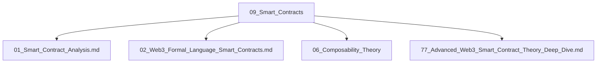

# 09_Smart_Contracts 智能合约主题分层导航

## 目录结构

- 智能合约分析
- 形式化语言与合约
- 合约可组合性
- 高级/深度理论
- 归档（见 99_Recycle_Bin 或 00-备份）

## 主题导航

- 返回 [全局索引](../00_Index_and_Classification.md)
- 交叉引用：[知识图谱](../00_Knowledge_Graph.md)

## Mermaid知识图谱锚点

