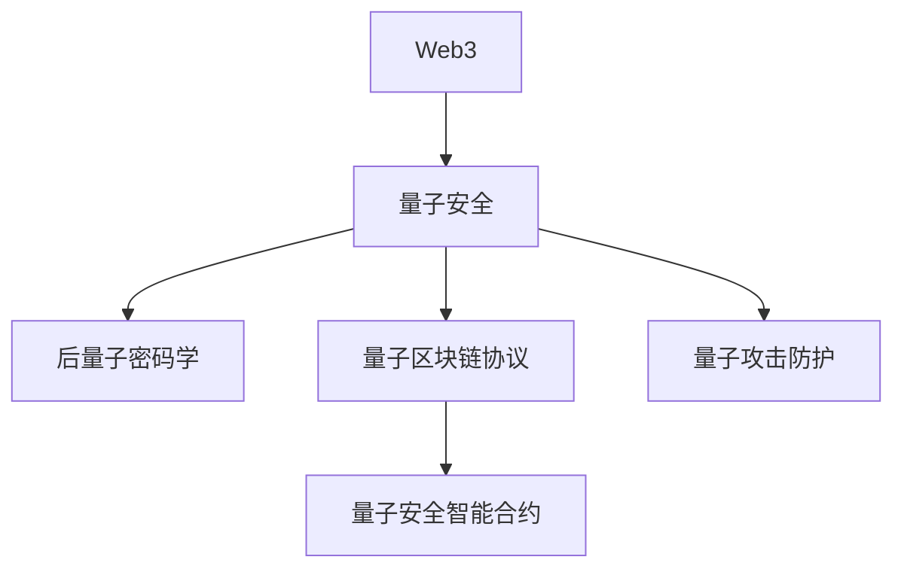

# 1. Web3量子安全与区块链

## 1.1 量子抗性密码学

- 后量子密码算法（格基、哈希、签名、编码等）
- NIST后量子密码标准进展
- 量子安全密钥管理与签名机制

## 1.2 量子区块链协议

- 量子安全共识协议、量子随机数、量子通信链路
- 量子区块链架构与典型实现

## 1.3 量子攻击威胁与防护

- Shor算法、Grover算法对现有区块链的威胁
- 未来防护机制与升级路径

## 1.4 量子安全智能合约

- 量子安全合约设计、量子密钥分发集成
- Rust/Golang代码片段

## 1.5 行业案例与最佳实践

- QANplatform、Quantum Resistant Ledger等量子安全区块链项目
- 行业最佳实践与标准化建议

## 1.6 Mermaid知识图谱示例

## 1.7 参考文献与外部链接

- [NIST PQC项目](https://csrc.nist.gov/projects/post-quantum-cryptography)
- [QANplatform](https://www.qanplatform.com/)
- [Quantum Resistant Ledger](https://theqrl.org/)
