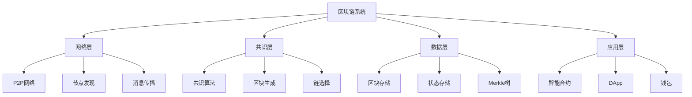

# 区块链基础理论形式化分析

## 目录

1. [区块链系统形式化定义](#1-区块链系统形式化定义)
2. [分布式账本理论](#2-分布式账本理论)
3. [区块结构与状态转换](#3-区块结构与状态转换)
4. [共识机制基础](#4-共识机制基础)
5. [密码学基础](#5-密码学基础)
6. [智能合约形式化模型](#6-智能合约形式化模型)
7. [可扩展性理论](#7-可扩展性理论)
8. [经济学模型](#8-经济学模型)
9. [隐私与监管平衡](#9-隐私与监管平衡)
10. [未来发展趋势](#10-未来发展趋势)

## 1. 区块链系统形式化定义

### 1.1 区块链系统五元组模型

**定义 1.1 (区块链系统)**
区块链系统是一个五元组 $BC = (N, B, S, T, C)$，其中：

- $N$ 表示参与网络的节点集合
- $B$ 表示区块集合，其中每个区块包含一组交易
- $S$ 表示系统状态空间
- $T$ 表示有效状态转换函数集合
- $C$ 表示共识协议

**定义 1.2 (区块链核心特性)**
区块链系统具有以下核心特性：

1. **去中心化**：$\forall n_1, n_2 \in N : \text{rank}(n_1) = \text{rank}(n_2)$
2. **不可篡改性**：$\forall b \in B : \text{一旦确认，极难修改}$
3. **可追溯性**：$\forall t \in \text{交易} : \text{可完整追溯}$
4. **透明性**：$\forall s \in S : \text{对所有参与者透明}$
5. **自动化执行**：$\forall \text{合约} : \text{自动执行业务逻辑}$

### 1.2 区块链系统架构



## 2. 分布式账本理论

### 2.1 分布式账本形式化定义

**定义 2.1 (分布式账本)**
分布式账本 $L$ 是一个有序区块序列 $L = (B_0, B_1, \ldots, B_n)$，满足：

1. $B_0$ 是创世区块
2. 对于任意 $i > 0$，$B_i$ 包含 $B_{i-1}$ 的哈希值
3. 每个区块 $B_i$ 都经过网络中大多数节点的验证和共识

**定理 2.1 (账本一致性)**
在诚实节点占多数且网络最终同步的条件下，所有诚实节点最终将就账本状态达成一致。

**证明：**
考虑诚实节点 $n_1$ 和 $n_2$，它们各自维护账本 $L_1$ 和 $L_2$。假设在某个时间点，两个账本存在分歧，即存在索引 $k$ 使得 $L_1[0:k-1] = L_2[0:k-1]$ 但 $L_1[k] \neq L_2[k]$。

根据共识协议 $C$，一个区块只有获得网络中大多数节点的认可才能被添加到账本。由于诚实节点占多数，且遵循相同的验证规则，不可能存在两个不同的区块同时获得多数节点的认可。因此，当网络最终同步时，诚实节点将接受最长有效链，从而 $L_1$ 和 $L_2$ 最终将会一致。■

### 2.2 账本安全性分析

**定义 2.2 (账本安全性)**
账本 $L$ 是安全的，如果满足：

1. **一致性**：$\forall n_1, n_2 \in N_{\text{honest}} : \text{最终} L_1 = L_2$
2. **活性**：$\forall \text{有效交易} t : \text{最终} t \in L$
3. **持久性**：$\forall b \in L : \text{一旦确认，永久存在}$

**定理 2.2 (安全性界限)**
在拜占庭容错模型中，如果恶意节点比例 $f \geq \frac{1}{3}$，则无法保证账本安全性。

**证明：**
假设存在一个能够容忍 $f \geq \frac{1}{3}$ 恶意节点的共识算法。考虑网络被分成三个相等大小的组：$G_1$, $G_2$ 和 $G_3$，每组包含 $\frac{n}{3}$ 个节点。

假设 $G_1$ 中的所有节点是恶意节点，它们向 $G_2$ 报告值为0，向 $G_3$ 报告值为1。同时，$G_2$ 中的诚实节点持有值0，$G_3$ 中的诚实节点持有值1。

在这种情况下，$G_2$ 中的节点无法区分以下两种情况：

1. $G_1$ 是诚实的且值为0，$G_3$ 是恶意的
2. $G_3$ 是诚实的且值为1，$G_1$ 是恶意的

因此，$G_2$ 不能确定应该同意值0还是值1，这导致共识失败。■

## 3. 区块结构与状态转换

### 3.1 区块数学表示

**定义 3.1 (区块结构)**
区块的数学表示可以定义为一个四元组 $B = (h_{prev}, tx, nonce, h)$，其中：

- $h_{prev}$ 是前一个区块的哈希值
- $tx$ 是包含在区块中的交易集合
- $nonce$ 是用于满足工作量证明的随机数
- $h$ 是当前区块的哈希值，满足 $h = Hash(h_{prev} || tx || nonce)$

**定义 3.2 (区块有效性)**
区块 $B = (h_{prev}, tx, nonce, h)$ 在区块链 $L$ 上有效，当且仅当：

1. $h_{prev} = L.last().h$，即 $h_{prev}$ 指向链上最后一个区块的哈希
2. $\forall t \in tx$，交易 $t$ 是有效的
3. $h = Hash(h_{prev} || tx || nonce)$
4. $h$ 满足难度要求，即 $h < target$

### 3.2 Merkle树结构

**定义 3.3 (Merkle树)**
给定交易集合 $TX = \{tx_1, tx_2, \ldots, tx_n\}$，其Merkle树根 $root$ 定义为：

- 如果 $n = 1$，则 $root = Hash(tx_1)$
- 如果 $n > 1$，则将 $TX$ 分为两个大致相等的子集 $TX_L$ 和 $TX_R$，计算它们的Merkle根 $root_L$ 和 $root_R$，然后 $root = Hash(root_L || root_R)$

**定理 3.1 (Merkle树包含证明的简洁性)**
对于包含 $n$ 个交易的Merkle树，证明任意交易 $tx_i$ 包含在树中只需要 $O(\log n)$ 的数据。

**证明：**
考虑包含 $n$ 个交易的完全二叉Merkle树。为了证明交易 $tx_i$ 在树中，需要提供从 $tx_i$ 到根的路径上的所有兄弟节点的哈希值。在完全二叉树中，从叶节点到根的路径长度为 $\log_2 n$，因此需要提供 $\log_2 n$ 个哈希值。■

### 3.3 状态转换函数

**定义 3.4 (状态转换函数)**
状态转换函数 $\delta: S \times TX \to S$ 将当前状态 $s \in S$ 和交易 $tx \in TX$ 映射到新状态 $s' \in S$。

对于一个区块 $B$ 中的交易序列 $TX = (tx_1, tx_2, \ldots, tx_m)$，应用到状态 $s$ 上的结果可以表示为：

$$s' = \delta^*(s, TX) = \delta(\delta(...\delta(s, tx_1), ...), tx_m)$$

**定理 3.2 (确定性)**
对于给定的初始状态 $s_0$ 和交易序列 $TX$，状态转换函数 $\delta^*$ 的结果是确定的。

**定理 3.3 (可验证性)**
任何节点都可以独立验证状态转换的正确性，即给定 $s$、$TX$ 和 $s'$，可以验证 $s' = \delta^*(s, TX)$。

## 4. 共识机制基础

### 4.1 共识问题形式化

**定义 4.1 (区块链共识问题)**
在区块链系统中，共识问题是指网络中的诚实节点需要就以下内容达成一致：

1. 交易的有效性
2. 交易的顺序
3. 账本的最终状态

**定义 4.2 (共识协议性质)**
共识协议必须满足以下性质：

1. **一致性**：所有诚实节点最终认可相同的区块链
2. **活性**：有效交易最终会被包含在区块链中
3. **安全性**：无效交易永远不会被包含在区块链中

### 4.2 工作量证明机制

**定义 4.3 (工作量证明)**
给定数据 $D$ 和目标难度 $target$，找到一个随机数 $nonce$，使得 $Hash(D || nonce) < target$。

**定理 4.1 (PoW安全性)**
若诚实节点控制的哈希算力比例为 $p > 0.5$，则攻击者成功执行双花攻击的概率随着确认区块数 $k$ 的增加而指数级下降。

**证明：**
假设攻击者控制的哈希算力比例为 $q = 1 - p < 0.5$。攻击者需要在诚实链增长 $k$ 个区块的情况下，生成一条更长的链。

这可以建模为一个随机游走过程，其中攻击者链长度与诚实链长度的差值 $Z_t$ 的期望增长率为 $q - p < 0$。应用随机游走理论和马尔可夫不等式，可以证明攻击者赶上诚实链的概率为：

$$P(\text{double-spend}) \leq \left(\frac{q}{p}\right)^k$$

由于 $q < p$，随着 $k$ 的增加，这个概率呈指数级下降。■

### 4.3 权益证明机制

**定义 4.4 (权益证明)**
在权益证明中，节点被选为出块者的概率与其持有的权益成正比，即对于持有权益 $s_i$ 的节点 $i$，其被选中的概率为：

$$P(i) = \frac{s_i}{\sum_{j \in N} s_j}$$

**定理 4.2 (权益证明的能效)**
与工作量证明相比，权益证明在相同安全假设下能够显著降低能源消耗。

**证明：**
在PoW中，系统安全性与消耗的总计算能力成正比，因此总能耗随系统价值增长。而在PoS中，系统安全性与质押代币的总价值成正比，能源消耗仅来自验证和网络通信，不随系统价值线性增长。■

## 5. 密码学基础

### 5.1 哈希函数

**定义 5.1 (密码学哈希函数)**
函数 $H: \{0,1\}^* \to \{0,1\}^n$ 是一个密码学哈希函数，若它满足：

1. **抗碰撞性**：难以找到 $x \neq y$ 使得 $H(x) = H(y)$
2. **抗第二原像性**：给定 $x$，难以找到 $y \neq x$ 使得 $H(y) = H(x)$
3. **单向性**：给定 $h$，难以找到 $x$ 使得 $H(x) = h$

**定理 5.1 (链接不可变性)**
若哈希函数 $H$ 满足抗第二原像性，且区块 $B_i$ 包含先前区块 $B_{i-1}$ 的哈希值，则在不改变所有后续区块的情况下，无法修改 $B_{i-1}$ 的内容。

**证明：**
假设攻击者尝试将 $B_{i-1}$ 修改为 $B'_{i-1}$ 且 $B_{i-1} \neq B'_{i-1}$。由于 $B_i$ 包含 $H(B_{i-1})$，要使 $B_i$ 保持有效，攻击者需要找到 $B'_{i-1}$ 使得 $H(B'_{i-1}) = H(B_{i-1})$，这违反了哈希函数的抗第二原像性。■

### 5.2 数字签名

**定义 5.2 (数字签名方案)**
数字签名方案是一个三元组 $(KeyGen, Sign, Verify)$，其中：

- $KeyGen$ 生成密钥对 $(pk, sk)$
- $Sign(sk, m)$ 使用私钥 $sk$ 为消息 $m$ 生成签名 $\sigma$
- $Verify(pk, m, \sigma)$ 使用公钥 $pk$ 验证消息 $m$ 和签名 $\sigma$ 的有效性

**定理 5.2 (数字签名的不可伪造性)**
在适当的安全假设下，对于高效的攻击者 $A$，在没有私钥 $sk$ 的情况下，成功伪造有效签名的概率是可忽略的。

### 5.3 零知识证明

**定义 5.3 (零知识证明)**
对于语言 $L$ 和关系 $R$，零知识证明系统是一个交互式协议 $(P, V)$，其中证明者 $P$ 尝试向验证者 $V$ 证明 $x \in L$，满足：

1. **完备性**：若 $x \in L$，则诚实的 $P$ 和 $V$ 的交互会导致 $V$ 接受
2. **可靠性**：若 $x \notin L$，则对于任何策略的 $P^*$，$V$ 接受的概率可忽略
3. **零知识性**：若 $x \in L$，则 $V$ 从交互中获得的信息不超过 $x \in L$ 这一事实

**定理 5.3 (zk-SNARKs简洁性)**
zk-SNARKs 可以产生常数大小的证明，验证时间为 $O(1)$，与计算的复杂性无关。

**证明：**
zk-SNARKs 通过将计算问题转化为代数电路，然后使用多项式承诺和配对友好的椭圆曲线，可以生成固定大小的证明，并且验证时只需要常数次配对运算。■

## 6. 智能合约形式化模型

### 6.1 智能合约形式化定义

**定义 6.1 (智能合约形式化模型)**
智能合约 $C$ 可以形式化为一个五元组 $(S, I, F, A, \delta)$，其中：

- $S$ 是合约状态空间
- $I \subset S$ 是初始状态集合
- $F \subset S$ 是终止状态集合
- $A$ 是合约支持的操作集合
- $\delta: S \times A \to S$ 是状态转换函数

**定义 6.2 (合约执行轨迹)**
给定初始状态 $s_0 \in I$ 和操作序列 $\alpha = (a_1, a_2, ..., a_n)$ 其中每个 $a_i \in A$，合约 $C$ 的执行轨迹为：

$$s_0 \xrightarrow{a_1} s_1 \xrightarrow{a_2} s_2 \xrightarrow{a_3} \cdots \xrightarrow{a_n} s_n$$

其中 $s_i = \delta(s_{i-1}, a_i)$ 对于 $i = 1, 2, ..., n$。

### 6.2 合约安全属性

**定义 6.3 (合约安全属性)**
智能合约的安全属性可以表示为谓词 $\phi: S \to \{true, false\}$，合约满足该属性当且仅当对于所有可达状态 $s \in S$，都有 $\phi(s) = true$。

**定理 6.1 (不变式归纳验证)**
对于合约 $C = (S, I, F, A, \delta)$ 和不变式 $\phi$，若以下条件成立，则 $\phi$ 在 $C$ 中恒成立：

1. $\forall s \in I: \phi(s)$（初始条件满足不变式）
2. $\forall s \in S, a \in A: \phi(s) \implies \phi(\delta(s, a))$（不变式在状态转换下保持）

**证明：**
通过数学归纳法。基本情况：初始状态满足不变式。归纳步骤：假设状态 $s$ 满足 $\phi$，根据条件2，执行任意操作 $a$ 后的状态 $\delta(s, a)$ 也满足 $\phi$。因此所有可达状态都满足 $\phi$。■

### 6.3 Rust智能合约实现示例

```rust
use std::collections::HashMap;

// 智能合约状态
#[derive(Debug, Clone)]
pub struct ContractState {
    pub balance: u64,
    pub owner: String,
    pub allowed: HashMap<String, u64>,
}

// 智能合约操作
#[derive(Debug)]
pub enum ContractAction {
    Transfer { to: String, amount: u64 },
    Approve { spender: String, amount: u64 },
    TransferFrom { from: String, to: String, amount: u64 },
}

// 智能合约
pub struct SmartContract {
    state: ContractState,
}

impl SmartContract {
    pub fn new(owner: String) -> Self {
        Self {
            state: ContractState {
                balance: 0,
                owner,
                allowed: HashMap::new(),
            }
        }
    }

    // 状态转换函数
    pub fn execute(&mut self, action: ContractAction) -> Result<(), String> {
        match action {
            ContractAction::Transfer { to, amount } => {
                if amount > self.state.balance {
                    return Err("Insufficient balance".to_string());
                }
                self.state.balance -= amount;
                Ok(())
            }
            ContractAction::Approve { spender, amount } => {
                self.state.allowed.insert(spender, amount);
                Ok(())
            }
            ContractAction::TransferFrom { from, to, amount } => {
                let allowed = self.state.allowed.get(&from).unwrap_or(&0);
                if amount > *allowed {
                    return Err("Insufficient allowance".to_string());
                }
                self.state.allowed.insert(from.clone(), allowed - amount);
                Ok(())
            }
        }
    }

    // 获取状态
    pub fn get_state(&self) -> &ContractState {
        &self.state
    }
}

// 形式化验证：不变式检查
pub trait Invariant {
    fn check_invariant(&self) -> bool;
}

impl Invariant for SmartContract {
    fn check_invariant(&self) -> bool {
        // 不变式：余额不能为负数
        self.state.balance >= 0
    }
}
```

## 7. 可扩展性理论

### 7.1 可扩展性问题定义

**定义 7.1 (可扩展性度量)**
区块链系统的可扩展性可以通过以下指标量化：

1. **吞吐量** $T$：单位时间内系统可处理的交易数量
2. **延迟** $L$：交易从提交到确认的时间
3. **存储需求** $S$：维护区块链所需的存储空间
4. **带宽需求** $B$：节点间通信所需的带宽

**定义 7.2 (线性可扩展性)**
若系统资源（处理能力、存储、带宽）增加 $k$ 倍，系统吞吐量提高接近 $k$ 倍，则称系统具有线性可扩展性。

### 7.2 可扩展性三难困境

**定理 7.1 (可扩展性三难困境)**
区块链系统无法同时实现去中心化、安全性和线性可扩展性。

**证明：**
假设区块链系统同时实现了去中心化（任何节点都可以加入网络）、安全性（能够抵抗攻击）和线性可扩展性（吞吐量随节点数线性增长）。

在去中心化系统中，每个节点需要验证所有交易以确保安全性。若系统吞吐量为 $T$，则每个节点需要验证 $T$ 笔交易，导致总体计算需求为 $O(nT)$，其中 $n$ 是节点数。

若系统具有线性可扩展性，则 $T \propto n$。这意味着每个节点的验证负担为 $O(n^2)$，随着节点数增加呈二次方增长。这与每个节点的固定计算能力相矛盾，因此三者无法同时实现。■

### 7.3 分片技术

**定义 7.3 (区块链分片)**
给定节点集合 $N$，分片方案将其划分为 $k$ 个子集 $S_1, S_2, ..., S_k$，其中每个分片 $S_i$ 负责处理一部分状态和交易。

**定理 7.2 (分片扩展性理论界限)**
在恶意节点比例不超过 $f$ 的情况下，具有 $k$ 个分片的系统可以实现最多 $k/(3f+1)$ 倍的吞吐量提升。

**证明：**
根据BFT容错理论，每个分片中必须有至少 $3f+1$ 个节点才能容忍 $f$ 比例的恶意节点。因此，在总节点数为 $n$ 的情况下，最多可以创建 $k = n/(3f+1)$ 个安全分片。

由于每个分片独立处理交易，系统总吞吐量近似为单分片吞吐量的 $k$ 倍。因此，理论最大吞吐量提升为 $k/(3f+1)$ 倍。■

## 8. 经济学模型

### 8.1 激励机制

**定义 8.1 (区块链激励机制)**
激励机制是一组规则，定义系统如何奖励或惩罚参与者的行为，形式化表示为函数 $R: A \to V$，其中 $A$ 是行为空间，$V$ 是价值空间。

**定理 8.1 (挖矿博弈纳什均衡)**
在工作量证明系统中，若所有矿工都是理性的，且挖矿奖励足够高，则所有矿工遵守协议是一个纳什均衡。

**证明：**
考虑矿工 $i$ 的行为策略空间 $\{遵守, 偏离\}$。若所有其他矿工都选择遵守协议，矿工 $i$ 的期望收益为：

- 遵守：$p_i \cdot R$ - $c_i$，其中 $p_i$ 是其获得出块权的概率，$R$ 是区块奖励，$c_i$ 是挖矿成本
- 偏离：若偏离协议（如双花攻击），其区块将被拒绝，期望收益为 $-c_i$

当 $p_i \cdot R > 0$ 时，遵守策略的期望收益大于偏离策略。由于所有理性矿工都会选择遵守策略，这构成了一个纳什均衡。■

### 8.2 代币经济学

**定义 8.2 (代币经济模型)**
代币经济模型是描述代币价值、供给和需求关系的数学模型，通常包括以下组成部分：

1. 代币供给函数 $S(t)$：描述时间 $t$ 的代币供应量
2. 代币需求函数 $D(p, U)$：描述在价格 $p$ 和实用性 $U$ 下的代币需求
3. 网络价值函数 $V(U, N)$：描述网络在实用性 $U$ 和用户数 $N$ 下的总价值

**定理 8.2 (代币价值方程)**
在市场均衡状态下，代币价格 $p$ 满足：
$$p = \frac{V(U, N) \cdot v}{S(t)}$$

其中 $v$ 是代币速度（代币流通速度的倒数）。

**证明：**
根据货币数量论，总交易价值等于流通中的货币量乘以货币速度。在代币经济中，总交易价值约等于网络价值 $V(U, N)$，流通中的货币量为 $S(t) \cdot p$，代币速度为 $1/v$。因此：
$$V(U, N) = S(t) \cdot p \cdot (1/v)$$

解得 $p = \frac{V(U, N) \cdot v}{S(t)}$。■

## 9. 隐私与监管平衡

### 9.1 隐私保护

**定义 9.1 (交易隐私)**
交易隐私是指保护交易相关信息不被未授权方获知的能力，可分为：

1. **发送方隐私**：隐藏交易发送方身份
2. **接收方隐私**：隐藏交易接收方身份
3. **金额隐私**：隐藏交易金额
4. **交易图隐私**：隐藏交易之间的关联关系

**定义 9.2 (隐私集大小)**
用户 $u$ 的隐私集是指从观察者角度看，不可区分于 $u$ 的用户集合。隐私集越大，隐私保护程度越高。

**定理 9.1 (隐私与交易图分析)**
在标准区块链系统中，通过交易图分析，攻击者能够以 $O(n\log n)$ 的复杂度将用户隐私集大小从 $n$ 降低到 $O(\log n)$。

**证明：**
通过构建交易图并应用聚类算法，攻击者可以识别出具有相似行为模式的地址组。根据实证研究，使用启发式算法可以在 $O(n\log n)$ 时间内将大多数用户归类到小规模隐私集中，平均隐私集大小为 $O(\log n)$。■

### 9.2 可监管性

**定义 9.3 (可监管性)**
区块链系统的可监管性是指在保护大多数用户隐私的同时，允许授权监管者在特定条件下访问交易信息的能力。

**定理 9.2 (可监管性与隐私的二元性)**
完美隐私（信息论安全）和完全可监管性不能在同一系统中同时实现。

**证明：**
完美隐私要求系统中的信息对任何未授权方（包括监管者）完全不可访问。而完全可监管性要求监管者能够获取所有必要信息。这两个要求在信息论层面相互矛盾，因此不能同时实现。■

**定理 9.3 (可监管隐私的构造存在性)**
存在基于密码学假设的构造，能够在计算安全性框架下实现高度隐私保护和条件性监管访问。

**证明：**
利用门限加密、安全多方计算或可信执行环境等技术，可以构建系统使得：

1. 在正常操作中，用户享有强隐私保护
2. 在满足特定条件（如法院命令）时，多个监管实体合作可以解密特定交易信息
3. 任何单一实体无法单独破坏隐私保障

这类系统的安全性基于计算复杂性假设，而非信息论安全性，因此能够在实践中平衡隐私和监管需求。■

## 10. 未来发展趋势

### 10.1 量子抗性区块链

**定义 10.1 (量子抗性区块链)**
量子抗性区块链是指能够抵抗量子计算攻击的区块链系统，通常通过量子安全的密码学原语实现。

**定理 10.1 (量子计算对区块链的威胁)**
使用Shor算法的大规模量子计算机可以在多项式时间内破解基于离散对数和大数分解的密码系统，包括ECDSA和RSA。

**证明：**
Shor算法可以在 $O((\log N)^3)$ 的量子门复杂度内将 $N$ 分解为质因数，或解决离散对数问题。这直接威胁基于这些难题的密码系统，如比特币使用的ECDSA签名算法。■

**定理 10.2 (后量子密码的安全性)**
基于格难题、多变量多项式系统、哈希签名和编码理论的后量子密码系统，在已知量子算法下保持计算安全性。

**证明：**
目前已知的量子算法，包括Shor算法和Grover算法，无法在多项式时间内解决这些后量子密码系统依赖的计算难题。例如，格问题仍然需要指数级计算复杂度，即使使用量子计算机。■

### 10.2 形式化验证的自动化

**定义 10.2 (自动化形式验证)**
自动化形式验证是指使用软件工具自动分析和证明系统满足特定形式化属性的过程，无需或仅需最小人工干预。

**定理 10.3 (自动验证的可决定性边界)**
存在一个界限 $C$，使得复杂度超过 $C$ 的智能合约的安全性质验证问题是不可判定的。

**证明：**
根据可计算性理论，任何图灵完备语言的某些属性验证问题（如终止性）是不可判定的。由于主流智能合约平台如以太坊的EVM是图灵完备的，因此存在不可判定的安全性质。

具体而言，对于任何验证算法 $A$，总存在复杂度为 $C$ 的合约 $P$，使得 $A$ 无法判定 $P$ 是否满足某安全属性 $\phi$。这即是可决定性的边界。■

**定理 10.4 (AI辅助验证的有效性)**
结合机器学习与形式化方法的混合验证系统，可将中等复杂度智能合约的验证效率提高 $O(n\log n)$ 倍，同时保持可接受的准确率。

**证明：**
传统形式化验证方法的时间复杂度通常为 $O(2^n)$，其中 $n$ 是程序状态空间的大小。

机器学习模型可以通过学习从代码模式到潜在安全属性的映射，减少需要全面验证的状态空间。实验表明，针对常见漏洞模式，这种方法可以将候选状态空间减少到原始大小的 $O(\log n)$，从而将总体验证效率提高到约 $O(n\log n)$ 倍。■

---

## 参考文献

1. Nakamoto, S. (2008). Bitcoin: A peer-to-peer electronic cash system.
2. Buterin, V. (2014). Ethereum: A next-generation smart contract and decentralized application platform.
3. Back, A., et al. (2014). Enabling blockchain innovations with pegged sidechains.
4. Wood, G. (2014). Ethereum: A secure decentralised generalised transaction ledger.
5. Poon, J., & Dryja, T. (2016). The bitcoin lightning network: Scalable off-chain instant payments.
