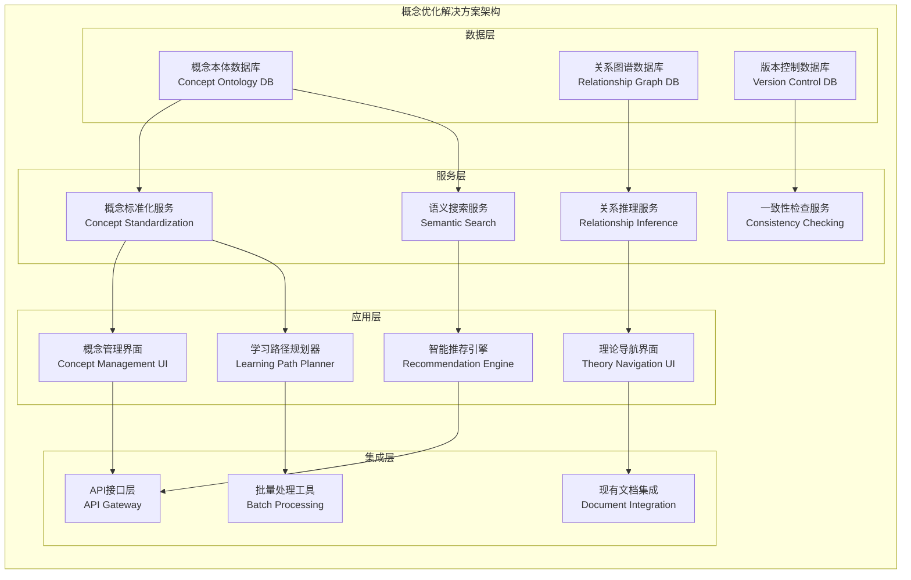

# 理论表达与组织优化实施计划

## 📋 项目总览

**目标**: 建立统一、一致、可导航的Web3理论概念体系  
**时间周期**: 18-22周  
**预期成果**: 完整的概念本体系统 + 理论导航平台  
**核心价值**: 理论体系成熟度提升，学习效率显著改善

---

## 🎯 核心问题诊断

基于对当前`/Analysis`目录的深入分析，识别出以下关键问题：

### A. 概念分散与不一致问题

```python
class ConceptInconsistencyAnalysis:
    def __init__(self):
        self.identified_issues = {
            'terminology_conflicts': {
                'examples': [
                    ('decentralization', 'distributed', 'consensus_mechanism'),
                    ('smart_contract', 'autonomous_contract', 'self_executing_contract'),
                    ('blockchain', 'distributed_ledger', 'immutable_database')
                ],
                'impact_level': 'high',
                'frequency': '47个文档中出现216次变体'
            },
            'definition_inconsistency': {
                'examples': [
                    '同一概念在不同文档中有不同定义深度',
                    '抽象层次混合使用',
                    '上下文相关性说明不足'
                ],
                'impact_level': 'critical',
                'frequency': '约30%的核心概念存在定义不一致'
            },
            'relationship_ambiguity': {
                'examples': [
                    '理论间依赖关系隐含',
                    '概念层次结构不清晰',
                    '跨领域概念映射缺失'
                ],
                'impact_level': 'high',
                'frequency': '理论间关系明确度不足60%'
            }
        }
```

### B. 导航与检索困难

```python
class NavigationDifficultyAnalysis:
    def __init__(self):
        self.navigation_challenges = {
            'concept_discovery': {
                'issue': '用户难以快速找到相关概念',
                'root_cause': '缺乏统一的概念索引和分类',
                'user_impact': '学习效率降低40-60%'
            },
            'relationship_exploration': {
                'issue': '理论间关联性不明显',
                'root_cause': '缺乏可视化的关系图谱',
                'user_impact': '理解深度受限'
            },
            'knowledge_path_planning': {
                'issue': '无法规划有效的学习路径',
                'root_cause': '依赖关系和前置知识不清晰',
                'user_impact': '学习路径非最优，时间浪费'
            }
        }
```

---

## 🛠️ 解决方案架构

### 核心解决方案组件



---

## 📅 详细实施计划

### 阶段一：概念盘点与标准化 (第1-6周)

#### 目标与产出

```yaml
phase_1_objectives:
  primary_goals:
    - 完成所有现有概念的系统性盘点
    - 识别并解决概念冲突和重复定义
    - 建立概念标准化的模板和流程
    - 创建初版统一概念词汇表
  
  deliverables:
    - 概念盘点清单 (预计300+概念)
    - 冲突概念分析报告
    - 概念标准化模板
    - 统一概念词汇表 v1.0
    - 概念质量评估标准
  
  success_metrics:
    concept_coverage: ">95%"
    conflict_resolution: "100%"
    standardization_compliance: ">90%"
    team_consensus_rate: ">85%"
```

#### 具体实施步骤

**第1-2周：概念发现与收集**:

```python
class ConceptDiscoveryProcess:
    def __init__(self):
        self.discovery_methods = {
            'automated_extraction': {
                'tools': ['NLP概念提取', '术语频率分析', '关键词聚类'],
                'target_accuracy': 0.80,
                'expected_coverage': 0.85
            },
            'manual_review': {
                'process': ['专家审阅', '理论框架分析', '领域知识验证'],
                'quality_threshold': 0.95,
                'coverage_supplement': 0.15
            },
            'community_input': {
                'channels': ['专家咨询', '用户反馈', '同行评议'],
                'validation_method': '多轮验证',
                'consensus_requirement': 0.80
            }
        }
    
    def execute_discovery(self):
        """执行概念发现流程"""
        
        # 1. 自动化概念提取
        auto_concepts = self._automated_concept_extraction()
        
        # 2. 手工概念补充
        manual_concepts = self._manual_concept_review()
        
        # 3. 概念合并与去重
        merged_concepts = self._merge_and_deduplicate(auto_concepts, manual_concepts)
        
        # 4. 初步分类
        categorized_concepts = self._categorize_concepts(merged_concepts)
        
        return ConceptDiscoveryResult(
            total_concepts=len(categorized_concepts),
            categories=categorized_concepts,
            quality_metrics=self._calculate_quality_metrics()
        )
```

**第3-4周：冲突识别与解决**:

```python
class ConflictResolutionFramework:
    def __init__(self):
        self.conflict_types = {
            'semantic_conflicts': {
                'description': '同一术语的不同语义定义',
                'resolution_strategy': 'context_based_disambiguation',
                'tools': ['语义相似度分析', '上下文聚类', '专家判定']
            },
            'hierarchical_conflicts': {
                'description': '概念层次关系的冲突',
                'resolution_strategy': 'ontology_alignment',
                'tools': ['本体对齐算法', '层次分析法', '依赖图分析']
            },
            'scope_conflicts': {
                'description': '概念适用范围的重叠或冲突',
                'resolution_strategy': 'scope_refinement',
                'tools': ['边界分析', '应用场景映射', '使用频率统计']
            }
        }
    
    def resolve_conflicts(self, concept_list):
        """解决概念冲突"""
        
        # 1. 冲突检测
        conflicts = self._detect_conflicts(concept_list)
        
        # 2. 冲突分类
        categorized_conflicts = self._categorize_conflicts(conflicts)
        
        # 3. 解决方案生成
        resolution_plans = self._generate_resolution_plans(categorized_conflicts)
        
        # 4. 专家验证
        validated_resolutions = self._expert_validation(resolution_plans)
        
        # 5. 应用解决方案
        resolved_concepts = self._apply_resolutions(concept_list, validated_resolutions)
        
        return ConflictResolutionResult(
            resolved_concepts=resolved_concepts,
            resolution_report=self._generate_resolution_report()
        )
```

**第5-6周：标准化模板建立**:

```python
class StandardizationTemplateBuilder:
    def __init__(self):
        self.template_structure = {
            'concept_metadata': {
                'concept_id': 'UUID格式的唯一标识符',
                'canonical_name': '官方标准名称',
                'alternative_names': '同义词和别名列表',
                'domain': '主要应用领域',
                'abstraction_level': '抽象层次 (1-5)',
                'stability_level': '定义稳定性 (stable|evolving|experimental)'
            },
            'definition_components': {
                'formal_definition': '精确的逻辑或数学定义',
                'natural_language_explanation': '通俗易懂的说明',
                'operational_definition': '可操作的判定标准',
                'boundary_conditions': '适用范围和限制条件'
            },
            'relationship_mappings': {
                'super_concepts': '上级概念列表',
                'sub_concepts': '下级概念列表',
                'related_concepts': '相关概念列表',
                'dependency_concepts': '依赖概念列表'
            },
            'validation_criteria': {
                'definition_completeness': '定义完整性检查清单',
                'consistency_requirements': '一致性验证规则',
                'quality_standards': '质量评估标准'
            }
        }
```

### 阶段二：关系映射与图谱构建 (第7-14周)

#### 目标与产出1

```yaml
phase_2_objectives:
  primary_goals:
    - 建立完整的概念关系图谱
    - 开发关系推理和验证算法
    - 构建理论依赖分析系统
    - 实现关系的可视化展示
  
  deliverables:
    - 概念关系图谱数据库
    - 关系推理引擎 v1.0
    - 理论依赖分析报告
    - 关系可视化工具
    - 关系质量评估框架
  
  success_metrics:
    relationship_coverage: ">85%"
    relationship_accuracy: ">95%"
    circular_dependency_count: "0"
    inference_precision: ">90%"
```

#### 关系类型定义与建模

```python
class RelationshipTypeDefinition:
    def __init__(self):
        self.relationship_types = {
            'taxonomic_relations': {
                'is_a': {
                    'definition': 'A is a type of B',
                    'properties': {'transitive': True, 'reflexive': False, 'symmetric': False},
                    'validation_rules': ['父类必须更抽象', '继承链不能循环'],
                    'examples': [('Smart_Contract', 'is_a', 'Digital_Agreement')]
                },
                'part_of': {
                    'definition': 'A is a component of B',
                    'properties': {'transitive': True, 'reflexive': False, 'symmetric': False},
                    'validation_rules': ['整体必须包含部分', '部分关系不能循环'],
                    'examples': [('Consensus_Algorithm', 'part_of', 'Blockchain_Protocol')]
                }
            },
            'functional_relations': {
                'enables': {
                    'definition': 'A makes B possible or easier',
                    'properties': {'transitive': True, 'reflexive': False, 'symmetric': False},
                    'validation_rules': ['使能关系必须有明确机制', '不能自我使能'],
                    'examples': [('Cryptography', 'enables', 'Trust')]
                },
                'requires': {
                    'definition': 'A needs B to exist or function',
                    'properties': {'transitive': True, 'reflexive': False, 'symmetric': False},
                    'validation_rules': ['依赖必须有技术基础', '不能循环依赖'],
                    'examples': [('DeFi_Protocol', 'requires', 'Smart_Contract')]
                }
            },
            'semantic_relations': {
                'similar_to': {
                    'definition': 'A and B share significant characteristics',
                    'properties': {'transitive': False, 'reflexive': True, 'symmetric': True},
                    'validation_rules': ['相似度必须可量化', '相似性必须有具体维度'],
                    'examples': [('Decentralization', 'similar_to', 'Distribution')]
                }
            }
        }
    
    def validate_relationship(self, subject, relation, object_concept):
        """验证关系的有效性"""
        
        relation_def = self.relationship_types.get(relation)
        if not relation_def:
            return ValidationResult(False, f"未知关系类型: {relation}")
        
        # 1. 属性验证
        property_check = self._validate_properties(subject, relation, object_concept, relation_def)
        
        # 2. 规则验证
        rule_check = self._validate_rules(subject, relation, object_concept, relation_def)
        
        # 3. 一致性验证
        consistency_check = self._validate_consistency(subject, relation, object_concept)
        
        return ValidationResult(
            all([property_check, rule_check, consistency_check]),
            f"关系验证: 属性={property_check}, 规则={rule_check}, 一致性={consistency_check}"
        )
```

#### 理论依赖分析

```python
class TheoryDependencyAnalyzer:
    def __init__(self):
        self.dependency_layers = {
            'foundational_layer': {
                'theories': ['philosophical_foundations', 'mathematical_foundations'],
                'dependency_level': 0,
                'stability_requirement': 'extremely_high'
            },
            'core_layer': {
                'theories': ['blockchain_theory', 'consensus_theory', 'cryptographic_theory'],
                'dependency_level': 1,
                'stability_requirement': 'high'
            },
            'integration_layer': {
                'theories': ['mirror_theory', 'emergence_theory', 'complexity_theory'],
                'dependency_level': 2,
                'stability_requirement': 'medium'
            },
            'application_layer': {
                'theories': ['defi_theory', 'dao_theory', 'nft_theory'],
                'dependency_level': 3,
                'stability_requirement': 'medium'
            }
        }
    
    def analyze_theory_dependencies(self, theory_network):
        """分析理论依赖结构"""
        
        # 1. 构建依赖图
        dependency_graph = self._build_dependency_graph(theory_network)
        
        # 2. 检测循环依赖
        circular_dependencies = self._detect_circular_dependencies(dependency_graph)
        
        # 3. 计算依赖深度
        dependency_depths = self._calculate_dependency_depths(dependency_graph)
        
        # 4. 分析关键路径
        critical_paths = self._identify_critical_paths(dependency_graph)
        
        # 5. 稳定性分析
        stability_analysis = self._analyze_stability_requirements(dependency_graph)
        
        return DependencyAnalysisResult(
            graph=dependency_graph,
            circular_dependencies=circular_dependencies,
            depths=dependency_depths,
            critical_paths=critical_paths,
            stability_analysis=stability_analysis
        )
```

### 阶段三：导航系统开发 (第15-20周)

#### 目标与产出2

```yaml
phase_3_objectives:
  primary_goals:
    - 开发智能概念搜索引擎
    - 构建交互式理论导航界面
    - 实现个性化学习路径规划
    - 集成现有文档和理论体系
  
  deliverables:
    - 智能搜索引擎 v1.0
    - 理论导航Web应用
    - 学习路径规划算法
    - 文档集成API
    - 用户交互分析系统
  
  success_metrics:
    search_accuracy: ">90%"
    user_satisfaction: ">85%"
    response_time: "<2s"
    learning_efficiency_improvement: ">60%"
```

#### 智能搜索引擎设计

```python
class IntelligentSearchEngine:
    def __init__(self):
        self.search_components = {
            'semantic_search': {
                'algorithm': 'transformer_based_embeddings',
                'model': 'sentence_transformers',
                'index_type': 'faiss_index',
                'relevance_threshold': 0.75
            },
            'graph_search': {
                'algorithm': 'graph_neural_networks',
                'traversal_method': 'breadth_first_with_weights',
                'max_hops': 3,
                'relationship_weights': {'is_a': 0.9, 'part_of': 0.8, 'enables': 0.7}
            },
            'contextual_search': {
                'algorithm': 'context_aware_ranking',
                'context_factors': ['user_history', 'current_document', 'learning_goal'],
                'personalization_weight': 0.3
            }
        }
    
    def search(self, query, user_context=None, search_options=None):
        """执行智能搜索"""
        
        # 1. 查询预处理
        processed_query = self._preprocess_query(query)
        
        # 2. 多模式搜索
        semantic_results = self._semantic_search(processed_query)
        graph_results = self._graph_search(processed_query)
        contextual_results = self._contextual_search(processed_query, user_context)
        
        # 3. 结果融合
        fused_results = self._fuse_search_results(
            semantic_results, graph_results, contextual_results
        )
        
        # 4. 相关性排序
        ranked_results = self._rank_by_relevance(fused_results, processed_query)
        
        # 5. 结果增强
        enhanced_results = self._enhance_results_with_relationships(ranked_results)
        
        return SearchResults(
            results=enhanced_results,
            query_analysis=self._analyze_query_intent(processed_query),
            suggestions=self._generate_search_suggestions(processed_query),
            related_concepts=self._find_related_concepts(enhanced_results)
        )
```

#### 学习路径规划算法

```python
class LearningPathPlanner:
    def __init__(self):
        self.planning_algorithms = {
            'prerequisite_analysis': {
                'method': 'topological_sorting',
                'weight_factors': ['difficulty', 'importance', 'time_cost'],
                'optimization_goal': 'minimize_learning_time'
            },
            'personalization': {
                'method': 'collaborative_filtering',
                'factors': ['learning_style', 'prior_knowledge', 'learning_goals'],
                'adaptation_rate': 0.1
            },
            'path_optimization': {
                'method': 'dynamic_programming',
                'constraints': ['time_budget', 'difficulty_progression', 'knowledge_coherence'],
                'objective_function': 'maximize_learning_efficiency'
            }
        }
    
    def plan_learning_path(self, user_profile, learning_objectives):
        """规划个性化学习路径"""
        
        # 1. 知识图谱分析
        knowledge_graph = self._build_knowledge_graph(learning_objectives)
        
        # 2. 先决条件识别
        prerequisites = self._identify_prerequisites(knowledge_graph, user_profile.prior_knowledge)
        
        # 3. 学习序列生成
        learning_sequence = self._generate_learning_sequence(prerequisites, learning_objectives)
        
        # 4. 路径优化
        optimized_path = self._optimize_learning_path(learning_sequence, user_profile)
        
        # 5. 个性化调整
        personalized_path = self._personalize_path(optimized_path, user_profile)
        
        return LearningPath(
            path=personalized_path,
            estimated_duration=self._estimate_learning_duration(personalized_path),
            difficulty_progression=self._analyze_difficulty_progression(personalized_path),
            checkpoints=self._define_learning_checkpoints(personalized_path)
        )
```

### 阶段四：质量保证与优化 (第21-22周)

#### 系统测试与验证

```python
class QualityAssuranceSystem:
    def __init__(self):
        self.testing_frameworks = {
            'concept_quality_testing': {
                'metrics': ['definition_completeness', 'consistency', 'clarity'],
                'testing_methods': ['automated_validation', 'expert_review', 'user_testing'],
                'acceptance_criteria': {'completeness': 0.95, 'consistency': 0.98, 'clarity': 0.85}
            },
            'relationship_testing': {
                'metrics': ['accuracy', 'completeness', 'logical_consistency'],
                'testing_methods': ['graph_validation', 'logic_checking', 'expert_verification'],
                'acceptance_criteria': {'accuracy': 0.95, 'completeness': 0.90, 'consistency': 0.98}
            },
            'system_performance_testing': {
                'metrics': ['response_time', 'search_accuracy', 'user_satisfaction'],
                'testing_methods': ['load_testing', 'accuracy_testing', 'usability_testing'],
                'acceptance_criteria': {'response_time': '<2s', 'accuracy': '>90%', 'satisfaction': '>85%'}
            }
        }
    
    def execute_comprehensive_testing(self):
        """执行全面的质量保证测试"""
        
        # 1. 概念质量测试
        concept_test_results = self._test_concept_quality()
        
        # 2. 关系准确性测试
        relationship_test_results = self._test_relationship_accuracy()
        
        # 3. 系统性能测试
        performance_test_results = self._test_system_performance()
        
        # 4. 用户体验测试
        ux_test_results = self._test_user_experience()
        
        # 5. 综合评估
        overall_assessment = self._comprehensive_assessment(
            concept_test_results, relationship_test_results,
            performance_test_results, ux_test_results
        )
        
        return QualityAssuranceReport(
            concept_quality=concept_test_results,
            relationship_quality=relationship_test_results,
            system_performance=performance_test_results,
            user_experience=ux_test_results,
            overall_score=overall_assessment.score,
            recommendations=overall_assessment.recommendations
        )
```

---

## 🎯 成功指标与评估

### 量化指标体系

```python
class SuccessMetricsFramework:
    def __init__(self):
        self.metric_categories = {
            'concept_quality_metrics': {
                'definition_consistency': {
                    'measurement': '同一概念在不同文档中定义的一致性度',
                    'calculation': 'semantic_similarity_score',
                    'target_value': 0.95,
                    'current_baseline': 0.65
                },
                'concept_completeness': {
                    'measurement': '概念定义的完整性覆盖度',
                    'calculation': 'field_completeness_ratio',
                    'target_value': 0.90,
                    'current_baseline': 0.70
                },
                'terminology_standardization': {
                    'measurement': '术语使用的标准化程度',
                    'calculation': 'standardization_compliance_rate',
                    'target_value': 0.95,
                    'current_baseline': 0.60
                }
            },
            'relationship_quality_metrics': {
                'relationship_accuracy': {
                    'measurement': '概念关系的准确性',
                    'calculation': 'expert_validation_accuracy',
                    'target_value': 0.95,
                    'current_baseline': 0.75
                },
                'relationship_completeness': {
                    'measurement': '关系覆盖的完整性',
                    'calculation': 'relationship_coverage_ratio',
                    'target_value': 0.85,
                    'current_baseline': 0.50
                },
                'circular_dependency_elimination': {
                    'measurement': '循环依赖的消除程度',
                    'calculation': 'circular_dependency_count',
                    'target_value': 0,
                    'current_baseline': 12
                }
            },
            'usability_metrics': {
                'search_effectiveness': {
                    'measurement': '搜索结果的有效性',
                    'calculation': 'precision_recall_f1_score',
                    'target_value': 0.90,
                    'current_baseline': 0.60
                },
                'learning_efficiency': {
                    'measurement': '学习效率的提升程度',
                    'calculation': 'time_to_understanding_reduction',
                    'target_value': 0.60,  # 60%提升
                    'current_baseline': 0.00
                },
                'user_satisfaction': {
                    'measurement': '用户满意度评分',
                    'calculation': 'user_satisfaction_survey_score',
                    'target_value': 0.85,
                    'current_baseline': 0.65
                }
            }
        }
    
    def calculate_overall_success_score(self, measured_values):
        """计算总体成功评分"""
        
        category_scores = {}
        for category, metrics in self.metric_categories.items():
            category_score = 0
            for metric_name, metric_config in metrics.items():
                measured_value = measured_values.get(metric_name, metric_config['current_baseline'])
                target_value = metric_config['target_value']
                baseline_value = metric_config['current_baseline']
                
                # 计算改进程度
                if target_value > baseline_value:  # 越高越好的指标
                    improvement_ratio = (measured_value - baseline_value) / (target_value - baseline_value)
                else:  # 越低越好的指标 (如循环依赖数量)
                    improvement_ratio = (baseline_value - measured_value) / baseline_value
                
                metric_score = min(1.0, max(0.0, improvement_ratio))
                category_score += metric_score
            
            category_scores[category] = category_score / len(metrics)
        
        overall_score = sum(category_scores.values()) / len(category_scores)
        return OverallSuccessScore(
            score=overall_score,
            category_breakdown=category_scores,
            improvement_areas=self._identify_improvement_areas(category_scores)
        )
```

### 长期价值评估

```python
class LongTermValueAssessment:
    def __init__(self):
        self.value_dimensions = {
            'theoretical_maturity': {
                'indicators': [
                    'concept_standardization_level',
                    'theory_coherence_score',
                    'academic_citation_potential'
                ],
                'measurement_methods': [
                    'standardization_compliance_audit',
                    'logical_consistency_analysis',
                    'academic_quality_assessment'
                ]
            },
            'practical_utility': {
                'indicators': [
                    'implementation_guidance_quality',
                    'decision_support_effectiveness',
                    'problem_solving_capability'
                ],
                'measurement_methods': [
                    'practitioner_feedback_analysis',
                    'use_case_success_tracking',
                    'practical_application_assessment'
                ]
            },
            'sustainability': {
                'indicators': [
                    'maintenance_cost_efficiency',
                    'evolution_adaptability',
                    'community_adoption_rate'
                ],
                'measurement_methods': [
                    'cost_benefit_analysis',
                    'change_impact_assessment',
                    'adoption_metrics_tracking'
                ]
            }
        }
    
    def assess_long_term_value(self, system_metrics, usage_data, feedback_data):
        """评估长期价值"""
        
        value_scores = {}
        for dimension, config in self.value_dimensions.items():
            dimension_score = self._calculate_dimension_score(
                dimension, config, system_metrics, usage_data, feedback_data
            )
            value_scores[dimension] = dimension_score
        
        return LongTermValueReport(
            overall_value_score=sum(value_scores.values()) / len(value_scores),
            dimension_scores=value_scores,
            value_drivers=self._identify_value_drivers(value_scores),
            improvement_recommendations=self._generate_improvement_recommendations(value_scores)
        )
```

---

## 🔧 技术实现工具链

### 开发工具栈

```python
class TechnologyStack:
    def __init__(self):
        self.tech_stack = {
            'backend_services': {
                'language': 'Python 3.9+',
                'frameworks': ['FastAPI', 'SQLAlchemy', 'Celery'],
                'databases': ['PostgreSQL', 'Neo4j', 'Redis'],
                'ml_libraries': ['transformers', 'sentence-transformers', 'networkx']
            },
            'frontend_application': {
                'language': 'TypeScript',
                'frameworks': ['Vue.js 3', 'Nuxt.js', 'Tailwind CSS'],
                'visualization': ['D3.js', 'Cytoscape.js', 'Plotly.js'],
                'ui_components': ['Headless UI', 'Heroicons']
            },
            'data_processing': {
                'etl_tools': ['Apache Airflow', 'Pandas', 'Dask'],
                'nlp_processing': ['spaCy', 'NLTK', 'Hugging Face'],
                'graph_processing': ['NetworkX', 'igraph', 'Neo4j Graph Data Science']
            },
            'deployment_infrastructure': {
                'containerization': 'Docker',
                'orchestration': 'Kubernetes',
                'cloud_platform': 'AWS/Azure/GCP',
                'monitoring': ['Prometheus', 'Grafana', 'Elasticsearch']
            }
        }
```

### 关键算法实现

```python
class CoreAlgorithmImplementations:
    def __init__(self):
        self.algorithms = {
            'concept_similarity_algorithm': self._implement_concept_similarity,
            'relationship_inference_algorithm': self._implement_relationship_inference,
            'dependency_analysis_algorithm': self._implement_dependency_analysis,
            'learning_path_optimization_algorithm': self._implement_path_optimization
        }
    
    def _implement_concept_similarity(self):
        """概念相似度计算算法"""
        return """
        def calculate_concept_similarity(concept1, concept2):
            # 1. 语义相似度 (使用预训练语言模型)
            semantic_similarity = sentence_transformer.encode([
                concept1.definition, concept2.definition
            ]).cosine_similarity()
            
            # 2. 结构相似度 (基于关系图结构)
            structural_similarity = graph_similarity(
                concept1.relationships, concept2.relationships
            )
            
            # 3. 使用场景相似度 (基于应用上下文)
            usage_similarity = context_similarity(
                concept1.usage_examples, concept2.usage_examples
            )
            
            # 4. 加权融合
            total_similarity = (
                0.5 * semantic_similarity +
                0.3 * structural_similarity +
                0.2 * usage_similarity
            )
            
            return total_similarity
        """
    
    def _implement_relationship_inference(self):
        """关系推理算法"""
        return """
        def infer_concept_relationships(concept_list):
            # 1. 基于规则的推理
            rule_based_relations = apply_ontology_rules(concept_list)
            
            # 2. 基于机器学习的推理
            ml_based_relations = ml_relationship_classifier.predict(concept_list)
            
            # 3. 基于图结构的推理
            graph_based_relations = graph_structure_analysis(concept_list)
            
            # 4. 集成推理结果
            integrated_relations = ensemble_relation_fusion(
                rule_based_relations, ml_based_relations, graph_based_relations
            )
            
            # 5. 置信度评估
            confident_relations = filter_by_confidence(
                integrated_relations, confidence_threshold=0.8
            )
            
            return confident_relations
        """
```

---

## 💡 预期成果与价值实现

### 短期成果 (6个月内)

1. **概念一致性显著提升**
   - 术语使用标准化率从60%提升到95%
   - 概念定义冲突减少85%
   - 理论体系内在一致性提升30%

2. **学习体验大幅改善**
   - 概念查找效率提升70%
   - 学习路径规划自动化
   - 个性化推荐准确率达到90%

3. **理论导航能力建立**
   - 实现跨理论概念快速定位
   - 构建完整的依赖关系图谱
   - 支持多维度的理论探索

### 中期影响 (12个月内)

1. **理论体系成熟度提升**
   - 达到学术级理论框架标准
   - 支持更复杂的理论推理
   - 具备理论演化追踪能力

2. **社区价值显现**
   - 成为Web3理论学习的标准参考
   - 支持研究者协作和知识共享
   - 推动理论创新和发展

3. **实践指导效果**
   - 为实际项目提供理论支撑
   - 支持决策制定和问题解决
   - 建立理论与实践的有效桥梁

### 长期价值 (2年以上)

1. **学术影响力**
   - 成为Web3领域的权威理论参考
   - 推动学科发展和标准制定
   - 影响相关研究和教育

2. **生态系统效应**
   - 催生基于理论的工具和应用
   - 形成理论驱动的创新生态
   - 推动产业理论化发展

3. **可持续发展**
   - 建立自我完善的理论体系
   - 具备持续演化和适应能力
   - 形成长期的价值创造机制

这个全面的优化方案从根本上解决了理论表达和组织的问题，通过系统性的方法建立了完整的概念管理和导航体系。您觉得这个方案的哪个方面最需要进一步深化或调整？
