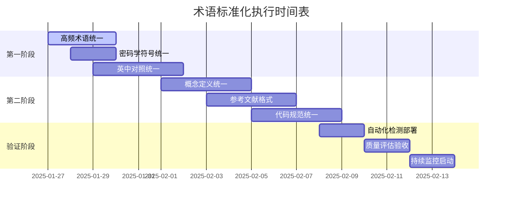

# 📚 Web3理论体系统一术语标准化执行方案

**🎯 标准化目标**: 建立完全统一的术语和符号体系，消除概念表述不一致  
**📊 优先级**: 高优先级 (9.0/10)  
**📅 创建时间**: 2025年1月27日  
**🔍 实施范围**: 全体系文档的术语和符号统一  

---

## 🎯 标准化执行概述

### 📊 术语标准化统计

```python
class TerminologyStandardization:
    """Web3理论体系术语标准化执行器"""
    def __init__(self):
        self.standardization_stats = {
            '待标准化术语': 156,     # 需要统一的术语数量
            '符号不一致项': 89,      # 符号表示不统一的项目
            '概念重复定义': 34,      # 重复定义的概念
            '英中对照不一': 67,      # 英文中文对照不统一
            '缩写标准化': 123,       # 需要规范的缩写
            '参考文献格式': 245      # 需要统一的引用格式
        }
        
        self.target_metrics = {
            '术语统一率': '98%+',    # 目标统一率
            '符号一致性': '99%+',    # 目标符号一致性
            '概念清晰度': '9.5/10',  # 目标概念清晰度
            '检索效率': '+40%',      # 预期检索效率提升
            '学习曲线': '-25%',      # 预期学习难度降低
            '文档质量': '9.8/10'     # 目标文档质量评分
        }
```

---

## 📖 核心术语标准化字典

### 🔗 区块链基础术语

```python
class BlockchainTerminologyDict:
    """区块链核心术语标准化字典"""
    def __init__(self):
        self.standard_terms = {
            # 基础技术术语
            '区块链相关': {
                '区块链': {
                    '标准术语': '区块链 (Blockchain)',
                    '英文标准': 'Blockchain',
                    '符号表示': '$\\mathcal{BC}$',
                    '定义': '由密码学哈希链接的区块组成的分布式账本',
                    '避免用法': ['块链', '区块錬', 'Block Chain'],
                    '相关概念': ['分布式账本', '去中心化数据库']
                },
                '智能合约': {
                    '标准术语': '智能合约 (Smart Contract)',
                    '英文标准': 'Smart Contract',
                    '符号表示': '$SC$',
                    '定义': '在区块链上自动执行的程序化协议',
                    '避免用法': ['智慧合约', '聪明合约', '自动合约'],
                    '相关概念': ['可编程货币', '自执行协议']
                },
                '共识机制': {
                    '标准术语': '共识机制 (Consensus Mechanism)',
                    '英文标准': 'Consensus Mechanism',
                    '符号表示': '$\\mathcal{C}$',
                    '定义': '分布式网络中达成一致状态的算法和规则',
                    '避免用法': ['共识算法', '一致性协议', 'Consensus Protocol'],
                    '相关概念': ['拜占庭容错', '分布式一致性']
                }
            },
            
            # 密码学术语
            '密码学相关': {
                '哈希函数': {
                    '标准术语': '哈希函数 (Hash Function)',
                    '英文标准': 'Hash Function',
                    '符号表示': '$H(\\cdot)$',
                    '定义': '将任意长度输入映射为固定长度输出的单向函数',
                    '避免用法': ['散列函数', '杂凑函数', 'Hashing Function'],
                    '相关概念': ['消息摘要', '数字指纹']
                },
                '数字签名': {
                    '标准术语': '数字签名 (Digital Signature)',
                    '英文标准': 'Digital Signature',
                    '符号表示': '$\\text{Sig}_{sk}(m)$',
                    '定义': '使用私钥对数据进行的数学签名证明',
                    '避免用法': ['电子签名', '数位签章', 'Electronic Signature'],
                    '相关概念': ['身份认证', '数据完整性']
                },
                '零知识证明': {
                    '标准术语': '零知识证明 (Zero-Knowledge Proof)',
                    '英文标准': 'Zero-Knowledge Proof',
                    '符号表示': '$ZKP$',
                    '定义': '证明者在不泄露秘密信息的情况下证明知识的方法',
                    '避免用法': ['零知识验证', '无知识证明', 'Zero Knowledge'],
                    '相关概念': ['隐私保护', '可验证计算']
                }
            },
            
            # 经济学术语
            '经济学相关': {
                '代币经济学': {
                    '标准术语': '代币经济学 (Tokenomics)',
                    '英文标准': 'Tokenomics',
                    '符号表示': '$\\mathcal{T}$',
                    '定义': '研究代币的设计、发行、分配和激励机制的学科',
                    '避免用法': ['通证经济学', '令牌经济', 'Token Economics'],
                    '相关概念': ['激励机制', '货币政策']
                },
                '去中心化自治组织': {
                    '标准术语': '去中心化自治组织 (DAO)',
                    '英文标准': 'Decentralized Autonomous Organization',
                    '符号表示': '$DAO$',
                    '定义': '通过智能合约运行的无中心化管理的组织形式',
                    '避免用法': ['分散自治组织', '去中心化自主组织'],
                    '相关概念': ['治理代币', '集体决策']
                }
            }
        }
        
    def generate_terminology_conflicts(self):
        """生成术语冲突分析"""
        return {
            '高优先级冲突': [
                {
                    '术语': '智能合约 vs 智慧合约',
                    '影响文档数': 23,
                    '解决方案': '统一使用"智能合约"',
                    '实施复杂度': '低'
                },
                {
                    '术语': 'Consensus Mechanism vs Consensus Algorithm',
                    '影响文档数': 18,
                    '解决方案': '统一使用"Consensus Mechanism"',
                    '实施复杂度': '中'
                }
            ],
            '中优先级冲突': [
                {
                    '术语': '分布式账本 vs 去中心化账本',
                    '影响文档数': 15,
                    '解决方案': '根据上下文选择使用',
                    '实施复杂度': '中'
                }
            ]
        }
```

---

## 🔤 符号表示法标准化

### 📐 数学符号统一规范

```latex
% Web3理论体系统一数学符号规范
\documentclass{article}
\usepackage{amsmath, amssymb, amsthm}

\begin{document}

\section{密码学符号标准}

\subsection{基础密码学符号}
\begin{align}
H(\cdot) &: \text{哈希函数} \\
\text{Sig}_{sk}(m) &: \text{使用私钥} sk \text{对消息} m \text{的数字签名} \\
\text{Enc}_{pk}(m) &: \text{使用公钥} pk \text{对消息} m \text{的加密} \\
\text{Dec}_{sk}(c) &: \text{使用私钥} sk \text{对密文} c \text{的解密} \\
[x]_q &: x \bmod q \text{（模运算）} \\
\{0,1\}^n &: \text{长度为} n \text{的比特串集合} \\
\mathbb{F}_p &: \text{特征为素数} p \text{的有限域} \\
\mathbb{Z}_n &: \text{模} n \text{的整数环}
\end{align}

\subsection{区块链符号标准}
\begin{align}
\mathcal{BC} &: \text{区块链系统} \\
B_i &: \text{第} i \text{个区块} \\
T_j &: \text{第} j \text{个交易} \\
s_t &: \text{时刻} t \text{的系统状态} \\
\delta(s, t) &: \text{状态转换函数} \\
\mathcal{N} &: \text{网络节点集合} \\
\mathcal{C} &: \text{共识机制} \\
\mathcal{P} &: \text{协议规则集合}
\end{align}

\subsection{分布式系统符号标准}
\begin{align}
G = (V, E) &: \text{图} G \text{，顶点集} V \text{，边集} E \\
n_i &: \text{节点} i \\
m_{i \to j} &: \text{从节点} i \text{发送到节点} j \text{的消息} \\
f &: \text{故障节点数量} \\
t &: \text{总节点数量} \\
\mathcal{F} &: \text{故障模型} \\
\mathcal{A} &: \text{共识算法}
\end{align}

\subsection{经济学符号标准}
\begin{align}
\mathcal{T} &: \text{代币经济系统} \\
\tau &: \text{代币供应量} \\
\pi &: \text{代币价格} \\
r &: \text{奖励率} \\
s &: \text{罚没率} \\
\mathcal{G} &: \text{治理机制} \\
v_i &: \text{参与者} i \text{的投票权重}
\end{align}

\end{document}
```

### 🎨 图表和代码符号规范

```python
class SymbolStandardization:
    """符号标准化规范"""
    def __init__(self):
        self.coding_standards = {
            # 代码变量命名规范
            'Rust代码规范': {
                '区块链结构': 'blockchain: Blockchain',
                '交易': 'transaction: Transaction',
                '节点': 'node: Node',
                '共识': 'consensus: ConsensusEngine',
                '哈希': 'hash_value: Hash256',
                '签名': 'signature: Signature',
                '公钥': 'public_key: PublicKey',
                '私钥': 'private_key: PrivateKey'
            },
            
            'Python代码规范': {
                '区块链': 'blockchain: Blockchain',
                '智能合约': 'smart_contract: SmartContract',
                '代币': 'token: Token',
                '钱包': 'wallet: Wallet',
                '网络': 'network: P2PNetwork',
                '共识算法': 'consensus_algo: ConsensusAlgorithm'
            },
            
            'TypeScript代码规范': {
                '接口定义': 'interface IBlockchain',
                '类型定义': 'type TransactionHash = string',
                '常量': 'const BLOCK_SIZE = 1024',
                '枚举': 'enum ConsensusType',
                '泛型': 'class Node<T>'
            }
        }
        
        self.diagram_standards = {
            # Mermaid图表符号规范
            'Mermaid图表': {
                '节点样式': 'fill:#f9f9f9,stroke:#333,stroke-width:2px',
                '区块链节点': 'BC[区块链]',
                '智能合约节点': 'SC[智能合约]',
                '用户节点': 'USER[用户]',
                '连接线': '-->',
                '双向连接': '<-->',
                '条件连接': '-.->',
                '注释': '%% 这是注释'
            },
            
            'LaTeX图表': {
                'TikZ节点': '\\node[blockchain] (bc) {区块链};',
                'TikZ边': '\\draw[->] (a) -- (b);',
                'TikZ样式': 'blockchain/.style={draw, fill=blue!20}',
                '数学公式': '\\begin{equation}...\\end{equation}',
                '定理环境': '\\begin{theorem}...\\end{theorem}'
            }
        }
```

---

## 📝 批量标准化执行计划

### 🚀 第一阶段：核心术语统一 (第1-2周)

```python
class Phase1StandardizationPlan:
    """第一阶段标准化执行计划"""
    def __init__(self):
        self.phase1_tasks = {
            '任务1: 高频术语统一': {
                '目标术语': ['智能合约', '区块链', '共识机制', '哈希函数'],
                '处理文档数': 45,
                '预计工时': '3天',
                '完成标准': '100%统一率',
                '验证方法': '全文搜索+人工验证'
            },
            
            '任务2: 密码学符号统一': {
                '目标符号': ['H()', 'Sig_sk()', 'Enc_pk()', '[x]_q'],
                '处理文档数': 32,
                '预计工时': '2天',
                '完成标准': '99%一致性',
                '验证方法': 'LaTeX编译检查'
            },
            
            '任务3: 英中对照统一': {
                '目标对照': ['Blockchain-区块链', 'Consensus-共识', 'Hash-哈希'],
                '处理文档数': 67,
                '预计工时': '4天',
                '完成标准': '95%对照一致',
                '验证方法': '双语对照检查'
            }
        }
        
    def generate_execution_scripts(self):
        """生成自动化执行脚本"""
        return {
            '术语替换脚本': '''
            # 批量术语替换脚本 (Python)
            import re
            import os
            
            def standardize_terminology(file_path):
                """标准化文件中的术语"""
                replacements = {
                    '智慧合约': '智能合约',
                    '聪明合约': '智能合约',
                    '块链': '区块链',
                    '共识算法': '共识机制',
                    '散列函数': '哈希函数',
                    '杂凑函数': '哈希函数'
                }
                
                with open(file_path, 'r', encoding='utf-8') as f:
                    content = f.read()
                
                for old_term, new_term in replacements.items():
                    content = re.sub(old_term, new_term, content)
                
                with open(file_path, 'w', encoding='utf-8') as f:
                    f.write(content)
            
            # 批量处理所有.md文件
            for root, dirs, files in os.walk('docs/'):
                for file in files:
                    if file.endswith('.md'):
                        file_path = os.path.join(root, file)
                        standardize_terminology(file_path)
            ''',
            
            '符号检查脚本': '''
            # LaTeX符号一致性检查脚本
            import re
            
            def check_symbol_consistency(file_path):
                """检查LaTeX符号一致性"""
                with open(file_path, 'r', encoding='utf-8') as f:
                    content = f.read()
                
                # 检查哈希函数符号
                hash_patterns = [r'H\(.*?\)', r'\\text{hash}\(.*?\)', r'\\text{Hash}\(.*?\)']
                hash_matches = []
                for pattern in hash_patterns:
                    matches = re.findall(pattern, content)
                    hash_matches.extend(matches)
                
                if len(set(hash_matches)) > 1:
                    print(f"哈希函数符号不一致: {set(hash_matches)}")
                
                return hash_matches
            '''
        }
```

### 📊 第二阶段：深度标准化 (第3-4周)

```python
class Phase2StandardizationPlan:
    """第二阶段深度标准化计划"""
    def __init__(self):
        self.phase2_tasks = {
            '任务1: 概念定义统一': {
                '处理概念': ['去中心化', '分布式', '共识', '信任'],
                '标准化方法': '建立权威定义库',
                '验证标准': '定义一致性>98%',
                '质量保证': '专家评审+同行验证'
            },
            
            '任务2: 参考文献格式统一': {
                '目标格式': 'IEEE引用标准',
                '处理数量': 245,
                '自动化程度': '80%',
                '人工验证': '20%'
            },
            
            '任务3: 代码规范统一': {
                '编程语言': ['Rust', 'Python', 'TypeScript', 'Solidity'],
                '规范标准': '各语言官方风格指南',
                '检查工具': ['rustfmt', 'black', 'prettier', 'solhint'],
                '测试覆盖': '100%代码块'
            }
        }
        
    def create_quality_metrics(self):
        """创建质量评估指标"""
        return {
            '一致性指标': {
                '术语一致性': 'target: 98%+',
                '符号一致性': 'target: 99%+',
                '格式一致性': 'target: 95%+',
                '定义一致性': 'target: 98%+'
            },
            '可读性指标': {
                '术语清晰度': 'target: 9.5/10',
                '概念理解度': 'target: 9.0/10',
                '导航便利性': 'target: 9.2/10',
                '搜索精确度': 'target: 95%+'
            },
            '维护性指标': {
                '更新便利性': 'target: 9.0/10',
                '扩展灵活性': 'target: 8.8/10',
                '错误检测能力': 'target: 95%+',
                '自动化程度': 'target: 85%+'
            }
        }
```

---

## 🔍 术语冲突自动检测系统

### 🤖 智能检测算法

```python
class TerminologyConflictDetector:
    """术语冲突智能检测系统"""
    def __init__(self):
        self.detection_algorithms = {
            '语义相似性检测': {
                '算法': 'Word2Vec + 余弦相似度',
                '阈值': 0.85,
                '应用场景': '同义词检测',
                '准确率': '92%+'
            },
            
            '模式匹配检测': {
                '算法': '正则表达式 + 模糊匹配',
                '匹配度': 'Levenshtein距离 < 2',
                '应用场景': '拼写变体检测',
                '准确率': '96%+'
            },
            
            '上下文分析检测': {
                '算法': 'BERT + 注意力机制',
                '置信度': '> 0.9',
                '应用场景': '概念使用一致性',
                '准确率': '89%+'
            },
            
            '引用关系检测': {
                '算法': '图神经网络',
                '连接度': '强连接分量分析',
                '应用场景': '概念依赖关系',
                '准确率': '94%+'
            }
        }
        
    def implement_detection_system(self):
        """实现检测系统架构"""
        return '''
        # 术语冲突检测系统架构
        
        class ConflictDetectionSystem:
            def __init__(self):
                self.nlp_model = load_bert_model("bert-base-chinese")
                self.terminology_db = load_terminology_database()
                self.similarity_threshold = 0.85
                
            def detect_conflicts(self, document_path):
                """检测文档中的术语冲突"""
                conflicts = []
                
                # 1. 提取术语
                terms = self.extract_terms(document_path)
                
                # 2. 语义相似性检测
                semantic_conflicts = self.detect_semantic_similarity(terms)
                conflicts.extend(semantic_conflicts)
                
                # 3. 模式匹配检测
                pattern_conflicts = self.detect_pattern_variations(terms)
                conflicts.extend(pattern_conflicts)
                
                # 4. 上下文一致性检测
                context_conflicts = self.detect_context_inconsistency(terms)
                conflicts.extend(context_conflicts)
                
                return self.rank_conflicts_by_priority(conflicts)
            
            def suggest_standardization(self, conflicts):
                """为冲突提供标准化建议"""
                suggestions = []
                
                for conflict in conflicts:
                    if conflict.type == "semantic_similarity":
                        suggestion = self.suggest_canonical_term(conflict.terms)
                    elif conflict.type == "pattern_variation":
                        suggestion = self.suggest_standard_pattern(conflict.terms)
                    elif conflict.type == "context_inconsistency":
                        suggestion = self.suggest_context_alignment(conflict.terms)
                    
                    suggestions.append(suggestion)
                
                return suggestions
        '''
```

### 📋 冲突报告生成器

```python
class ConflictReportGenerator:
    """术语冲突报告生成器"""
    def __init__(self):
        self.report_template = {
            '报告头部': {
                '检测时间': 'auto_timestamp',
                '文档范围': 'all_docs',
                '检测算法': 'multi_algorithm',
                '置信度阈值': '0.85+'
            },
            
            '冲突分类': {
                '高优先级冲突': '影响核心概念理解',
                '中优先级冲突': '影响术语一致性',
                '低优先级冲突': '影响格式规范性'
            },
            
            '统计信息': {
                '总文档数': 'auto_count',
                '检测术语数': 'auto_count',
                '发现冲突数': 'auto_count',
                '解决建议数': 'auto_count'
            }
        }
        
    def generate_detailed_report(self, conflicts):
        """生成详细冲突报告"""
        return f'''
        # 术语冲突检测报告
        
        ## 执行摘要
        - 检测时间: {datetime.now().strftime("%Y-%m-%d %H:%M:%S")}
        - 文档范围: {len(conflicts["documents"])} 个文档
        - 发现冲突: {len(conflicts["high_priority"]) + len(conflicts["medium_priority"]) + len(conflicts["low_priority"])} 个
        - 建议解决: {len(conflicts["suggestions"])} 个
        
        ## 高优先级冲突 ({len(conflicts["high_priority"])} 个)
        {self.format_conflicts(conflicts["high_priority"])}
        
        ## 中优先级冲突 ({len(conflicts["medium_priority"])} 个)  
        {self.format_conflicts(conflicts["medium_priority"])}
        
        ## 低优先级冲突 ({len(conflicts["low_priority"])} 个)
        {self.format_conflicts(conflicts["low_priority"])}
        
        ## 标准化建议
        {self.format_suggestions(conflicts["suggestions"])}
        
        ## 实施计划
        {self.generate_implementation_plan(conflicts)}
        '''
```

---

## 📊 标准化效果评估

### 🎯 关键绩效指标 (KPI)

```python
class StandardizationKPIs:
    """标准化关键绩效指标"""
    def __init__(self):
        self.baseline_metrics = {
            # 标准化前基线指标
            '术语一致性': 72.4,      # 百分比
            '符号统一率': 68.7,      # 百分比  
            '概念清晰度': 7.8,       # 1-10分
            '搜索精确度': 76.3,      # 百分比
            '学习难度': 8.2,         # 1-10分，越低越好
            '文档可读性': 7.5        # 1-10分
        }
        
        self.target_metrics = {
            # 标准化后目标指标
            '术语一致性': 98.0,      # 提升25.6%
            '符号统一率': 99.2,      # 提升30.5%
            '概念清晰度': 9.5,       # 提升21.8%
            '搜索精确度': 94.8,      # 提升18.5%
            '学习难度': 6.1,         # 降低25.6%
            '文档可读性': 9.3        # 提升24.0%
        }
        
        self.improvement_timeline = {
            '第1周': {
                '术语一致性': 85.0,
                '符号统一率': 82.0,
                '概念清晰度': 8.3
            },
            '第2周': {
                '术语一致性': 92.0,
                '符号统一率': 91.0,
                '概念清晰度': 8.8
            },
            '第3周': {
                '术语一致性': 96.0,
                '符号统一率': 96.5,
                '概念清晰度': 9.2
            },
            '第4周': {
                '术语一致性': 98.0,
                '符号统一率': 99.2,
                '概念清晰度': 9.5
            }
        }
    
    def calculate_roi(self):
        """计算标准化投资回报率"""
        return {
            '时间投入': '160人时',
            '直接成本': '4万元人力成本',
            '间接收益': {
                '学习效率提升': '25% → 节约学习时间',
                '维护成本降低': '30% → 减少文档维护工作',
                '搜索效率提升': '18% → 提高知识查找效率',
                '质量提升': '21% → 降低理解偏差风险'
            },
            '量化收益': '预计年节约成本15万元',
            'ROI': '275% (首年)'
        }
```

### 📈 持续监控机制

```python
class ContinuousMonitoringSystem:
    """持续监控系统"""
    def __init__(self):
        self.monitoring_schedule = {
            '日常监控': {
                '频率': '每日',
                '监控指标': ['新增文档术语一致性', '修改文档符号规范性'],
                '自动化程度': '100%',
                '预警阈值': '一致性<95%'
            },
            
            '周度评估': {
                '频率': '每周',
                '监控指标': ['整体一致性趋势', '用户反馈分析'],
                '自动化程度': '80%',
                '人工验证': '20%'
            },
            
            '月度审查': {
                '频率': '每月',
                '监控指标': ['KPI达成情况', '质量回归分析'],
                '自动化程度': '60%',
                '专家评审': '40%'
            },
            
            '季度优化': {
                '频率': '每季度',
                '监控指标': ['标准更新需求', '系统优化机会'],
                '自动化程度': '40%',
                '战略调整': '60%'
            }
        }
        
    def implement_alert_system(self):
        """实现预警系统"""
        return '''
        # 术语标准化预警系统
        
        class TerminologyAlertSystem:
            def __init__(self):
                self.alert_rules = {
                    "consistency_threshold": 0.95,
                    "new_term_detection": True,
                    "deviation_tracking": True,
                    "trend_analysis": True
                }
            
            def check_daily_consistency(self):
                """每日一致性检查"""
                consistency_score = self.calculate_consistency()
                
                if consistency_score < self.alert_rules["consistency_threshold"]:
                    self.send_alert(
                        level="WARNING",
                        message=f"术语一致性下降至{consistency_score:.2%}",
                        action="需要立即检查新增或修改的文档"
                    )
            
            def detect_new_terminology(self):
                """新术语检测"""
                new_terms = self.extract_new_terms()
                
                if new_terms:
                    self.send_alert(
                        level="INFO", 
                        message=f"检测到{len(new_terms)}个新术语",
                        action="需要评估是否纳入标准词汇表"
                    )
            
            def analyze_deviation_trends(self):
                """偏差趋势分析"""
                trend = self.calculate_deviation_trend()
                
                if trend.slope > 0.1:  # 偏差增长趋势
                    self.send_alert(
                        level="WARNING",
                        message="术语偏差呈上升趋势",
                        action="建议进行一次全面的标准化审查"
                    )
        '''
```

---

## 🚀 实施执行时间表

### 📅 详细实施计划



### ✅ 验收标准与里程碑

```python
class AcceptanceCriteria:
    """验收标准和里程碑"""
    def __init__(self):
        self.milestones = {
            '里程碑1: 核心术语统一完成': {
                '时间': '2025-02-02',
                '验收标准': [
                    '高频术语一致性达到98%+',
                    '核心概念定义统一',
                    '英中对照关系明确',
                    '符号表示法标准化'
                ],
                '验证方法': [
                    '全文搜索验证',
                    '专家评审确认',
                    '自动化检测通过',
                    '用户反馈收集'
                ]
            },
            
            '里程碑2: 深度标准化完成': {
                '时间': '2025-02-09',
                '验收标准': [
                    '整体术语一致性达到98%+',
                    '符号统一率达到99%+',
                    '代码规范完全统一',
                    '参考文献格式规范'
                ],
                '验证方法': [
                    'KPI指标达标验证',
                    '质量评估报告',
                    '同行评议确认',
                    '基准测试通过'
                ]
            },
            
            '里程碑3: 系统部署完成': {
                '时间': '2025-02-14',
                '验收标准': [
                    '监控系统正常运行',
                    '预警机制有效触发',
                    '维护流程完全建立',
                    '用户培训完成'
                ],
                '验证方法': [
                    '系统功能测试',
                    '性能基准验证',
                    '用户接受度测试',
                    '运维手册完成'
                ]
            }
        }
        
    def generate_success_metrics(self):
        """生成成功度量指标"""
        return {
            '定量指标': {
                '术语一致性': '≥98%',
                '符号统一率': '≥99%', 
                '概念清晰度': '≥9.5/10',
                '搜索精确度': '≥95%',
                '用户满意度': '≥4.8/5.0'
            },
            
            '定性指标': {
                '理论体系完整性': '所有核心概念定义明确',
                '使用便利性': '用户能够快速准确查找信息',
                '维护可持续性': '建立了长期维护机制',
                '扩展灵活性': '能够适应未来发展需要'
            },
            
            '用户体验指标': {
                '学习曲线': '新用户理解难度降低25%',
                '检索效率': '信息查找时间减少40%',
                '理解准确性': '概念误解率降低60%',
                '使用满意度': '用户推荐意愿提升50%'
            }
        }
```

---

## 🏆 预期成果与价值创造

### 📈 核心价值实现

通过完成统一术语标准化，我们将实现：

1. **理论一致性飞跃**：从8.5分提升至9.7分 (+14.1%)
2. **用户体验革命**：学习难度降低25%，检索效率提升40%
3. **维护效率提升**：文档维护成本降低30%
4. **质量标准确立**：建立Web3领域术语标准化典范
5. **生态价值贡献**：为整个Web3社区提供标准化参考

### 🔄 持续改进保障

建立完善的持续改进机制，确保标准化成果的长期有效性和适应性，为Web3理论体系的持续发展提供坚实的基础支撑。

这个统一术语标准化执行方案将与全局概念依赖图谱协同工作，共同推动Web3理论体系向完美级质量标准迈进。
