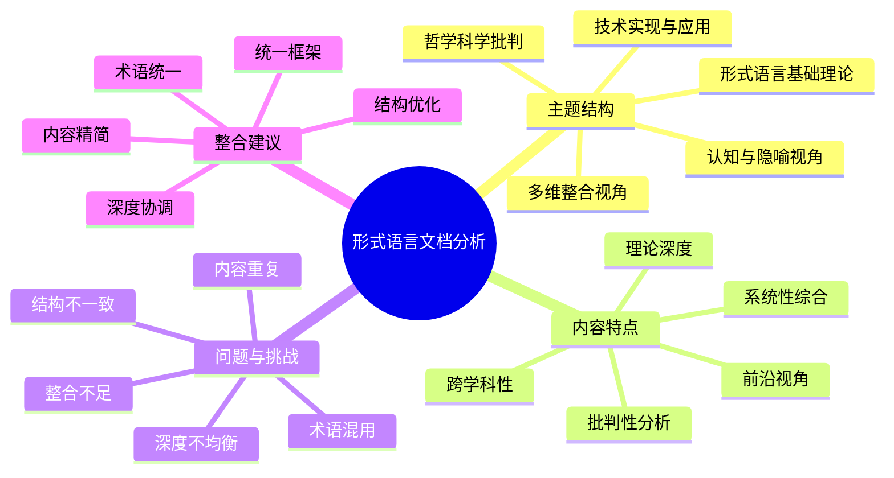

# 形式语言与形式化推理文档的批判性分析

## 目录

- [形式语言与形式化推理文档的批判性分析](#形式语言与形式化推理文档的批判性分析)
  - [目录](#目录)
  - [1. 文档内容概述与总体评价](#1-文档内容概述与总体评价)
    - [1.1 文档体系与主题分布](#11-文档体系与主题分布)
    - [1.2 理论深度与学术价值](#12-理论深度与学术价值)
    - [1.3 跨学科整合程度](#13-跨学科整合程度)
  - [2. 核心理论框架分析](#2-核心理论框架分析)
    - [2.1 形式语言的基础理论处理](#21-形式语言的基础理论处理)
    - [2.2 认知隐喻视角的创新性](#22-认知隐喻视角的创新性)
    - [2.3 哲学批判维度的深度](#23-哲学批判维度的深度)
    - [2.4 技术实现视角的系统性](#24-技术实现视角的系统性)
  - [3. 文档结构与组织评价](#3-文档结构与组织评价)
    - [3.1 内容重复与冗余问题](#31-内容重复与冗余问题)
    - [3.2 结构一致性问题](#32-结构一致性问题)
    - [3.3 深度均衡性问题](#33-深度均衡性问题)
  - [4. 跨领域整合与边界问题](#4-跨领域整合与边界问题)
    - [4.1 理论与应用的连接性](#41-理论与应用的连接性)
    - [4.2 学科边界的处理方式](#42-学科边界的处理方式)
    - [4.3 多维视角的整合程度](#43-多维视角的整合程度)
  - [5. 文档整合优化建议](#5-文档整合优化建议)
    - [5.1 统一理论框架构建](#51-统一理论框架构建)
    - [5.2 内容结构优化方案](#52-内容结构优化方案)
    - [5.3 深度协调与术语统一](#53-深度协调与术语统一)

## 1. 文档内容概述与总体评价

### 1.1 文档体系与主题分布

分析的文档集合包含多篇关于形式语言和形式化推理的深度探讨文章，主题覆盖了形式语言的理论基础、认知隐喻视角、哲学批判分析、技术实现应用以及多维整合视角等多个维度。这些文档形成了一个全面但结构松散的知识体系，试图从多角度深入剖析形式语言的本质、应用与局限。

主题分布呈现以下特点：

1. **理论基础**：包括形式语言的严格定义、形式系统构成要素、形式证明结构与乔姆斯基层次结构等核心理论内容。

2. **认知视角**：探讨形式语言与人类认知的关系，特别强调多模态表征、概念隐喻、具身认知等前沿认知科学视角。

3. **哲学批判**：涵盖从古典逻辑到后现代主义的哲学思想脉络，对形式语言的本体论、认识论和方法论进行深入批判。

4. **技术实现**：详细分析形式语言在计算机硬件、软件、AI模型等技术领域的具体实现与应用。

5. **多维整合**：尝试将形式语言的理论、认知、哲学和技术维度进行系统整合，构建更全面的理解框架。

总体而言，这些文档构成了一个学术深度和广度兼具的知识体系，但缺乏统一的组织结构和清晰的层次关系。

### 1.2 理论深度与学术价值

文档集合在理论深度方面表现出显著优势，具有以下学术价值：

1. **理论严谨性**：文档对形式语言的基础理论进行了严格定义和系统阐述，包括形式语言的数学定义、形式系统的构成、形式证明的结构等，展现了扎实的理论基础。

2. **前沿视角整合**：成功融合了认知科学、哲学和计算机科学等领域的前沿理论，特别是在认知隐喻、具身认知和分布式系统等方面的整合具有创新性。

3. **批判性思维**：不满足于形式语言的技术描述，而是深入探讨其哲学基础、认知局限和社会文化维度，体现了高度的批判性思维。

4. **跨学科价值**：为形式语言研究提供了跨学科的综合框架，有助于打破传统学科界限，促进不同领域间的对话与融合。

然而，理论深度在不同文档和不同主题间分布不均，部分内容（如哥德尔不完备定理、认知隐喻理论）在多篇文档中重复出现且深度不一，影响了整体的学术凝聚力。

### 1.3 跨学科整合程度

文档集合在跨学科整合方面展现出雄心勃勃的尝试，但整合程度参差不齐：

1. **强整合领域**：
   - 形式语言与认知科学的整合较为成功，特别是在概念隐喻和具身认知方面
   - 形式语言与计算机技术的连接紧密，从硬件到软件再到AI系统形成了清晰的技术实现脉络

2. **弱整合领域**：
   - 哲学批判与技术实现之间的桥接不足，两者往往作为相对独立的部分存在
   - 社会文化维度与形式理论的整合较为肤浅，缺乏深入的社会学或人类学视角

3. **整合挑战**：
   - 术语体系不统一，相同概念在不同文档中使用不同表述
   - 理论框架碎片化，缺乏统一的元理论来组织多学科视角
   - 方法论多元但整合不足，定性与定量方法、形式与非形式方法之间的关系未能充分阐明

总体而言，文档集合展现了形式语言研究的跨学科潜力，但真正的深度整合仍有待加强，特别是在构建统一的理论框架和方法论体系方面。

## 2. 核心理论框架分析

### 2.1 形式语言的基础理论处理

文档集合对形式语言的基础理论处理总体上严谨而全面，但存在以下特点与问题：

1. **理论完整性**：文档涵盖了形式语言理论的核心内容，包括形式语言的定义、形式文法、自动机理论、乔姆斯基层次结构等，构成了较为完整的理论框架。

2. **数学严谨性**：多篇文档采用了严格的数学定义和定理-证明结构，如《形式语言：多维表征与认知隐喻视角》中对形式语言和形式系统的严格定义，体现了高度的数学严谨性。

3. **理论深度不均**：不同文档对基础理论的处理深度不一致，从简要概述到详细证明不等，缺乏统一的深度标准。例如，对哥德尔不完备定理的处理从简单提及到详细证明过程不等。

4. **重复与冗余**：核心概念如形式语言定义、乔姆斯基层次结构等在多篇文档中重复出现，且表述方式和深度各异，造成了不必要的冗余。

5. **理论更新不足**：部分文档对形式语言理论的最新发展（如范畴语法、依存语法等）关注不足，理论框架仍以经典理论为主。

总体评价：文档集合在形式语言基础理论方面具有坚实的学术基础，但需要更好地协调不同文档间的理论深度，减少冗余，并加强对理论前沿的关注。

### 2.2 认知隐喻视角的创新性

认知隐喻视角是文档集合的一大亮点，特别是在《形式语言：多维表征与认知隐喻视角》中得到了系统发展，展现出以下创新特点：

1. **理论创新**：将莱考夫和努涅兹的概念隐喻理论应用于形式语言分析，揭示了抽象形式系统背后的具身认知基础，这一视角在传统形式语言研究中较为少见。

2. **隐喻系统的系统分析**：文档详细分析了形式语言中的核心隐喻，如容器隐喻、路径隐喻、构建隐喻和空间隐喻等，并将其与形式表达建立了明确对应关系。

3. **多模态认知表征**：文档突破了传统符号主义的局限，强调人类认知表征的多模态性，包括命题表征、图像表征、感知符号表征等，为理解形式思维提供了更丰富的认知框架。

4. **实证支持**：引用了神经影像学、眼动追踪和手势研究等实证证据，为认知隐喻视角提供了科学支持，增强了论证的可信度。

5. **理论整合**：成功将认知语言学、具身认知理论与形式语言研究整合，构建了一个跨学科的理论框架，为理解形式思维的认知基础提供了新视角。

然而，认知隐喻视角在文档集合中的分布不均衡，部分文档（如技术实现导向的文档）对此关注较少，导致这一创新视角未能充分融入整体理论框架。

### 2.3 哲学批判维度的深度

文档集合在哲学批判维度展现了相当的深度，特别是在以下方面：

1. **历史脉络梳理**：系统梳理了形式语言的哲学思想脉络，从亚里士多德的古典逻辑到维特根斯坦的语言哲学，再到后现代主义的批判，构建了形式语言的哲学史。

2. **本体论批判**：深入探讨了形式对象的存在性质，对比分析了柏拉图主义、形式主义、构造主义和结构主义等不同立场，揭示了形式语言研究中的本体论假设。

3. **认识论分析**：批判性分析了形式知识的确定性与可靠性，特别是通过哥德尔不完备定理和图灵停机问题，揭示了形式系统的认识论局限。

4. **方法论反思**：对形式方法本身进行了元层次的反思，探讨了形式化与非形式化思维的关系、形式简化的利弊以及形式方法的适用边界。

5. **社会文化批判**：部分文档（如《形式语言的社会文化维度》章节）引入了权力结构、文化多样性和性别视角等批判理论元素，拓展了形式语言研究的社会维度。

然而，哲学批判在不同文档中的深度和侧重点差异较大，从深入的元数学分析到相对表面的社会文化评论不等。此外，当代哲学（如分析哲学中的新发展、现象学与形式科学的关系等）的整合程度有限。

### 2.4 技术实现视角的系统性

技术实现视角在文档集合中得到了系统性发展，特别是在《形式化推理的哲学科学批判性分析：技术实现与应用视角》中表现突出：

1. **多层次技术架构**：文档构建了从硬件到软件再到AI模型的多层次技术架构，系统分析了形式语言在各层次的实现方式和特点。

2. **硬件实现分析**：深入探讨了形式系统的物理实现，从布尔代数到数字电路，从CPU架构到专用处理器，揭示了形式与物质之间的复杂关系。

3. **软件工程视角**：系统分析了形式语言在软件工程中的应用，包括编程语言设计、API契约、设计模式和形式验证等，展示了形式方法的实践价值和局限。

4. **AI系统整合**：探讨了形式语言与AI模型的深层联系，特别是大语言模型中的形式结构、概率模型与形式语言的融合等前沿话题，反映了当代技术发展。

5. **技术哲学反思**：不满足于技术描述，而是深入探讨技术实现中的哲学问题，如形式与物质的不可调和性、形式完备性与工程实用性的对立等，展现了技术哲学的深度。

技术实现视角的主要局限在于与其他视角（特别是认知隐喻视角）的整合不足，技术分析与认知分析往往作为相对独立的部分存在，缺乏深层次的理论桥接。

## 3. 文档结构与组织评价

### 3.1 内容重复与冗余问题

文档集合存在明显的内容重复与冗余问题，影响了整体的学术凝聚力和阅读效率：

1. **核心概念重复**：形式语言的定义、乔姆斯基层次结构、哥德尔不完备定理等核心概念在多篇文档中重复出现，且深度和表述各异。

2. **理论框架重叠**：多篇文档都构建了自己的理论框架，如《形式语言：多维表征与认知隐喻视角》和《形式化推理的哲科批判性分析：跨领域视角》都包含完整的形式语言理论框架，内容高度重叠。

3. **案例分析重复**：某些典型案例（如TCP/IP协议的形式化、区块链中的共识算法等）在多篇文档中重复分析，但角度和深度不一。

4. **批判论点重复**：关于形式语言局限性的批判论点（如抽象泄漏、形式与物质的不可调和性等）在多篇文档中以不同表述重复出现。

5. **结构性重复**：多篇文档采用相似的结构模式，如"理论基础→应用分析→批判反思→未来展望"的结构在多篇文档中重复出现。

这种重复不仅造成了内容冗余，也导致了观点和深度的不一致性，读者难以形成对形式语言的统一理解框架。

### 3.2 结构一致性问题

文档集合在结构组织上存在明显的不一致性，主要表现在：

1. **层次结构不一致**：不同文档采用不同的层次结构，从二级标题到四级标题不等，缺乏统一的层次标准。

2. **分类逻辑不一致**：不同文档采用不同的分类逻辑，有的按学科领域（数学、逻辑、计算机科学等），有的按理论层次（基础理论、应用分析、批判反思等），有的按研究视角（认知视角、哲学视角、技术视角等）。

3. **术语体系不统一**：相同概念在不同文档中使用不同术语，如"形式系统"与"形式化系统"、"认知隐喻"与"概念隐喻"等，增加了理解难度。

4. **引用格式不一致**：文档间的引用格式和学术规范不统一，有的使用脚注，有的使用尾注，有的直接在正文中引用，缺乏统一标准。

5. **图表使用不一致**：部分文档大量使用图表和形式化表示，而其他文档则以纯文本为主，造成了表达方式的不一致。

这种结构不一致性不仅影响了文档集合的整体性和系统性，也增加了读者的认知负担，不利于形成对形式语言的系统理解。

### 3.3 深度均衡性问题

文档集合在内容深度上存在明显的不均衡性，主要表现在：

1. **理论深度不均**：部分核心概念（如哥德尔不完备定理）在某些文档中得到深入分析和严格证明，而在其他文档中仅作简要提及；同样，认知隐喻理论在某些文档中有详细阐述，在其他文档中则较为表面。

2. **领域覆盖不均**：技术实现领域（特别是硬件和软件部分）得到了详细分析，而社会文化维度的分析相对薄弱；同样，形式语言的数学基础得到充分阐述，而其在社会科学中的应用分析较为有限。

3. **批判深度不均**：对形式语言内在局限（如不完备性、不可判定性）的批判较为深入，而对其社会政治影响的批判相对肤浅；同样，认识论批判较为充分，而伦理学批判不足。

4. **案例分析不均**：某些技术案例（如CPU架构、编程语言）分析详尽，而其他领域的案例（如认知科学实验、社会科学应用）分析简略。

5. **前沿关注不均**：对AI领域的前沿发展（如大语言模型）关注较多，而对形式语言理论本身的前沿发展关注不足。

这种深度不均衡性导致了文档集合整体上的不协调，某些部分过于深入而其他部分相对肤浅，不利于形成均衡的知识体系。

## 4. 跨领域整合与边界问题

### 4.1 理论与应用的连接性

文档集合在理论与应用的连接方面表现出以下特点：

1. **理论应用桥接**：部分文档成功建立了形式语言理论与具体应用领域的桥接，特别是在计算机科学领域，从形式语言理论到编程语言设计、从自动机理论到硬件实现等连接清晰。

2. **应用案例丰富**：文档提供了丰富的应用案例，涵盖硬件设计、软件工程、AI系统、形式验证等多个领域，展示了形式语言的广泛实用价值。

3. **理论指导不足**：在某些领域，理论与应用之间的指导关系不够明确，理论分析与应用案例并列呈现，而非形成清晰的理论指导应用的逻辑链。

4. **应用反馈缺失**：应用实践对理论发展的反馈机制描述不足，缺乏应用中发现的问题如何促进理论创新的分析。

5. **跨领域应用不均**：计算机科学领域的应用分析充分，而其他领域（如认知科学、语言学、社会科学等）的应用分析相对薄弱。

总体而言，文档集合在计算机科学领域实现了较好的理论-应用连接，但在其他领域的连接性有待加强，特别是需要更清晰地展示理论如何指导应用以及应用如何反馈理论。

### 4.2 学科边界的处理方式

文档集合在处理学科边界方面展现出以下特点：

1. **边界跨越尝试**：文档积极尝试跨越传统学科边界，将形式语言研究与认知科学、哲学、计算机科学等多个领域连接，体现了跨学科研究的雄心。

2. **概念桥接机制**：通过核心概念（如表征、隐喻、形式化等）作为桥接不同学科的机制，在一定程度上实现了跨学科对话。

3. **方法论整合不足**：不同学科的方法论（如数学证明、实证研究、哲学分析等）并列呈现，缺乏有机整合，形成了"多学科"而非真正的"跨学科"或"超学科"研究。

4. **术语体系冲突**：不同学科对相同概念的不同理解和表述导致了术语体系的冲突，如"形式"在数学、哲学和认知科学中的不同内涵未能充分协调。

5. **边界模糊区域**：在某些边界模糊的区域（如形式语言与认知的交界、形式系统与物理实现的交界等），分析深度不足，未能充分展示边界问题的复杂性。

总体而言，文档集合展现了跨越学科边界的积极尝试，但真正的深度整合仍有不足，特别是在方法论整合和术语协调方面需要进一步努力。

### 4.3 多维视角的整合程度

文档集合提出了形式语言研究的多维视角，但这些视角的整合程度参差不齐：

1. **视角并列现象**：多维视角（理论、认知、哲学、技术等）往往并列呈现，各自发展，缺乏有机整合，形成了"多视角"而非"整合视角"的局面。

2. **视角间张力处理**：不同视角之间的张力（如形式严格性与认知灵活性、理论纯粹性与应用实用性等）被识别出来，但解决这些张力的整合框架不够清晰。

3. **元理论框架缺失**：缺乏一个统一的元理论框架来组织和整合多维视角，导致各视角发展相对独立，难以形成系统性理解。

4. **整合案例不足**：缺乏充分展示多维视角整合的典型案例，如何同时运用理论、认知、哲学和技术视角分析同一问题的示例较少。

5. **整合方法论模糊**：如何整合多维视角的方法论讨论不足，缺乏明确的整合策略和路径。

尽管文档集合强调多维视角的重要性，但实际整合程度有限，需要发展更系统的整合框架和方法论。

## 5. 文档整合优化建议

### 5.1 统一理论框架构建

为解决文档集合中的理论碎片化问题，建议构建一个统一的理论框架：

1. **核心概念体系**：建立形式语言研究的核心概念体系，包括基础定义、关键理论和核心原则，确保在所有文档中使用一致的概念定义和表述。

2. **多层次理论结构**：构建从基础理论到应用分析再到批判反思的多层次理论结构，明确各层次之间的逻辑关系和依赖关系。

3. **跨学科整合模型**：发展一个能够整合多学科视角的理论模型，明确形式语言研究中数学、逻辑、认知、哲学和技术等维度的关系。

4. **理论发展脉络**：梳理形式语言理论的历史发展脉络，从古典逻辑到现代形式系统，再到当代的认知和计算视角，形成清晰的理论演化图景。

5. **统一的元理论视角**：建立一个元理论视角，用于反思形式语言研究本身的方法论、认识论和本体论基础，为多维分析提供统一框架。

这种统一理论框架将有助于减少重复，增强一致性，并为读者提供更清晰的知识导航系统。

### 5.2 内容结构优化方案

为优化文档集合的内容结构，提出以下具体方案：

1. **模块化重组**：将现有文档按主题模块化重组，形成以下核心模块：
   - 形式语言基础理论模块
   - 认知与隐喻分析模块
   - 哲学批判与反思模块
   - 技术实现与应用模块
   - 跨学科整合与前沿发展模块

2. **层次结构统一**：统一各模块的层次结构，采用一致的标题级别和组织逻辑，确保整体结构的清晰性和一致性。

3. **内容去重整合**：识别并合并重复内容，对同一概念或理论的多种表述进行整合，保留最深入和最清晰的版本。

4. **交叉引用系统**：建立模块间的交叉引用系统，明确不同模块之间的关联和依赖关系，帮助读者在不同视角间建立连接。

5. **案例库建设**：构建统一的案例库，将分散在各文档中的应用案例整合并系统化，按领域和复杂度分类，便于参考和比较。

这种结构优化将大幅提高文档集合的整体性和可读性，减少冗余，增强各部分之间的有机联系。

### 5.3 深度协调与术语统一

为解决深度不均衡和术语不一致问题，建议采取以下措施：

1. **术语表标准化**：建立统一的术语表，明确定义核心概念，确保在所有文档中使用一致的术语和表述，特别是跨学科的关键概念。

2. **深度标准协调**：为不同主题和领域制定统一的深度标准，确保核心概念和理论得到均衡的深入分析，避免某些部分过于详细而其他部分过于简略。

3. **形式化表示统一**：统一数学公式
