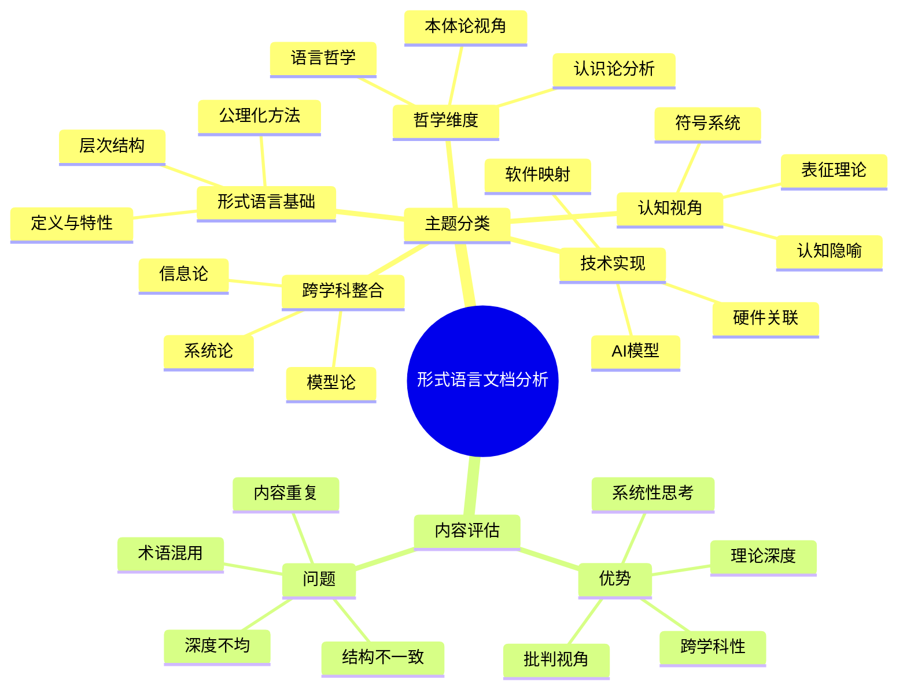

# 形式语言与形式化推理文档的批判性分析

## 目录

- [形式语言与形式化推理文档的批判性分析](#形式语言与形式化推理文档的批判性分析)
  - [目录](#目录)
  - [1. 文档内容概述与主题分类](#1-文档内容概述与主题分类)
    - [1.1 形式语言基础理论](#11-形式语言基础理论)
    - [1.2 哲学与认识论维度](#12-哲学与认识论维度)
    - [1.3 认知与表征视角](#13-认知与表征视角)
    - [1.4 技术实现与应用](#14-技术实现与应用)
    - [1.5 跨学科整合框架](#15-跨学科整合框架)
  - [2. 文档结构与组织评价](#2-文档结构与组织评价)
    - [2.1 内容重复与冗余问题](#21-内容重复与冗余问题)
    - [2.2 结构一致性问题](#22-结构一致性问题)
    - [2.3 术语使用与概念界定](#23-术语使用与概念界定)
  - [3. 理论深度与学术价值分析](#3-理论深度与学术价值分析)
    - [3.1 理论框架的系统性](#31-理论框架的系统性)
    - [3.2 批判视角的创新性](#32-批判视角的创新性)
    - [3.3 跨学科整合的广度](#33-跨学科整合的广度)
  - [4. 整合优化建议](#4-整合优化建议)
    - [4.1 内容整合方案](#41-内容整合方案)
    - [4.2 结构优化建议](#42-结构优化建议)
    - [4.3 深度协调策略](#43-深度协调策略)
  - [5. 总体评价与展望](#5-总体评价与展望)

## 1. 文档内容概述与主题分类

### 1.1 形式语言基础理论

文档集合对形式语言的基础理论进行了全面而深入的探讨，主要涵盖以下核心内容：

- **定义与特性**：系统阐述了形式语言的精确性、形式化、递归性、组合性和抽象性等核心特征，将其与自然语言进行对比，突出其作为数学、逻辑学和计算机科学基础工具的特殊地位。

- **层次结构**：详细分析了乔姆斯基语言谱系，从正则语言到无限制语言的层次分类，揭示了语法复杂性与表达能力、计算复杂性之间的深层关系。

- **公理化方法**：探讨了形式语言的公理化过程，包括确定基本符号、建立形成规则、选择公理、确立推导规则等步骤，同时指出了公理化方法面临的哥德尔不完备性等根本限制。

这部分内容体现了对形式语言理论基础的系统把握，为后续的跨学科分析奠定了坚实基础。

### 1.2 哲学与认识论维度

文档集合从多个哲学维度对形式语言进行了深入批判性分析：

- **本体论视角**：探讨了形式对象的存在性质，分析了数学柏拉图主义、形式主义、构造主义等不同立场对形式语言本体地位的不同理解。

- **认识论分析**：考察了形式知识的边界和局限，特别是通过哥德尔不完备定理、图灵停机问题等理论成果，揭示了形式系统内在的认识论限制。

- **语言哲学**：分析了形式语言与自然语言的关系，以及符号系统在知识表达和交流中的作用与局限。

这部分内容体现了对形式语言深层哲学问题的批判性思考，超越了技术层面，探讨了形式语言的基础性哲学问题。

### 1.3 认知与表征视角

文档集合从认知科学角度分析了形式语言的认知基础和表征特性：

- **符号系统与认知表征**：探讨了形式符号系统如何作为人类认知的外部工具，扩展了思维能力，同时也受到认知结构的制约。

- **认知隐喻**：创新性地分析了形式思维中的隐喻结构，揭示了抽象数学概念如何通过具身隐喻得以理解和操作。

- **多层次表征**：考察了形式语言如何在多个层次上表征知识，以及不同表征层次之间的转换机制和认知成本。

这部分内容将认知科学的新进展与形式语言研究相结合，提供了理解形式语言认知基础的新视角。

### 1.4 技术实现与应用

文档集合详细分析了形式语言在技术领域的实现和应用：

- **硬件关联**：探讨了形式语言与计算机硬件的共生关系，从冯·诺依曼架构到CPU指令集、GPU并行计算模型、TPU专用硬件等，分析了物理实现对形式语言的约束和影响。

- **软件映射**：考察了形式语言在软件工程中的应用，包括编程语言设计、形式化方法、设计模式等，揭示了理论纯粹性与实用性之间的张力。

- **AI模型**：分析了形式语言与人工智能模型的深层关联，特别是语言模型、神经网络架构、多模态AI等新兴领域对传统形式语言理论的挑战和扩展。

这部分内容将抽象的形式语言理论与具体的技术实现联系起来，展示了理论与实践的互动关系。

### 1.5 跨学科整合框架

文档集合尝试构建形式语言研究的跨学科整合框架：

- **信息论**：分析了形式语言与信息论的交互，包括编码与压缩、通信复杂性、信道容量与语言表达能力等方面。

- **模型论**：探讨了形式语言与模型论的深层关系，包括满足关系、完备性与紧致性、范畴等价与同构等核心概念。

- **系统论与控制论**：从系统整体性视角分析了形式语言的结构和功能，将其置于更广泛的系统科学框架中考察。

这部分内容体现了对形式语言跨学科研究的整合尝试，打破了传统学科界限，提供了更全面的理解视角。

## 2. 文档结构与组织评价

### 2.1 内容重复与冗余问题

文档集合存在明显的内容重复和冗余问题：

- **主题重叠**：多个文档反复讨论相同主题，如形式语言的定义、乔姆斯基层次、哥德尔不完备定理等，内容存在大量重叠。

- **结构复制**：多个文档采用相似的结构框架，从理论基础到哲学分析再到应用展望，导致整体阅读体验重复。

- **案例重用**：相同的例子和论证在不同文档中反复出现，如图灵机模型、停机问题的不可判定性等。

这种重复不仅降低了内容密度，也使得文档集合缺乏明确的层次结构和阅读路径。

### 2.2 结构一致性问题

文档集合在结构组织上存在一致性问题：

- **深度不均**：某些主题（如形式语言的基础定义）在多个文档中都有详细讨论，而其他主题（如具体应用案例）则相对薄弱。

- **分类标准不一**：不同文档采用不同的分类标准和层次结构，使得整体缺乏统一的组织框架。

- **连贯性不足**：文档之间缺乏明确的逻辑关联和引用关系，使得整体知识结构松散。

这些问题影响了文档集合作为系统性知识体系的整体性和连贯性。

### 2.3 术语使用与概念界定

文档集合在术语使用和概念界定上存在一些问题：

- **术语不一致**：同一概念在不同文档中使用不同术语，如"形式化推理"与"形式推理"、"哲学科学分析"与"哲科分析"等。

- **概念边界模糊**：某些核心概念（如"形式"、"表征"、"模型"等）在不同文档中的使用存在细微差异，缺乏统一明确的界定。

- **专业术语解释不足**：部分专业术语（如模型论中的"满足关系"、复杂性理论中的"归约"等）缺乏足够的解释，可能影响非专业读者的理解。

这些问题可能导致读者在跨文档阅读时产生概念混淆和理解障碍。

## 3. 理论深度与学术价值分析

### 3.1 理论框架的系统性

文档集合展现了对形式语言理论的系统性把握：

- **多维理论整合**：成功整合了形式语言学、计算理论、模型论、信息论等多个理论框架，构建了多维度的理解视角。

- **历史脉络梳理**：清晰呈现了形式语言理论的历史发展脉络，从古典逻辑到现代形式语言理论的演进过程。

- **核心问题聚焦**：深入探讨了形式语言理论的核心问题，如表达能力的层次、形式系统的限制、语法与语义的关系等。

这种系统性理论框架为形式语言研究提供了全面而深入的理论基础。

### 3.2 批判视角的创新性

文档集合展现了对形式语言的创新性批判视角：

- **多学科批判视角**：不局限于传统的数理逻辑视角，引入认知科学、哲学、系统论等多学科视角进行批判性分析。

- **隐喻分析创新**：创新性地应用认知语言学的隐喻理论分析形式思维的认知基础，揭示了抽象形式概念的具身根源。

- **技术生态整合**：将形式语言置于现代技术生态系统中考察，分析其与硬件、软件、AI系统的共生关系，提供了新的理解框架。

这些创新性批判视角超越了传统形式语言研究的范式，开拓了新的研究方向。

### 3.3 跨学科整合的广度

文档集合展现了广泛的跨学科整合视野：

- **理论跨界**：打破了数学、逻辑学、计算机科学、语言学、认知科学、哲学等学科界限，实现了多学科理论的交叉融合。

- **方法整合**：综合运用形式分析、历史考察、认知分析、哲学批判等多种研究方法，形成了方法论上的多元整合。

- **应用关联**：将理论研究与技术应用、社会影响等维度联系起来，体现了理论与实践的双向互动。

这种跨学科整合为形式语言研究提供了更广阔的视野和更丰富的理解维度。

## 4. 整合优化建议

### 4.1 内容整合方案

针对内容重复问题，建议采取以下整合方案：

- **核心概念统一处理**：将形式语言的基础定义、特性、层次结构等核心概念集中在一个基础文档中系统阐述，其他文档引用而非重复。

- **专题化组织**：将现有文档按主题重组为几个核心专题，如"理论基础"、"哲学维度"、"认知视角"、"技术实现"、"跨学科整合"等，每个专题深入发展特定视角。

- **渐进深化结构**：构建从基础到高级的渐进深化结构，基础文档介绍核心概念，专题文档深化特定视角，综合文档提供整合分析。

这种整合方案可以显著减少内容重复，提高知识密度和阅读效率。

### 4.2 结构优化建议

针对结构一致性问题，建议进行以下优化：

- **统一分类框架**：建立统一的分类框架和层次结构，确保所有文档在组织上保持一致性。

- **明确文档关系**：建立清晰的文档间关系图，说明各文档的定位和相互关系，为读者提供明确的阅读路径。

- **标准化章节结构**：对相似类型的文档采用标准化的章节结构，便于读者在不同文档间进行对比和关联阅读。

这些优化措施可以增强文档集合的整体结构性和连贯性。

### 4.3 深度协调策略

针对深度不均衡问题，建议采取以下协调策略：

- **核心-扩展模式**：对每个主题建立"核心-扩展"的二层结构，核心内容确保全面覆盖，扩展内容可以有所侧重。

- **交叉引用系统**：建立完善的交叉引用系统，使读者能够根据需要在不同深度层次间灵活导航。

- **案例库建设**：建立统一的案例库，收集形式语言在不同领域的应用案例，各文档可以根据需要引用，避免重复。

这些策略可以在保持专题深度的同时，确保整体知识结构的平衡和完整。

## 5. 总体评价与展望

总体而言，这套形式语言与形式化推理文档集合展现了对该领域的深入研究和多维思考，具有以下突出价值：

- **理论深度**：对形式语言的理论基础进行了系统而深入的探讨，展现了扎实的学术功底。

- **批判视角**：超越了传统的技术视角，从哲学、认知、社会等多维度对形式语言进行了批判性反思。

- **跨学科整合**：打破了传统学科界限，实现了多学科理论和方法的创新整合。

- **前沿视野**：关注了形式语言与人工智能、量子计算等前沿领域的交互，展现了前瞻性视野。

同时，文档集合也存在内容重复、结构不一致、深度不均衡等问题，需要通过系统性整合和优化来提升整体质量和可用性。

未来发展方向可考虑：

1. 进一步深化与人工智能、量子计算等前沿领域的交互研究
2. 增强实践案例分析，加强理论与应用的联系
3. 发展更系统化的教学和传播框架，提高知识的可获取性
4. 建立动态更新机制，持续整合新的研究进展和应用实践

通过这些优化和发展，这套文档集合有潜力成为形式语言与形式化推理领域的重要知识资源和研究参考。

