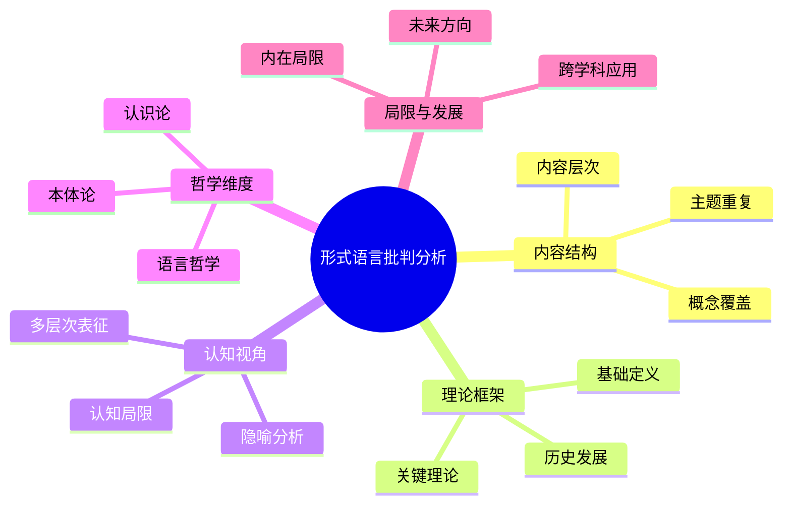

# 形式语言视角文档的批判性分析

## 目录

- [形式语言视角文档的批判性分析](#形式语言视角文档的批判性分析)
  - [目录](#目录)
  - [1. 文档结构与内容分析](#1-文档结构与内容分析)
    - [1.1 内容重叠与冗余](#11-内容重叠与冗余)
    - [1.2 结构一致性问题](#12-结构一致性问题)
    - [1.3 层次深度不均衡](#13-层次深度不均衡)
  - [2. 理论框架评估](#2-理论框架评估)
    - [2.1 基础理论覆盖](#21-基础理论覆盖)
    - [2.2 历史脉络呈现](#22-历史脉络呈现)
    - [2.3 核心概念处理](#23-核心概念处理)
  - [3. 认知视角的深度](#3-认知视角的深度)
    - [3.1 隐喻分析的创新性](#31-隐喻分析的创新性)
    - [3.2 多层次表征的系统性](#32-多层次表征的系统性)
    - [3.3 认知局限的探讨](#33-认知局限的探讨)
  - [4. 哲学维度的广度](#4-哲学维度的广度)
    - [4.1 本体论视角](#41-本体论视角)
    - [4.2 认识论分析](#42-认识论分析)
    - [4.3 语言哲学探讨](#43-语言哲学探讨)
  - [5. 文档整合建议](#5-文档整合建议)
    - [5.1 内容整合方案](#51-内容整合方案)
    - [5.2 结构优化建议](#52-结构优化建议)
    - [5.3 深度拓展方向](#53-深度拓展方向)
  - [6. 总体评价](#6-总体评价)

## 1. 文档结构与内容分析

### 1.1 内容重叠与冗余

七个视角文档之间存在显著的内容重叠，特别是在形式语言的基础理论、哥德尔不完备定理和认知隐喻等核心概念上。
这种重复不仅导致了信息冗余，也使得各文档的独特贡献不够明确。

具体重叠区域：

- 所有文档都包含形式语言的基本定义和理论框架
- view01、view03、view05、view06、view08均详细讨论了哥德尔不完备定理
- 认知隐喻分析在view02、view03、view07中有大量重复内容

这种重叠表明文档可能是在不同时期或由不同作者撰写，缺乏整体协调。

### 1.2 结构一致性问题

各文档的结构组织存在一致性问题：

- view01和view07采用较为简洁的章节结构
- view03和view06使用了更为详细的多级标题
- view02和view05的章节划分相对松散

这种结构不一致性降低了整体文档集的可读性和连贯性。特别是在引用相同概念时，不同文档使用的术语和组织方式不同，增加了理解难度。

### 1.3 层次深度不均衡

各文档在内容深度上存在不平衡：

- view03和view08在历史脉络和人物贡献上提供了详细信息
- view02在多层次表征和认知隐喻上有较深入的分析
- view05和view06在哲学维度的探讨上更为全面

这种不均衡导致读者难以从单一文档中获得形式语言的完整视角，需要在多个文档间跳转以构建全面理解。

## 2. 理论框架评估

### 2.1 基础理论覆盖

文档集对形式语言的基础理论覆盖较为全面，包括：

- 乔姆斯基语言谱系的四个层次
- 形式语言的语法、语义和推理规则
- 自动机理论与可计算性

然而，各文档对这些基础概念的处理深度不一，有些仅停留在列举层面（如view01），有些则提供了更深入的分析（如view08）。特别是在形式语言与计算理论的关联上，缺乏系统性的阐述。

### 2.2 历史脉络呈现

历史发展脉络的呈现是文档集的一个亮点，特别是view03、view06和view08提供了从古希腊到现代的形式语言发展史。这些文档通过表格形式清晰地展示了关键人物及其贡献，有助于理解形式语言的思想演进。

然而，这些历史叙述在不同文档中重复出现，且深度和侧重点不同，缺乏统一的历史框架。例如，view03详细介绍了弗雷格到乔姆斯基的贡献，而view07则更关注从亚里士多德到现代的思想脉络。

### 2.3 核心概念处理

核心概念的处理质量参差不齐：

- **哥德尔不完备定理**：所有文档都提及，但view03和view08的解释最为清晰
- **形式系统的自洽性**：view02提供了最深入的分析
- **乔姆斯基谱系**：view03和view05的阐述最为系统

文档集在核心概念的阐述上缺乏统一的深度标准，导致某些重要概念（如模型论）在不同文档中的处理深度差异显著。

## 3. 认知视角的深度

### 3.1 隐喻分析的创新性

文档集在形式语言的隐喻分析上展现了创新性，特别是view02和view07深入探讨了：

- 空间隐喻在数学概念中的应用
- 容器隐喻在集合论中的作用
- 路径隐喻在逻辑推理中的体现

这种将认知语言学与形式语言理论结合的视角具有学术价值，但各文档间的整合不足，导致这一创新视角的系统性呈现受到影响。

### 3.2 多层次表征的系统性

多层次表征分析是文档集的另一亮点，尤其是view02和view08提供了从语法层到认知层的系统分析框架。这种分层分析有助于理解形式语言的复杂性，但不同文档对层次的划分不一致：

- view02：符号层、语义层、元语言层、认知层
- view08：语法层次、语义层次、认知层次
- view06：句法层、语义层、语用层

这种不一致性降低了分析框架的清晰度和实用性。

### 3.3 认知局限的探讨

文档集在探讨形式语言的认知局限方面提供了有价值的见解，特别是：

- 形式化与人类直觉思维的差距
- 符号操作与概念理解之间的鸿沟
- 创造性思维难以完全形式化的挑战

然而，这些探讨分散在不同文档中，缺乏系统性的整合和深入的实证支持。

## 4. 哲学维度的广度

### 4.1 本体论视角

文档集在本体论视角上涵盖了主要的哲学立场：

- 柏拉图主义：数学对象独立存在
- 形式主义：数学是符号操作的形式系统
- 直觉主义：数学是心智构造
- 结构主义：数学研究结构关系

这些视角在view03、view06和view07中有所探讨，但缺乏深入的对比分析和当代发展的更新。

### 4.2 认识论分析

认识论维度的分析较为分散，主要集中在：

- 形式知识的确定性与可靠性问题
- 数学真理的本质和获取方式
- 形式系统的认知基础

这些分析在view01和view06中较为突出，但缺乏与当代认识论研究的深入对话。

### 4.3 语言哲学探讨

语言哲学视角是文档集相对薄弱的部分，虽然提及了：

- 形式语言与自然语言的关系
- 符号与意义的关联问题
- 语言的指称理论

但这些探讨相对表面，缺乏与维特根斯坦、克里普克等语言哲学家思想的深入对话。

## 5. 文档整合建议

### 5.1 内容整合方案

建议将七个文档整合为一个结构清晰的综合文档，按以下方式组织：

1. **基础理论框架**：整合view01、view03和view08的理论基础
2. **历史发展脉络**：合并view03、view06和view07的历史叙述
3. **认知与隐喻分析**：融合view02和view07的创新视角
4. **哲学维度探讨**：整合view01、view03和view06的哲学分析
5. **局限性与未来发展**：综合view05、view07和view08的前瞻性讨论

### 5.2 结构优化建议

为提高文档的系统性和可读性，建议采用一致的结构组织：

- 使用统一的多级标题体系
- 为每个主要概念提供明确的定义和示例
- 采用表格、图表等可视化元素增强理解
- 在章节间建立明确的引用关系

### 5.3 深度拓展方向

建议在以下方向进行深度拓展：

- **形式语言与人工智能**：探讨大语言模型对形式语言理论的挑战和启示
- **跨学科应用案例**：提供形式语言在不同领域应用的具体案例分析
- **实证研究整合**：引入认知科学和神经科学的实证研究支持理论分析
- **当代发展更新**：纳入类型论、范畴论等形式语言理论的最新发展

## 6. 总体评价

这七个形式语言视角文档展现了对形式语言的多维度、深入分析，特别是在认知隐喻、多层次表征和历史脉络方面提供了有价值的见解。文档集的主要优势在于其理论覆盖的广度和对形式语言认知基础的创新探索。

然而，文档集存在显著的内容重叠、结构不一致和深度不均衡问题，降低了其整体学术价值和可用性。通过系统整合、结构优化和深度拓展，这些文档可以发展成为一个更具学术价值和实用性的形式语言理论综合分析。

总体而言，这些文档为形式语言的批判性研究提供了丰富的理论资源，但需要更系统的整合和更新，以充分发挥其学术和教育价值。

