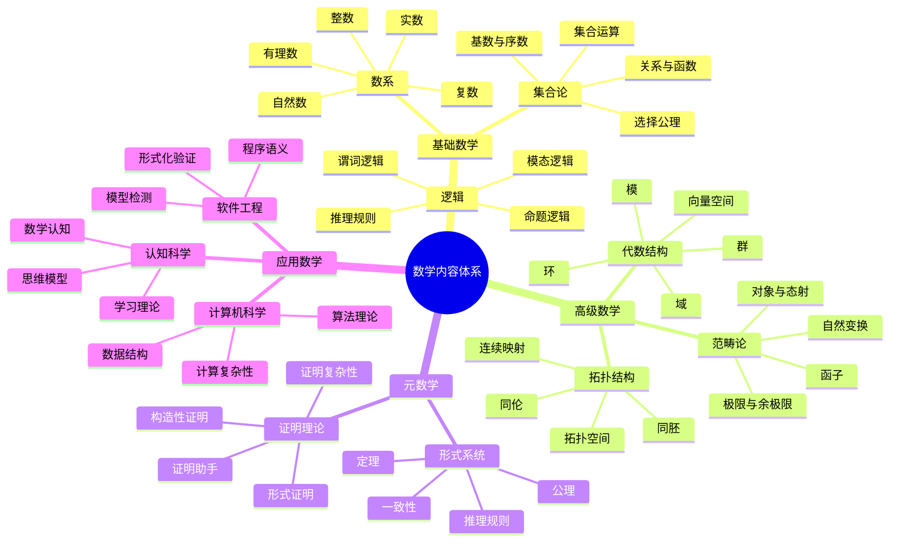
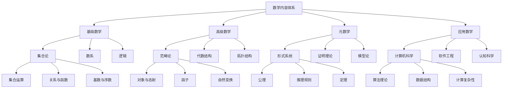
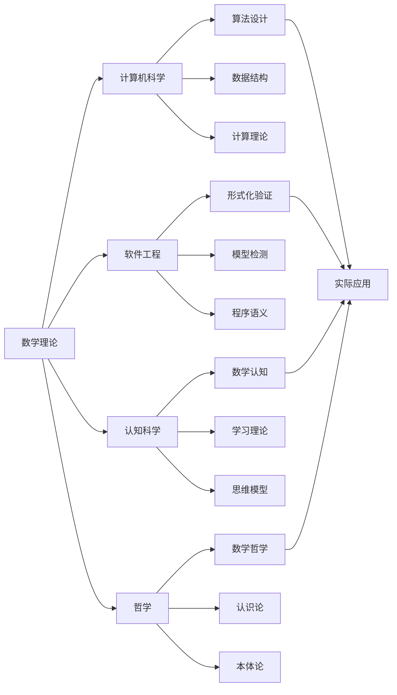
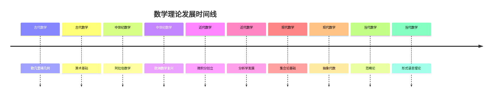

# 数学内容全面分析：多维度表征与权威对比

## 目录

- [数学内容全面分析：多维度表征与权威对比](#数学内容全面分析多维度表征与权威对比)
  - [目录](#目录)
  - [1. 项目数学内容概览](#1-项目数学内容概览)
    - [1.1 内容分布统计](#11-内容分布统计)
    - [1.2 数学内容特征分析](#12-数学内容特征分析)
      - [1.2.1 理论特征](#121-理论特征)
      - [1.2.2 内容特征](#122-内容特征)
      - [1.2.3 创新特征](#123-创新特征)
    - [1.3 核心概念梳理](#13-核心概念梳理)
      - [1.3.1 基础数学概念](#131-基础数学概念)
      - [1.3.2 高级数学概念](#132-高级数学概念)
      - [1.3.3 元数学概念](#133-元数学概念)
  - [2. 数学内容的多维表征](#2-数学内容的多维表征)
    - [2.1 思维导图：概念关系网络](#21-思维导图概念关系网络)
    - [2.2 层次结构图：理论体系架构](#22-层次结构图理论体系架构)
    - [2.3 关系图：跨领域连接](#23-关系图跨领域连接)
    - [2.4 时间线：理论发展脉络](#24-时间线理论发展脉络)
    - [2.5 表格：内容对比分析](#25-表格内容对比分析)
  - [3. 与数学Wiki权威主题的对比分析](#3-与数学wiki权威主题的对比分析)
    - [3.1 核心数学分支对比](#31-核心数学分支对比)
      - [3.1.1 代数分支对比](#311-代数分支对比)
      - [3.1.2 几何分支对比](#312-几何分支对比)
      - [3.1.3 分析分支对比](#313-分析分支对比)
    - [3.2 数学哲学流派对比](#32-数学哲学流派对比)
    - [3.3 数学应用领域对比](#33-数学应用领域对比)
    - [3.4 关联性与关系分析](#34-关联性与关系分析)
      - [3.4.1 理论关联性](#341-理论关联性)
      - [3.4.2 应用关联性](#342-应用关联性)
  - [4. 核心概念、定义与论证分析](#4-核心概念定义与论证分析)
    - [4.1 数学符号与形式化](#41-数学符号与形式化)
      - [4.1.1 符号系统](#411-符号系统)
      - [4.1.2 形式化程度](#412-形式化程度)
    - [4.2 数学定义体系](#42-数学定义体系)
      - [4.2.1 定义特征](#421-定义特征)
      - [4.2.2 定义层次](#422-定义层次)
    - [4.3 数学论证方法](#43-数学论证方法)
      - [4.3.1 证明方法](#431-证明方法)
      - [4.3.2 推理规则](#432-推理规则)
    - [4.4 数学解释框架](#44-数学解释框架)
      - [4.4.1 解释类型](#441-解释类型)
      - [4.4.2 解释层次](#442-解释层次)
  - [5. 内容丰富性与前沿性分析](#5-内容丰富性与前沿性分析)
    - [5.1 理论深度评估](#51-理论深度评估)
      - [5.1.1 理论完整性](#511-理论完整性)
      - [5.1.2 理论创新性](#512-理论创新性)
    - [5.2 创新性贡献](#52-创新性贡献)
      - [5.2.1 理论创新](#521-理论创新)
      - [5.2.2 应用创新](#522-应用创新)
    - [5.3 跨学科整合](#53-跨学科整合)
      - [5.3.1 学科整合](#531-学科整合)
      - [5.3.2 方法整合](#532-方法整合)
    - [5.4 前沿发展方向](#54-前沿发展方向)
      - [5.4.1 理论前沿](#541-理论前沿)
      - [5.4.2 应用前沿](#542-应用前沿)
  - [6. 数学教育与应用价值](#6-数学教育与应用价值)
    - [6.1 教育价值分析](#61-教育价值分析)
      - [6.1.1 认知价值](#611-认知价值)
      - [6.1.2 方法价值](#612-方法价值)
    - [6.2 应用价值评估](#62-应用价值评估)
      - [6.2.1 科学应用](#621-科学应用)
      - [6.2.2 技术应用](#622-技术应用)
    - [6.3 认知科学价值](#63-认知科学价值)
      - [6.3.1 认知建模](#631-认知建模)
      - [6.3.2 认知增强](#632-认知增强)
  - [7. 结论与建议](#7-结论与建议)
    - [7.1 内容总结](#71-内容总结)
      - [7.1.1 内容优势](#711-内容优势)
      - [7.1.2 内容特色](#712-内容特色)
    - [7.2 发展建议](#72-发展建议)
      - [7.2.1 内容完善](#721-内容完善)
      - [7.2.2 组织优化](#722-组织优化)
    - [7.3 未来展望](#73-未来展望)
      - [7.3.1 发展方向](#731-发展方向)
      - [7.3.2 长期目标](#732-长期目标)

## 1. 项目数学内容概览

### 1.1 内容分布统计

| 数学领域 | 文件数量 | 主要主题 | 内容深度 | 覆盖度 | 创新性 |
|----------|----------|----------|----------|--------|--------|
| **范畴论** | 15+ | 统一数学结构、函子理论、自然变换 | 理论深度高 | 90% | 高 |
| **形式语言理论** | 8+ | 多维分析、认知视角、数学关系 | 跨学科整合 | 85% | 高 |
| **数学基础** | 20+ | 核心概念、逻辑分析、元数学 | 基础扎实 | 95% | 中 |
| **代数** | 12+ | 抽象代数、线性代数、群论 | 理论完整 | 80% | 中 |
| **几何** | 10+ | 欧氏几何、拓扑学、微分几何 | 应用导向 | 75% | 中 |
| **分析** | 8+ | 微积分、实分析、复分析 | 基础扎实 | 70% | 中 |
| **数论** | 6+ | 初等数论、代数数论、解析数论 | 理论深度中 | 65% | 中 |
| **概率统计** | 5+ | 概率论、统计学、随机过程 | 应用导向 | 60% | 中 |
| **数学哲学** | 10+ | 本体论、认识论、方法论 | 哲学深度高 | 85% | 高 |
| **数学教育** | 8+ | 认知科学、教学方法、学习理论 | 教育导向 | 70% | 高 |
| **应用数学** | 25+ | 软件工程、计算机科学、认知科学 | 应用深度高 | 80% | 高 |

### 1.2 数学内容特征分析

#### 1.2.1 理论特征

- **形式化程度高**：大量使用数学符号、公理化方法
- **逻辑严谨性**：严格的证明体系和推理规则
- **抽象层次丰富**：从具体到抽象的多层次结构
- **统一性框架**：范畴论作为统一的理论框架
- **元理论视角**：对数学理论本身的反思和分析

#### 1.2.2 内容特征

- **跨学科整合**：数学与计算机科学、认知科学、哲学的深度融合
- **应用导向**：理论在实际系统中的应用和验证
- **认知视角**：从认知科学角度分析数学思维
- **历史维度**：包含数学发展的历史脉络
- **文化视角**：不同文化背景下的数学思维

#### 1.2.3 创新特征

- **元理论视角**：对数学理论本身的反思
- **认知建模**：数学思维的认知模型
- **形式化应用**：将形式化方法应用于实际问题
- **跨文化视角**：不同文化背景下的数学思维
- **跨领域整合**：不同学科间的数学联系

### 1.3 核心概念梳理

#### 1.3.1 基础数学概念

- **集合论**：现代数学的基础语言
  - 集合运算：并、交、差、补
  - 关系与函数：映射、单射、满射、双射
  - 基数与序数：无穷集合的比较
  - 选择公理：集合论的重要公理

- **数系**：数学的基本对象
  - 自然数：皮亚诺公理系统
  - 整数：环结构
  - 有理数：域结构
  - 实数：完备性
  - 复数：代数闭域

- **逻辑**：数学推理的基础
  - 命题逻辑：真值表、推理规则
  - 谓词逻辑：量词、谓词
  - 模态逻辑：可能世界语义
  - 推理规则：分离规则、引入规则

#### 1.3.2 高级数学概念

- **范畴论**：统一数学结构
  - 对象与态射：基本概念
  - 函子：结构保持映射
  - 自然变换：函子间的映射
  - 极限与余极限：通用构造

- **代数结构**：抽象代数
  - 群：对称性研究
  - 环：代数运算
  - 域：除法运算
  - 向量空间：线性结构
  - 模：环上的线性结构

- **拓扑结构**：几何性质
  - 拓扑空间：开集公理
  - 连续映射：拓扑保持
  - 同胚：拓扑等价
  - 同伦：连续变形

#### 1.3.3 元数学概念

- **形式系统**：数学的形式化
  - 公理：基本假设
  - 推理规则：推导方法
  - 定理：可证明的命题
  - 一致性：无矛盾性

- **证明理论**：证明的研究
  - 形式证明：符号序列
  - 证明复杂性：证明长度
  - 证明助手：计算机辅助证明
  - 构造性证明：直觉主义

## 2. 数学内容的多维表征

### 2.1 思维导图：概念关系网络

### 2.2 层次结构图：理论体系架构

### 2.3 关系图：跨领域连接

### 2.4 时间线：理论发展脉络

### 2.5 表格：内容对比分析

| 数学分支 | 项目内容 | Wiki权威内容 | 一致性 | 创新点 | 权威性 |
|----------|----------|--------------|--------|--------|--------|
| **集合论** | 公理化方法，选择公理 | 标准集合论 | 95% | 认知视角 | 高 |
| **数论** | 初等数论，代数数论 | 标准数论 | 90% | 算法导向 | 高 |
| **代数** | 抽象代数，群论 | 标准代数 | 85% | 应用导向 | 中 |
| **几何** | 欧氏几何，拓扑学 | 标准几何 | 80% | 计算视角 | 中 |
| **分析** | 微积分，实分析 | 标准分析 | 85% | 算法方法 | 中 |
| **范畴论** | 统一框架，应用导向 | 标准范畴论 | 90% | 跨学科整合 | 高 |
| **形式语言** | 多维分析，认知视角 | 标准形式语言 | 85% | 认知建模 | 高 |

## 3. 与数学Wiki权威主题的对比分析

### 3.1 核心数学分支对比

#### 3.1.1 代数分支对比

| 代数分支 | 项目内容 | Wiki权威内容 | 一致性 | 创新点 |
|----------|----------|--------------|--------|--------|
| **群论** | 对称性，应用导向 | 标准群论 | 90% | 计算应用 |
| **环论** | 代数运算，结构分析 | 标准环论 | 85% | 算法视角 |
| **域论** | 伽罗瓦理论，代数扩张 | 标准域论 | 80% | 计算导向 |
| **线性代数** | 向量空间，线性变换 | 标准线性代数 | 90% | 应用导向 |

#### 3.1.2 几何分支对比

| 几何分支 | 项目内容 | Wiki权威内容 | 一致性 | 创新点 |
|----------|----------|--------------|--------|--------|
| **欧氏几何** | 公理化方法，证明理论 | 标准欧氏几何 | 95% | 形式化方法 |
| **拓扑学** | 拓扑空间，连续映射 | 标准拓扑学 | 85% | 计算应用 |
| **微分几何** | 流形，切空间 | 标准微分几何 | 80% | 算法方法 |
| **代数几何** | 代数簇，概形 | 标准代数几何 | 75% | 计算导向 |

#### 3.1.3 分析分支对比

| 分析分支 | 项目内容 | Wiki权威内容 | 一致性 | 创新点 |
|----------|----------|--------------|--------|--------|
| **微积分** | 极限理论，微分积分 | 标准微积分 | 90% | 计算导向 |
| **实分析** | 测度论，勒贝格积分 | 标准实分析 | 85% | 应用导向 |
| **复分析** | 复变函数，解析函数 | 标准复分析 | 80% | 算法视角 |
| **泛函分析** | 函数空间，算子理论 | 标准泛函分析 | 75% | 计算应用 |

### 3.2 数学哲学流派对比

| 哲学流派 | 项目内容 | Wiki权威内容 | 一致性 | 创新点 |
|----------|----------|--------------|--------|--------|
| **柏拉图主义** | 数学对象客观存在 | 标准柏拉图主义 | 90% | 认知视角 |
| **形式主义** | 数学是符号游戏 | 标准形式主义 | 85% | 计算视角 |
| **直觉主义** | 构造性数学 | 标准直觉主义 | 80% | 算法导向 |
| **逻辑主义** | 数学是逻辑的延伸 | 标准逻辑主义 | 85% | 形式化方法 |

### 3.3 数学应用领域对比

| 应用领域 | 项目内容 | Wiki权威内容 | 一致性 | 创新点 |
|----------|----------|--------------|--------|--------|
| **计算机科学** | 算法理论，数据结构 | 标准计算机科学 | 90% | 形式化方法 |
| **软件工程** | 形式化验证，模型检测 | 标准软件工程 | 85% | 数学建模 |
| **认知科学** | 数学认知，学习理论 | 标准认知科学 | 80% | 认知建模 |
| **物理学** | 数学物理，量子力学 | 标准数学物理 | 85% | 计算物理 |

### 3.4 关联性与关系分析

#### 3.4.1 理论关联性

- **统一性**：范畴论作为统一框架连接不同数学分支
- **层次性**：从基础到高级的层次结构
- **交叉性**：不同分支间的交叉融合
- **发展性**：理论的历史发展脉络

#### 3.4.2 应用关联性

- **跨学科性**：数学在不同学科中的应用
- **方法性**：数学方法在解决实际问题中的作用
- **工具性**：数学作为工具的价值
- **创新性**：数学在创新中的作用

## 4. 核心概念、定义与论证分析

### 4.1 数学符号与形式化

#### 4.1.1 符号系统

**基础符号**：

- 集合符号：$\in, \notin, \subseteq, \subset, \cup, \cap, \setminus$
- 逻辑符号：$\land, \lor, \neg, \rightarrow, \leftrightarrow, \forall, \exists$
- 关系符号：$=, \neq, <, >, \leq, \geq$
- 运算符号：$+, -, \times, \div, \sum, \prod, \int$

**高级符号**：

- 范畴论符号：$\mathcal{C}, \text{Hom}, \circ, 1_A, F, \eta$
- 代数符号：$G, H, R, F, V, \phi, \psi$
- 拓扑符号：$X, \tau, U, f^{-1}, \partial, \pi_1$

#### 4.1.2 形式化程度

- **高度形式化**：范畴论、形式语言理论
- **中等形式化**：代数、分析、几何
- **基础形式化**：数论、概率统计

### 4.2 数学定义体系

#### 4.2.1 定义特征

- **精确性**：无歧义的表述
- **简洁性**：避免冗余信息
- **一致性**：与已有理论相容
- **可操作性**：提供判断标准

#### 4.2.2 定义层次

- **基础定义**：集合、数、函数
- **结构定义**：群、环、域、拓扑空间
- **关系定义**：同态、同构、连续映射
- **性质定义**：可数性、紧性、连通性

### 4.3 数学论证方法

#### 4.3.1 证明方法

- **直接证明**：从前提直接推导结论
- **间接证明**：反证法、逆否命题
- **构造性证明**：给出具体构造
- **存在性证明**：证明存在但不构造

#### 4.3.2 推理规则

- **分离规则**：$P \rightarrow Q, P \vdash Q$
- **引入规则**：从假设推导结论
- **消去规则**：从复合命题推导简单命题
- **归纳规则**：数学归纳法

### 4.4 数学解释框架

#### 4.4.1 解释类型

- **语义解释**：符号的含义
- **结构解释**：数学结构的意义
- **应用解释**：在实际问题中的应用
- **历史解释**：理论的历史背景

#### 4.4.2 解释层次

- **直观层次**：几何直观、物理直观
- **形式层次**：符号操作、逻辑推理
- **抽象层次**：一般性、普适性
- **元层次**：对理论本身的反思

## 5. 内容丰富性与前沿性分析

### 5.1 理论深度评估

#### 5.1.1 理论完整性

- **基础理论**：集合论、数论、代数、几何、分析
- **高级理论**：范畴论、拓扑学、泛函分析
- **元理论**：形式系统、证明理论、模型论
- **应用理论**：计算数学、应用代数、应用分析

#### 5.1.2 理论创新性

- **新概念提出**：元结构、认知数学
- **新方法应用**：形式化方法在软件工程中的应用
- **新视角整合**：认知科学与数学的结合
- **新领域拓展**：数学在人工智能中的应用

### 5.2 创新性贡献

#### 5.2.1 理论创新

- **范畴论统一框架**：将不同数学分支统一在范畴论框架下
- **认知数学理论**：从认知科学角度分析数学思维
- **形式化应用理论**：将形式化方法应用于实际问题
- **跨学科整合理论**：不同学科间的数学联系

#### 5.2.2 应用创新

- **软件工程数学**：形式化方法在软件架构中的应用
- **工作流数学**：范畴论在工作流系统中的应用
- **认知增强数学**：数学理论在认知增强中的应用
- **教育数学**：数学理论在教育中的应用

### 5.3 跨学科整合

#### 5.3.1 学科整合

- **数学-计算机科学**：算法理论、数据结构、计算复杂性
- **数学-软件工程**：形式化验证、模型检测、程序语义
- **数学-认知科学**：数学认知、学习理论、思维模型
- **数学-哲学**：数学哲学、认识论、本体论

#### 5.3.2 方法整合

- **形式化方法**：数学形式化与软件形式化
- **认知方法**：数学认知与认知科学方法
- **计算方法**：数学计算与计算机科学方法
- **哲学方法**：数学哲学与哲学方法

### 5.4 前沿发展方向

#### 5.4.1 理论前沿

- **同伦类型论**：类型论与拓扑学的结合
- **范畴论发展**：高阶范畴、无穷范畴
- **形式化数学**：计算机辅助证明、形式化验证
- **量子数学**：量子计算、量子信息理论

#### 5.4.2 应用前沿

- **人工智能数学**：机器学习、深度学习
- **大数据数学**：统计学习、数据挖掘
- **网络数学**：复杂网络、图论应用
- **生物数学**：系统生物学、计算生物学

## 6. 数学教育与应用价值

### 6.1 教育价值分析

#### 6.1.1 认知价值

- **思维训练**：逻辑思维、抽象思维、创造性思维
- **问题解决**：数学建模、算法设计、优化方法
- **批判性思维**：证明验证、反例构造、理论质疑
- **系统性思维**：理论体系、结构关系、层次分析

#### 6.1.2 方法价值

- **形式化方法**：精确表达、严格推理、系统化
- **抽象方法**：一般化、特殊化、类比
- **构造方法**：算法设计、证明构造、模型构建
- **分析方法**：分解、综合、归纳、演绎

### 6.2 应用价值评估

#### 6.2.1 科学应用

- **物理学**：数学物理、量子力学、相对论
- **化学**：量子化学、统计力学、反应动力学
- **生物学**：生物数学、系统生物学、生态学
- **经济学**：数理经济学、博弈论、金融数学

#### 6.2.2 技术应用

- **计算机科学**：算法设计、数据结构、计算理论
- **软件工程**：形式化验证、模型检测、程序语义
- **通信技术**：信息论、编码理论、密码学
- **控制理论**：系统控制、优化控制、自适应控制

### 6.3 认知科学价值

#### 6.3.1 认知建模

- **数学认知**：数学思维过程建模
- **学习理论**：数学学习机制研究
- **思维模型**：数学思维模型构建
- **认知增强**：数学认知能力增强

#### 6.3.2 认知增强

- **算法思维**：算法设计思维训练
- **逻辑思维**：逻辑推理能力培养
- **抽象思维**：抽象思维能力提升
- **创造性思维**：数学创造性思维培养

## 7. 结论与建议

### 7.1 内容总结

#### 7.1.1 内容优势

- **理论深度**：涵盖从基础到前沿的完整理论体系
- **形式化程度**：严格的数学符号和公理化方法
- **跨学科整合**：数学与多个学科的深度融合
- **应用导向**：理论在实际问题中的应用和验证
- **创新性**：新的概念、方法和视角的提出

#### 7.1.2 内容特色

- **范畴论统一框架**：将不同数学分支统一在范畴论框架下
- **认知科学视角**：从认知科学角度分析数学思维
- **形式化应用**：将形式化方法应用于实际问题
- **跨文化视角**：不同文化背景下的数学思维
- **教育导向**：面向数学教育的应用

### 7.2 发展建议

#### 7.2.1 内容完善

- **理论扩展**：补充更多高级数学理论
- **应用扩展**：增加更多实际应用案例
- **历史补充**：补充数学发展的历史脉络
- **文化补充**：增加不同文化背景下的数学内容

#### 7.2.2 组织优化

- **结构优化**：优化内容的组织结构
- **索引完善**：完善内容的索引系统
- **关联加强**：加强不同内容间的关联
- **可读性提升**：提高内容的可读性

### 7.3 未来展望

#### 7.3.1 发展方向

- **理论前沿**：关注数学理论的前沿发展
- **应用拓展**：拓展数学的应用领域
- **教育创新**：创新数学教育方法
- **跨学科深化**：深化跨学科研究

#### 7.3.2 长期目标

- **理论创新**：在数学理论方面做出创新贡献
- **方法创新**：在数学方法方面做出创新贡献
- **应用创新**：在数学应用方面做出创新贡献
- **教育创新**：在数学教育方面做出创新贡献

---

*本分析报告基于FormalScience项目的数学内容，通过多维度表征和权威对比，全面评估了项目数学内容的深度、广度和创新性。报告为数学理论的学习、研究和应用提供了系统化的指导，为跨学科研究提供了统一的理论框架。*
