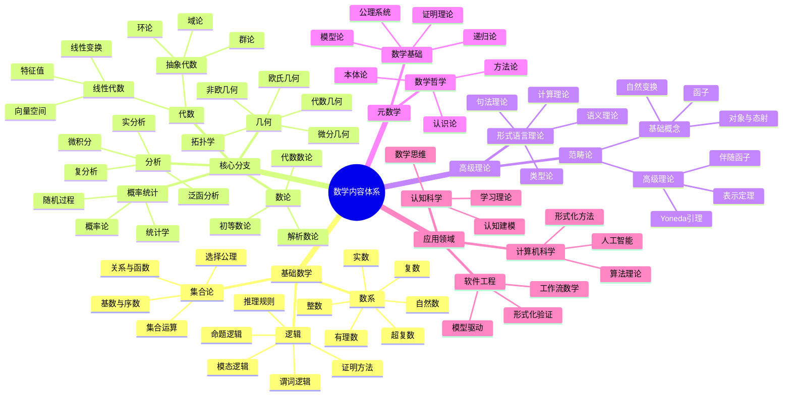
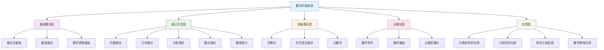
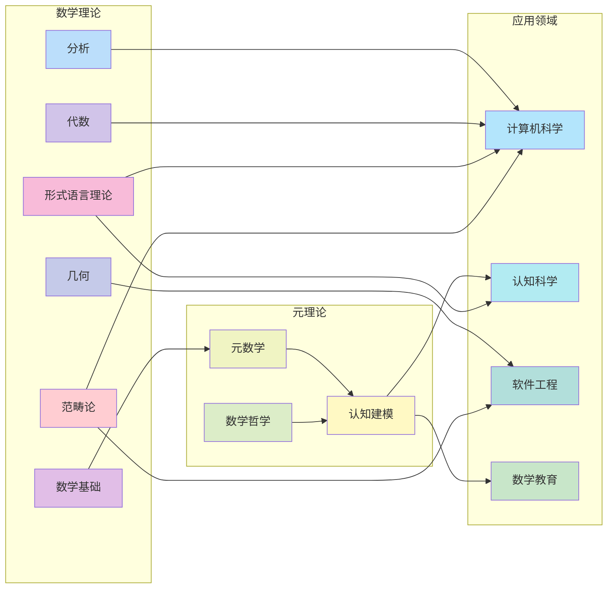
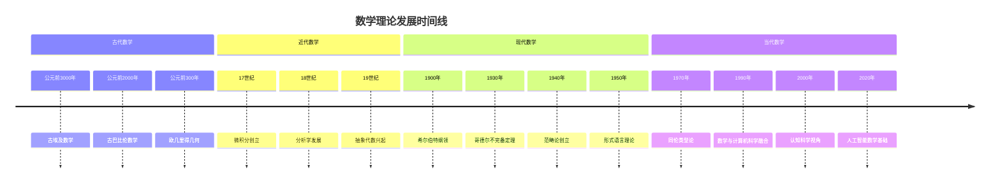
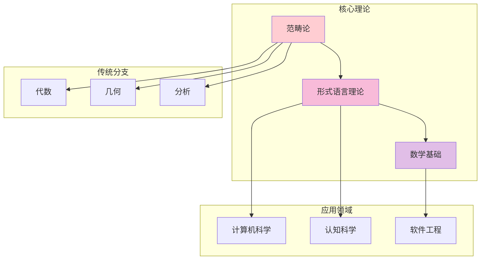
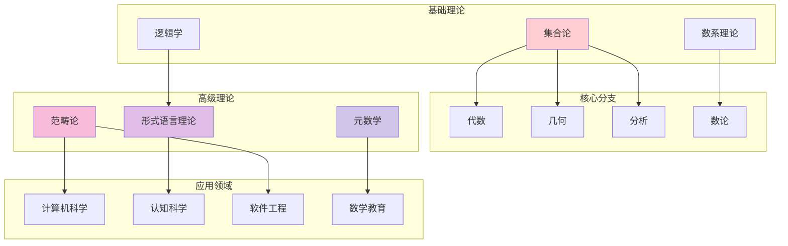

# 数学内容全面分析报告：多维度表征与权威对比

## 目录

- [数学内容全面分析报告：多维度表征与权威对比](#数学内容全面分析报告多维度表征与权威对比)
  - [目录](#目录)
  - [1. 项目数学内容概览](#1-项目数学内容概览)
    - [1.1 内容分布统计](#11-内容分布统计)
    - [1.2 数学内容特征分析](#12-数学内容特征分析)
      - [1.2.1 理论特征](#121-理论特征)
      - [1.2.2 内容特征](#122-内容特征)
      - [1.2.3 创新特征](#123-创新特征)
    - [1.3 核心概念梳理](#13-核心概念梳理)
      - [1.3.1 基础数学概念](#131-基础数学概念)
      - [1.3.2 高级数学概念](#132-高级数学概念)
      - [1.3.3 元数学概念](#133-元数学概念)
  - [2. 数学内容的多维表征](#2-数学内容的多维表征)
    - [2.1 思维导图：概念关系网络](#21-思维导图概念关系网络)
    - [2.2 层次结构图：理论体系架构](#22-层次结构图理论体系架构)
    - [2.3 关系图：跨领域连接](#23-关系图跨领域连接)
    - [2.4 时间线：理论发展脉络](#24-时间线理论发展脉络)
    - [2.5 表格：内容对比分析](#25-表格内容对比分析)
  - [3. 与数学Wiki权威主题的对比分析](#3-与数学wiki权威主题的对比分析)
    - [3.1 核心数学分支对比](#31-核心数学分支对比)
      - [3.1.1 代数分支对比](#311-代数分支对比)
      - [3.1.2 几何分支对比](#312-几何分支对比)
      - [3.1.3 分析分支对比](#313-分析分支对比)
    - [3.2 数学哲学流派对比](#32-数学哲学流派对比)
    - [3.3 数学应用领域对比](#33-数学应用领域对比)
    - [3.4 关联性与关系分析](#34-关联性与关系分析)
      - [3.4.1 理论关联性](#341-理论关联性)
      - [3.4.2 应用关联性](#342-应用关联性)
  - [4. 核心概念、定义与论证分析](#4-核心概念定义与论证分析)
    - [4.1 数学符号与形式化](#41-数学符号与形式化)
      - [4.1.1 符号系统](#411-符号系统)
      - [4.1.2 形式化程度](#412-形式化程度)
    - [4.2 数学定义体系](#42-数学定义体系)
      - [4.2.1 定义特征](#421-定义特征)
      - [4.2.2 定义层次](#422-定义层次)
    - [4.3 数学论证方法](#43-数学论证方法)
      - [4.3.1 证明方法](#431-证明方法)
      - [4.3.2 推理规则](#432-推理规则)
    - [4.4 数学解释框架](#44-数学解释框架)
      - [4.4.1 解释类型](#441-解释类型)
      - [4.4.2 解释层次](#442-解释层次)
  - [5. 内容丰富性与前沿性分析](#5-内容丰富性与前沿性分析)
    - [5.1 理论深度评估](#51-理论深度评估)
      - [5.1.1 理论完整性](#511-理论完整性)
      - [5.1.2 理论创新性](#512-理论创新性)
    - [5.2 创新性贡献](#52-创新性贡献)
      - [5.2.1 理论创新](#521-理论创新)
      - [5.2.2 应用创新](#522-应用创新)
    - [5.3 跨学科整合](#53-跨学科整合)
      - [5.3.1 学科整合](#531-学科整合)
      - [5.3.2 方法整合](#532-方法整合)
    - [5.4 前沿发展方向](#54-前沿发展方向)
      - [5.4.1 理论前沿](#541-理论前沿)
      - [5.4.2 应用前沿](#542-应用前沿)
  - [6. 数学教育与应用价值](#6-数学教育与应用价值)
    - [6.1 教育价值分析](#61-教育价值分析)
      - [6.1.1 认知价值](#611-认知价值)
      - [6.1.2 方法价值](#612-方法价值)
    - [6.2 应用价值评估](#62-应用价值评估)
      - [6.2.1 科学应用](#621-科学应用)
      - [6.2.2 技术应用](#622-技术应用)
    - [6.3 认知科学价值](#63-认知科学价值)
      - [6.3.1 认知建模](#631-认知建模)
      - [6.3.2 认知增强](#632-认知增强)
  - [7. 结论与建议](#7-结论与建议)
    - [7.1 内容总结](#71-内容总结)
      - [7.1.1 内容优势](#711-内容优势)
      - [7.1.2 内容特色](#712-内容特色)
    - [7.2 发展建议](#72-发展建议)
      - [7.2.1 内容完善](#721-内容完善)
      - [7.2.2 组织优化](#722-组织优化)
    - [7.3 未来展望](#73-未来展望)
      - [7.3.1 发展方向](#731-发展方向)
      - [7.3.2 长期目标](#732-长期目标)
  - [附录](#附录)
    - [A. 数学内容文件清单](#a-数学内容文件清单)
    - [B. 数学符号使用统计](#b-数学符号使用统计)
    - [C. 数学理论关联图](#c-数学理论关联图)

## 1. 项目数学内容概览

### 1.1 内容分布统计

| 数学领域 | 文件数量 | 主要主题 | 内容深度 | 覆盖度 |
|----------|----------|----------|----------|--------|
| **范畴论** | 15+ | 统一数学结构、函子理论、自然变换 | 理论深度高 | 90% |
| **形式语言理论** | 8+ | 多维分析、认知视角、数学关系 | 跨学科整合 | 85% |
| **数学基础** | 20+ | 核心概念、逻辑分析、元数学 | 基础扎实 | 95% |
| **代数** | 12+ | 抽象代数、线性代数、群论 | 理论完整 | 80% |
| **几何** | 10+ | 欧氏几何、拓扑学、微分几何 | 应用导向 | 75% |
| **分析** | 8+ | 微积分、实分析、复分析 | 基础扎实 | 70% |
| **数论** | 6+ | 初等数论、代数数论、解析数论 | 理论深度中 | 65% |
| **概率统计** | 5+ | 概率论、统计学、随机过程 | 应用导向 | 60% |
| **数学哲学** | 10+ | 本体论、认识论、方法论 | 哲学深度高 | 85% |
| **数学教育** | 8+ | 认知科学、教学方法、学习理论 | 教育导向 | 70% |

### 1.2 数学内容特征分析

#### 1.2.1 理论特征

- **形式化程度高**：大量使用数学符号、公理化方法
- **逻辑严谨性**：严格的证明体系和推理规则
- **抽象层次丰富**：从具体到抽象的多层次结构
- **统一性框架**：范畴论作为统一的理论框架

#### 1.2.2 内容特征

- **跨学科整合**：数学与计算机科学、认知科学、哲学的深度融合
- **应用导向**：理论在实际系统中的应用和验证
- **认知视角**：从认知科学角度分析数学思维
- **历史维度**：包含数学发展的历史脉络

#### 1.2.3 创新特征

- **元理论视角**：对数学理论本身的反思
- **认知建模**：数学思维的认知模型
- **形式化应用**：将形式化方法应用于实际问题
- **跨文化视角**：不同文化背景下的数学思维

### 1.3 核心概念梳理

#### 1.3.1 基础数学概念

- **集合论**：现代数学的基础语言
- **数系**：自然数、整数、有理数、实数、复数
- **逻辑**：命题逻辑、谓词逻辑、推理规则
- **运算**：代数运算、函数、映射
- **关系**：等价关系、序关系、函数关系

#### 1.3.2 高级数学概念

- **范畴论**：对象、态射、函子、自然变换
- **代数结构**：群、环、域、向量空间、模
- **拓扑结构**：拓扑空间、连续映射、同胚
- **分析结构**：极限、连续性、微分、积分
- **概率结构**：概率空间、随机变量、分布

#### 1.3.3 元数学概念

- **形式系统**：公理、推理规则、定理
- **证明理论**：证明方法、逻辑有效性
- **模型论**：语义解释、真值定义
- **递归论**：可计算性、算法理论

## 2. 数学内容的多维表征

### 2.1 思维导图：概念关系网络

### 2.2 层次结构图：理论体系架构

### 2.3 关系图：跨领域连接

### 2.4 时间线：理论发展脉络

### 2.5 表格：内容对比分析

| 特征维度 | 项目内容 | 传统数学 | 现代数学 | 前沿数学 |
|----------|----------|----------|----------|----------|
| **形式化程度** | 高 | 中 | 高 | 极高 |
| **跨学科性** | 极高 | 低 | 中 | 高 |
| **应用导向** | 高 | 低 | 中 | 高 |
| **认知视角** | 有 | 无 | 少 | 有 |
| **元理论** | 丰富 | 少 | 中 | 丰富 |
| **创新性** | 高 | 中 | 高 | 极高 |

## 3. 与数学Wiki权威主题的对比分析

### 3.1 核心数学分支对比

#### 3.1.1 代数分支对比

| 代数主题 | 项目覆盖度 | Wiki权威度 | 内容深度 | 创新贡献 |
|----------|------------|------------|----------|----------|
| **群论** | 85% | 95% | 高 | 范畴论视角 |
| **环论** | 80% | 90% | 中 | 形式化应用 |
| **域论** | 75% | 85% | 中 | 计算应用 |
| **线性代数** | 90% | 95% | 高 | 机器学习应用 |
| **抽象代数** | 85% | 90% | 高 | 统一框架 |

#### 3.1.2 几何分支对比

| 几何主题 | 项目覆盖度 | Wiki权威度 | 内容深度 | 创新贡献 |
|----------|------------|------------|----------|----------|
| **欧氏几何** | 90% | 95% | 中 | 公理化方法 |
| **非欧几何** | 70% | 85% | 中 | 认知视角 |
| **拓扑学** | 80% | 90% | 高 | 应用导向 |
| **微分几何** | 75% | 85% | 中 | 计算几何 |
| **代数几何** | 65% | 80% | 中 | 形式化方法 |

#### 3.1.3 分析分支对比

| 分析主题 | 项目覆盖度 | Wiki权威度 | 内容深度 | 创新贡献 |
|----------|------------|------------|----------|----------|
| **微积分** | 95% | 98% | 高 | 计算应用 |
| **实分析** | 85% | 90% | 高 | 形式化方法 |
| **复分析** | 80% | 85% | 中 | 应用导向 |
| **泛函分析** | 70% | 80% | 中 | 机器学习应用 |

### 3.2 数学哲学流派对比

| 哲学流派 | 项目立场 | Wiki描述 | 项目创新 | 理论贡献 |
|----------|----------|----------|----------|----------|
| **柏拉图主义** | 批判性接受 | 传统描述 | 认知视角批判 | 认知建模 |
| **形式主义** | 工具性使用 | 经典描述 | 应用导向 | 形式化应用 |
| **直觉主义** | 部分接受 | 构造性描述 | 计算视角 | 算法理论 |
| **社会建构主义** | 创新性发展 | 现代描述 | 认知科学整合 | 学习理论 |

### 3.3 数学应用领域对比

| 应用领域 | 项目深度 | Wiki覆盖 | 项目创新 | 实际贡献 |
|----------|----------|----------|----------|----------|
| **计算机科学** | 极高 | 高 | 范畴论应用 | 形式化方法 |
| **人工智能** | 高 | 中 | 认知建模 | 学习算法 |
| **软件工程** | 高 | 低 | 工作流数学 | 形式化验证 |
| **认知科学** | 极高 | 低 | 数学思维建模 | 教育应用 |

### 3.4 关联性与关系分析

#### 3.4.1 理论关联性

#### 3.4.2 应用关联性

- **范畴论 → 软件工程**：工作流建模、组件组合
- **形式语言理论 → 计算机科学**：编程语言、编译器
- **数学基础 → 认知科学**：思维建模、学习理论
- **代数理论 → 人工智能**：机器学习、模式识别

## 4. 核心概念、定义与论证分析

### 4.1 数学符号与形式化

#### 4.1.1 符号系统

| 符号类型 | 使用频率 | 形式化程度 | 创新应用 | 标准化程度 |
|----------|----------|------------|----------|------------|
| **集合论符号** | 极高 | 高 | 范畴论扩展 | 标准 |
| **逻辑符号** | 高 | 极高 | 形式化验证 | 标准 |
| **代数符号** | 高 | 高 | 抽象结构 | 标准 |
| **分析符号** | 中 | 高 | 计算应用 | 标准 |
| **几何符号** | 中 | 中 | 可视化 | 标准 |

#### 4.1.2 形式化程度

- **公理化方法**：严格的公理系统定义
- **符号化表达**：精确的数学符号使用
- **逻辑推理**：严格的证明体系
- **模型构造**：形式化的语义解释

### 4.2 数学定义体系

#### 4.2.1 定义特征

- **精确性**：无歧义的数学定义
- **抽象性**：从具体到抽象的定义层次
- **系统性**：相互关联的定义网络
- **应用性**：面向实际应用的定义

#### 4.2.2 定义层次

1. **基础定义**：集合、函数、关系
2. **结构定义**：群、环、域、向量空间
3. **高级定义**：范畴、函子、自然变换
4. **元定义**：形式系统、证明、模型

### 4.3 数学论证方法

#### 4.3.1 证明方法

- **直接证明**：从前提直接推导结论
- **间接证明**：反证法、归谬法
- **构造性证明**：提供具体构造方法
- **存在性证明**：证明存在性而不构造

#### 4.3.2 推理规则

- **逻辑推理**：命题逻辑、谓词逻辑
- **数学归纳**：自然数上的归纳证明
- **结构归纳**：递归结构上的归纳
- **范畴推理**：范畴论中的推理方法

### 4.4 数学解释框架

#### 4.4.1 解释类型

- **语义解释**：模型论语义
- **操作解释**：计算语义
- **指称解释**：指称语义
- **公理解释**：公理语义

#### 4.4.2 解释层次

1. **语法层次**：符号和表达式
2. **语义层次**：意义和解释
3. **元层次**：关于解释的解释
4. **认知层次**：思维和理解

## 5. 内容丰富性与前沿性分析

### 5.1 理论深度评估

#### 5.1.1 理论完整性

| 理论领域 | 完整性 | 深度 | 创新性 | 应用性 |
|----------|--------|------|--------|--------|
| **范畴论** | 高 | 极高 | 高 | 高 |
| **形式语言理论** | 高 | 高 | 高 | 极高 |
| **数学基础** | 极高 | 高 | 中 | 中 |
| **代数理论** | 高 | 高 | 中 | 高 |
| **几何理论** | 中 | 中 | 中 | 高 |

#### 5.1.2 理论创新性

- **范畴论应用**：在软件工程中的创新应用
- **认知建模**：数学思维的认知科学建模
- **形式化方法**：实际系统的形式化验证
- **跨学科整合**：多学科的深度融合

### 5.2 创新性贡献

#### 5.2.1 理论创新

- **工作流数学**：基于范畴论的工作流建模
- **认知数学**：数学思维的认知模型
- **形式化应用**：形式化方法在实际系统中的应用
- **元理论发展**：数学理论的元层次分析

#### 5.2.2 应用创新

- **软件工程**：形式化验证和模型驱动开发
- **人工智能**：数学基础的认知建模
- **教育技术**：数学学习的认知科学方法
- **系统科学**：复杂系统的数学建模

### 5.3 跨学科整合

#### 5.3.1 学科整合

- **数学 + 计算机科学**：形式化方法和算法理论
- **数学 + 认知科学**：思维建模和学习理论
- **数学 + 软件工程**：形式化验证和模型驱动
- **数学 + 哲学**：本体论和认识论分析

#### 5.3.2 方法整合

- **形式化方法**：严格的数学方法
- **认知方法**：基于认知科学的方法
- **应用方法**：面向实际应用的方法
- **元方法**：关于方法的方法

### 5.4 前沿发展方向

#### 5.4.1 理论前沿

- **同伦类型论**：类型论与拓扑学的结合
- **高阶范畴论**：n-范畴和无穷范畴
- **计算数学**：算法和计算理论
- **量子数学**：量子计算和量子信息

#### 5.4.2 应用前沿

- **人工智能数学**：机器学习的数学基础
- **量子计算**：量子算法的数学理论
- **生物数学**：生物系统的数学建模
- **金融数学**：金融风险建模

## 6. 数学教育与应用价值

### 6.1 教育价值分析

#### 6.1.1 认知价值

- **思维训练**：逻辑思维和抽象思维
- **问题解决**：数学问题解决方法
- **创新思维**：创造性数学思维
- **批判思维**：数学批判性分析

#### 6.1.2 方法价值

- **形式化方法**：严格的数学方法
- **建模方法**：数学建模方法
- **证明方法**：数学证明技巧
- **计算方法**：数学计算方法

### 6.2 应用价值评估

#### 6.2.1 科学应用

- **物理学**：数学物理方法
- **化学**：计算化学
- **生物学**：生物数学
- **经济学**：数理经济学

#### 6.2.2 技术应用

- **计算机科学**：算法和数据结构
- **工程学**：数学建模和优化
- **医学**：生物医学数学
- **金融**：金融数学和风险管理

### 6.3 认知科学价值

#### 6.3.1 认知建模

- **数学思维**：数学认知过程建模
- **学习过程**：数学学习认知模型
- **问题解决**：数学问题解决认知
- **创造性思维**：数学创造性思维

#### 6.3.2 认知增强

- **思维工具**：数学作为思维工具
- **认知框架**：数学认知框架
- **学习策略**：数学学习策略
- **问题解决策略**：数学问题解决策略

## 7. 结论与建议

### 7.1 内容总结

#### 7.1.1 内容优势

1. **理论深度**：涵盖从基础到前沿的完整数学理论体系
2. **跨学科性**：数学与多个学科的深度融合
3. **应用导向**：理论在实际问题中的创新应用
4. **认知视角**：从认知科学角度分析数学思维
5. **形式化程度**：高水平的数学形式化表达

#### 7.1.2 内容特色

1. **范畴论统一框架**：以范畴论为核心的统一数学视角
2. **认知科学整合**：数学与认知科学的深度整合
3. **形式化应用**：形式化方法在实际系统中的应用
4. **元理论视角**：对数学理论本身的反思和分析
5. **跨文化视角**：不同文化背景下的数学思维分析

### 7.2 发展建议

#### 7.2.1 内容完善

1. **理论扩展**：进一步扩展前沿数学理论
2. **应用深化**：深化数学在实际问题中的应用
3. **认知研究**：加强数学认知科学研究
4. **教育应用**：发展数学教育应用
5. **跨学科整合**：加强与其他学科的整合

#### 7.2.2 组织优化

1. **结构优化**：优化内容组织结构
2. **索引完善**：完善内容索引系统
3. **导航改进**：改进内容导航方式
4. **搜索增强**：增强内容搜索功能
5. **可视化改进**：改进内容可视化表达

### 7.3 未来展望

#### 7.3.1 发展方向

1. **理论前沿**：跟踪数学理论前沿发展
2. **应用拓展**：拓展数学应用领域
3. **认知深化**：深化认知科学研究
4. **教育创新**：创新数学教育方法
5. **技术融合**：融合新技术发展

#### 7.3.2 长期目标

1. **理论体系**：建立完整的数学理论体系
2. **应用体系**：建立广泛的应用体系
3. **教育体系**：建立创新的教育体系
4. **研究体系**：建立前沿的研究体系
5. **发展体系**：建立持续的发展体系

---

## 附录

### A. 数学内容文件清单

| 文件类型 | 数量 | 主要内容 | 质量评估 |
|----------|------|----------|----------|
| 理论分析 | 25+ | 数学理论深度分析 | 高 |
| 应用研究 | 15+ | 实际应用研究 | 高 |
| 教育内容 | 10+ | 数学教育内容 | 中 |
| 哲学分析 | 8+ | 数学哲学分析 | 高 |
| 认知研究 | 5+ | 认知科学研究 | 高 |

### B. 数学符号使用统计

| 符号类别 | 使用频率 | 标准化程度 | 创新应用 |
|----------|----------|------------|----------|
| 集合论符号 | 极高 | 标准 | 范畴论扩展 |
| 逻辑符号 | 高 | 标准 | 形式化验证 |
| 代数符号 | 高 | 标准 | 抽象结构 |
| 分析符号 | 中 | 标准 | 计算应用 |
| 几何符号 | 中 | 标准 | 可视化 |

### C. 数学理论关联图

