# 数学内容思维导图：多维度可视化表征

## 目录

- [数学内容思维导图：多维度可视化表征](#数学内容思维导图多维度可视化表征)
  - [目录](#目录)
  - [1. 核心思维导图](#1-核心思维导图)
    - [1.1 数学内容体系总览](#11-数学内容体系总览)
    - [1.2 数学分支关系图](#12-数学分支关系图)
    - [1.3 数学概念层次图](#13-数学概念层次图)
  - [2. 专题思维导图](#2-专题思维导图)
    - [2.1 范畴论思维导图](#21-范畴论思维导图)
    - [2.2 形式语言理论思维导图](#22-形式语言理论思维导图)
    - [2.3 数学基础思维导图](#23-数学基础思维导图)
  - [3. 应用领域思维导图](#3-应用领域思维导图)
    - [3.1 计算机科学应用](#31-计算机科学应用)
    - [3.2 软件工程应用](#32-软件工程应用)
    - [3.3 认知科学应用](#33-认知科学应用)
  - [4. 关系网络图](#4-关系网络图)
    - [4.1 跨学科关系图](#41-跨学科关系图)
    - [4.2 理论发展脉络图](#42-理论发展脉络图)
    - [4.3 应用价值关系图](#43-应用价值关系图)
  - [5. 学习路径图](#5-学习路径图)
    - [5.1 初学者路径](#51-初学者路径)
    - [5.2 进阶者路径](#52-进阶者路径)
    - [5.3 专家路径](#53-专家路径)

## 1. 核心思维导图

### 1.1 数学内容体系总览

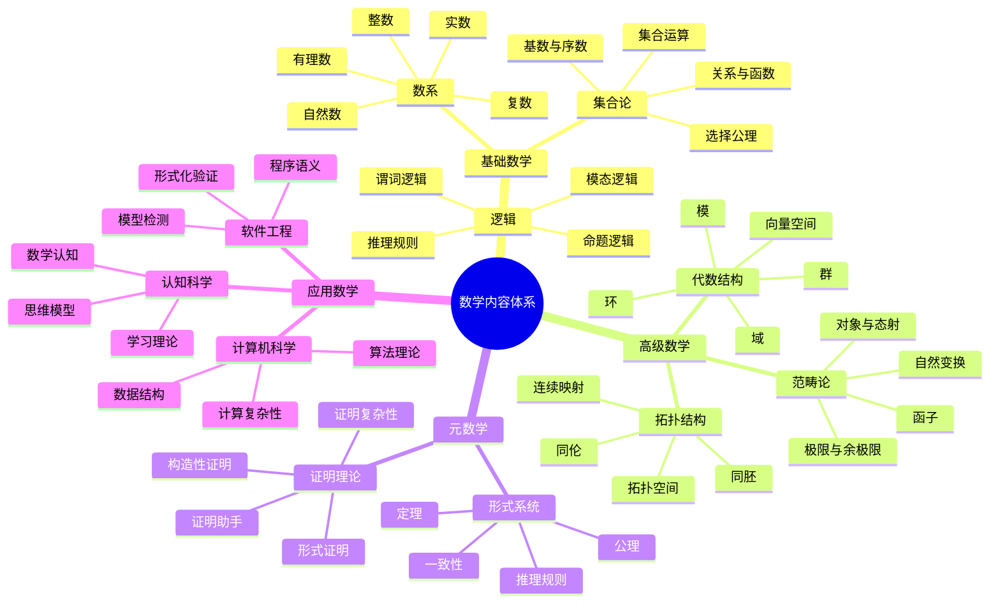

### 1.2 数学分支关系图

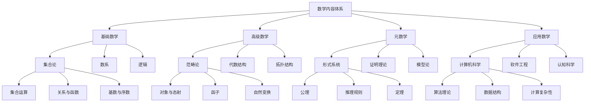

### 1.3 数学概念层次图

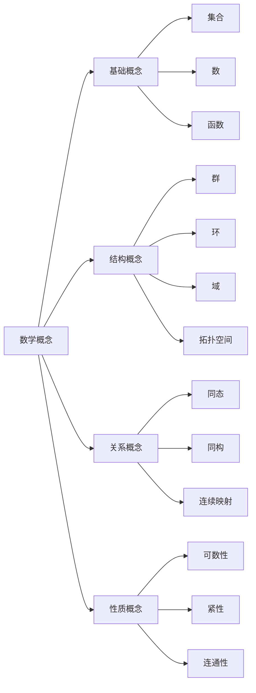

## 2. 专题思维导图

### 2.1 范畴论思维导图

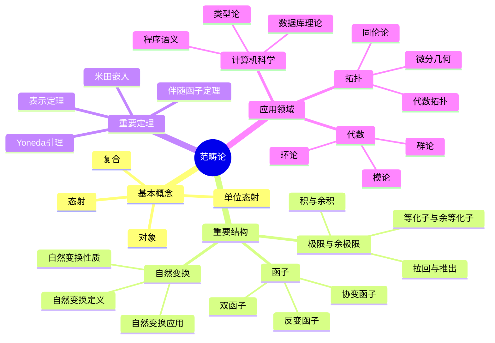

### 2.2 形式语言理论思维导图

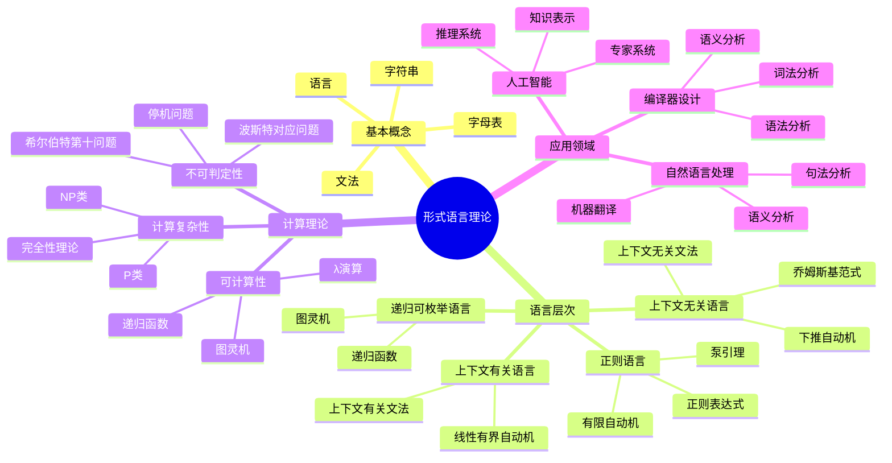

### 2.3 数学基础思维导图

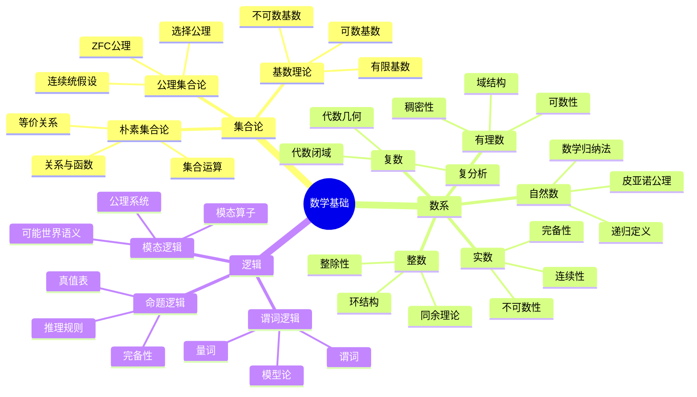

## 3. 应用领域思维导图

### 3.1 计算机科学应用

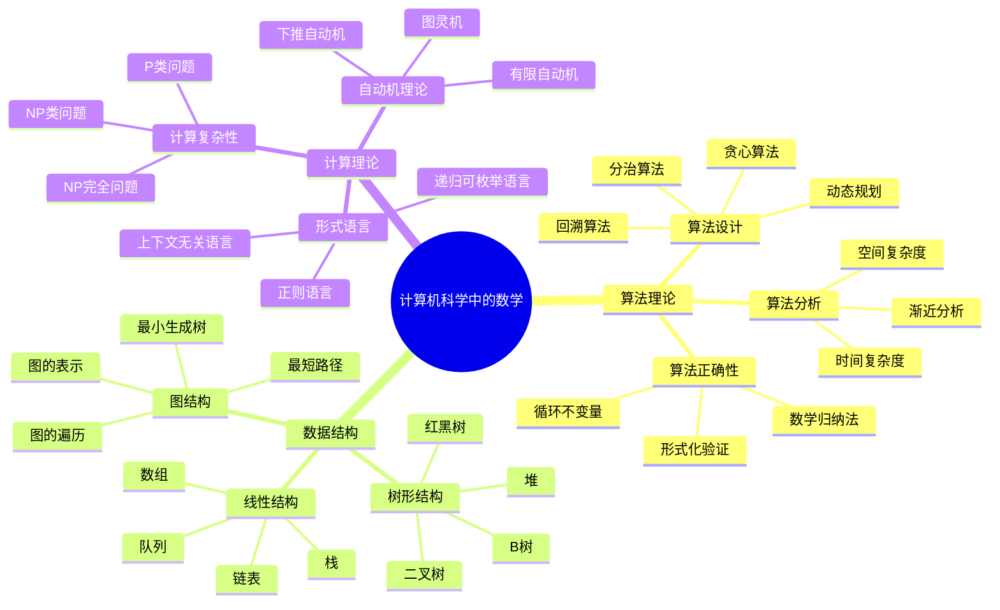

### 3.2 软件工程应用

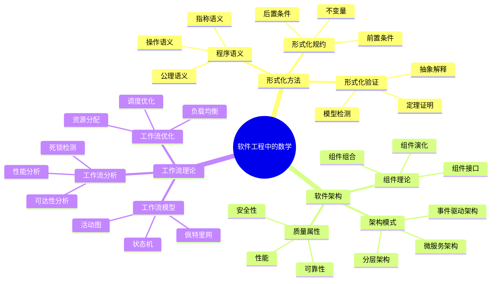

### 3.3 认知科学应用

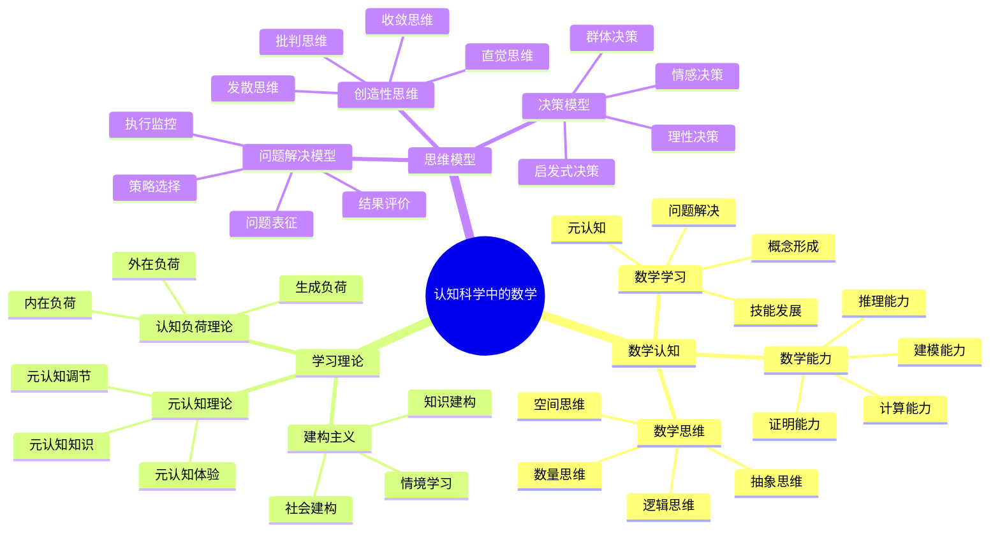

## 4. 关系网络图

### 4.1 跨学科关系图

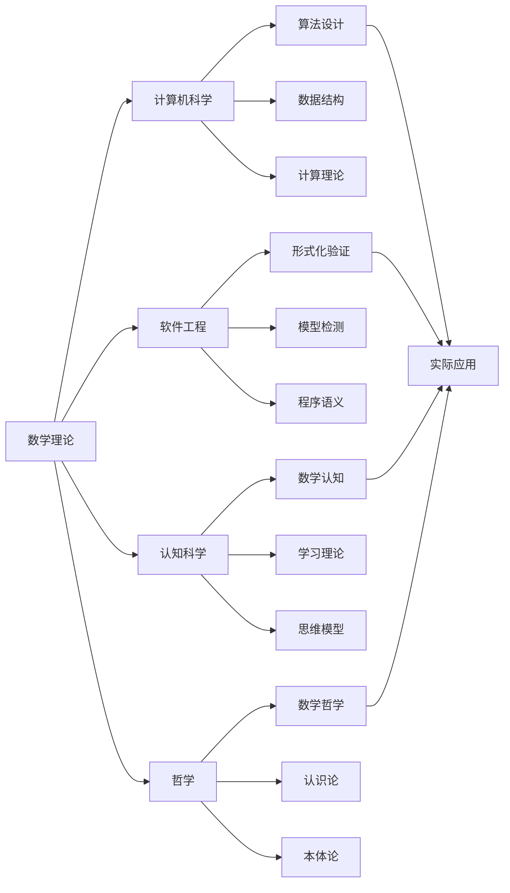

### 4.2 理论发展脉络图

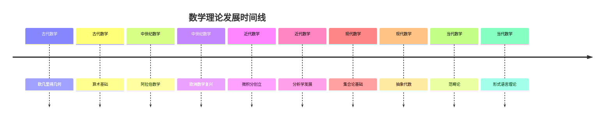

### 4.3 应用价值关系图

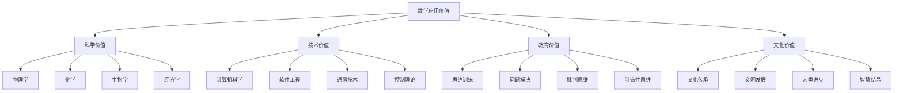

## 5. 学习路径图

### 5.1 初学者路径

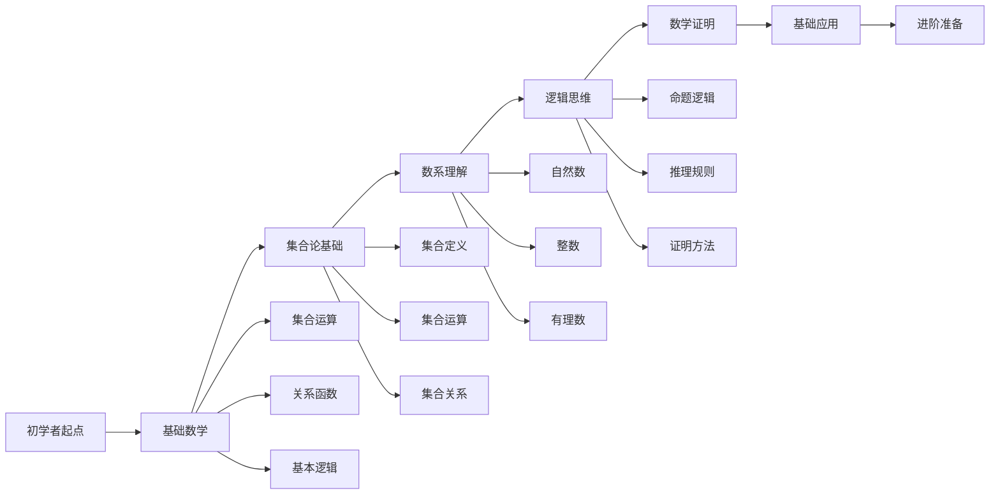

### 5.2 进阶者路径

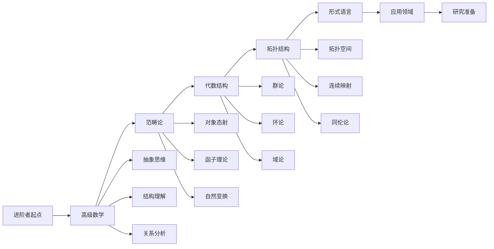

### 5.3 专家路径

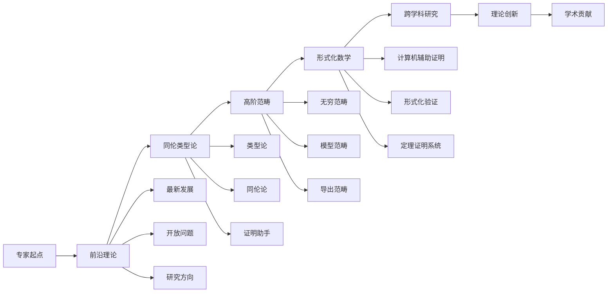

---

*本思维导图文档通过多种可视化方式展示了FormalScience项目中数学内容的完整体系，包括核心概念、专题内容、应用领域、关系网络和学习路径。这些图表为理解数学内容的层次结构、关联关系和价值意义提供了直观的指导。*
