# 数学内容思维导图：多维表征与可视化

## 目录

- [数学内容思维导图：多维表征与可视化](#数学内容思维导图多维表征与可视化)
  - [目录](#目录)
  - [1. 总体思维导图](#1-总体思维导图)
    - [1.1 核心概念网络](#11-核心概念网络)
    - [1.2 分支关系图](#12-分支关系图)
    - [1.3 层次结构图](#13-层次结构图)
  - [2. 基础数学思维导图](#2-基础数学思维导图)
    - [2.1 集合论思维导图](#21-集合论思维导图)
    - [2.2 数系思维导图](#22-数系思维导图)
    - [2.3 逻辑思维导图](#23-逻辑思维导图)
  - [3. 核心分支思维导图](#3-核心分支思维导图)
    - [3.1 代数思维导图](#31-代数思维导图)
    - [3.2 几何思维导图](#32-几何思维导图)
    - [3.3 分析思维导图](#33-分析思维导图)
    - [3.4 数论思维导图](#34-数论思维导图)
  - [4. 高级理论思维导图](#4-高级理论思维导图)
    - [4.1 范畴论思维导图](#41-范畴论思维导图)
    - [4.2 形式语言理论思维导图](#42-形式语言理论思维导图)
    - [4.3 元数学思维导图](#43-元数学思维导图)
  - [5. 应用领域思维导图](#5-应用领域思维导图)
    - [5.1 计算机科学应用](#51-计算机科学应用)
    - [5.2 认知科学应用](#52-认知科学应用)
    - [5.3 软件工程应用](#53-软件工程应用)
  - [6. 方法论思维导图](#6-方法论思维导图)
    - [6.1 定义方法](#61-定义方法)
    - [6.2 证明方法](#62-证明方法)
    - [6.3 形式化方法](#63-形式化方法)
  - [7. 关系网络图](#7-关系网络图)
    - [7.1 概念关系网络](#71-概念关系网络)
    - [7.2 方法关系网络](#72-方法关系网络)
    - [7.3 应用关系网络](#73-应用关系网络)
  - [8. 时间发展图](#8-时间发展图)
    - [8.1 历史发展脉络](#81-历史发展脉络)
    - [8.2 理论演进过程](#82-理论演进过程)
  - [9. 多维表征图](#9-多维表征图)
    - [9.1 维度分析图](#91-维度分析图)
    - [9.2 特征对比图](#92-特征对比图)
  - [10. 总结与展望](#10-总结与展望)

## 1. 总体思维导图

### 1.1 核心概念网络

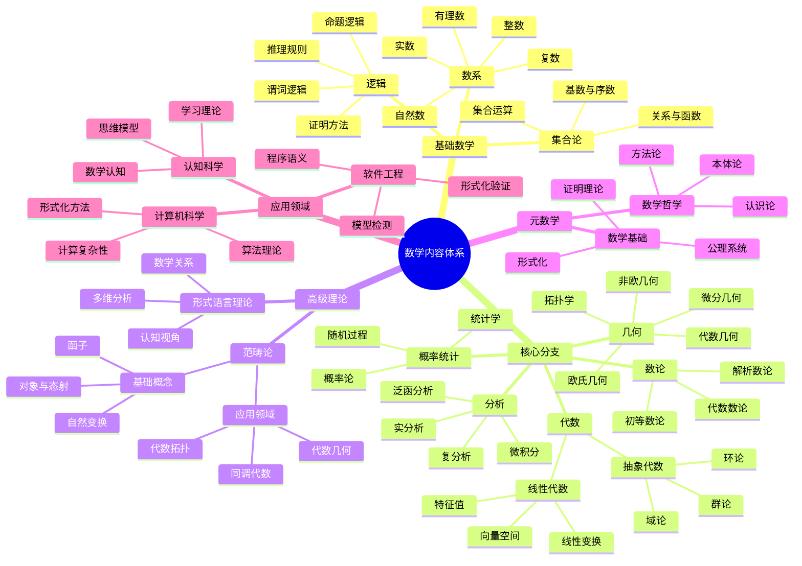
```mermaid
mindmap
  root((数学内容体系))
    基础数学
      集合论
        集合运算
        关系与函数
        基数与序数
      数系
        自然数
        整数
        有理数
        实数
        复数
      逻辑
        命题逻辑
        谓词逻辑
        推理规则
        证明方法
    核心分支
      代数
        抽象代数
          群论
          环论
          域论
        线性代数
          向量空间
          线性变换
          特征值
      几何
        欧氏几何
        非欧几何
        拓扑学
        微分几何
        代数几何
      分析
        微积分
        实分析
        复分析
        泛函分析
      数论
        初等数论
        代数数论
        解析数论
      概率统计
        概率论
        统计学
        随机过程
    高级理论
      范畴论
        基础概念
          对象与态射
          函子
          自然变换
        应用领域
          代数拓扑
          代数几何
          同调代数
      形式语言理论
        多维分析
        认知视角
        数学关系
    元数学
      数学基础
        公理系统
        形式化
        证明理论
      数学哲学
        本体论
        认识论
        方法论
    应用领域
      计算机科学
        算法理论
        计算复杂性
        形式化方法
      认知科学
        数学认知
        学习理论
        思维模型
      软件工程
        形式化验证
        模型检测
        程序语义
```

### 1.2 分支关系图

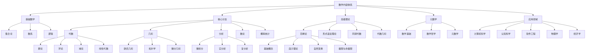
```mermaid
graph TD
    A[数学内容体系] --> B[基础数学]
    A --> C[核心分支]
    A --> D[高级理论]
    A --> E[元数学]
    A --> F[应用领域]
    
    B --> B1[集合论]
    B --> B2[数系]
    B --> B3[逻辑]
    
    C --> C1[代数]
    C --> C2[几何]
    C --> C3[分析]
    C --> C4[数论]
    C --> C5[概率统计]
    
    D --> D1[范畴论]
    D --> D2[形式语言理论]
    D --> D3[同调代数]
    D --> D4[代数几何]
    
    E --> E1[数学基础]
    E --> E2[数学哲学]
    E --> E3[元数学]
    
    F --> F1[计算机科学]
    F --> F2[认知科学]
    F --> F3[软件工程]
    F --> F4[物理学]
    F --> F5[经济学]
    
    C1 --> C11[群论]
    C1 --> C12[环论]
    C1 --> C13[域论]
    C1 --> C14[线性代数]
    
    C2 --> C21[欧氏几何]
    C2 --> C22[拓扑学]
    C2 --> C23[微分几何]
    
    C3 --> C31[微积分]
    C3 --> C32[实分析]
    C3 --> C33[复分析]
    
    D1 --> D11[基础概念]
    D1 --> D12[函子理论]
    D1 --> D13[自然变换]
    D1 --> D14[极限与余极限]
```

### 1.3 层次结构图

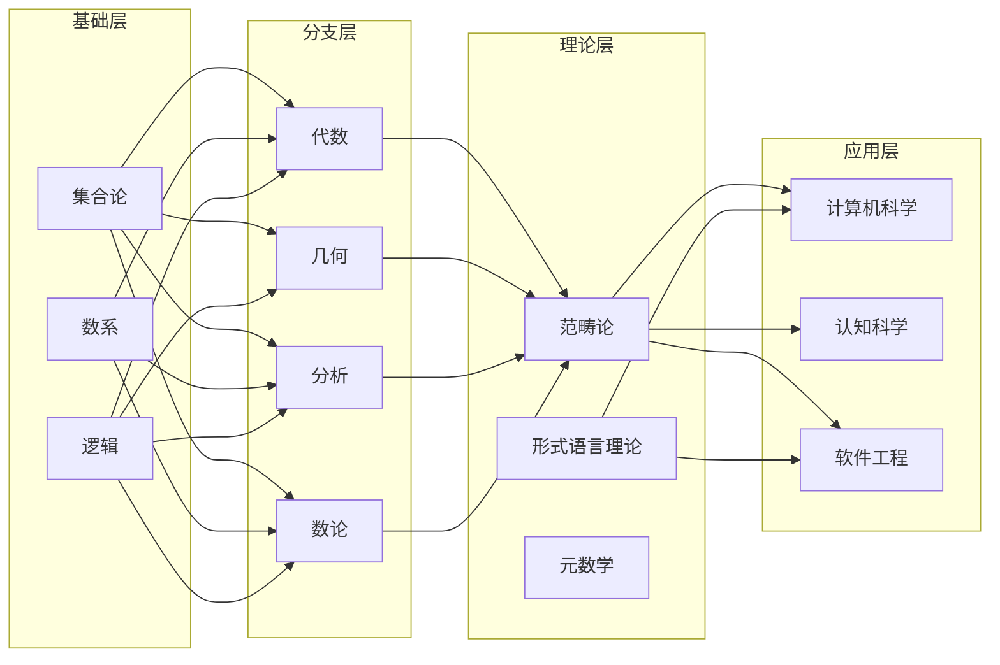
```mermaid
graph LR
    subgraph "应用层"
        A1[计算机科学]
        A2[认知科学]
        A3[软件工程]
    end
    
    subgraph "理论层"
        T1[范畴论]
        T2[形式语言理论]
        T3[元数学]
    end
    
    subgraph "分支层"
        B1[代数]
        B2[几何]
        B3[分析]
        B4[数论]
    end
    
    subgraph "基础层"
        F1[集合论]
        F2[数系]
        F3[逻辑]
    end
    
    F1 --> B1
    F1 --> B2
    F1 --> B3
    F1 --> B4
    
    F2 --> B1
    F2 --> B3
    F2 --> B4
    
    F3 --> B1
    F3 --> B2
    F3 --> B3
    F3 --> B4
    
    B1 --> T1
    B2 --> T1
    B3 --> T1
    B4 --> T1
    
    T1 --> A1
    T1 --> A2
    T1 --> A3
    
    T2 --> A1
    T2 --> A3
```

## 2. 基础数学思维导图

### 2.1 集合论思维导图

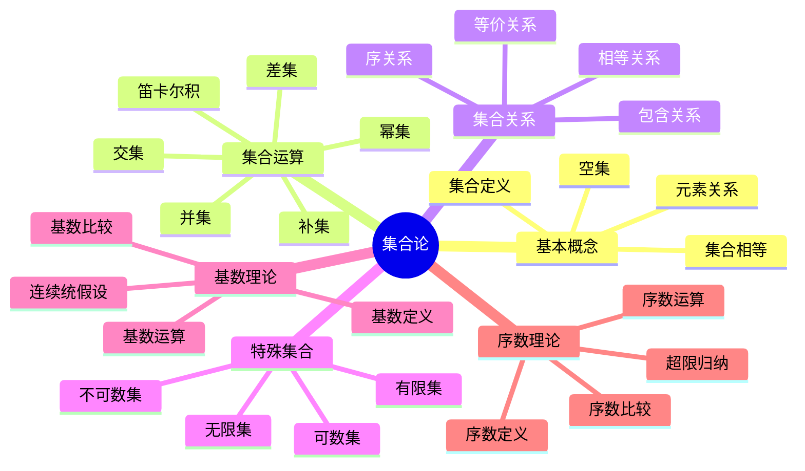
```mermaid
mindmap
  root((集合论))
    基本概念
      集合定义
      元素关系
      集合相等
      空集
    集合运算
      并集
      交集
      差集
      补集
      笛卡尔积
      幂集
    集合关系
      包含关系
      相等关系
      等价关系
      序关系
    特殊集合
      有限集
      无限集
      可数集
      不可数集
    基数理论
      基数定义
      基数运算
      基数比较
      连续统假设
    序数理论
      序数定义
      序数运算
      序数比较
      超限归纳
```

### 2.2 数系思维导图

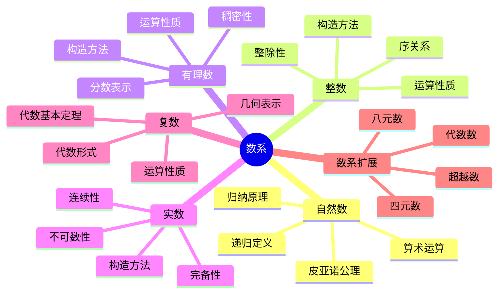
```mermaid
mindmap
  root((数系))
    自然数
      皮亚诺公理
      归纳原理
      递归定义
      算术运算
    整数
      构造方法
      运算性质
      序关系
      整除性
    有理数
      构造方法
      稠密性
      运算性质
      分数表示
    实数
      构造方法
      完备性
      连续性
      不可数性
    复数
      代数形式
      几何表示
      运算性质
      代数基本定理
    数系扩展
      代数数
      超越数
      四元数
      八元数
```

### 2.3 逻辑思维导图

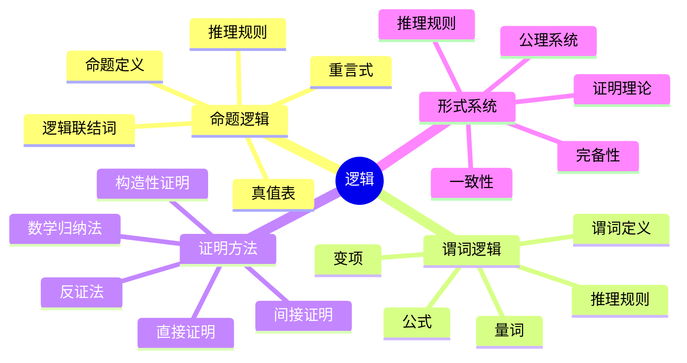
```mermaid
mindmap
  root((逻辑))
    命题逻辑
      命题定义
      逻辑联结词
      真值表
      重言式
      推理规则
    谓词逻辑
      谓词定义
      量词
      变项
      公式
      推理规则
    证明方法
      直接证明
      间接证明
      反证法
      数学归纳法
      构造性证明
    形式系统
      公理系统
      推理规则
      证明理论
      完备性
      一致性
```

## 3. 核心分支思维导图

### 3.1 代数思维导图

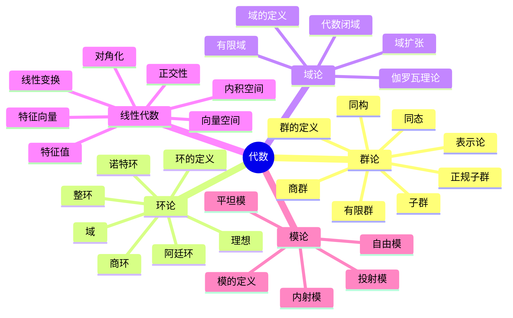
```mermaid
mindmap
  root((代数))
    群论
      群的定义
      子群
      正规子群
      商群
      同态
      同构
      有限群
      表示论
    环论
      环的定义
      理想
      商环
      整环
      域
      诺特环
      阿廷环
    域论
      域的定义
      域扩张
      伽罗瓦理论
      有限域
      代数闭域
    线性代数
      向量空间
      线性变换
      特征值
      特征向量
      对角化
      内积空间
      正交性
    模论
      模的定义
      自由模
      投射模
      内射模
      平坦模
```

### 3.2 几何思维导图

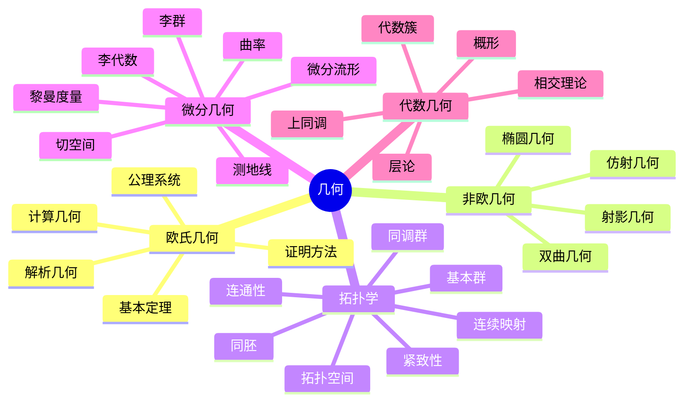
```mermaid
mindmap
  root((几何))
    欧氏几何
      公理系统
      基本定理
      证明方法
      计算几何
      解析几何
    非欧几何
      双曲几何
      椭圆几何
      射影几何
      仿射几何
    拓扑学
      拓扑空间
      连续映射
      同胚
      紧致性
      连通性
      基本群
      同调群
    微分几何
      微分流形
      切空间
      黎曼度量
      曲率
      测地线
      李群
      李代数
    代数几何
      代数簇
      概形
      层论
      上同调
      相交理论
```

### 3.3 分析思维导图

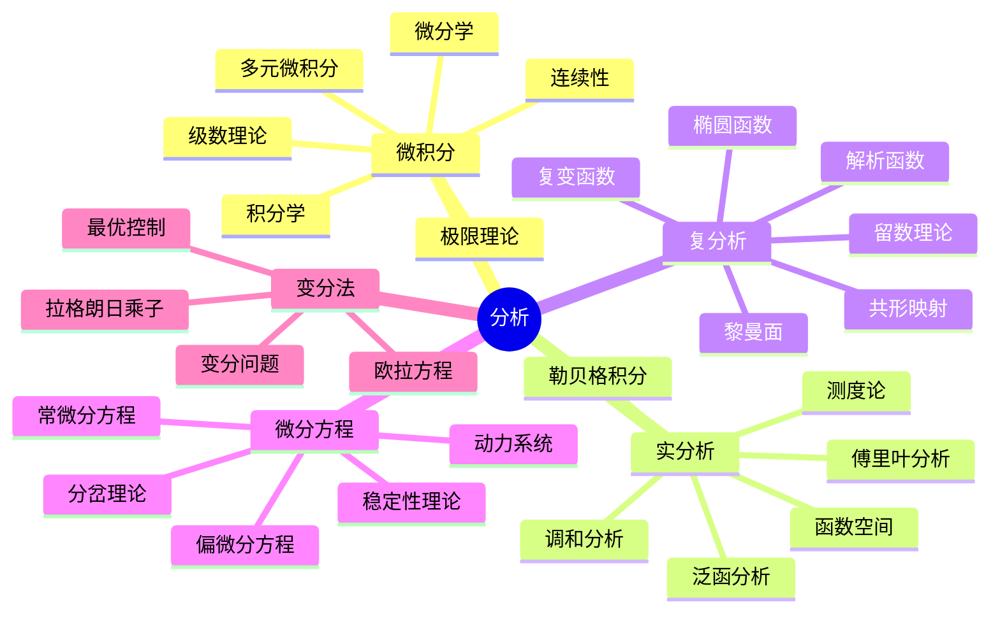
```mermaid
mindmap
  root((分析))
    微积分
      极限理论
      连续性
      微分学
      积分学
      级数理论
      多元微积分
    实分析
      测度论
      勒贝格积分
      函数空间
      傅里叶分析
      调和分析
      泛函分析
    复分析
      复变函数
      解析函数
      留数理论
      共形映射
      黎曼面
      椭圆函数
    微分方程
      常微分方程
      偏微分方程
      动力系统
      稳定性理论
      分岔理论
    变分法
      变分问题
      欧拉方程
      拉格朗日乘子
      最优控制
```

### 3.4 数论思维导图

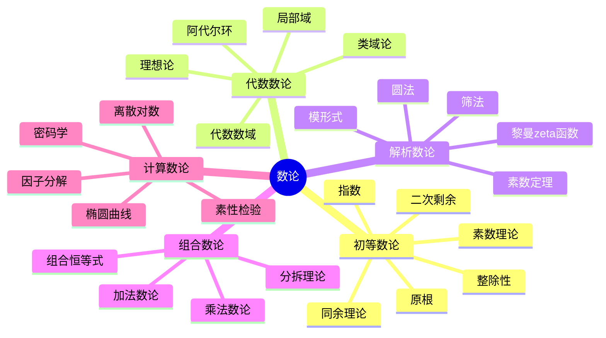
```mermaid
mindmap
  root((数论))
    初等数论
      整除性
      素数理论
      同余理论
      二次剩余
      原根
      指数
    代数数论
      代数数域
      理想论
      类域论
      局部域
      阿代尔环
    解析数论
      黎曼zeta函数
      素数定理
      圆法
      筛法
      模形式
    组合数论
      加法数论
      乘法数论
      组合恒等式
      分拆理论
    计算数论
      素性检验
      因子分解
      离散对数
      椭圆曲线
      密码学
```

## 4. 高级理论思维导图

### 4.1 范畴论思维导图

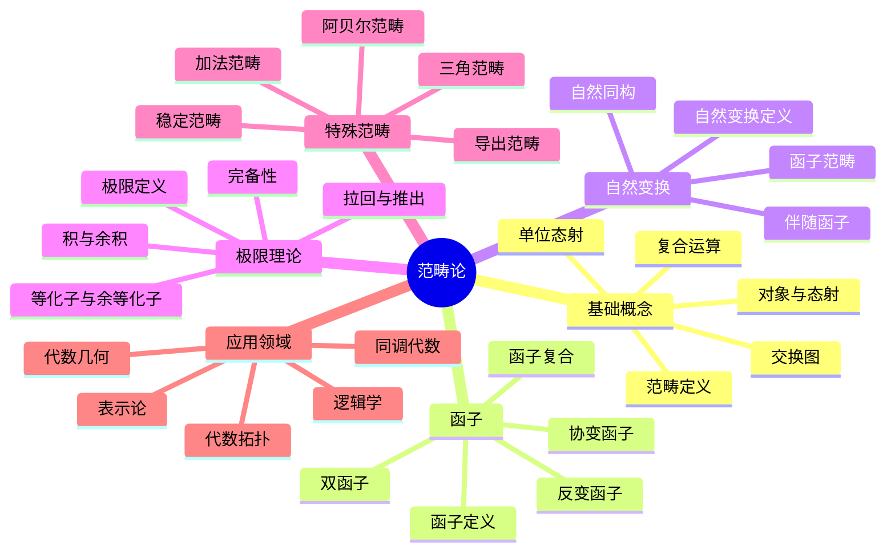
```mermaid
mindmap
  root((范畴论))
    基础概念
      范畴定义
      对象与态射
      复合运算
      单位态射
      交换图
    函子
      函子定义
      协变函子
      反变函子
      双函子
      函子复合
    自然变换
      自然变换定义
      自然同构
      函子范畴
      伴随函子
    极限理论
      极限定义
      积与余积
      等化子与余等化子
      拉回与推出
      完备性
    特殊范畴
      阿贝尔范畴
      加法范畴
      三角范畴
      稳定范畴
      导出范畴
    应用领域
      代数拓扑
      代数几何
      同调代数
      表示论
      逻辑学
```

### 4.2 形式语言理论思维导图

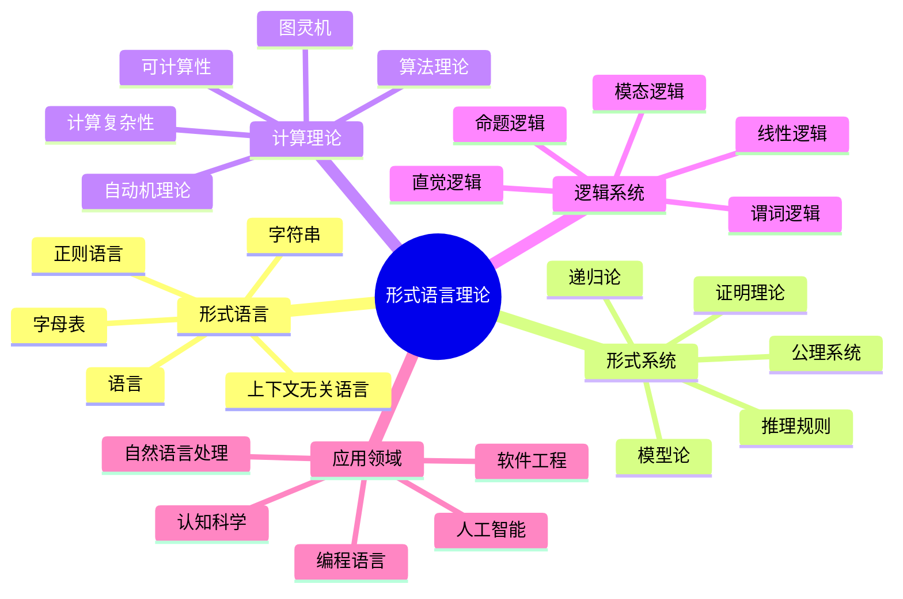
```mermaid
mindmap
  root((形式语言理论))
    形式语言
      字母表
      字符串
      语言
      正则语言
      上下文无关语言
    形式系统
      公理系统
      推理规则
      证明理论
      模型论
      递归论
    计算理论
      图灵机
      可计算性
      计算复杂性
      算法理论
      自动机理论
    逻辑系统
      命题逻辑
      谓词逻辑
      模态逻辑
      直觉逻辑
      线性逻辑
    应用领域
      编程语言
      自然语言处理
      人工智能
      软件工程
      认知科学
```

### 4.3 元数学思维导图

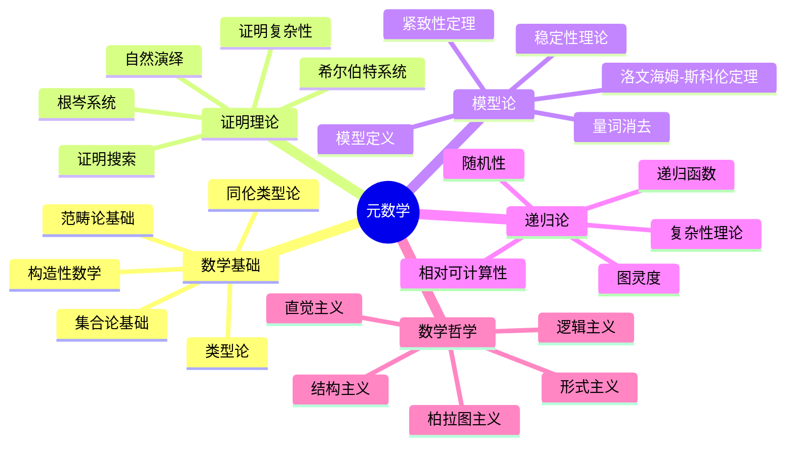
```mermaid
mindmap
  root((元数学))
    数学基础
      集合论基础
      类型论
      范畴论基础
      同伦类型论
      构造性数学
    证明理论
      自然演绎
      希尔伯特系统
      根岑系统
      证明复杂性
      证明搜索
    模型论
      模型定义
      紧致性定理
      洛文海姆-斯科伦定理
      量词消去
      稳定性理论
    递归论
      递归函数
      图灵度
      相对可计算性
      随机性
      复杂性理论
    数学哲学
      柏拉图主义
      形式主义
      直觉主义
      逻辑主义
      结构主义
```

## 5. 应用领域思维导图

### 5.1 计算机科学应用

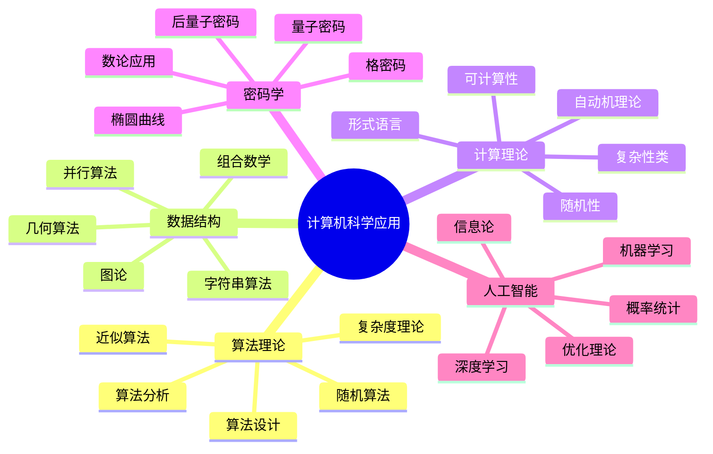
```mermaid
mindmap
  root((计算机科学应用))
    算法理论
      算法设计
      算法分析
      复杂度理论
      随机算法
      近似算法
    数据结构
      图论
      组合数学
      几何算法
      字符串算法
      并行算法
    计算理论
      自动机理论
      形式语言
      可计算性
      复杂性类
      随机性
    密码学
      数论应用
      椭圆曲线
      格密码
      量子密码
      后量子密码
    人工智能
      机器学习
      深度学习
      优化理论
      概率统计
      信息论
```

### 5.2 认知科学应用

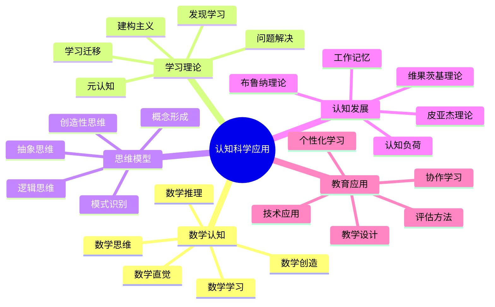
```mermaid
mindmap
  root((认知科学应用))
    数学认知
      数学思维
      数学直觉
      数学推理
      数学创造
      数学学习
    学习理论
      建构主义
      发现学习
      问题解决
      元认知
      学习迁移
    思维模型
      概念形成
      模式识别
      抽象思维
      逻辑思维
      创造性思维
    认知发展
      皮亚杰理论
      维果茨基理论
      布鲁纳理论
      认知负荷
      工作记忆
    教育应用
      教学设计
      评估方法
      技术应用
      个性化学习
      协作学习
```

### 5.3 软件工程应用

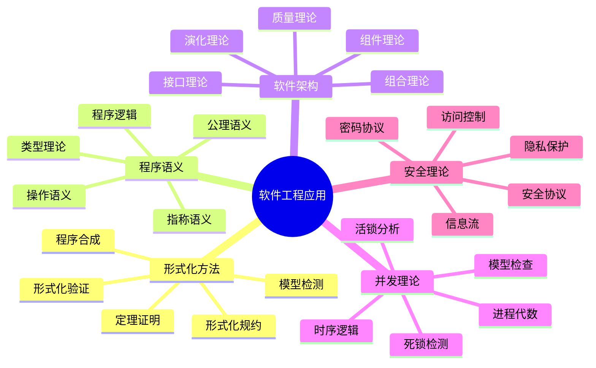
```mermaid
mindmap
  root((软件工程应用))
    形式化方法
      形式化规约
      形式化验证
      模型检测
      定理证明
      程序合成
    程序语义
      操作语义
      指称语义
      公理语义
      类型理论
      程序逻辑
    软件架构
      组件理论
      接口理论
      组合理论
      演化理论
      质量理论
    并发理论
      进程代数
      时序逻辑
      模型检查
      死锁检测
      活锁分析
    安全理论
      访问控制
      信息流
      密码协议
      安全协议
      隐私保护
```

## 6. 方法论思维导图

### 6.1 定义方法

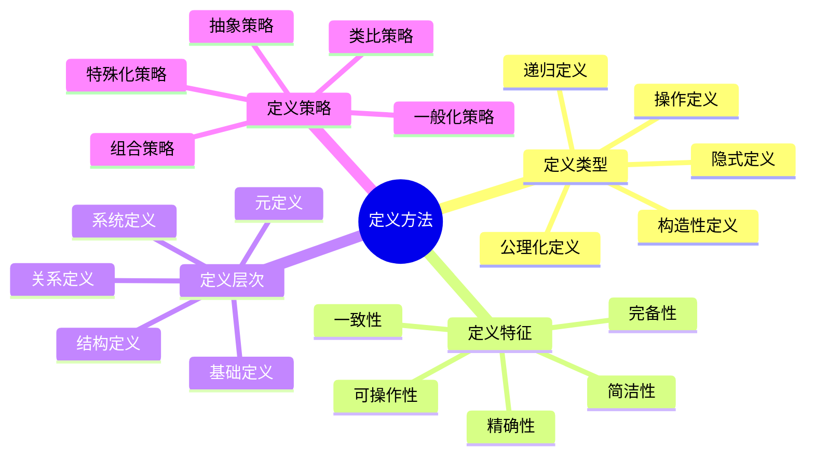
```mermaid
mindmap
  root((定义方法))
    定义类型
      构造性定义
      公理化定义
      递归定义
      操作定义
      隐式定义
    定义特征
      精确性
      一致性
      简洁性
      可操作性
      完备性
    定义层次
      基础定义
      结构定义
      关系定义
      系统定义
      元定义
    定义策略
      类比策略
      抽象策略
      特殊化策略
      一般化策略
      组合策略
```

### 6.2 证明方法

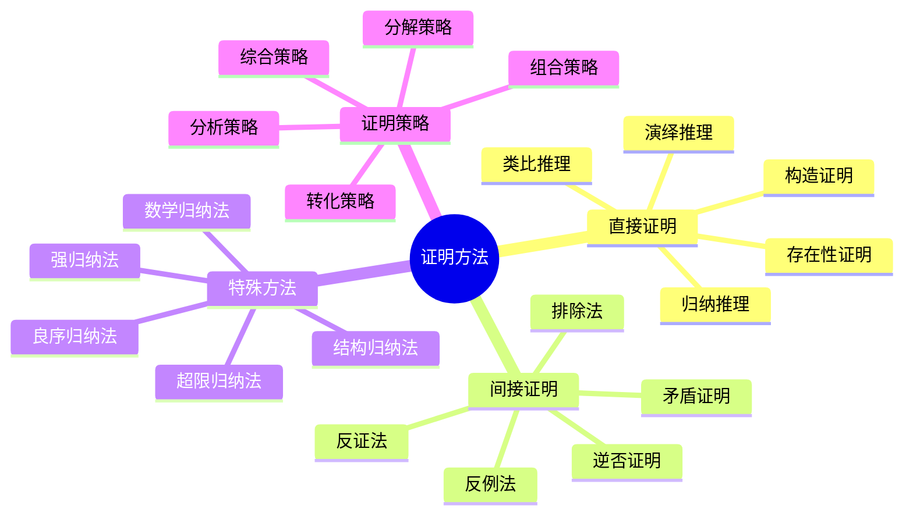
```mermaid
mindmap
  root((证明方法))
    直接证明
      演绎推理
      归纳推理
      类比推理
      构造证明
      存在性证明
    间接证明
      反证法
      逆否证明
      矛盾证明
      排除法
      反例法
    特殊方法
      数学归纳法
      强归纳法
      结构归纳法
      良序归纳法
      超限归纳法
    证明策略
      分析策略
      综合策略
      分解策略
      组合策略
      转化策略
```

### 6.3 形式化方法

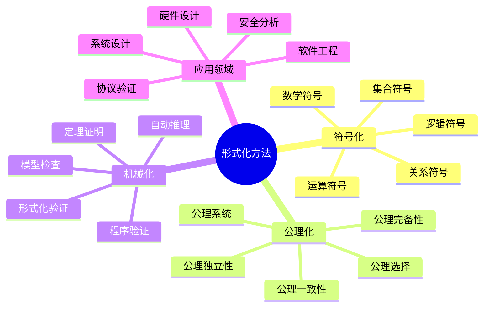
```mermaid
mindmap
  root((形式化方法))
    符号化
      数学符号
      逻辑符号
      集合符号
      运算符号
      关系符号
    公理化
      公理选择
      公理独立性
      公理完备性
      公理一致性
      公理系统
    机械化
      自动推理
      定理证明
      模型检查
      程序验证
      形式化验证
    应用领域
      软件工程
      硬件设计
      协议验证
      安全分析
      系统设计
```

## 7. 关系网络图

### 7.1 概念关系网络

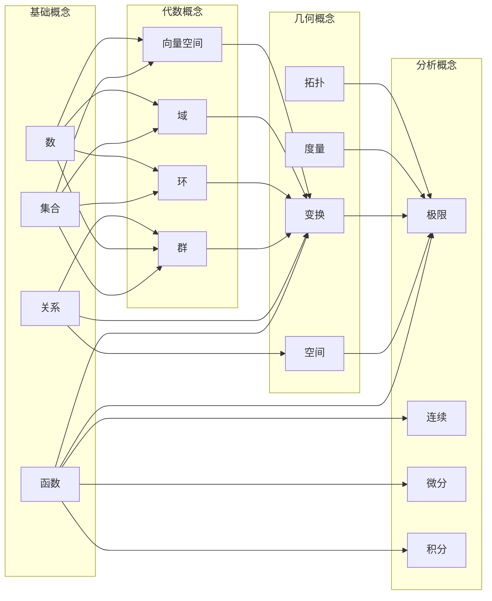
```mermaid
graph LR
    subgraph "基础概念"
        A1[集合]
        A2[数]
        A3[函数]
        A4[关系]
    end
    
    subgraph "代数概念"
        B1[群]
        B2[环]
        B3[域]
        B4[向量空间]
    end
    
    subgraph "几何概念"
        C1[空间]
        C2[变换]
        C3[度量]
        C4[拓扑]
    end
    
    subgraph "分析概念"
        D1[极限]
        D2[连续]
        D3[微分]
        D4[积分]
    end
    
    A1 --> B1
    A1 --> B2
    A1 --> B3
    A1 --> B4
    
    A2 --> B1
    A2 --> B2
    A2 --> B3
    A2 --> B4
    
    A3 --> C2
    A3 --> D1
    A3 --> D2
    A3 --> D3
    A3 --> D4
    
    A4 --> B1
    A4 --> C1
    A4 --> C2
    
    B1 --> C2
    B2 --> C2
    B3 --> C2
    B4 --> C2
    
    C1 --> D1
    C2 --> D1
    C3 --> D1
    C4 --> D1
```

### 7.2 方法关系网络

```mermaid
graph LR
    subgraph "基础方法"
        A1[定义]
        A2[证明]
        A3[计算]
        A4[构造]
    end
    
    subgraph "高级方法"
        B1[形式化]
        B2[抽象]
        B3[归纳]
        B4[演绎]
    end
    
    subgraph "应用方法"
        C1[建模]
        C2[优化]
        C3[验证]
        C4[分析]
    end
    
    A1 --> B1
    A1 --> B2
    A1 --> B3
    A1 --> B4
    
    A2 --> B1
    A2 --> B3
    A2 --> B4
    
    A3 --> C1
    A3 --> C2
    A3 --> C4
    
    A4 --> C1
    A4 --> C2
    A4 --> C3
    
    B1 --> C3
    B2 --> C1
    B3 --> C4
    B4 --> C2
```

### 7.3 应用关系网络

```mermaid
graph LR
    subgraph "理论领域"
        A1[纯数学]
        A2[应用数学]
        A3[计算数学]
        A4[统计数学]
    end
    
    subgraph "应用领域"
        B1[计算机科学]
        B2[物理学]
        B3[工程学]
        B4[经济学]
    end
    
    subgraph "交叉领域"
        C1[认知科学]
        C2[人工智能]
        C3[生物数学]
        C4[金融数学]
    end
    
    A1 --> B1
    A1 --> B2
    A1 --> B3
    A1 --> B4
    
    A2 --> B1
    A2 --> B2
    A2 --> B3
    A2 --> B4
    
    A3 --> B1
    A3 --> C1
    A3 --> C2
    
    A4 --> B4
    A4 --> C3
    A4 --> C4
    
    B1 --> C1
    B1 --> C2
    B2 --> C3
    B4 --> C4
```

## 8. 时间发展图

### 8.1 历史发展脉络

```mermaid
timeline
    title 数学理论发展时间线
    section 古代数学
        公元前3000年 : 埃及数学
        公元前2000年 : 巴比伦数学
        公元前300年 : 欧几里得几何
        公元前200年 : 阿基米德方法
    section 中世纪数学
        公元500年 : 印度数学
        公元800年 : 阿拉伯数学
        公元1200年 : 欧洲数学复兴
    section 近代数学
        17世纪 : 微积分创立
        18世纪 : 分析学发展
        19世纪 : 非欧几何
        19世纪末 : 集合论创立
    section 现代数学
        1900年 : 希尔伯特问题
        1930年 : 哥德尔不完备定理
        1940年 : 范畴论创立
        1950年 : 同调代数发展
    section 当代数学
        1960年 : 代数几何发展
        1980年 : 同伦类型论
        2000年 : 朗兰兹纲领
        2020年 : 人工智能数学
```

### 8.2 理论演进过程

```mermaid
graph LR
    subgraph "基础阶段"
        A1[算术]
        A2[几何]
        A3[代数]
    end
    
    subgraph "分析阶段"
        B1[微积分]
        B2[分析学]
        B3[微分方程]
    end
    
    subgraph "抽象阶段"
        C1[抽象代数]
        C2[拓扑学]
        C3[泛函分析]
    end
    
    subgraph "现代阶段"
        D1[范畴论]
        D2[代数几何]
        D3[同伦论]
    end
    
    subgraph "前沿阶段"
        E1[同伦类型论]
        E2[朗兰兹纲领]
        E3[人工智能数学]
    end
    
    A1 --> B1
    A2 --> B1
    A3 --> B1
    
    B1 --> C1
    B2 --> C2
    B3 --> C3
    
    C1 --> D1
    C2 --> D2
    C3 --> D3
    
    D1 --> E1
    D2 --> E2
    D3 --> E3
```

## 9. 多维表征图

### 9.1 维度分析图

```mermaid
graph TD
    subgraph "抽象维度"
        A1[具体]
        A2[抽象]
        A3[元抽象]
    end
    
    subgraph "应用维度"
        B1[理论]
        B2[应用]
        B3[交叉]
    end
    
    subgraph "方法维度"
        C1[构造]
        C2[分析]
        C3[综合]
    end
    
    subgraph "历史维度"
        D1[古典]
        D2[现代]
        D3[当代]
    end
    
    A1 --> B1
    A2 --> B2
    A3 --> B3
    
    B1 --> C1
    B2 --> C2
    B3 --> C3
    
    C1 --> D1
    C2 --> D2
    C3 --> D3
```

### 9.2 特征对比图

```mermaid
graph LR
    subgraph "理论特征"
        A1[严谨性]
        A2[抽象性]
        A3[系统性]
        A4[创新性]
    end
    
    subgraph "方法特征"
        B1[形式化]
        B2[逻辑性]
        B3[构造性]
        B4[应用性]
    end
    
    subgraph "应用特征"
        C1[通用性]
        C2[实用性]
        C3[交叉性]
        C4[前沿性]
    end
    
    A1 --> B1
    A2 --> B2
    A3 --> B3
    A4 --> B4
    
    B1 --> C1
    B2 --> C2
    B3 --> C3
    B4 --> C4
```

## 10. 总结与展望

### 10.1 思维导图总结

本数学内容思维导图通过多种表征方式展现了数学内容的完整体系：

1. **层次性**：从基础到高级的层次结构
2. **关联性**：不同概念、方法、应用之间的关联
3. **系统性**：完整的理论体系和方法体系
4. **应用性**：广泛的应用领域和实际价值

### 10.2 表征方式总结

本思维导图采用了多种表征方式：

1. **思维导图**：概念关系的可视化
2. **关系图**：概念间关系的网络表示
3. **时间线**：历史发展的时序表示
4. **层次图**：理论层次的立体表示
5. **网络图**：复杂关系的网络表示

### 10.3 应用价值

本思维导图具有重要的应用价值：

1. **学习指导**：为数学学习提供系统指导
2. **研究参考**：为数学研究提供参考框架
3. **教学工具**：为数学教学提供可视化工具
4. **应用指南**：为数学应用提供指南

### 10.4 发展展望

未来发展方向：

1. **动态化**：开发动态交互的思维导图
2. **个性化**：根据用户需求定制思维导图
3. **智能化**：结合AI技术增强思维导图功能
4. **协作化**：支持多人协作编辑思维导图

---

*本数学内容思维导图通过多维表征和可视化方式，全面展现了数学内容的体系结构、概念关系、方法联系和应用领域，为数学理论的学习、研究和应用提供了直观的指导工具。*
