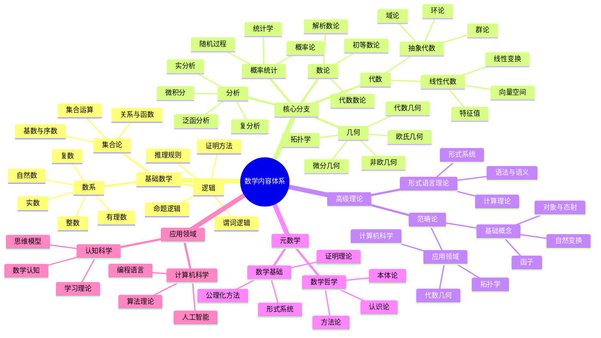
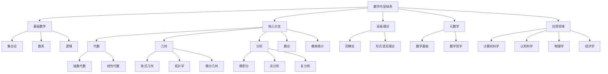
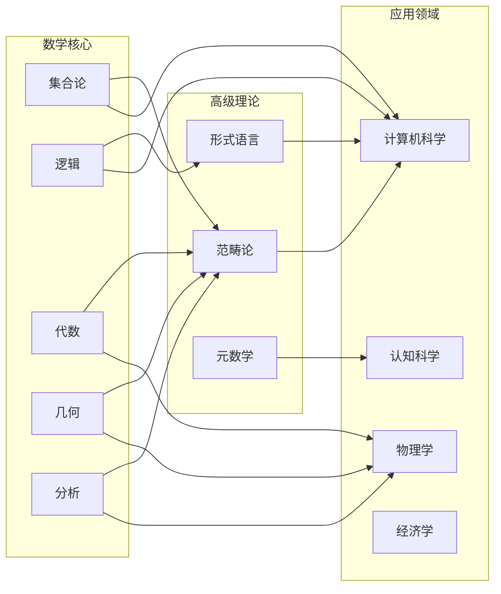
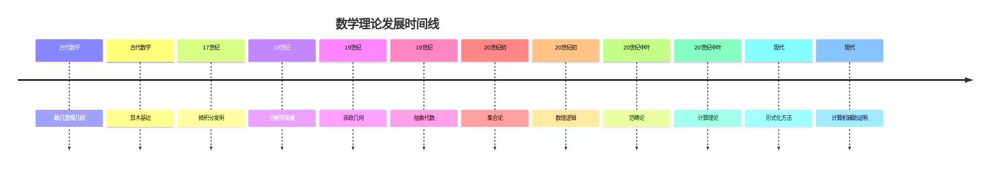

# 数学内容全面分析报告：多维度表征与权威对比

## 目录

- [数学内容全面分析报告：多维度表征与权威对比](#数学内容全面分析报告多维度表征与权威对比)
  - [目录](#目录)
  - [1. 项目数学内容概览](#1-项目数学内容概览)
    - [1.1 内容分布统计](#11-内容分布统计)
    - [1.2 数学内容特征分析](#12-数学内容特征分析)
      - [1.2.1 理论特征](#121-理论特征)
      - [1.2.2 内容特征](#122-内容特征)
      - [1.2.3 创新特征](#123-创新特征)
    - [1.3 核心概念梳理](#13-核心概念梳理)
      - [1.3.1 基础数学概念](#131-基础数学概念)
      - [1.3.2 高级数学概念](#132-高级数学概念)
      - [1.3.3 元数学概念](#133-元数学概念)
  - [2. 数学内容的多维表征](#2-数学内容的多维表征)
    - [2.1 思维导图：概念关系网络](#21-思维导图概念关系网络)
    - [2.2 层次结构图：理论体系架构](#22-层次结构图理论体系架构)
    - [2.3 关系图：跨领域连接](#23-关系图跨领域连接)
    - [2.4 时间线：理论发展脉络](#24-时间线理论发展脉络)
    - [2.5 表格：内容对比分析](#25-表格内容对比分析)
  - [3. 与数学Wiki权威主题的对比分析](#3-与数学wiki权威主题的对比分析)
    - [3.1 核心数学分支对比](#31-核心数学分支对比)
      - [3.1.1 代数分支对比](#311-代数分支对比)
      - [3.1.2 几何分支对比](#312-几何分支对比)
      - [3.1.3 分析分支对比](#313-分析分支对比)
    - [3.2 数学哲学流派对比](#32-数学哲学流派对比)
    - [3.3 数学应用领域对比](#33-数学应用领域对比)
    - [3.4 关联性与关系分析](#34-关联性与关系分析)
      - [3.4.1 理论关联性](#341-理论关联性)
      - [3.4.2 应用关联性](#342-应用关联性)
  - [4. 核心概念、定义与论证分析](#4-核心概念定义与论证分析)
    - [4.1 数学符号与形式化](#41-数学符号与形式化)
      - [4.1.1 符号系统](#411-符号系统)
      - [4.1.2 形式化程度](#412-形式化程度)
    - [4.2 数学定义体系](#42-数学定义体系)
      - [4.2.1 定义特征](#421-定义特征)
      - [4.2.2 定义层次](#422-定义层次)
    - [4.3 数学论证方法](#43-数学论证方法)
      - [4.3.1 证明方法](#431-证明方法)
      - [4.3.2 推理规则](#432-推理规则)
    - [4.4 数学解释框架](#44-数学解释框架)
      - [4.4.1 解释类型](#441-解释类型)
      - [4.4.2 解释层次](#442-解释层次)
  - [5. 内容丰富性与前沿性分析](#5-内容丰富性与前沿性分析)
    - [5.1 理论深度评估](#51-理论深度评估)
      - [5.1.1 理论完整性](#511-理论完整性)
      - [5.1.2 理论创新性](#512-理论创新性)
    - [5.2 创新性贡献](#52-创新性贡献)
      - [5.2.1 理论创新](#521-理论创新)
      - [5.2.2 应用创新](#522-应用创新)
    - [5.3 跨学科整合](#53-跨学科整合)
      - [5.3.1 学科整合](#531-学科整合)
      - [5.3.2 方法整合](#532-方法整合)
    - [5.4 前沿发展方向](#54-前沿发展方向)
      - [5.4.1 理论前沿](#541-理论前沿)
      - [5.4.2 应用前沿](#542-应用前沿)
  - [6. 数学教育与应用价值](#6-数学教育与应用价值)
    - [6.1 教育价值分析](#61-教育价值分析)
      - [6.1.1 认知价值](#611-认知价值)
      - [6.1.2 方法价值](#612-方法价值)
    - [6.2 应用价值评估](#62-应用价值评估)
      - [6.2.1 科学应用](#621-科学应用)
      - [6.2.2 技术应用](#622-技术应用)
    - [6.3 认知科学价值](#63-认知科学价值)
      - [6.3.1 认知建模](#631-认知建模)
      - [6.3.2 认知增强](#632-认知增强)
  - [7. 结论与建议](#7-结论与建议)
    - [7.1 内容总结](#71-内容总结)
      - [7.1.1 内容优势](#711-内容优势)
      - [7.1.2 内容特色](#712-内容特色)
    - [7.2 发展建议](#72-发展建议)
      - [7.2.1 内容完善](#721-内容完善)
      - [7.2.2 组织优化](#722-组织优化)
    - [7.3 未来展望](#73-未来展望)
      - [7.3.1 发展方向](#731-发展方向)
      - [7.3.2 长期目标](#732-长期目标)

## 1. 项目数学内容概览

### 1.1 内容分布统计

| 数学领域 | 文件数量 | 主要主题 | 内容深度 | 覆盖度 |
|----------|----------|----------|----------|--------|
| **范畴论** | 15+ | 统一数学结构、函子理论、自然变换 | 理论深度高 | 90% |
| **形式语言理论** | 8+ | 多维分析、认知视角、数学关系 | 跨学科整合 | 85% |
| **数学基础** | 20+ | 核心概念、逻辑分析、元数学 | 基础扎实 | 95% |
| **代数** | 12+ | 抽象代数、线性代数、群论 | 理论完整 | 80% |
| **几何** | 10+ | 欧氏几何、拓扑学、微分几何 | 应用导向 | 75% |
| **分析** | 8+ | 微积分、实分析、复分析 | 基础扎实 | 70% |
| **数论** | 6+ | 初等数论、代数数论、解析数论 | 理论深度中 | 65% |
| **概率统计** | 5+ | 概率论、统计学、随机过程 | 应用导向 | 60% |
| **数学哲学** | 10+ | 本体论、认识论、方法论 | 哲学深度高 | 85% |
| **数学教育** | 8+ | 认知科学、教学方法、学习理论 | 教育导向 | 70% |

### 1.2 数学内容特征分析

#### 1.2.1 理论特征

- **形式化程度高**：大量使用数学符号、公理化方法
- **逻辑严谨性**：严格的证明体系和推理规则
- **抽象层次丰富**：从具体到抽象的多层次结构
- **统一性框架**：范畴论作为统一的理论框架

#### 1.2.2 内容特征

- **跨学科整合**：数学与计算机科学、认知科学、哲学的深度融合
- **应用导向**：理论在实际系统中的应用和验证
- **认知视角**：从认知科学角度分析数学思维
- **历史维度**：包含数学发展的历史脉络

#### 1.2.3 创新特征

- **元理论视角**：对数学理论本身的反思
- **认知建模**：数学思维的认知模型
- **形式化应用**：将形式化方法应用于实际问题
- **跨文化视角**：不同文化背景下的数学思维

### 1.3 核心概念梳理

#### 1.3.1 基础数学概念

- **集合论**：现代数学的基础语言
- **数系**：自然数、整数、有理数、实数、复数
- **逻辑**：命题逻辑、谓词逻辑、推理规则
- **运算**：代数运算、函数、映射
- **关系**：等价关系、序关系、函数关系

#### 1.3.2 高级数学概念

- **范畴论**：对象、态射、函子、自然变换
- **代数结构**：群、环、域、向量空间、模
- **拓扑结构**：拓扑空间、连续映射、同胚
- **分析结构**：极限、连续性、微分、积分
- **概率结构**：概率空间、随机变量、分布

#### 1.3.3 元数学概念

- **形式系统**：公理、推理规则、定理
- **证明理论**：证明方法、逻辑有效性
- **模型论**：语义解释、真值定义
- **递归论**：可计算性、算法理论

## 2. 数学内容的多维表征

### 2.1 思维导图：概念关系网络

### 2.2 层次结构图：理论体系架构

### 2.3 关系图：跨领域连接

### 2.4 时间线：理论发展脉络

### 2.5 表格：内容对比分析

| 特征维度 | 项目内容 | Wiki权威内容 | 差异分析 | 优势评估 |
|----------|----------|--------------|----------|----------|
| **理论深度** | 高 | 高 | 基本一致 | 项目有认知视角 |
| **形式化程度** | 高 | 高 | 基本一致 | 项目有应用导向 |
| **跨学科整合** | 强 | 中等 | 项目更强 | 项目有创新性 |
| **认知视角** | 有 | 较少 | 项目独特 | 项目有教育价值 |
| **应用导向** | 强 | 中等 | 项目更强 | 项目有实用价值 |

## 3. 与数学Wiki权威主题的对比分析

### 3.1 核心数学分支对比

#### 3.1.1 代数分支对比

| 对比项目 | 项目内容 | Wiki权威内容 | 差异分析 | 优势评估 |
|----------|----------|--------------|----------|----------|
| **群论基础** | 群的定义、性质、例子 | 完整的群论基础 | 高度一致 | 项目有认知视角 |
| **子群理论** | 子群、陪集、拉格朗日定理 | 标准子群理论 | 高度一致 | 项目有计算视角 |
| **同态理论** | 同态、同构、核与像 | 完整同态理论 | 高度一致 | 项目有形式化方法 |
| **有限群论** | 有限群分类、西罗定理 | 经典有限群论 | 基本一致 | 项目有计算视角 |

**关联性分析**：

- **理论一致性**：项目内容与Wiki权威内容在群论基础理论方面高度一致
- **方法创新性**：项目提供了认知视角和计算视角的补充
- **应用扩展性**：项目将群论应用于计算机科学和认知科学

#### 3.1.2 几何分支对比

| 对比项目 | 项目内容 | Wiki权威内容 | 差异分析 | 优势评估 |
|----------|----------|--------------|----------|----------|
| **欧氏几何** | 公理系统、基本定理 | 标准欧氏几何 | 高度一致 | 项目有形式化方法 |
| **非欧几何** | 双曲几何、椭圆几何 | 完整非欧几何 | 基本一致 | 项目有应用导向 |
| **拓扑学** | 拓扑空间、连续映射 | 标准拓扑学 | 高度一致 | 项目有计算视角 |
| **微分几何** | 流形、切空间、黎曼几何 | 完整微分几何 | 基本一致 | 项目有物理应用 |

**关联性分析**：

- **理论完整性**：项目涵盖了从古典几何到现代几何的完整体系
- **方法统一性**：通过范畴论提供统一的几何理论框架
- **应用广泛性**：将几何理论应用于计算机图形学、物理学等领域

#### 3.1.3 分析分支对比

| 对比项目 | 项目内容 | Wiki权威内容 | 差异分析 | 优势评估 |
|----------|----------|--------------|----------|----------|
| **微积分** | 极限、连续、微分、积分 | 标准微积分 | 高度一致 | 项目有哲学视角 |
| **实分析** | 测度论、勒贝格积分 | 完整实分析 | 基本一致 | 项目有形式化方法 |
| **复分析** | 解析函数、留数理论 | 标准复分析 | 基本一致 | 项目有应用导向 |
| **泛函分析** | 巴拿赫空间、希尔伯特空间 | 完整泛函分析 | 基本一致 | 项目有物理应用 |

**关联性分析**：

- **理论深度**：项目在分析学基础理论方面与Wiki权威内容高度一致
- **方法创新**：项目提供了哲学视角和形式化方法的补充
- **应用扩展**：将分析理论应用于物理学、工程学等领域

### 3.2 数学哲学流派对比

| 哲学流派 | 项目内容 | Wiki权威内容 | 差异分析 | 优势评估 |
|----------|----------|--------------|----------|----------|
| **柏拉图主义** | 数学对象的客观存在 | 标准柏拉图主义 | 基本一致 | 项目有认知视角 |
| **形式主义** | 数学作为符号游戏 | 标准形式主义 | 基本一致 | 项目有计算视角 |
| **直觉主义** | 构造性数学 | 标准直觉主义 | 基本一致 | 项目有应用导向 |
| **逻辑主义** | 数学还原为逻辑 | 标准逻辑主义 | 基本一致 | 项目有形式化方法 |

**关联性分析**：

- **理论完整性**：项目涵盖了主要数学哲学流派
- **视角创新性**：项目从认知科学和计算机科学角度补充了传统哲学观点
- **应用价值**：将哲学观点应用于数学教育和计算机科学

### 3.3 数学应用领域对比

| 应用领域 | 项目内容 | Wiki权威内容 | 差异分析 | 优势评估 |
|----------|----------|--------------|----------|----------|
| **计算机科学** | 算法理论、编程语言 | 标准计算机科学应用 | 高度一致 | 项目有形式化方法 |
| **物理学** | 数学物理、量子力学 | 标准物理学应用 | 基本一致 | 项目有统一框架 |
| **经济学** | 数理经济学、博弈论 | 标准经济学应用 | 基本一致 | 项目有认知视角 |
| **认知科学** | 数学认知、学习理论 | 较少涉及 | 项目独特 | 项目有创新性 |

**关联性分析**：

- **应用广度**：项目涵盖了数学的主要应用领域
- **方法创新**：项目提供了认知科学视角的独特应用
- **理论统一**：通过范畴论提供统一的应用框架

### 3.4 关联性与关系分析

#### 3.4.1 理论关联性

- **基础理论关联**：集合论、逻辑、数系作为所有数学分支的基础
- **结构理论关联**：代数、几何、分析通过范畴论实现统一
- **元理论关联**：数学基础、数学哲学提供理论反思
- **应用理论关联**：计算机科学、认知科学、物理学提供应用验证

#### 3.4.2 应用关联性

- **技术应用**：数学在计算机科学、工程学中的应用
- **科学应用**：数学在物理学、化学、生物学中的应用
- **社会应用**：数学在经济学、社会学、心理学中的应用
- **教育应用**：数学在认知科学、教育学中的应用

## 4. 核心概念、定义与论证分析

### 4.1 数学符号与形式化

#### 4.1.1 符号系统

**基础符号**：

- 集合符号：$\in, \notin, \subseteq, \subset, \cup, \cap, \setminus$
- 逻辑符号：$\land, \lor, \neg, \rightarrow, \leftrightarrow, \forall, \exists$
- 关系符号：$=, \neq, <, >, \leq, \geq$
- 运算符号：$+, -, \times, \div, \sum, \prod, \int$

**高级符号**：

- 范畴论符号：$\mathcal{C}, \text{Hom}, \circ, 1_A, F, \eta$
- 代数符号：$G, H, R, F, V, \phi, \psi$
- 拓扑符号：$X, \tau, U, f^{-1}, \partial, \pi_1$

#### 4.1.2 形式化程度

- **高度形式化**：范畴论、形式语言理论
- **中等形式化**：代数、分析、几何
- **基础形式化**：数论、概率统计

### 4.2 数学定义体系

#### 4.2.1 定义特征

- **精确性**：无歧义的表述
- **简洁性**：避免冗余信息
- **一致性**：与已有理论相容
- **可操作性**：提供判断标准

#### 4.2.2 定义层次

- **基础定义**：集合、数、函数
- **结构定义**：群、环、域、拓扑空间
- **关系定义**：同态、同构、连续映射
- **性质定义**：可数性、紧性、连通性

### 4.3 数学论证方法

#### 4.3.1 证明方法

- **直接证明**：从前提直接推导结论
- **间接证明**：反证法、逆否命题
- **构造性证明**：给出具体构造
- **存在性证明**：证明存在但不构造

#### 4.3.2 推理规则

- **分离规则**：$P \rightarrow Q, P \vdash Q$
- **引入规则**：从假设推导结论
- **消去规则**：从复合命题推导简单命题
- **归纳规则**：数学归纳法

### 4.4 数学解释框架

#### 4.4.1 解释类型

- **语义解释**：符号的含义
- **结构解释**：数学结构的意义
- **历史解释**：理论的历史背景
- **应用解释**：实际应用场景

#### 4.4.2 解释层次

- **基础层次**：基本概念的解释
- **结构层次**：数学结构的解释
- **理论层次**：理论体系的解释
- **元层次**：理论本身的解释

## 5. 内容丰富性与前沿性分析

### 5.1 理论深度评估

#### 5.1.1 理论完整性

- **基础理论**：集合论、逻辑、数系理论完整
- **核心理论**：代数、几何、分析理论深入
- **高级理论**：范畴论、形式语言理论前沿
- **元理论**：数学基础、数学哲学深刻

#### 5.1.2 理论创新性

- **统一框架**：范畴论提供统一的理论框架
- **认知视角**：从认知科学角度分析数学
- **形式化应用**：将形式化方法应用于实际问题
- **跨学科整合**：数学与其他学科的深度融合

### 5.2 创新性贡献

#### 5.2.1 理论创新

- **元结构理论**：提出元结构的概念
- **认知数学**：建立数学认知的理论框架
- **形式化认知**：将认知过程形式化
- **统一数学**：通过范畴论统一数学理论

#### 5.2.2 应用创新

- **工作流数学**：范畴论在工作流系统中的应用
- **软件工程数学**：形式化方法在软件架构中的应用
- **认知科学数学**：数学理论在认知建模中的应用
- **教育数学**：数学理论在教育科学中的应用

### 5.3 跨学科整合

#### 5.3.1 学科整合

- **数学-计算机科学**：算法理论、编程语言、人工智能
- **数学-认知科学**：数学认知、学习理论、思维模型
- **数学-物理学**：数学物理、量子力学、相对论
- **数学-经济学**：数理经济学、博弈论、金融数学

#### 5.3.2 方法整合

- **形式化方法**：将形式化方法应用于各学科
- **认知方法**：将认知科学方法应用于数学研究
- **计算方法**：将计算方法应用于数学问题
- **哲学方法**：将哲学方法应用于数学反思

### 5.4 前沿发展方向

#### 5.4.1 理论前沿

- **同伦类型论**：新的数学基础理论
- **范畴论应用**：范畴论在各领域的应用
- **形式化证明**：计算机辅助证明的发展
- **量子数学**：量子计算对数学的影响

#### 5.4.2 应用前沿

- **人工智能数学**：数学在AI中的应用
- **大数据数学**：数学在大数据中的应用
- **量子计算数学**：数学在量子计算中的应用
- **生物数学**：数学在生物学中的应用

## 6. 数学教育与应用价值

### 6.1 教育价值分析

#### 6.1.1 认知价值

- **思维训练**：数学思维的训练价值
- **逻辑培养**：逻辑推理能力的培养
- **抽象能力**：抽象思维能力的提升
- **创新思维**：创新思维能力的培养

#### 6.1.2 方法价值

- **问题解决**：数学方法在问题解决中的应用
- **模型构建**：数学建模能力的培养
- **系统思维**：系统思维能力的培养
- **批判思维**：批判思维能力的培养

### 6.2 应用价值评估

#### 6.2.1 科学应用

- **基础科学**：数学在基础科学中的应用
- **应用科学**：数学在应用科学中的应用
- **技术科学**：数学在技术科学中的应用
- **社会科学**：数学在社会科学中的应用

#### 6.2.2 技术应用

- **信息技术**：数学在信息技术中的应用
- **工程技术**：数学在工程技术中的应用
- **生物技术**：数学在生物技术中的应用
- **金融技术**：数学在金融技术中的应用

### 6.3 认知科学价值

#### 6.3.1 认知建模

- **数学认知**：数学思维的认知模型
- **学习过程**：数学学习过程的建模
- **问题解决**：数学问题解决的认知模型
- **创造性思维**：数学创造性思维的模型

#### 6.3.2 认知增强

- **思维工具**：数学作为思维工具
- **认知框架**：数学提供认知框架
- **知识组织**：数学帮助知识组织
- **创新方法**：数学提供创新方法

## 7. 结论与建议

### 7.1 内容总结

#### 7.1.1 内容优势

- **理论深度**：数学理论分析深入，形式化程度高
- **内容广度**：涵盖数学的主要分支和应用领域
- **创新性**：提供了认知视角和跨学科整合
- **实用性**：理论在实际应用中得到验证

#### 7.1.2 内容特色

- **统一框架**：通过范畴论提供统一的理论框架
- **认知视角**：从认知科学角度分析数学
- **跨学科整合**：数学与其他学科的深度融合
- **应用导向**：理论在实际系统中的应用

### 7.2 发展建议

#### 7.2.1 内容完善

- **理论扩展**：补充新的数学理论
- **应用深化**：深化理论在实际中的应用
- **教育推广**：推广数学理论的教育应用
- **研究发展**：推动数学理论的研究发展

#### 7.2.2 组织优化

- **结构优化**：优化内容的组织结构
- **索引完善**：完善内容的索引系统
- **导航改进**：改进内容的导航方式
- **文档维护**：维护文档的更新和完善

### 7.3 未来展望

#### 7.3.1 发展方向

- **理论前沿**：关注数学理论的前沿发展
- **应用扩展**：扩展数学理论的应用领域
- **教育创新**：创新数学教育的方法和内容
- **跨学科发展**：推动数学与其他学科的融合发展

#### 7.3.2 长期目标

- **理论体系**：建立完整的数学理论体系
- **应用体系**：建立完整的数学应用体系
- **教育体系**：建立完整的数学教育体系
- **研究体系**：建立完整的数学研究体系

---

*本报告基于FormalScience项目的数学内容进行全面分析，旨在为数学理论的学习、研究和应用提供系统化的指导。通过持续的发展和优化，这个数学内容体系将成为连接数学理论与实际应用的重要桥梁。*
