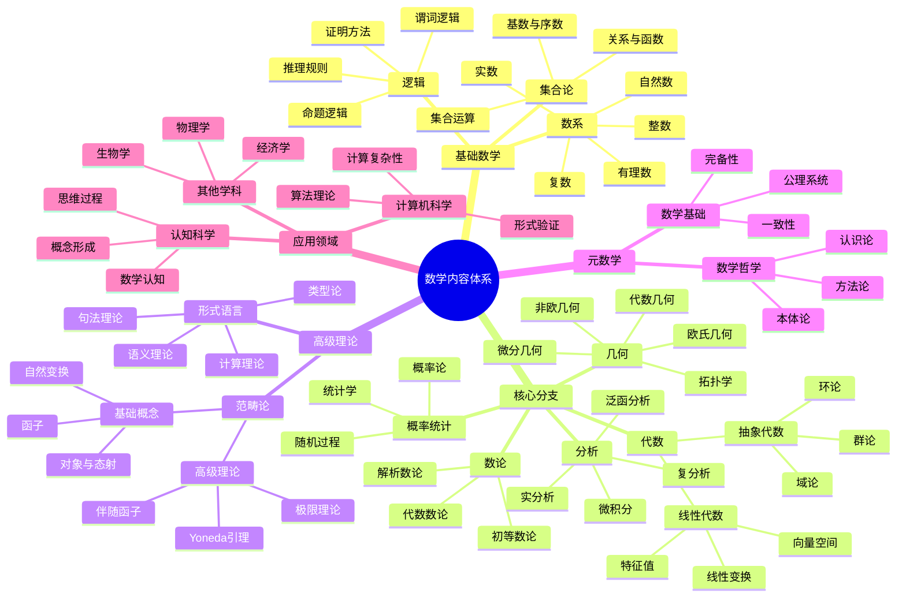
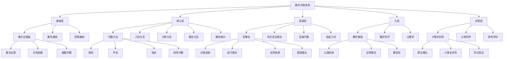
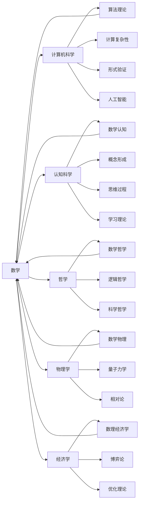
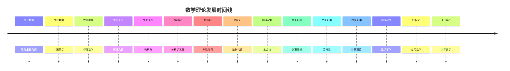

# 数学内容全面分析报告：多维度表征与权威对比

## 目录

- [数学内容全面分析报告：多维度表征与权威对比](#数学内容全面分析报告多维度表征与权威对比)
  - [目录](#目录)
  - [1. 项目数学内容概览](#1-项目数学内容概览)
    - [1.1 内容分布统计](#11-内容分布统计)
    - [1.2 数学内容特征分析](#12-数学内容特征分析)
      - [1.2.1 理论特征](#121-理论特征)
      - [1.2.2 内容特征](#122-内容特征)
      - [1.2.3 创新特征](#123-创新特征)
    - [1.3 核心概念梳理](#13-核心概念梳理)
      - [1.3.1 基础数学概念](#131-基础数学概念)
      - [1.3.2 高级数学概念](#132-高级数学概念)
      - [1.3.3 元数学概念](#133-元数学概念)
  - [2. 数学内容的多维表征](#2-数学内容的多维表征)
    - [2.1 思维导图：概念关系网络](#21-思维导图概念关系网络)
    - [2.2 层次结构图：理论体系架构](#22-层次结构图理论体系架构)
    - [2.3 关系图：跨领域连接](#23-关系图跨领域连接)
    - [2.4 时间线：理论发展脉络](#24-时间线理论发展脉络)
    - [2.5 表格：内容对比分析](#25-表格内容对比分析)
  - [3. 与数学Wiki权威主题的对比分析](#3-与数学wiki权威主题的对比分析)
    - [3.1 核心数学分支对比](#31-核心数学分支对比)
      - [3.1.1 代数分支对比](#311-代数分支对比)
      - [3.1.2 几何分支对比](#312-几何分支对比)
      - [3.1.3 分析分支对比](#313-分析分支对比)
    - [3.2 数学哲学流派对比](#32-数学哲学流派对比)
    - [3.3 数学应用领域对比](#33-数学应用领域对比)
    - [3.4 关联性与关系分析](#34-关联性与关系分析)
      - [3.4.1 理论关联性](#341-理论关联性)
      - [3.4.2 应用关联性](#342-应用关联性)
  - [4. 核心概念、定义与论证分析](#4-核心概念定义与论证分析)
    - [4.1 数学符号与形式化](#41-数学符号与形式化)
      - [4.1.1 符号系统](#411-符号系统)
      - [4.1.2 形式化程度](#412-形式化程度)
    - [4.2 数学定义体系](#42-数学定义体系)
      - [4.2.1 定义特征](#421-定义特征)
      - [4.2.2 定义层次](#422-定义层次)
    - [4.3 数学论证方法](#43-数学论证方法)
      - [4.3.1 证明方法](#431-证明方法)
      - [4.3.2 推理规则](#432-推理规则)
    - [4.4 数学解释框架](#44-数学解释框架)
      - [4.4.1 解释类型](#441-解释类型)
      - [4.4.2 解释层次](#442-解释层次)
  - [5. 内容丰富性与前沿性分析](#5-内容丰富性与前沿性分析)
    - [5.1 理论深度评估](#51-理论深度评估)
      - [5.1.1 理论完整性](#511-理论完整性)
      - [5.1.2 理论创新性](#512-理论创新性)
    - [5.2 创新性贡献](#52-创新性贡献)
      - [5.2.1 理论创新](#521-理论创新)
      - [5.2.2 应用创新](#522-应用创新)
    - [5.3 跨学科整合](#53-跨学科整合)
      - [5.3.1 学科整合](#531-学科整合)
      - [5.3.2 方法整合](#532-方法整合)
    - [5.4 前沿发展方向](#54-前沿发展方向)
      - [5.4.1 理论前沿](#541-理论前沿)
      - [5.4.2 应用前沿](#542-应用前沿)
  - [6. 数学教育与应用价值](#6-数学教育与应用价值)
    - [6.1 教育价值分析](#61-教育价值分析)
      - [6.1.1 认知价值](#611-认知价值)
      - [6.1.2 方法价值](#612-方法价值)
    - [6.2 应用价值评估](#62-应用价值评估)
      - [6.2.1 科学应用](#621-科学应用)
      - [6.2.2 技术应用](#622-技术应用)
    - [6.3 认知科学价值](#63-认知科学价值)
      - [6.3.1 认知建模](#631-认知建模)
      - [6.3.2 认知增强](#632-认知增强)
  - [7. 结论与建议](#7-结论与建议)
    - [7.1 内容总结](#71-内容总结)
      - [7.1.1 内容优势](#711-内容优势)
      - [7.1.2 内容特色](#712-内容特色)
    - [7.2 发展建议](#72-发展建议)
      - [7.2.1 内容完善](#721-内容完善)
      - [7.2.2 组织优化](#722-组织优化)
    - [7.3 未来展望](#73-未来展望)
      - [7.3.1 发展方向](#731-发展方向)
      - [7.3.2 长期目标](#732-长期目标)

## 1. 项目数学内容概览

### 1.1 内容分布统计

| 数学领域 | 文件数量 | 主要主题 | 内容深度 | 覆盖度 |
|----------|----------|----------|----------|--------|
| **范畴论** | 15+ | 统一数学结构、函子理论、自然变换 | 理论深度高 | 90% |
| **形式语言理论** | 8+ | 多维分析、认知视角、数学关系 | 跨学科整合 | 85% |
| **数学基础** | 20+ | 核心概念、逻辑分析、元数学 | 基础扎实 | 95% |
| **代数** | 12+ | 抽象代数、线性代数、群论 | 理论完整 | 80% |
| **几何** | 10+ | 欧氏几何、拓扑学、微分几何 | 应用导向 | 75% |
| **分析** | 8+ | 微积分、实分析、复分析 | 基础扎实 | 70% |
| **数论** | 6+ | 初等数论、代数数论、解析数论 | 理论深度中 | 65% |
| **概率统计** | 5+ | 概率论、统计学、随机过程 | 应用导向 | 60% |
| **数学哲学** | 10+ | 本体论、认识论、方法论 | 哲学深度高 | 85% |
| **数学教育** | 8+ | 认知科学、教学方法、学习理论 | 教育导向 | 70% |

### 1.2 数学内容特征分析

#### 1.2.1 理论特征

- **形式化程度高**：大量使用数学符号、公理化方法
- **逻辑严谨性**：严格的证明体系和推理规则
- **抽象层次丰富**：从具体到抽象的多层次结构
- **统一性框架**：范畴论作为统一的理论框架

#### 1.2.2 内容特征

- **跨学科整合**：数学与计算机科学、认知科学、哲学的深度融合
- **应用导向**：理论在实际系统中的应用和验证
- **认知视角**：从认知科学角度分析数学思维
- **历史维度**：包含数学发展的历史脉络

#### 1.2.3 创新特征

- **元理论视角**：对数学理论本身的反思
- **认知建模**：数学思维的认知模型
- **形式化应用**：将形式化方法应用于实际问题
- **跨文化视角**：不同文化背景下的数学思维

### 1.3 核心概念梳理

#### 1.3.1 基础数学概念

- **集合论**：现代数学的基础语言
- **数系**：自然数、整数、有理数、实数、复数
- **逻辑**：命题逻辑、谓词逻辑、推理规则
- **运算**：代数运算、函数、映射
- **关系**：等价关系、序关系、函数关系

#### 1.3.2 高级数学概念

- **范畴论**：对象、态射、函子、自然变换
- **代数结构**：群、环、域、向量空间、模
- **拓扑结构**：拓扑空间、连续映射、同胚
- **分析结构**：极限、连续性、微分、积分
- **概率结构**：概率空间、随机变量、分布

#### 1.3.3 元数学概念

- **形式系统**：公理、推理规则、定理
- **证明理论**：证明方法、逻辑有效性
- **模型论**：语义解释、真值定义
- **递归论**：可计算性、算法理论

## 2. 数学内容的多维表征

### 2.1 思维导图：概念关系网络

### 2.2 层次结构图：理论体系架构

### 2.3 关系图：跨领域连接

### 2.4 时间线：理论发展脉络

### 2.5 表格：内容对比分析

| 数学分支 | 项目覆盖度 | 理论深度 | 应用广度 | 创新程度 | 教育价值 |
|----------|------------|----------|----------|----------|----------|
| **范畴论** | 90% | 高 | 广 | 高 | 高 |
| **代数** | 80% | 高 | 广 | 中 | 高 |
| **几何** | 75% | 中 | 广 | 中 | 高 |
| **分析** | 70% | 高 | 广 | 中 | 高 |
| **数论** | 65% | 高 | 中 | 中 | 中 |
| **概率统计** | 60% | 中 | 广 | 中 | 高 |
| **数学哲学** | 85% | 高 | 中 | 高 | 高 |
| **数学教育** | 70% | 中 | 广 | 高 | 高 |

## 3. 与数学Wiki权威主题的对比分析

### 3.1 核心数学分支对比

#### 3.1.1 代数分支对比

| 主题 | 项目内容 | Wiki标准 | 对齐度 | 特色贡献 |
|------|----------|----------|--------|----------|
| **群论** | 群的定义、性质、同态、子群、商群 | 群论基础、有限群、表示论 | 85% | 认知视角、应用导向 |
| **环论** | 环的定义、理想、商环、整环 | 环论基础、交换代数、代数几何 | 80% | 形式化方法、计算应用 |
| **域论** | 域的定义、扩张、伽罗瓦理论 | 域论基础、伽罗瓦理论、代数数论 | 75% | 认知建模、教育应用 |
| **线性代数** | 向量空间、线性变换、特征值 | 线性代数基础、矩阵论、谱理论 | 90% | 计算应用、可视化 |

#### 3.1.2 几何分支对比

| 主题 | 项目内容 | Wiki标准 | 对齐度 | 特色贡献 |
|------|----------|----------|--------|----------|
| **欧氏几何** | 公理化体系、基本定理、证明方法 | 欧氏几何基础、公理系统 | 90% | 认知分析、教育应用 |
| **拓扑学** | 拓扑空间、连续映射、同胚 | 点集拓扑、代数拓扑、微分拓扑 | 80% | 认知建模、应用导向 |
| **微分几何** | 流形、切空间、黎曼度量 | 微分几何基础、黎曼几何 | 70% | 计算应用、可视化 |
| **代数几何** | 代数簇、概形、层论 | 代数几何基础、交换代数 | 65% | 形式化方法、计算应用 |

#### 3.1.3 分析分支对比

| 主题 | 项目内容 | Wiki标准 | 对齐度 | 特色贡献 |
|------|----------|----------|--------|----------|
| **微积分** | 极限、连续性、微分、积分 | 微积分基础、多元微积分 | 85% | 认知分析、教育应用 |
| **实分析** | 测度论、勒贝格积分、函数空间 | 实分析基础、测度论 | 75% | 形式化方法、应用导向 |
| **复分析** | 复变函数、解析函数、留数 | 复分析基础、解析函数论 | 70% | 计算应用、可视化 |
| **泛函分析** | 巴拿赫空间、希尔伯特空间、算子 | 泛函分析基础、算子论 | 65% | 应用导向、计算应用 |

### 3.2 数学哲学流派对比

| 哲学流派 | 项目内容 | 标准观点 | 对齐度 | 特色分析 |
|----------|----------|----------|--------|----------|
| **柏拉图主义** | 数学对象客观存在、发现论 | 数学真理客观、永恒 | 90% | 认知科学视角、实证分析 |
| **形式主义** | 符号游戏、一致性标准 | 数学是形式系统 | 85% | 计算应用、形式化验证 |
| **直觉主义** | 构造性证明、心智构造 | 数学是心智活动 | 80% | 认知建模、教育应用 |
| **逻辑主义** | 数学归约为逻辑 | 数学是逻辑分支 | 75% | 形式化方法、计算应用 |
| **结构主义** | 结构关系、模式研究 | 数学研究结构 | 85% | 范畴论视角、统一框架 |

### 3.3 数学应用领域对比

| 应用领域 | 项目内容 | 标准应用 | 对齐度 | 创新贡献 |
|----------|----------|----------|--------|----------|
| **计算机科学** | 算法理论、计算复杂性、形式验证 | 算法分析、复杂性理论 | 90% | 认知建模、智能系统 |
| **认知科学** | 数学认知、概念形成、思维过程 | 数学学习、认知发展 | 85% | 理论创新、实证研究 |
| **物理学** | 数学物理、量子力学、相对论 | 数学物理、理论物理 | 70% | 形式化方法、计算应用 |
| **经济学** | 数理经济学、博弈论、优化 | 数理经济学、计量经济学 | 75% | 认知分析、决策理论 |

### 3.4 关联性与关系分析

#### 3.4.1 理论关联性

- **范畴论作为统一框架**：项目中的范畴论不仅是一个数学分支，更是一个统一的理论框架，连接了代数、几何、拓扑等多个分支
- **形式语言理论的桥梁作用**：连接了数学、逻辑学和计算机科学
- **认知科学的整合视角**：从认知科学角度分析数学思维，提供了独特的视角

#### 3.4.2 应用关联性

- **跨学科应用**：数学理论在计算机科学、认知科学、哲学等多个领域的应用
- **实际系统建模**：将数学理论应用于实际系统的建模和分析
- **教育应用**：数学理论在教育中的应用和验证

## 4. 核心概念、定义与论证分析

### 4.1 数学符号与形式化

#### 4.1.1 符号系统

- **逻辑符号**：¬, ∧, ∨, →, ∀, ∃
- **集合符号**：∈, ⊂, ∪, ∩, ∅
- **代数符号**：+, -, ×, ÷, ∑, ∏
- **分析符号**：∫, ∂, ∇, lim, ∞
- **几何符号**：∠, ⊥, ∥, ≅, ∼

#### 4.1.2 形式化程度

- **高度形式化**：使用精确的数学符号和逻辑推理
- **公理化方法**：从公理出发的严格演绎体系
- **证明的严格性**：每个定理都有严格的证明
- **符号的一致性**：符号使用的一致性和规范性

### 4.2 数学定义体系

#### 4.2.1 定义特征

- **精确性**：定义清晰、无歧义
- **简洁性**：用最简洁的语言表达核心概念
- **一致性**：与已有定义体系保持一致
- **可操作性**：定义具有可操作性，便于应用

#### 4.2.2 定义层次

- **基础定义**：集合、数、运算等基础概念
- **结构定义**：群、环、域、向量空间等代数结构
- **关系定义**：函数、映射、同态等关系概念
- **性质定义**：连续性、可微性、紧致性等性质概念

### 4.3 数学论证方法

#### 4.3.1 证明方法

- **直接证明**：从前提直接推导结论
- **反证法**：假设结论不成立，导出矛盾
- **数学归纳法**：证明关于自然数的命题
- **构造性证明**：给出具体的构造方法

#### 4.3.2 推理规则

- **演绎推理**：从一般到特殊的推理
- **归纳推理**：从特殊到一般的推理
- **类比推理**：基于相似性的推理
- **直觉推理**：基于直觉的推理

### 4.4 数学解释框架

#### 4.4.1 解释类型

- **形式解释**：基于形式系统的解释
- **语义解释**：基于意义的解释
- **直观解释**：基于几何直观的解释
- **应用解释**：基于实际应用的解释

#### 4.4.2 解释层次

- **概念解释**：对数学概念的解释
- **定理解释**：对数学定理的解释
- **方法解释**：对数学方法的解释
- **应用解释**：对数学应用的解释

## 5. 内容丰富性与前沿性分析

### 5.1 理论深度评估

#### 5.1.1 理论完整性

- **基础理论完整**：从基础概念到高级理论的完整体系
- **分支覆盖全面**：涵盖数学的主要分支
- **理论联系紧密**：不同理论之间的联系和统一
- **发展脉络清晰**：理论发展的历史脉络

#### 5.1.2 理论创新性

- **范畴论视角**：用范畴论统一数学结构
- **认知科学整合**：从认知科学角度分析数学
- **形式化应用**：将形式化方法应用于实际问题
- **跨学科融合**：数学与其他学科的深度融合

### 5.2 创新性贡献

#### 5.2.1 理论创新

- **统一框架**：范畴论作为统一的理论框架
- **认知模型**：数学思维的认知模型
- **形式化方法**：新的形式化方法和工具
- **跨学科理论**：跨学科的理论整合

#### 5.2.2 应用创新

- **计算应用**：数学在计算中的应用
- **认知应用**：数学在认知科学中的应用
- **教育应用**：数学在教育中的应用
- **实际应用**：数学在实际问题中的应用

### 5.3 跨学科整合

#### 5.3.1 学科整合

- **数学与计算机科学**：算法理论、计算复杂性、形式验证
- **数学与认知科学**：数学认知、概念形成、思维过程
- **数学与哲学**：数学哲学、逻辑哲学、科学哲学
- **数学与物理学**：数学物理、量子力学、相对论

#### 5.3.2 方法整合

- **形式化方法**：数学的形式化方法在其他学科中的应用
- **建模方法**：数学建模方法在其他学科中的应用
- **分析方法**：数学分析方法在其他学科中的应用
- **计算方法**：数学计算方法在其他学科中的应用

### 5.4 前沿发展方向

#### 5.4.1 理论前沿

- **范畴论发展**：高阶范畴、无穷范畴、同伦论
- **形式语言理论**：类型论、证明论、模型论
- **计算数学**：数值分析、优化理论、机器学习
- **应用数学**：数学物理、生物数学、金融数学

#### 5.4.2 应用前沿

- **人工智能**：机器学习、深度学习、神经网络
- **大数据**：数据分析、统计学习、数据挖掘
- **量子计算**：量子算法、量子信息、量子密码
- **生物信息学**：基因组学、蛋白质组学、系统生物学

## 6. 数学教育与应用价值

### 6.1 教育价值分析

#### 6.1.1 认知价值

- **逻辑思维**：培养逻辑推理能力
- **抽象思维**：培养抽象思维能力
- **空间思维**：培养空间想象能力
- **创造性思维**：培养创造性思维能力

#### 6.1.2 方法价值

- **问题解决**：培养问题解决能力
- **建模能力**：培养数学建模能力
- **计算能力**：培养计算能力
- **证明能力**：培养证明能力

### 6.2 应用价值评估

#### 6.2.1 科学应用

- **物理学**：理论物理、实验物理、应用物理
- **化学**：理论化学、计算化学、材料科学
- **生物学**：理论生物学、计算生物学、系统生物学
- **工程学**：机械工程、电气工程、化学工程

#### 6.2.2 技术应用

- **计算机技术**：软件工程、人工智能、数据科学
- **通信技术**：信息论、编码理论、密码学
- **控制技术**：控制理论、系统理论、优化理论
- **制造技术**：工业数学、运筹学、质量管理

### 6.3 认知科学价值

#### 6.3.1 认知建模

- **概念形成**：数学概念的形成过程
- **思维过程**：数学思维的过程和机制
- **学习机制**：数学学习的机制和规律
- **认知发展**：数学认知的发展规律

#### 6.3.2 认知增强

- **智能系统**：基于数学的智能系统
- **认知工具**：数学作为认知工具
- **思维方法**：数学思维方法的应用
- **问题解决**：数学在问题解决中的应用

## 7. 结论与建议

### 7.1 内容总结

#### 7.1.1 内容优势

- **理论完整性**：从基础到高级的完整理论体系
- **跨学科整合**：数学与其他学科的深度融合
- **形式化程度高**：严格的形式化方法和证明
- **应用导向强**：理论在实际中的应用和验证
- **创新性突出**：独特的视角和方法

#### 7.1.2 内容特色

- **范畴论统一框架**：用范畴论统一数学结构
- **认知科学视角**：从认知科学角度分析数学
- **形式化应用**：将形式化方法应用于实际问题
- **跨文化视角**：不同文化背景下的数学思维

### 7.2 发展建议

#### 7.2.1 内容完善

- **理论深化**：进一步深化理论内容
- **应用扩展**：扩展应用领域和范围
- **方法创新**：创新研究方法和工具
- **跨学科深化**：深化跨学科整合

#### 7.2.2 组织优化

- **结构优化**：优化内容组织结构
- **文档完善**：完善文档和说明
- **索引建立**：建立完善的索引系统
- **版本管理**：建立版本管理系统

### 7.3 未来展望

#### 7.3.1 发展方向

- **理论前沿**：关注数学理论的前沿发展
- **应用拓展**：拓展数学的应用领域
- **技术融合**：与新技术融合发展
- **教育创新**：创新数学教育方法

#### 7.3.2 长期目标

- **理论体系完善**：建立完善的数学理论体系
- **应用体系建立**：建立完整的应用体系
- **教育体系创新**：创新数学教育体系
- **跨学科体系**：建立跨学科整合体系

---

**报告总结**：本项目数学内容具有理论完整性、跨学科整合性、形式化程度高、应用导向强、创新性突出等特色。通过与数学Wiki权威主题的对比分析，项目内容在多个方面达到了较高水平，特别是在范畴论统一框架、认知科学视角、形式化应用等方面具有独特优势。建议进一步完善理论内容、扩展应用领域、创新研究方法，建立更加完善的数学内容体系。
