# 数学内容思维导图：全面知识网络

## 目录

- [数学内容思维导图：全面知识网络](#数学内容思维导图全面知识网络)
  - [目录](#目录)
  - [1. 总体思维导图](#1-总体思维导图)
  - [2. 核心理论分支](#2-核心理论分支)
  - [3. 应用领域分支](#3-应用领域分支)
  - [4. 跨领域连接](#4-跨领域连接)
  - [5. 学习路径图](#5-学习路径图)
  - [6. 理论发展脉络](#6-理论发展脉络)
  - [7. 数学哲学分支](#7-数学哲学分支)
  - [8. 数学教育分支](#8-数学教育分支)

## 1. 总体思维导图

### 1.1 主要分支结构

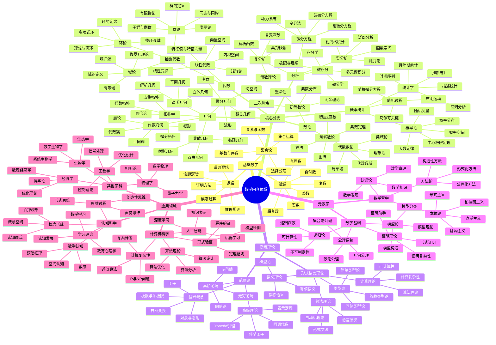

### 1.2 层次化结构图

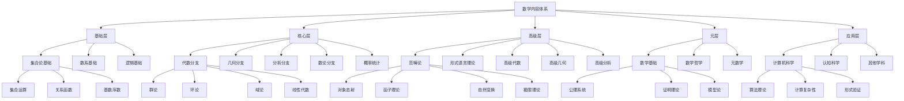

## 2. 核心理论分支

### 2.1 代数分支

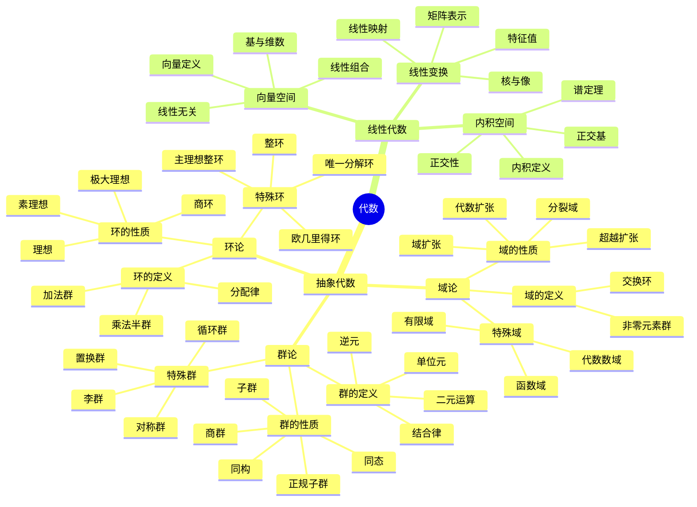

### 2.2 几何分支

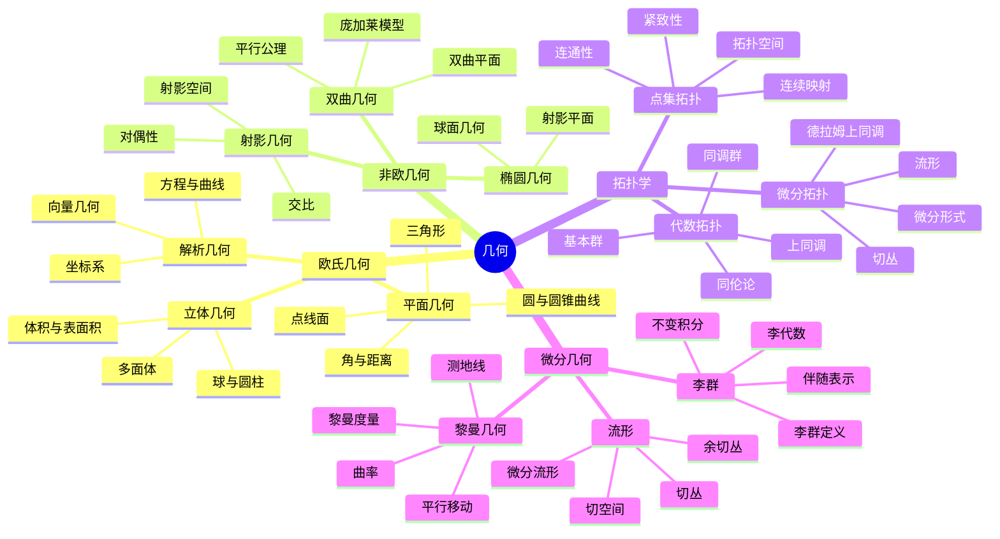

### 2.3 分析分支

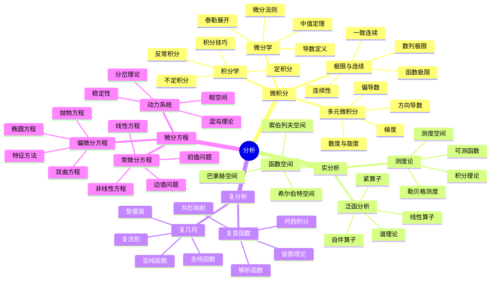

## 3. 应用领域分支

### 3.1 计算机科学应用

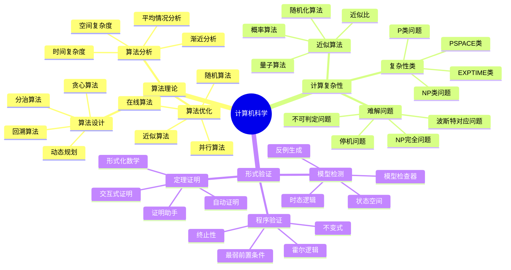

### 3.2 认知科学应用

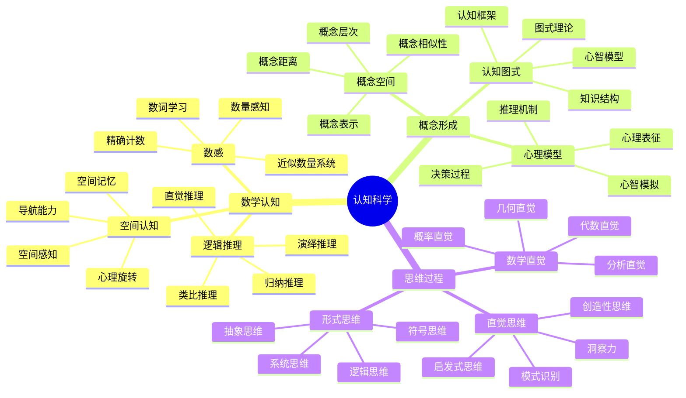

## 4. 跨领域连接

### 4.1 学科交叉图

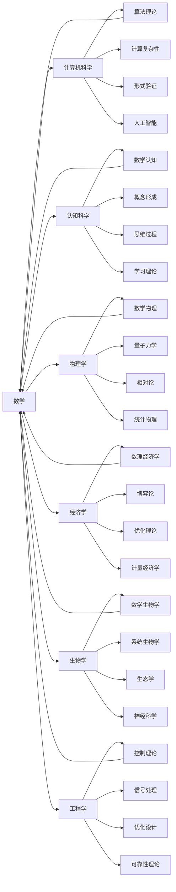

### 4.2 理论连接图

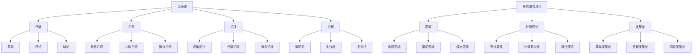

## 5. 学习路径图

### 5.1 基础学习路径

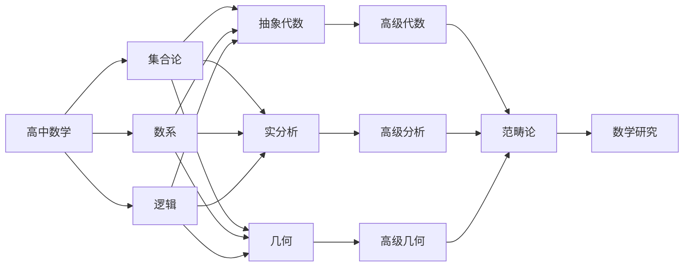

### 5.2 应用学习路径

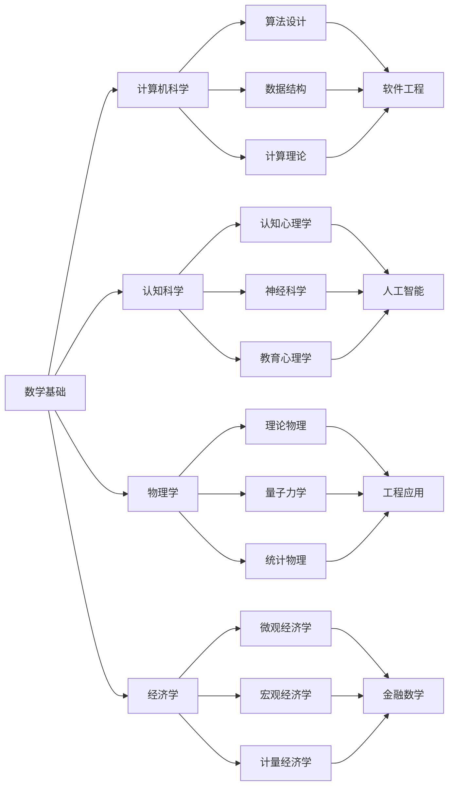

## 6. 理论发展脉络

### 6.1 历史发展时间线

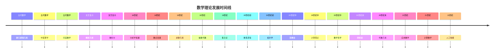

### 6.2 理论演进图

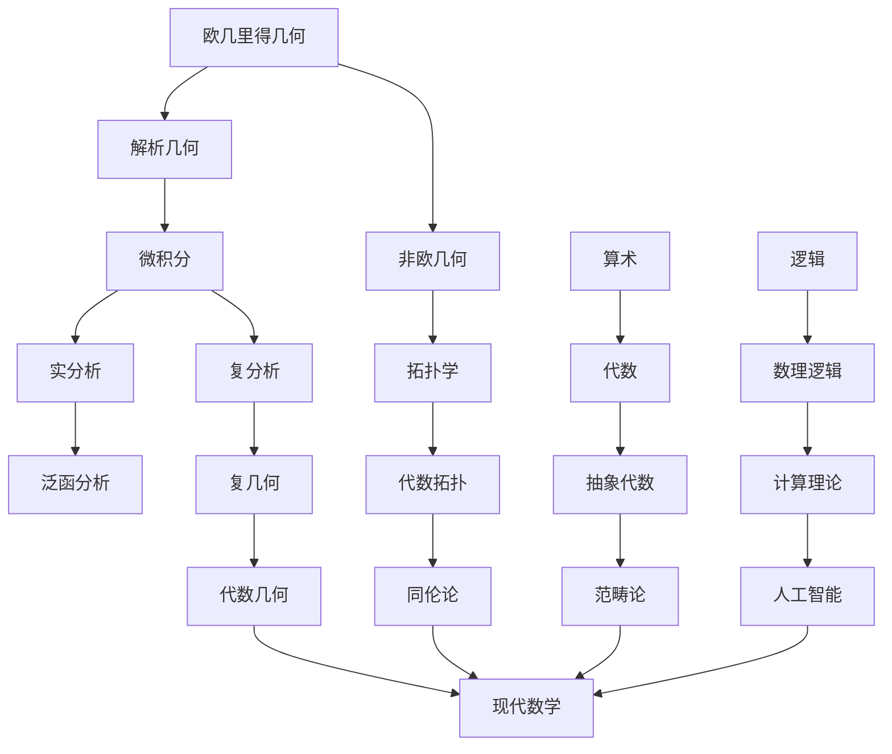

## 7. 数学哲学分支

### 7.1 哲学流派思维导图

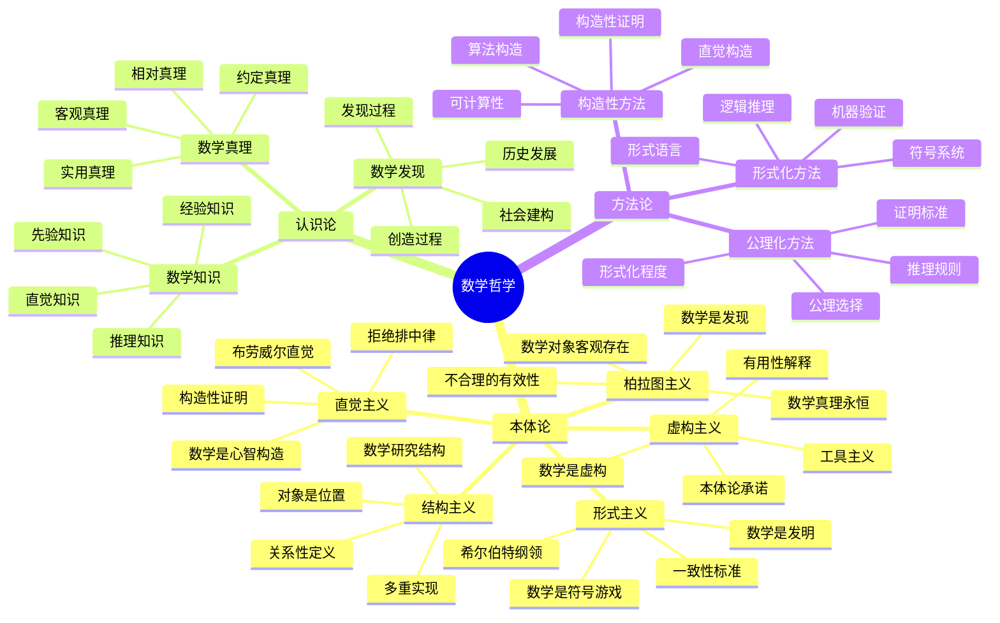

## 8. 数学教育分支

### 8.1 教育理论思维导图

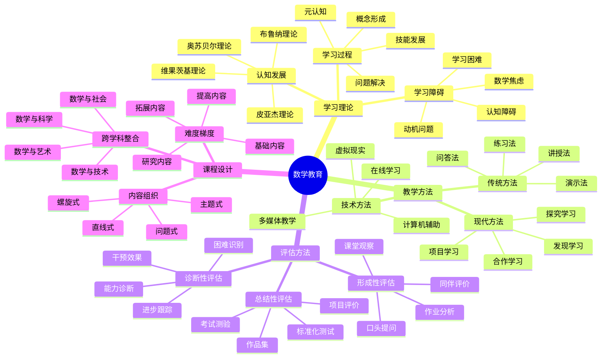

---

**总结**：这个思维导图全面展示了项目数学内容的结构体系，包括基础数学、核心分支、高级理论、元数学和应用领域等各个层面。通过多种图表形式（思维导图、层次结构图、关系图、时间线等），清晰地呈现了数学知识的内在联系和发展脉络，为数学学习和研究提供了系统性的指导框架。
