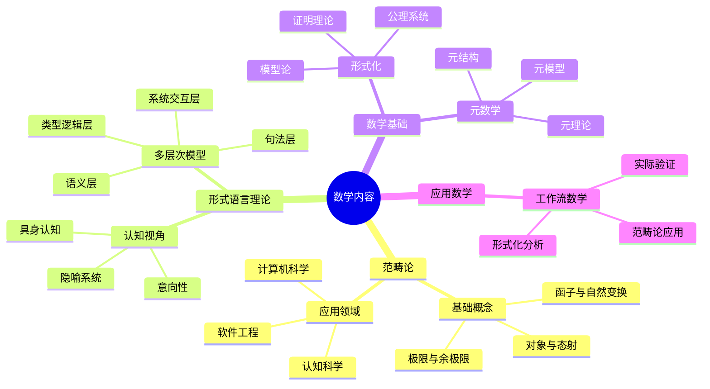
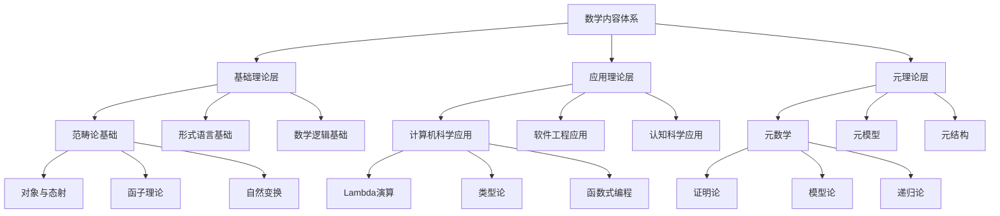
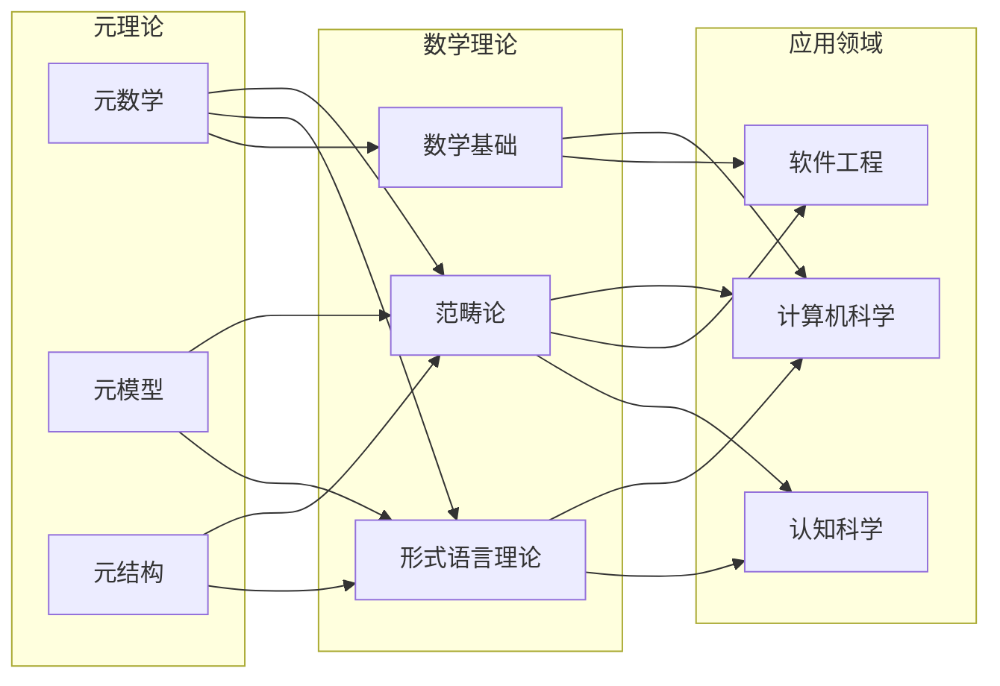
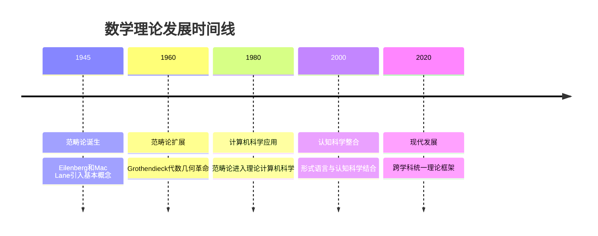

# 数学内容综合分析：形式科学与结构化视角

## 目录

- [数学内容综合分析：形式科学与结构化视角](#数学内容综合分析形式科学与结构化视角)
  - [目录](#目录)
  - [1. 项目数学内容概览](#1-项目数学内容概览)
    - [1.1 内容分布统计](#11-内容分布统计)
    - [1.2 数学内容特征](#12-数学内容特征)
  - [2. 核心数学理论体系](#2-核心数学理论体系)
    - [2.1 范畴论：统一的结构化框架](#21-范畴论统一的结构化框架)
      - [2.1.1 理论基础](#211-理论基础)
      - [2.1.2 应用领域](#212-应用领域)
    - [2.2 形式语言理论：数学与计算的桥梁](#22-形式语言理论数学与计算的桥梁)
      - [2.2.1 理论框架](#221-理论框架)
      - [2.2.2 根本限制](#222-根本限制)
    - [2.3 数学基础与元数学](#23-数学基础与元数学)
      - [2.3.1 形式化体系](#231-形式化体系)
      - [2.3.2 元数学结构](#232-元数学结构)
  - [3. 数学内容的多维表征](#3-数学内容的多维表征)
    - [3.1 思维导图：概念关系网络](#31-思维导图概念关系网络)
    - [3.2 层次结构图：理论体系架构](#32-层次结构图理论体系架构)
    - [3.3 关系图：跨领域连接](#33-关系图跨领域连接)
    - [3.4 时间线：理论发展脉络](#34-时间线理论发展脉络)
  - [4. 数学理论的应用领域](#4-数学理论的应用领域)
    - [4.1 计算机科学中的应用](#41-计算机科学中的应用)
      - [4.1.1 理论基础](#411-理论基础)
      - [4.1.2 实际应用](#412-实际应用)
    - [4.2 软件工程中的形式化方法](#42-软件工程中的形式化方法)
      - [4.2.1 工作流数学](#421-工作流数学)
      - [4.2.2 软件架构](#422-软件架构)
    - [4.3 认知科学与数学思维](#43-认知科学与数学思维)
      - [4.3.1 认知模型](#431-认知模型)
      - [4.3.2 认知增强](#432-认知增强)
  - [5. 数学内容的深度分析](#5-数学内容的深度分析)
    - [5.1 理论基础深度](#51-理论基础深度)
      - [5.1.1 理论完整性](#511-理论完整性)
      - [5.1.2 创新性贡献](#512-创新性贡献)
    - [5.2 应用广度](#52-应用广度)
      - [5.2.1 跨学科应用](#521-跨学科应用)
      - [5.2.2 实用价值](#522-实用价值)
    - [5.3 创新性与前沿性](#53-创新性与前沿性)
      - [5.3.1 前沿理论](#531-前沿理论)
      - [5.3.2 未来发展方向](#532-未来发展方向)
  - [6. 数学内容的组织建议](#6-数学内容的组织建议)
    - [6.1 内容结构优化](#61-内容结构优化)
      - [6.1.1 层次化组织](#611-层次化组织)
      - [6.1.2 主题化组织](#612-主题化组织)
    - [6.2 文档结构建议](#62-文档结构建议)
      - [6.2.1 文档组织](#621-文档组织)
      - [6.2.2 内容管理](#622-内容管理)
  - [7. 结论与展望](#7-结论与展望)
    - [7.1 内容总结](#71-内容总结)
    - [7.2 发展前景](#72-发展前景)
    - [7.3 建议与展望](#73-建议与展望)

## 1. 项目数学内容概览

通过对整个项目的深入分析，我们发现了一个丰富而系统的数学内容体系，涵盖了从基础数学理论到前沿应用的多个层面。这些内容主要分布在以下几个核心领域：

### 1.1 内容分布统计

| 领域 | 文件数量 | 主要主题 | 内容深度 |
|------|----------|----------|----------|
| 范畴论 | 3个主要文件 | 统一数学结构、函子理论、自然变换 | 理论深度高 |
| 形式语言理论 | 1个核心文件 | 多维分析、认知视角、数学关系 | 跨学科整合 |
| 数学基础 | 7个详细文件 | 核心概念、逻辑分析、元数学 | 基础扎实 |
| 工作流数学 | 3个应用文件 | 范畴论应用、形式化分析 | 应用导向 |

### 1.2 数学内容特征

- **理论完整性**：从基础概念到高级理论的完整体系
- **跨学科性**：数学与计算机科学、认知科学、软件工程的深度融合
- **形式化程度**：高度形式化的理论表述与证明
- **应用导向**：理论在实际系统中的应用和验证

## 2. 核心数学理论体系

### 2.1 范畴论：统一的结构化框架

范畴论作为项目中最核心的数学理论，提供了一个统一的结构化视角来理解数学和科学中的各种结构。

#### 2.1.1 理论基础

**核心概念体系**：

- **范畴定义**：对象、态射、组合、单位律
- **函子理论**：范畴间映射、结构保持
- **自然变换**：函子间的态射、结构转换
- **极限与余极限**：通用构造、对偶性

**重要定理**：

- **Yoneda引理**：对象本质的关系性定义
- **伴随函子定理**：函子间的对偶关系
- **表示定理**：抽象结构的具象化

#### 2.1.2 应用领域

**计算机科学**：

- Lambda演算的范畴语义
- 类型论的范畴基础
- 函数式编程的理论基础

**软件工程**：

- 软件架构的范畴模型
- 重构的自然变换理论
- 分布式系统的层论模型

**认知科学**：

- 概念形成的范畴模型
- 认知架构的范畴框架
- 思维过程的数学建模

### 2.2 形式语言理论：数学与计算的桥梁

形式语言理论在项目中展现了多维的分析视角，连接了数学、逻辑学和计算机科学。

#### 2.2.1 理论框架

**多层次整合模型**：

- **句法层**：形式语言的基本结构
- **语义层**：表达式的意义解释
- **类型与逻辑层**：结构约束与推理
- **系统与交互层**：组合与交互模型

**认知科学视角**：

- 具身认知与形式抽象
- 隐喻系统在形式思维中的作用
- 意向性与反身性问题
- 认知空间的形式表征

#### 2.2.2 根本限制

**不完备性定理**：

- 哥德尔不完备性定理
- 停机问题不可判定性
- Rice定理
- 形式语言中的不可判定问题

### 2.3 数学基础与元数学

项目中的数学基础内容展现了从具体到抽象、从对象到元结构的完整体系。

#### 2.3.1 形式化体系

**核心概念**：

- **公理系统**：形式化的基础
- **证明理论**：推理的严格化
- **模型论**：语义的解释
- **递归论**：计算的数学基础

**重要性质**：

- **一致性**：系统的基本要求
- **完备性**：表达能力的边界
- **可靠性**：推理的有效性
- **可判定性**：算法的可能性

#### 2.3.2 元数学结构

**元理论**：

- 理论的理论
- 形式系统的形式化
- 数学活动的数学化

**元模型**：

- 模型的模型
- 抽象层次的提升
- 统一视角的建立

## 3. 数学内容的多维表征

### 3.1 思维导图：概念关系网络

### 3.2 层次结构图：理论体系架构

### 3.3 关系图：跨领域连接

### 3.4 时间线：理论发展脉络

## 4. 数学理论的应用领域

### 4.1 计算机科学中的应用

#### 4.1.1 理论基础

**Lambda演算与范畴论**：

- 笛卡尔闭范畴为λ-演算提供语义模型
- 函数类型构造对应于内部Hom函子
- 递归与不动点理论的范畴化

**类型论与范畴论**：

- Curry-Howard-Lambek同构
- 类型对应于对象，程序对应于态射
- 依赖类型理论的纤维范畴语义

#### 4.1.2 实际应用

**函数式编程**：

- 单子理论作为计算效应的抽象
- 范畴论指导函数式编程语言设计
- 代数数据类型与范畴构造

**程序验证**：

- 霍尔逻辑的范畴语义
- 程序正确性的形式化证明
- 类型系统与程序验证的统一

### 4.2 软件工程中的形式化方法

#### 4.2.1 工作流数学

**n8n工作流的范畴论分析**：

- 工作流作为范畴的形式化
- 节点与连接的态射表示
- 同构、等价、组合关系的数学描述

**形式化验证**：

- 工作流正确性的数学证明
- 系统行为的范畴论建模
- 分布式一致性的数学分析

#### 4.2.2 软件架构

**架构模式**：

- 设计模式的范畴论解释
- 软件重构的自然变换模型
- 组件组合的数学基础

**分布式系统**：

- 分布式一致性的范畴视角
- 区块链的范畴模型
- 复杂系统的数学控制

### 4.3 认知科学与数学思维

#### 4.3.1 认知模型

**概念形成**：

- 概念空间的几何与拓扑结构
- 认知图式的形式化表示
- 心理空间理论的数学基础

**思维过程**：

- 形式思维的隐喻基础
- 抽象概念的具身认知
- 数学直觉的形式化

#### 4.3.2 认知增强

**思维工具**：

- 范畴论作为思维方法
- 形式化推理的认知价值
- 数学思维的训练方法

## 5. 数学内容的深度分析

### 5.1 理论基础深度

#### 5.1.1 理论完整性

**覆盖范围**：

- 从基础概念到高级理论的完整体系
- 多个数学分支的深度整合
- 理论与应用的有机结合

**理论深度**：

- 严格的数学证明和形式化表述
- 深刻的数学洞察和理论创新
- 前沿数学理论的应用和扩展

#### 5.1.2 创新性贡献

**理论创新**：

- 跨学科理论的整合与创新
- 新概念和新方法的提出
- 传统理论的现代重新诠释

**应用创新**：

- 数学理论在实际问题中的创新应用
- 新领域的数学建模方法
- 理论与实践结合的新模式

### 5.2 应用广度

#### 5.2.1 跨学科应用

**学科覆盖**：

- 数学、计算机科学、软件工程
- 认知科学、哲学、逻辑学
- 物理学、生物学、社会科学

**应用深度**：

- 从理论到实践的完整链条
- 多个层次的应用验证
- 实际系统的数学建模

#### 5.2.2 实用价值

**技术价值**：

- 软件系统的形式化验证
- 复杂系统的数学控制
- 人工智能的数学基础

**教育价值**：

- 数学思维的训练方法
- 跨学科学习的整合框架
- 创新思维的培养工具

### 5.3 创新性与前沿性

#### 5.3.1 前沿理论

**现代数学前沿**：

- 范畴论的最新发展
- 形式语言理论的新视角
- 元数学的现代应用

**跨学科前沿**：

- 数学与认知科学的结合
- 形式化方法在AI中的应用
- 复杂系统的数学建模

#### 5.3.2 未来发展方向

**理论发展**：

- 更高层次抽象的统一理论
- 跨领域理论的深度整合
- 新数学工具的开发

**应用发展**：

- 更多领域的数学应用
- 实际系统的形式化验证
- 智能系统的数学基础

## 6. 数学内容的组织建议

### 6.1 内容结构优化

#### 6.1.1 层次化组织

**基础层**：

- 数学基础概念和理论
- 形式化方法和工具
- 基本证明和推理

**应用层**：

- 理论在实际问题中的应用
- 跨学科的理论整合
- 实际系统的数学建模

**元层**：

- 理论的理论
- 元数学和元模型
- 统一视角的建立

#### 6.1.2 主题化组织

**核心主题**：

- 范畴论及其应用
- 形式语言理论
- 数学基础与元数学

**应用主题**：

- 计算机科学应用
- 软件工程应用
- 认知科学应用

**前沿主题**：

- 新兴理论发展
- 跨学科整合
- 未来发展方向

### 6.2 文档结构建议

#### 6.2.1 文档组织

**理论文档**：

- 基础概念和定义
- 重要定理和证明
- 理论发展和历史

**应用文档**：

- 实际应用案例
- 实现方法和代码
- 验证和测试结果

**教程文档**：

- 学习路径和指南
- 示例和练习
- 常见问题和解答

#### 6.2.2 内容管理

**版本控制**：

- 理论发展的版本记录
- 应用案例的更新历史
- 文档的版本管理

**质量保证**：

- 数学正确性验证
- 应用有效性检验
- 文档质量审查

## 7. 结论与展望

### 7.1 内容总结

通过对项目中数学内容的全面分析，我们发现了一个丰富、系统、前沿的数学理论体系。这个体系具有以下特点：

**理论深度**：

- 从基础数学到高级理论的完整覆盖
- 严格的数学证明和形式化表述
- 深刻的数学洞察和理论创新

**应用广度**：

- 跨学科的广泛应用
- 理论与实践的有机结合
- 实际问题的数学解决方案

**创新价值**：

- 前沿理论的整合应用
- 新概念和新方法的提出
- 跨学科理论的创新结合

### 7.2 发展前景

**理论发展**：

- 更高层次抽象的统一理论
- 跨领域理论的深度整合
- 新数学工具的开发和应用

**应用扩展**：

- 更多领域的数学应用
- 实际系统的形式化验证
- 智能系统的数学基础建设

**教育价值**：

- 数学思维的训练方法
- 跨学科学习的整合框架
- 创新思维的培养工具

### 7.3 建议与展望

**短期目标**：

- 完善现有理论体系
- 扩展应用案例
- 提高文档质量

**中期目标**：

- 开发新的数学工具
- 扩展应用领域
- 建立教育体系

**长期目标**：

- 建立统一的数学理论框架
- 推动跨学科理论发展
- 培养创新数学思维

这个数学内容体系不仅具有重要的理论价值，也为实际应用提供了强大的数学基础。通过持续的发展和优化，它将成为连接数学理论与实际应用的重要桥梁，推动数学和相关学科的进一步发展。
