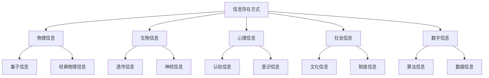
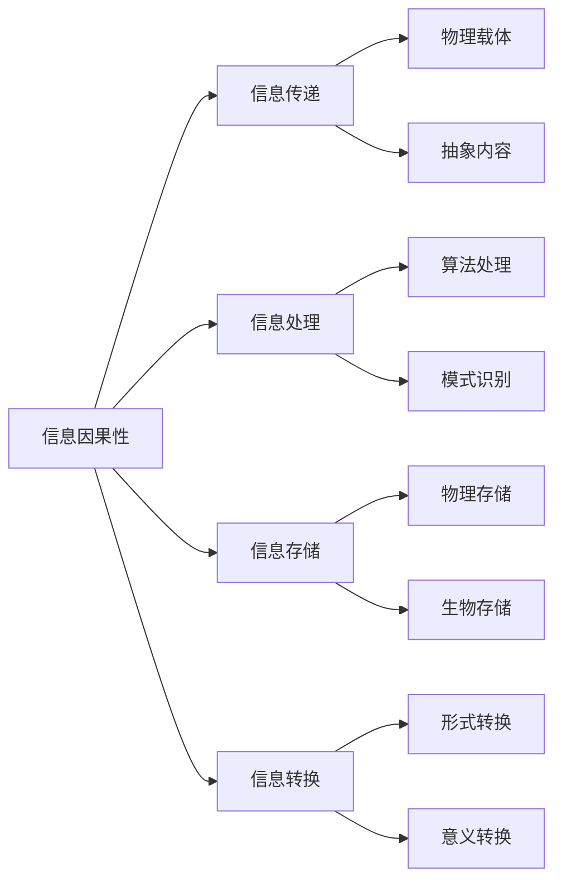
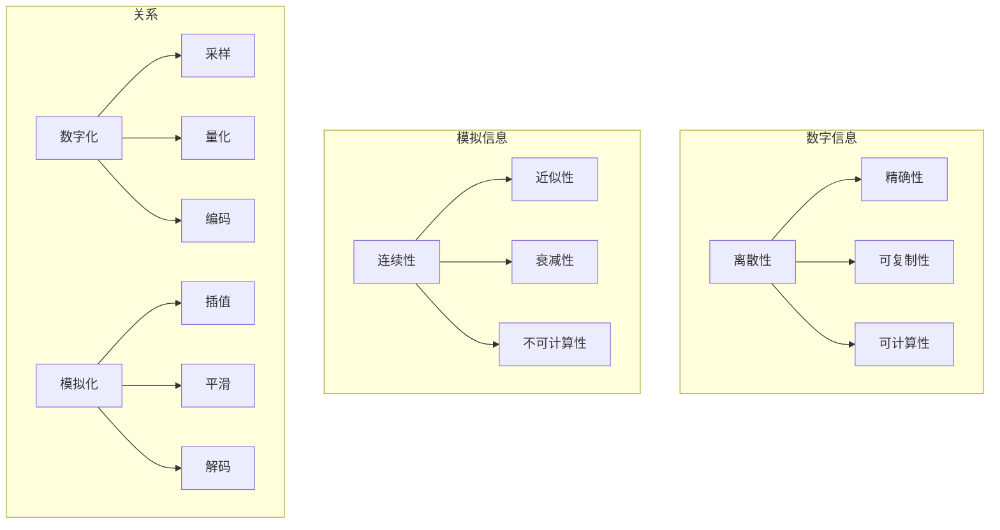

# 信息本体论分析

## 目录

1. [概述](#概述)
2. [信息本体论的基本问题](#信息本体论的基本问题)
3. [主要理论立场](#主要理论立场)
4. [信息作为基础实在](#信息作为基础实在)
5. [信息与物质的关系](#信息与物质的关系)
6. [数字信息的本体论地位](#数字信息的本体论地位)
7. [信息实在论的批判分析](#信息实在论的批判分析)
8. [形式化表达](#形式化表达)
9. [应用与影响](#应用与影响)
10. [未来发展趋势](#未来发展趋势)

## 概述

信息本体论是当代哲学中一个新兴而重要的领域，它探讨信息的本质、存在方式和在实在结构中的地位。随着信息技术的快速发展，信息本体论不仅具有重要的理论意义，也对理解现代社会的本质产生了深远影响。

### 核心问题

- 信息是否具有独立的本体论地位？
- 信息与物质、能量的关系如何？
- 数字信息是否构成新的实在层次？
- 信息是否可以作为解释世界的基础？

## 信息本体论的基本问题

### 1. 信息的定义问题

**传统定义**：

- 信息是减少不确定性的量度
- 信息是消息的内容和意义
- 信息是知识的载体

**本体论定义**：

- 信息是实在的基本构成要素
- 信息是宇宙的基本属性
- 信息是解释一切现象的基础

### 2. 信息的存在方式



### 3. 信息的层次结构

| 层次 | 信息类型 | 特征 | 本体论地位 |
|------|----------|------|------------|
| **物理层** | 量子信息、经典信息 | 客观性、可测量性 | 基础实在 |
| **生物层** | 遗传信息、神经信息 | 功能性、目的性 | 涌现实在 |
| **心理层** | 认知信息、意识信息 | 主观性、意向性 | 主观实在 |
| **社会层** | 文化信息、制度信息 | 集体性、规范性 | 社会实在 |
| **数字层** | 算法信息、数据信息 | 抽象性、可计算性 | 虚拟实在 |

## 主要理论立场

### 1. 信息实在论 (Information Realism)

**核心主张**：

- 信息是客观存在的实体
- 信息具有独立的本体论地位
- 信息是解释世界的基本要素

**代表人物**：

- 弗雷德金 (Edward Fredkin)
- 惠勒 (John Wheeler)
- 蔡廷 (Gregory Chaitin)

**形式化表达**：

```rust
struct InformationRealism {
    information_entities: Vec<InformationEntity>,
    ontological_status: OntologicalStatus,
    explanatory_power: ExplanatoryPower
}

enum OntologicalStatus {
    Fundamental,    // 基础实在
    Emergent,       // 涌现实在
    Dependent       // 依赖实在
}

impl InformationRealism {
    fn is_fundamental(&self) -> bool {
        matches!(self.ontological_status, OntologicalStatus::Fundamental)
    }
    
    fn can_explain_world(&self) -> bool {
        self.explanatory_power > 0.8
    }
}
```

### 2. 信息建构论 (Information Constructivism)

**核心主张**：

- 信息是社会建构的产物
- 信息依赖于观察者和解释框架
- 信息不具有独立的本体论地位

**批判分析**：

- 过度强调主观性，忽视客观基础
- 难以解释信息的普遍性和规律性
- 可能导致相对主义和怀疑论

### 3. 信息功能论 (Information Functionalism)

**核心主张**：

- 信息由其功能角色定义
- 信息是系统行为的模式
- 信息具有多重可实现性

**优势**：

- 避免了还原论的困难
- 强调了信息的系统性特征
- 与认知科学兼容

**局限**：

- 可能忽视信息的物理基础
- 功能定义可能过于宽泛
- 难以区分信息与其他功能状态

## 信息作为基础实在

### 1. 宇宙是信息的观点

**"It from Bit" 假说**：

- 约翰·惠勒提出的著名假说
- 认为宇宙的基本构成是信息比特
- 物理实在从信息中涌现

**形式化表达**：

```rust
struct ItFromBitHypothesis {
    universe: Universe,
    information_bits: Vec<InformationBit>,
    emergence_relation: EmergenceRelation
}

struct InformationBit {
    value: BitValue,
    position: Position,
    context: Context
}

enum BitValue {
    Zero,
    One,
    Superposition
}

impl ItFromBitHypothesis {
    fn universe_from_bits(&self) -> Universe {
        // 从信息比特构建宇宙
        Universe::from_information_bits(&self.information_bits)
    }
    
    fn bits_from_universe(&self) -> Vec<InformationBit> {
        // 从宇宙提取信息比特
        self.universe.extract_information_bits()
    }
}
```

### 2. 数字物理学

**核心思想**：

- 宇宙是巨大的数字计算机
- 物理规律是计算规则
- 时空是计算的结果

**批判分析**：

**支持论证**：

- 量子力学的不确定性
- 计算宇宙假说的数学一致性
- 信息处理在自然界的普遍性

**反对论证**：

- 缺乏直接的经验证据
- 计算隐喻可能误导
- 难以解释意识的质性特征

### 3. 信息因果性



## 信息与物质的关系

### 1. 传统观点

**物质优先论**：

- 物质是基础，信息是派生的
- 信息依赖于物质载体
- 信息不具有独立存在

**信息优先论**：

- 信息是基础，物质是信息的实现
- 物质是信息的特殊形式
- 信息可以独立于特定物质载体

### 2. 当代观点

**互补论**：

- 物质和信息是互补的
- 两者都不能完全还原为对方
- 需要整体性理解

**涌现论**：

- 信息从物质系统中涌现
- 涌现的信息具有新的性质
- 涌现是层次性的

### 3. 批判性分析

| 观点 | 优势 | 局限 | 适用性 |
|------|------|------|--------|
| **物质优先论** | 符合直觉、经验支持 | 难以解释抽象信息 | 经典物理领域 |
| **信息优先论** | 解释力强、统一性好 | 缺乏直接证据 | 量子信息领域 |
| **互补论** | 避免极端、包容性强 | 可能模糊不清 | 跨学科研究 |
| **涌现论** | 解释层次性、动态性 | 机制不明确 | 复杂系统研究 |

## 数字信息的本体论地位

### 1. 数字信息的特征

**抽象性**：

- 独立于物理载体
- 可无限复制
- 可精确传输

**可计算性**：

- 可被算法处理
- 具有形式结构
- 支持自动化操作

**虚拟性**：

- 存在于虚拟空间
- 具有虚拟实在性
- 影响现实世界

### 2. 数字实在论

**核心主张**：

- 数字信息构成新的实在层次
- 数字实在具有客观性
- 数字实在影响物理实在

**形式化表达**：

```rust
struct DigitalRealism {
    digital_entities: Vec<DigitalEntity>,
    virtual_space: VirtualSpace,
    reality_interface: RealityInterface
}

struct DigitalEntity {
    id: DigitalId,
    content: Content,
    structure: Structure,
    behavior: Behavior
}

impl DigitalRealism {
    fn digital_to_physical(&self, digital_entity: &DigitalEntity) -> PhysicalEffect {
        // 数字实体对物理世界的影响
        self.reality_interface.translate_to_physical(digital_entity)
    }
    
    fn physical_to_digital(&self, physical_event: &PhysicalEvent) -> DigitalRepresentation {
        // 物理事件在数字世界的表示
        self.reality_interface.translate_to_digital(physical_event)
    }
}
```

### 3. 数字与模拟的对比



## 信息实在论的批判分析

### 1. 理论优势

**解释力**：

- 统一解释不同领域的现象
- 提供简洁的理论框架
- 与现代科学兼容

**预测力**：

- 预测信息技术的应用
- 指导科学研究方向
- 启发新的技术发展

**实用性**：

- 指导信息系统的设计
- 支持人工智能的发展
- 促进跨学科研究

### 2. 理论局限

**概念模糊性**：

- "信息"概念过于宽泛
- 缺乏精确的定义标准
- 难以区分不同类型的信息

**经验证据不足**：

- 缺乏直接的经验验证
- 依赖于间接推理
- 难以进行实验检验

**还原论倾向**：

- 可能过度简化复杂现象
- 忽视其他重要因素
- 导致机械论理解

### 3. 替代方案

**多元实在论**：

- 承认多种实在层次
- 避免单一基础主义
- 强调层次间的关系

**过程实在论**：

- 强调实在的动态性
- 关注信息的变化过程
- 避免静态的实体观

**关系实在论**：

- 强调关系的重要性
- 避免孤立的实体观
- 关注系统的整体性

## 形式化表达

### 1. 信息理论的形式化

```rust
struct InformationTheory {
    entropy: Entropy,
    mutual_information: MutualInformation,
    channel_capacity: ChannelCapacity
}

struct Entropy {
    probability_distribution: Vec<f64>,
    base: f64
}

impl Entropy {
    fn calculate(&self) -> f64 {
        -self.probability_distribution.iter()
            .filter(|&p| *p > 0.0)
            .map(|p| p * p.log(self.base))
            .sum::<f64>()
    }
}

struct MutualInformation {
    joint_distribution: Vec<Vec<f64>>,
    marginal_distributions: Vec<Vec<f64>>
}

impl MutualInformation {
    fn calculate(&self) -> f64 {
        // 计算互信息
        let joint_entropy = self.calculate_joint_entropy();
        let marginal_entropies: f64 = self.marginal_distributions.iter()
            .map(|dist| Entropy::new(dist.clone(), 2.0).calculate())
            .sum();
        marginal_entropies - joint_entropy
    }
}
```

### 2. 信息本体论的形式化

```rust
struct InformationOntology {
    entities: Vec<InformationEntity>,
    relations: Vec<InformationRelation>,
    laws: Vec<InformationLaw>
}

struct InformationEntity {
    id: EntityId,
    type_: EntityType,
    properties: Vec<Property>,
    behavior: Behavior
}

enum EntityType {
    Physical,
    Biological,
    Psychological,
    Social,
    Digital
}

struct InformationRelation {
    source: EntityId,
    target: EntityId,
    relation_type: RelationType,
    strength: f64
}

enum RelationType {
    Causation,
    Constitution,
    Dependence,
    Emergence,
    Computation
}
```

### 3. 信息处理的算法模型

```rust
struct InformationProcessor {
    input: InformationStream,
    algorithm: Algorithm,
    output: InformationStream
}

struct Algorithm {
    steps: Vec<ProcessingStep>,
    complexity: Complexity,
    correctness: Correctness
}

impl InformationProcessor {
    fn process(&mut self) -> Result<InformationStream, ProcessingError> {
        let mut current_state = self.input.clone();
        
        for step in &self.algorithm.steps {
            current_state = step.apply(&current_state)?;
        }
        
        self.output = current_state;
        Ok(self.output.clone())
    }
    
    fn verify_correctness(&self) -> CorrectnessResult {
        // 验证处理结果的正确性
        self.algorithm.correctness.verify(&self.input, &self.output)
    }
}
```

## 应用与影响

### 1. 科学应用

**物理学**：

- 量子信息理论
- 黑洞信息悖论
- 宇宙信息论

**生物学**：

- 遗传信息处理
- 神经信息编码
- 生物信息学

**认知科学**：

- 认知信息处理
- 意识的信息理论
- 人工智能基础

### 2. 技术应用

**信息技术**：

- 信息系统的设计
- 数据科学的基础
- 网络架构的优化

**人工智能**：

- 机器学习算法
- 知识表示方法
- 智能系统设计

**通信技术**：

- 信息传输理论
- 编码解码技术
- 网络安全保障

### 3. 哲学影响

**认识论影响**：

- 重新定义知识概念
- 改变真理理论
- 影响确证方法

**伦理学影响**：

- 信息伦理问题
- 数字权利概念
- 隐私保护理论

**社会哲学影响**：

- 信息社会的理解
- 数字民主理论
- 网络治理哲学

## 未来发展趋势

### 1. 理论发展

**统一理论**：

- 信息与其他基本概念的统一
- 跨学科的信息理论
- 信息实在论的完善

**新概念**：

- 量子信息的新理解
- 生物信息的新理论
- 社会信息的新模型

**方法论**：

- 信息分析的新方法
- 形式化表达的新技术
- 实验验证的新途径

### 2. 技术发展

**量子信息**：

- 量子计算的发展
- 量子通信的应用
- 量子密码的实现

**生物信息**：

- 基因编辑技术
- 脑机接口发展
- 生物计算实现

**人工智能**：

- 强人工智能的探索
- 意识模拟的研究
- 智能系统的进化

### 3. 社会影响

**信息社会**：

- 数字化程度的加深
- 信息经济的成熟
- 数字文化的形成

**治理模式**：

- 数字治理的发展
- 网络民主的实现
- 全球治理的变革

**人类发展**：

- 认知能力的增强
- 社会关系的重构
- 文明形态的演进

## 总结

信息本体论作为当代哲学的重要分支，不仅具有深远的理论意义，也对理解现代社会的本质产生了重要影响。通过批判性分析，我们可以看到信息实在论既有其理论优势，也存在概念模糊性和经验证据不足等局限。

未来的发展需要在保持理论深度的同时，加强经验验证和概念精确化，推动信息本体论与其他哲学分支的对话和融合，为理解信息时代的本质提供更加完善的理论框架。

---

*本文档通过多种表征方式（图表、表格、形式化表达）展现了信息本体论的丰富内涵，并进行了批判性分析，避免了简单的正反合辩证法，为深入理解信息的本体论地位提供了全面的视角。*
