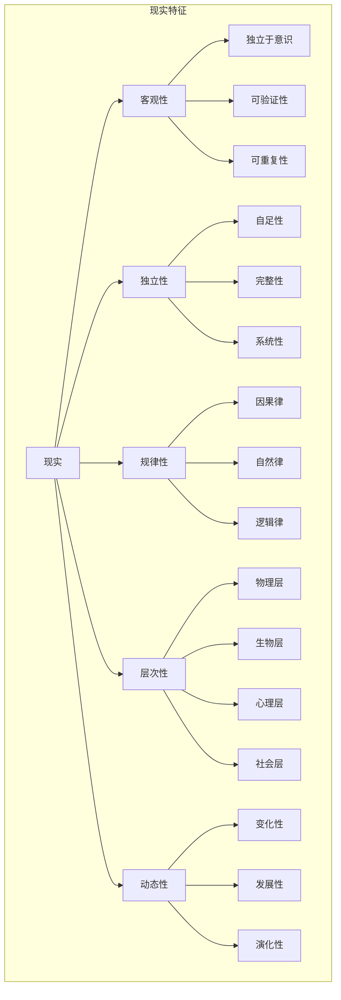
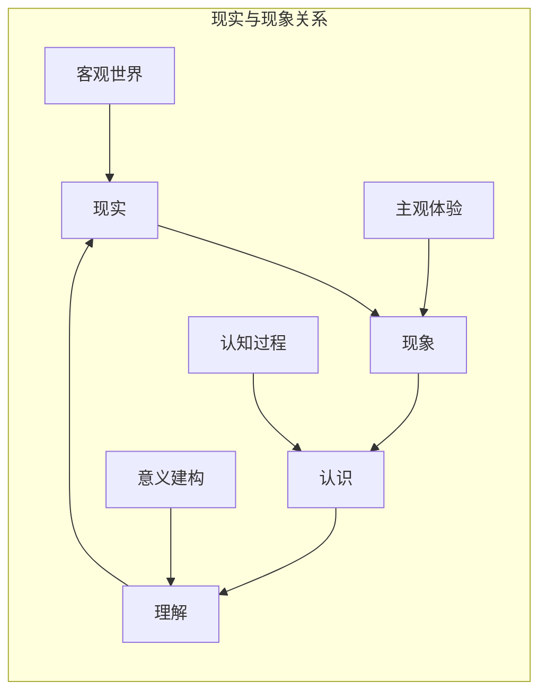
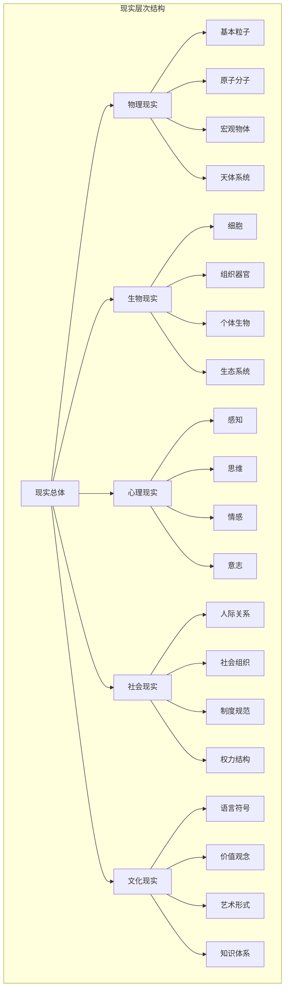

# 现实本体论分析

## 目录

1. [概述](#概述)
2. [现实的概念分析](#现实的概念分析)
3. [现实的存在方式](#现实的存在方式)
4. [现实与现象的关系](#现实与现象的关系)
5. [现实的结构分析](#现实的结构分析)
6. [现实的认识论问题](#现实的认识论问题)
7. [现实的价值论问题](#现实的价值论问题)
8. [现实本体论的批判性分析](#现实本体论的批判性分析)
9. [现代技术对现实概念的影响](#现代技术对现实概念的影响)
10. [现实本体论的发展趋势](#现实本体论的发展趋势)
11. [总结](#总结)

## 概述

现实本体论是哲学中关于"现实"这一基本概念的本体论研究。它探讨什么是真实的、什么是存在的，以及现实与表象、现象之间的关系。在当代哲学中，现实本体论面临着来自科学、技术、认知科学等多方面的挑战和重新审视。

## 现实的概念分析

### 1. 现实的定义

**传统定义**：

- 现实是独立于意识而存在的客观世界
- 现实是可以通过感官直接感知的世界
- 现实是符合逻辑和因果律的世界

**现代定义**：

- 现实是可以通过科学方法验证的世界
- 现实是包含物理、心理、社会等多层次的世界
- 现实是动态变化和发展的世界

### 2. 现实的特征



### 3. 现实与相关概念的关系

| 概念 | 定义 | 与现实的关系 | 特征 |
|------|------|-------------|------|
| **存在** | 一切存在的事物 | 现实是存在的具体表现 | 抽象性、普遍性 |
| **实在** | 真实存在的事物 | 现实是实在的集合 | 具体性、多样性 |
| **现象** | 显现出来的事物 | 现象是现实的显现 | 主观性、相对性 |
| **表象** | 表现出来的事物 | 表象是现实的表现 | 中介性、工具性 |

## 现实的存在方式

### 1. 物理现实

**定义**：

- 由物质和能量构成的世界
- 遵循物理定律的客观存在
- 可以通过科学方法研究的对象

**特征**：

```rust
struct PhysicalReality {
    matter: Matter,
    energy: Energy,
    spacetime: Spacetime,
    laws: PhysicalLaws
}

impl PhysicalReality {
    fn is_observable(&self) -> bool {
        // 物理现实是可观察的
        true
    }
    
    fn follows_laws(&self) -> bool {
        // 物理现实遵循自然定律
        self.laws.are_consistent()
    }
    
    fn is_measurable(&self) -> bool {
        // 物理现实是可测量的
        true
    }
}
```

### 2. 心理现实

**定义**：

- 由意识、思维、情感构成的世界
- 主观体验和内心状态
- 个体独特的心理世界

**特征**：

```rust
struct MentalReality {
    consciousness: Consciousness,
    thoughts: Vec<Thought>,
    emotions: Vec<Emotion>,
    experiences: Vec<Experience>
}

impl MentalReality {
    fn is_subjective(&self) -> bool {
        // 心理现实是主观的
        true
    }
    
    fn is_private(&self) -> bool {
        // 心理现实是私人的
        true
    }
    
    fn is_accessible(&self) -> bool {
        // 心理现实只能通过内省访问
        false
    }
}
```

### 3. 社会现实

**定义**：

- 由社会关系、制度、文化构成的世界
- 人类共同创造的社会世界
- 集体认同和共享的意义世界

**特征**：

```rust
struct SocialReality {
    institutions: Vec<Institution>,
    relationships: Vec<Relationship>,
    culture: Culture,
    norms: Vec<Norm>
}

impl SocialReality {
    fn is_constructed(&self) -> bool {
        // 社会现实是建构的
        true
    }
    
    fn is_shared(&self) -> bool {
        // 社会现实是共享的
        true
    }
    
    fn is_changeable(&self) -> bool {
        // 社会现实是可变的
        true
    }
}
```

## 现实与现象的关系

### 1. 传统观点

**实在论观点**：

- 现实是独立于现象的存在
- 现象是现实的反映或表现
- 现实是现象的基础和原因

**现象学观点**：

- 现象是直接给予的
- 现实通过现象显现
- 现象学还原是认识现实的方法

### 2. 关系分析



### 3. 批判性分析

-**问题1：现象与现实的同一性问题**

- 现象是否等同于现实？
- 是否存在独立于现象的现实？
- 如何区分真实现象与虚假现象？

-**问题2：现象的中介性问题**

- 现象是否是认识现实的中介？
- 中介是否会影响对现实的认识？
- 如何保证中介的可靠性？

-**问题3：现象的相对性问题**

- 不同主体对同一现实的现象是否相同？
- 现象的相对性是否影响现实的客观性？
- 如何协调现象的相对性与现实的客观性？

## 现实的结构分析

### 1. 层次结构



### 2. 关系结构

**因果关系**：

- 现实中的因果链条
- 因果关系的复杂性
- 因果解释的局限性

**逻辑关系**：

- 现实中的逻辑结构
- 逻辑与现实的对应
- 逻辑分析的适用性

**价值关系**：

- 现实中的价值结构
- 价值与事实的关系
- 价值判断的客观性

### 3. 动态结构

**变化性**：

- 现实的持续变化
- 变化的规律性
- 变化的不可逆性

**发展性**：

- 现实的定向发展
- 发展的阶段性
- 发展的方向性

**演化性**：

- 现实的演化过程
- 演化的机制
- 演化的结果

## 现实的认识论问题

### 1. 现实的可认识性

**乐观主义**：

- 现实是可以完全认识的
- 科学方法是认识现实的有效工具
- 认识是一个渐进的过程

**怀疑主义**：

- 现实的认识存在根本限制
- 感官和理性的局限性
- 认识的相对性和不确定性

**批判性分析**：

```rust
struct EpistemologicalAnalysis {
    knowability: Knowability,
    methods: Vec<Method>,
    limitations: Vec<Limitation>
}

enum Knowability {
    FullyKnowable,    // 完全可认识
    PartiallyKnowable, // 部分可认识
    Unknowable        // 不可认识
}

impl EpistemologicalAnalysis {
    fn assess_knowability(&self, reality: &Reality) -> Knowability {
        // 评估现实的可认识性
        if self.methods.are_sufficient(reality) {
            Knowability::FullyKnowable
        } else if self.methods.are_partial(reality) {
            Knowability::PartiallyKnowable
        } else {
            Knowability::Unknowable
        }
    }
}
```

### 2. 认识方法的问题

**科学方法**：

- 观察和实验
- 假设和验证
- 理论和模型

**哲学方法**：

- 概念分析
- 逻辑推理
- 现象学方法

**批判性方法**：

- 怀疑和质疑
- 反思和批判
- 对话和讨论

### 3. 认识结果的问题

**客观性问题**：

- 认识结果是否客观？
- 如何保证认识的客观性？
- 客观性与主观性的关系

**真理性问题**：

- 认识结果是否为真？
- 真理的标准是什么？
- 真理与现实的对应关系

**实用性问题**：

- 认识结果是否有用？
- 有用性与真理性的关系
- 实用标准的合理性

## 现实的价值论问题

### 1. 现实的价值性

**内在价值**：

- 现实本身具有价值
- 价值是现实的属性
- 价值是客观存在的

**工具价值**：

- 现实作为实现目的的工具
- 价值依赖于主体的需要
- 价值是主观赋予的

**关系价值**：

- 价值存在于主体与客体的关系中
- 价值是动态变化的
- 价值具有历史性

### 2. 价值判断的问题

**客观性问题**：

- 价值判断是否客观？
- 客观价值是否存在？
- 价值客观性的基础

**相对性问题**：

- 价值判断是否相对？
- 相对性的程度和范围
- 相对性与普遍性的关系

**合理性问题**：

- 价值判断是否合理？
- 合理性的标准
- 合理性论证的方法

### 3. 价值冲突的问题

**价值冲突的类型**：

- 不同价值之间的冲突
- 同一价值在不同情况下的冲突
- 价值与事实之间的冲突

**价值冲突的解决**：

- 价值排序的方法
- 价值权衡的原则
- 价值妥协的策略

## 现实本体论的批判性分析

### 1. 传统现实观的批判

-**问题1：现实观的简化**

- 传统现实观过于简化
- 忽视了现实的复杂性
- 缺乏对现实多样性的认识

-**问题2：现实观的静态性**

- 传统现实观是静态的
- 忽视了现实的动态性
- 缺乏对现实变化的认识

-**问题3：现实观的绝对性**

- 传统现实观是绝对的
- 忽视了现实的相对性
- 缺乏对现实条件性的认识

### 2. 现代现实观的批判

-**问题1：科学主义的局限**

- 科学主义过于强调科学方法
- 忽视了其他认识方式
- 缺乏对科学局限性的认识

-**问题2：建构主义的极端**

- 建构主义过于强调社会建构
- 忽视了现实的客观性
- 缺乏对建构基础的反思

-**问题3：相对主义的困境**

- 相对主义过于强调相对性
- 忽视了普遍性的一面
- 缺乏对相对性限度的认识

### 3. 批判性反思

-**反思1：现实概念的复杂性**

- 现实概念本身是复杂的
- 需要多角度、多层次的理解
- 不能简单化处理

-**反思2：认识方法的多样性**

- 需要多种认识方法
- 不同方法各有优缺点
- 需要方法的综合运用

-**反思3：价值判断的复杂性**

- 价值判断涉及多个方面
- 需要综合考虑各种因素
- 不能简单化处理

## 现代技术对现实概念的影响

### 1. 虚拟现实技术

-**影响1：现实边界的模糊**

- 虚拟现实模糊了现实与虚拟的边界
- 挑战了传统的现实概念
- 提出了新的本体论问题

-**影响2：现实体验的扩展**

- 虚拟现实扩展了人类的现实体验
- 提供了新的认识方式
- 改变了现实的概念

-**影响3：现实建构的可能性**

- 虚拟现实显示了现实建构的可能性
- 挑战了现实的客观性
- 提出了建构主义的问题

### 2. 人工智能技术

-**影响1：智能的重新定义**

- 人工智能挑战了智能的传统定义
- 提出了智能的本质问题
- 影响了现实的概念

-**影响2：意识的重新理解**

- 人工智能挑战了意识的传统理解
- 提出了意识与智能的关系问题
- 影响了心理现实的概念

-**影响3：现实的智能化**

- 人工智能使现实更加智能化
- 改变了现实的结构
- 提出了新的现实问题

### 3. 网络技术

-**影响1：现实的空间扩展**

- 网络技术扩展了现实的空间
- 创造了新的现实空间
- 改变了空间的概念

-**影响2：现实的时间压缩**

- 网络技术压缩了现实的时间
- 改变了时间的体验
- 影响了时间的概念

-**影响3：现实的全球化**

- 网络技术使现实更加全球化
- 改变了现实的规模
- 提出了全球现实的问题

## 现实本体论的发展趋势

### 1. 理论发展趋势

-**趋势1：多元主义**

- 承认现实的多元性
- 接受不同的现实观
- 强调包容性和开放性

-**趋势2：动态主义**

- 强调现实的动态性
- 关注现实的变化和发展
- 重视过程的视角

-**趋势3：关系主义**

- 强调现实的关系性
- 关注现实中的各种关系
- 重视整体性的视角

### 2. 方法发展趋势

-**趋势1：跨学科方法**

- 结合不同学科的方法
- 强调方法的综合运用
- 重视跨学科的视角

-**趋势2：技术化方法**

- 利用现代技术的方法
- 强调技术的工具作用
- 重视技术的影响

-**趋势3：实践化方法**

- 强调实践的方法
- 关注实际应用
- 重视实践的效果

### 3. 应用发展趋势

-**趋势1：实用化**

- 强调理论的实用性
- 关注实际应用
- 重视实践效果

-**趋势2：全球化**

- 关注全球性问题
- 强调全球视角
- 重视国际合作

-**趋势3：人文化**

- 强调人文关怀
- 关注人的价值
- 重视人的发展

## 总结

现实本体论作为哲学的基础理论，面临着来自多方面的挑战和重新审视。传统的现实观需要根据现代科学、技术和社会的发展进行批判性反思和重新建构。

主要观点：

1. **现实的复杂性**：现实是一个复杂的多层次系统，需要多角度、多方法的认识。

2. **认识的局限性**：对现实的认识存在根本的局限性，需要保持开放和批判的态度。

3. **价值的多元性**：现实的价值是多元的，需要综合考虑各种价值因素。

4. **技术的深刻影响**：现代技术对现实概念产生了深刻影响，需要认真对待这些影响。

5. **发展的动态性**：现实本体论本身也在不断发展，需要保持开放和发展的态度。

现实本体论的研究不仅具有重要的理论意义，也具有重要的实践意义。它为我们理解世界、认识自我、指导实践提供了重要的理论基础。
