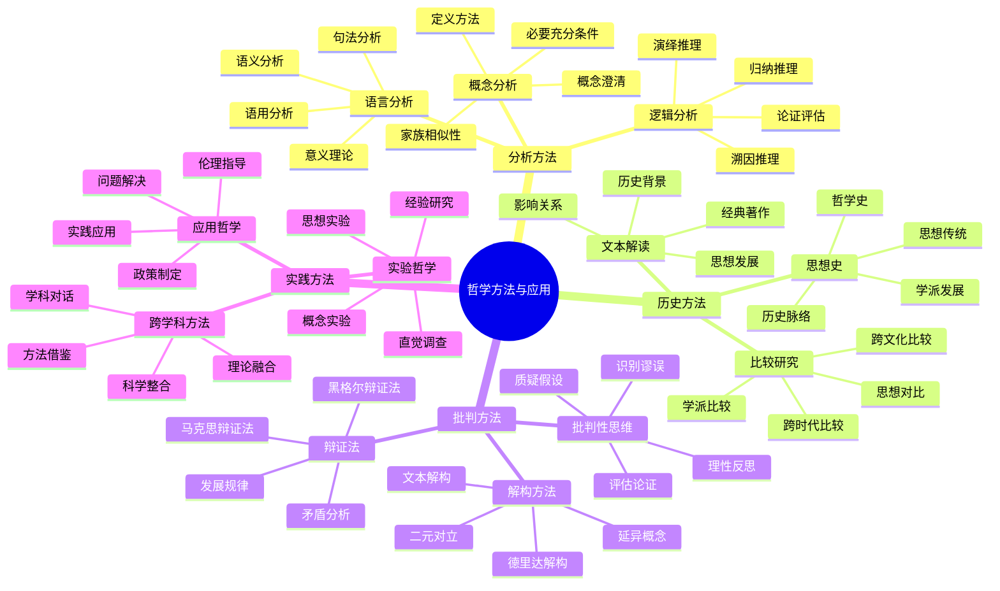
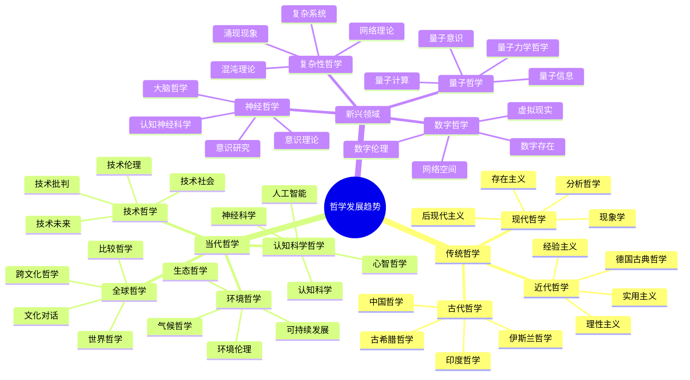
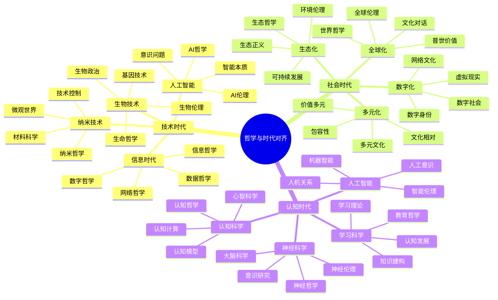
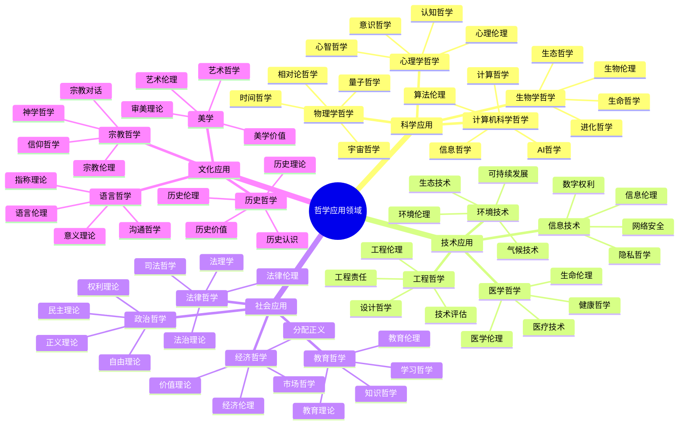
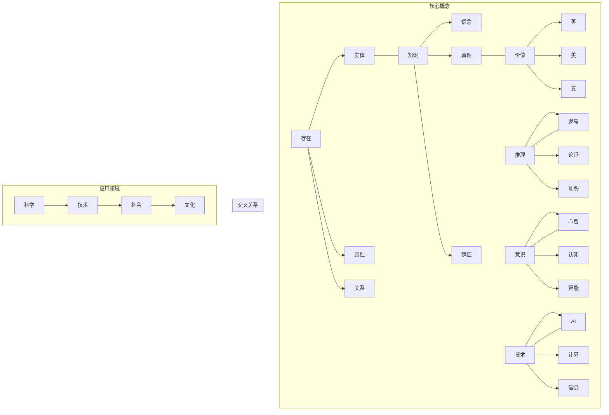
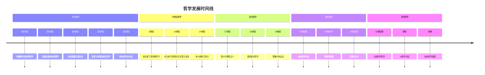
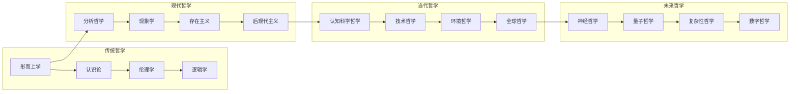

# 哲学概念思维导图 - 增强版

## 哲学体系总览

```mermaid
mindmap
  root((哲学体系))
    本体论
      数学本体论
        柏拉图主义
          数学对象客观存在
          数学真理永恒
          数学是发现
          不合理的有效性
        形式主义
          数学是符号游戏
          一致性标准
          数学是发明
          希尔伯特纲领
        直觉主义
          数学是心智构造
          构造性证明
          拒绝排中律
          布劳威尔直觉
        结构主义
          数学研究结构
          对象是位置
          多重实现
          关系性定义
        虚构主义
          数学是虚构
          有用性解释
          本体论承诺
          工具主义
      现实本体论
        实在论
          朴素实在论
          科学实在论
          形而上学实在论
          结构实在论
        反实在论
          唯心主义
          现象主义
          工具主义
          社会建构论
          内部实在论
        唯物论
          原子论
          机械唯物论
          辩证唯物主义
          当代物理主义
        唯心论
          主观唯心论
          客观唯心论
          先验唯心论
          绝对唯心论
        二元论
          笛卡尔二元论
          属性二元论
          心身问题
          交互作用问题
      信息本体论
        信息作为基础实在
          信息本体论
          计算宇宙假说
          数字物理学
          信息哲学
        AI本体论
          强人工智能论
          多重实现论
          涌现主义
          计算主义
        网络本体论
          网络空间
          虚拟现实
          数字存在
          信息社会
      认识论
        知识论
          JTB理论
            知识定义
            真信念
            确证条件
            葛梯尔问题
          葛梯尔问题
            反例构造
            确证问题
            知识分析
            解决方案
          知识的确证
            基础主义
            融贯论
            外在主义
            内在主义
          怀疑论
            笛卡尔怀疑
            休谟怀疑
            皮浪主义
            现代怀疑论
        真理理论
          符合论
            真理定义
            事实对应
            亚里士多德
            现代发展
          融贯论
            信念系统
            逻辑一致性
            整体论
            布拉德雷
          实用主义
            真理效用
            皮尔士
            詹姆斯
            杜威
          紧缩论
            真理冗余
            拉姆齐
            霍维奇
            最小主义
        知识来源
          理性主义
            天赋观念
            笛卡尔
            斯宾诺莎
            莱布尼茨
          经验主义
            感觉经验
            洛克
            贝克莱
            休谟
          批判主义
            康德
            先验综合
            批判哲学
            调和立场
        知识结构
          基础主义
            基础信念
            非推论知识
            确证链条
            基础论
          反基础主义
            无限回归
            循环论证
            整体论
            融贯论
          融贯论
            信念网络
            相互支持
            整体确证
            系统论
      伦理学
        规范伦理学
          义务论
            康德伦理学
              绝对命令
              普遍化原则
              目的王国
              道德律
            罗斯义务论
              显见义务
              道德直觉
              义务冲突
              权衡原则
          功利主义
            古典功利主义
              边沁
              密尔
              最大幸福
              快乐计算
            规则功利主义
              规则遵循
              长期后果
              制度设计
              社会效用
            偏好功利主义
              偏好满足
              主观价值
              个人选择
              现代发展
          德性伦理学
            亚里士多德
              德性概念
              中庸之道
              实践智慧
              幸福生活
            现代德性论
              品格培养
              道德教育
              美德传统
              社群主义
          关怀伦理学
            女性主义视角
            关系伦理
            情感关怀
            具体情境
        元伦理学
          道德实在论
            道德事实
            客观价值
            道德真理
            认知主义
          情感主义
            情感表达
            非认知主义
            艾耶尔
            史蒂文森
          建构主义
            道德建构
            社会规范
            实践理性
            罗尔斯
          错误理论
            麦基
            道德错误
            主观投射
            虚无主义
        应用伦理学
          AI伦理
            算法偏见
            责任归属
            价值对齐
            透明度
          工程伦理
            职业责任
            安全设计
            环境影响
            社会影响
          科学伦理
            研究诚信
            动物实验
            人体实验
            数据伦理
          环境伦理
            生态价值
            可持续发展
            代际正义
            生物多样性
        形式化伦理学
          道义逻辑
            义务算子
            允许算子
            禁止算子
            逻辑系统
          价值对齐
            AI价值
            人类价值
            价值冲突
            对齐方法
          计算道德
            道德算法
            决策系统
            伦理编程
            自动化伦理
      逻辑学
        形式逻辑
          命题逻辑
            真值表
            逻辑联结词
            推理规则
            有效性
          谓词逻辑
            量词
            谓词
            个体词
            形式化
          模态逻辑
            必然性
            可能性
            可能世界
            克里普克语义
          时序逻辑
            时间算子
            过去
            现在
            未来
        哲学逻辑
          认识逻辑
            知识算子
            信念算子
            认知模态
            认知悖论
          道义逻辑
            义务逻辑
            规范逻辑
            法律逻辑
            伦理推理
          信念逻辑
            信念修正
            信念合并
            信念网络
            信念动力学
          意图逻辑
            意图算子
            行动逻辑
            实践推理
            决策理论
        非经典逻辑
          直觉主义逻辑
            构造性证明
            排中律拒绝
            布劳威尔
            数学基础
          模糊逻辑
            模糊集合
            隶属度
            扎德
            不确定性
          非单调逻辑
            默认推理
            信念修正
            异常处理
            常识推理
          多值逻辑
            三值逻辑
            四值逻辑
            无穷值逻辑
            真值度
        逻辑哲学
          逻辑的本质
            形式系统
            推理规则
            有效性标准
            逻辑真理
          发现vs发明
            逻辑发现
            逻辑发明
            约定论
            实在论
          逻辑多元主义
            多种逻辑
            相对主义
            语境依赖
            应用领域
      形而上学
        存在论
          实体与属性
            实体理论
            属性理论
            关系理论
            类别理论
          部分与整体
            构成关系
            同一性
            组合问题
            涌现属性
          同一性
            历时同一性
            共时同一性
            相对同一性
            绝对同一性
          变化
            变化的本体论
            时间中的同一性
            变化与持存
            过程哲学
        模态形而上学
          必然性
            逻辑必然性
            形而上学必然性
            物理必然性
            概念必然性
          可能性
            逻辑可能性
            形而上学可能性
            物理可能性
            认识可能性
          可能世界
            可能世界语义
            世界相似性
            跨世界同一性
            本质主义
          本质与偶然
            本质属性
            偶然属性
            本质主义
            反本质主义
        时间与空间
          时间逻辑
            时间结构
            时间关系
            时间流
            时间方向
          空间哲学
            空间概念
            空间关系
            空间结构
            空间几何
          时空关系
            相对论
            时空统一
            时空弯曲
            时空哲学
        因果性
          因果关系
            因果概念
            因果机制
            因果解释
            因果推理
          决定论
            拉普拉斯决定论
            物理决定论
            心理决定论
            自由意志问题
          自由意志
            相容论
            不相容论
            自由意志主义
            决定论批判
          概率因果
            统计因果
            概率解释
            因果发现
            机器学习
      交叉领域哲学
        数学哲学
          数学对象存在性
            柏拉图主义
            形式主义
            直觉主义
            结构主义
            虚构主义
          数学真理本质
            客观性
            必然性
            先验性
            应用性
          数学发现发明
            发现论
            发明论
            创造论
            建构论
          数学应用性
            不合理的有效性
            数学建模
            科学应用
            技术应用
        科学哲学
          科学方法论
            归纳法
            演绎法
            溯因法
            假设演绎法
          科学实在论
            理论实体
            科学真理
            科学进步
            科学成功
          科学革命
            范式转换
            库恩理论
            科学革命结构
            不可通约性
          科学解释
            覆盖律模型
            因果解释
            功能解释
            目的论解释
        认知哲学
          心智哲学
            心身问题
            意识问题
            意向性问题
            感受质问题
          认知科学哲学
            认知架构
            认知过程
            认知模型
            认知计算
          人工智能哲学
            强AI
            弱AI
            图灵测试
            中文房间
        技术哲学
          AI哲学
            智能本质
            意识问题
            伦理问题
            社会影响
          计算哲学
            计算概念
            算法思维
            计算模型
            计算理论
          信息哲学
            信息本质
            信息处理
            信息社会
            信息伦理
          网络哲学
            网络空间
            虚拟现实
            数字存在
            网络社会
```

## 哲学方法与应用

## 哲学发展趋势

## 哲学与时代对齐

## 哲学应用领域

## 哲学概念关系网络

## 哲学发展时间线

## 哲学概念对比表

| 概念类别 | 传统理解 | 现代发展 | 形式化表达 | 应用领域 |
|---------|---------|---------|-----------|---------|
| **存在** | 形而上学概念 | 信息存在论 | ∃x(Entity(x)) | 本体工程 |
| **知识** | 真信念+确证 | 计算知识论 | K_a(p) ∧ p ∧ J_a(p) | 知识表示 |
| **价值** | 主观/客观 | 价值对齐 | V(a) > V(b) | AI伦理 |
| **推理** | 逻辑推理 | 计算推理 | Γ ⊢ φ | 自动推理 |
| **意识** | 主观体验 | 认知建模 | C(x) → M(x) | 认知科学 |
| **因果** | 必然联系 | 概率因果 | P(E\|C) > P(E\|¬C) | 因果发现 |

## 哲学方法对比表

| 方法类型 | 传统方法 | 现代方法 | 优势 | 局限性 |
|---------|---------|---------|------|--------|
| **概念分析** | 语言分析 | 形式化分析 | 精确性高 | 可能过度简化 |
| **逻辑分析** | 演绎推理 | 计算逻辑 | 严格性 | 适用范围有限 |
| **历史分析** | 文本解读 | 数据挖掘 | 深度理解 | 主观性 |
| **批判分析** | 理性批判 | 实验哲学 | 客观性 | 复杂性 |
| **实践分析** | 经验总结 | 实证研究 | 实用性 | 理论性不足 |

## 哲学应用对比表

| 应用领域 | 传统应用 | 现代应用 | 技术整合 | 发展趋势 |
|---------|---------|---------|---------|---------|
| **科学哲学** | 方法论指导 | 科学建模 | 贝叶斯网络 | 可证伪性 |
| **技术哲学** | 技术批判 | 技术设计 | 系统分析 | 预测困难 |
| **认知哲学** | 心智分析 | 认知建模 | 神经网络 | 意识问题 |
| **伦理哲学** | 道德指导 | 伦理计算 | 价值对齐 | 相对主义 |
| **逻辑哲学** | 推理分析 | 自动推理 | 逻辑编程 | 复杂性 |

## 哲学发展趋势图

## 哲学与时代对齐分析

### 当代挑战

1. **技术挑战**：
   - 人工智能的快速发展
   - 信息技术的普及
   - 生物技术的突破
   - 纳米技术的应用

2. **社会挑战**：
   - 全球化的深入
   - 多元化的加剧
   - 数字化的普及
   - 生态化的紧迫

3. **认知挑战**：
   - 认知科学的进展
   - 神经科学的突破
   - 人工智能的挑战
   - 学习科学的创新

### 哲学回应

1. **理论回应**：
   - 信息哲学：研究信息的本质和作用
   - 网络哲学：分析网络空间的特征
   - AI哲学：探讨智能的本质和伦理
   - 技术哲学：反思技术的社会影响

2. **方法回应**：
   - 计算哲学：哲学问题的计算化处理
   - 认知哲学：认知科学视角的哲学研究
   - 生态哲学：环境问题的哲学思考
   - 全球哲学：跨文化哲学对话

3. **实践回应**：
   - 应用哲学：将哲学理论应用于实际问题
   - 实验哲学：通过实验方法研究哲学问题
   - 跨学科哲学：整合不同学科的方法和理论
   - 技术哲学：指导技术发展的伦理方向

### 哲学与时代同步性

#### 同步性指标

- **问题相关性**：哲学问题与时代问题的相关性
- **方法适应性**：哲学方法对时代挑战的适应性
- **应用有效性**：哲学理论在实践中的应用效果
- **发展前瞻性**：哲学对未来的预见和指导

#### 同步性评估

- **高同步性**：逻辑学、认识论、伦理学
- **中同步性**：本体论、形而上学
- **需要加强**：美学、政治哲学、社会哲学

---

*这个思维导图展示了哲学体系的完整结构，从传统的本体论、认识论、伦理学、逻辑学、形而上学，到现代的交叉领域哲学，以及哲学方法的应用和发展趋势。每个分支都包含了核心概念、主要理论、代表人物和现代发展，体现了哲学与时代发展的紧密联系。*
