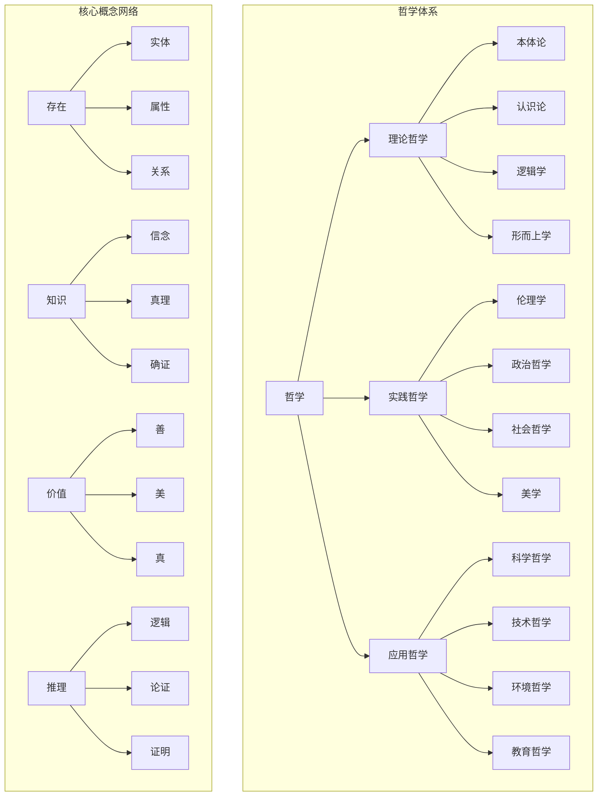
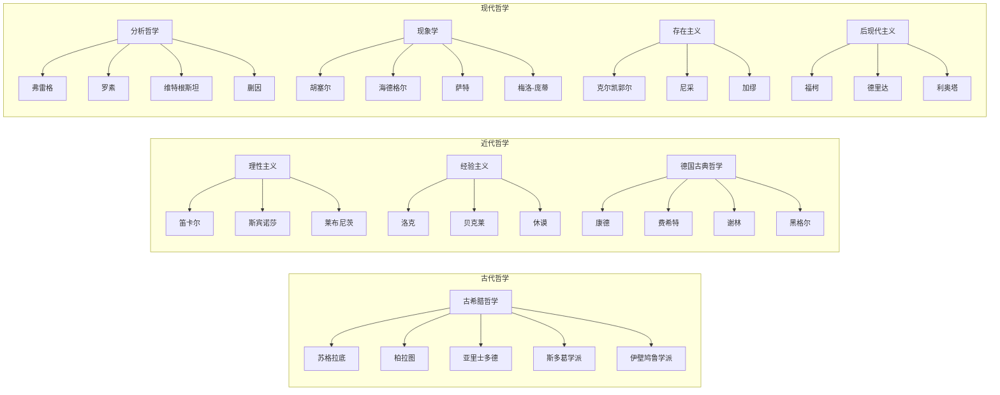
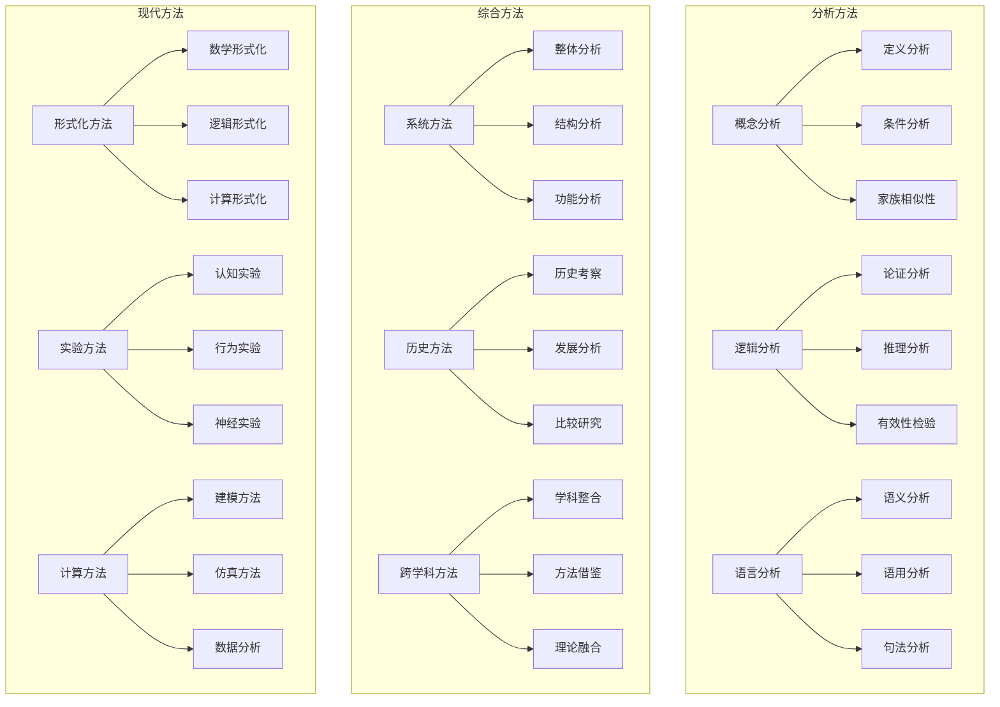
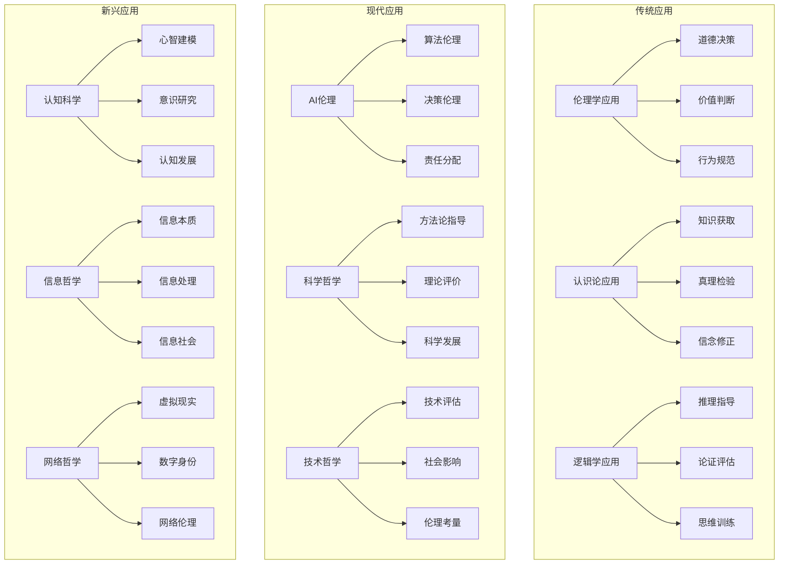
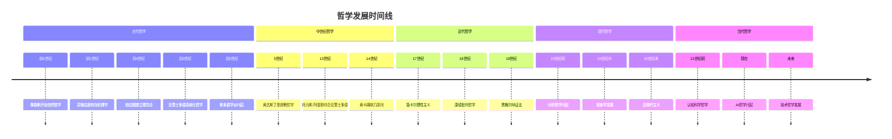
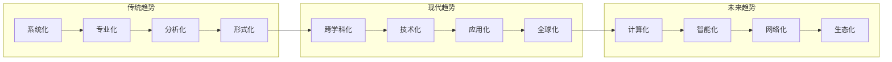

# 哲学概念关系图

## 哲学体系层次结构

## 哲学流派关系图

## 哲学方法关系图

## 哲学应用关系图

## 哲学发展时间线

## 哲学概念对比表

| 概念类别 | 传统理解 | 现代发展 | 形式化表达 | 应用领域 |
|---------|---------|---------|-----------|---------|
| **存在** | 形而上学概念 | 信息存在论 | ∃x(Entity(x)) | 本体工程 |
| **知识** | 真信念+确证 | 计算知识论 | K_a(p) ∧ p ∧ J_a(p) | 知识表示 |
| **价值** | 主观/客观 | 价值对齐 | V(a) > V(b) | AI伦理 |
| **推理** | 逻辑推理 | 计算推理 | Γ ⊢ φ | 自动推理 |
| **意识** | 主观体验 | 认知建模 | C(x) → M(x) | 认知科学 |
| **因果** | 必然联系 | 概率因果 | P(E\|C) > P(E\|¬C) | 因果发现 |

## 哲学方法对比表

| 方法类型 | 传统方法 | 现代方法 | 优势 | 局限性 |
|---------|---------|---------|------|--------|
| **概念分析** | 语言分析 | 形式化分析 | 精确性高 | 可能过度简化 |
| **逻辑分析** | 演绎推理 | 计算逻辑 | 严格性 | 适用范围有限 |
| **历史分析** | 文本解读 | 数据挖掘 | 深度理解 | 主观性 |
| **实验分析** | 思想实验 | 认知实验 | 客观性 | 外部效度 |
| **系统分析** | 整体把握 | 建模分析 | 全面性 | 复杂性高 |
| **跨学科分析** | 学科借鉴 | 深度融合 | 创新性 | 整合困难 |

## 哲学应用对比表

| 应用领域 | 传统应用 | 现代应用 | 技术工具 | 挑战 |
|---------|---------|---------|---------|------|
| **伦理学** | 道德推理 | 计算伦理学 | 道义逻辑 | 价值冲突 |
| **认识论** | 知识理论 | 认知建模 | 信念网络 | 不确定性 |
| **逻辑学** | 形式推理 | 自动推理 | 证明系统 | 复杂性 |
| **形而上学** | 本体论 | 本体工程 | 描述逻辑 | 抽象性 |
| **科学哲学** | 方法论 | 科学建模 | 贝叶斯网络 | 可证伪性 |
| **技术哲学** | 技术批判 | 技术设计 | 系统分析 | 预测困难 |

## 哲学发展趋势图

## 哲学与时代对齐分析

### 技术时代特征

1. **数字化**: 信息技术的普及
2. **网络化**: 全球互联互通
3. **智能化**: AI技术的快速发展
4. **自动化**: 系统自动化程度提高

### 哲学回应

1. **信息哲学**: 研究信息的本质和作用
2. **网络哲学**: 分析网络空间的特征
3. **AI哲学**: 探讨智能的本质和伦理
4. **技术哲学**: 反思技术的社会影响

### 未来发展方向

1. **计算哲学**: 哲学问题的计算化处理
2. **认知哲学**: 认知科学视角的哲学研究
3. **生态哲学**: 环境问题的哲学思考
4. **全球哲学**: 跨文化哲学对话

---

*本关系图展示了哲学概念、流派、方法、应用之间的复杂关系，以及哲学发展的历史脉络和未来趋势。这些图表为理解哲学的体系结构和现代发展提供了直观的参考。*
