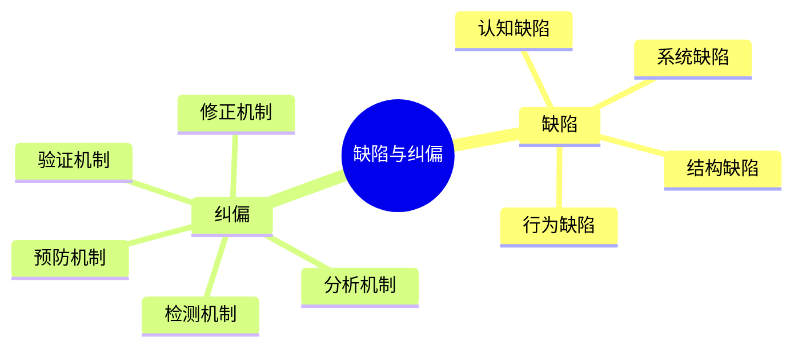
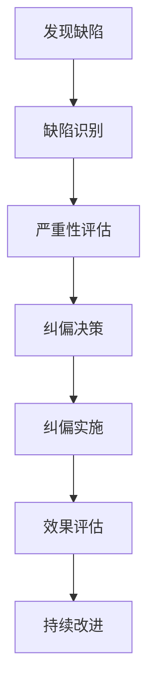
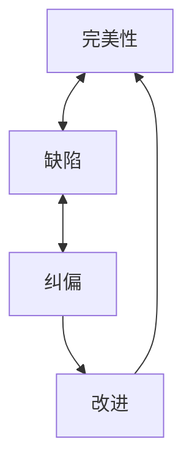
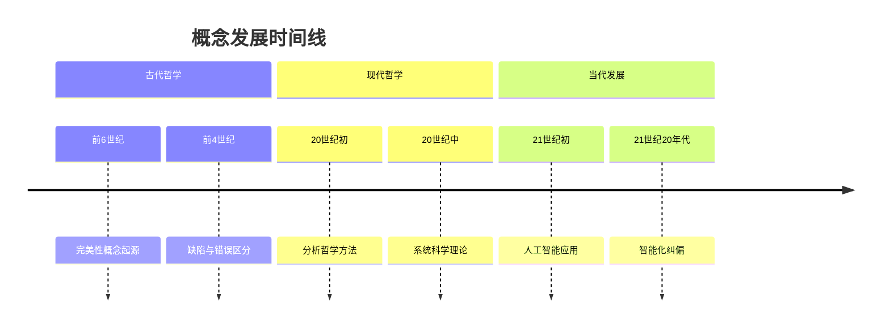

# 缺陷与纠偏哲学内容总结

## 概述

本文档总结了在 `docs/Philosophy/content/` 目录下创建的缺陷与纠偏相关的哲学内容。这些内容提供了多种表征方式，包括思维导图、图表、表格等，涵盖了核心概念、定义、论证、解释、形式化符号等方面的内容，并与当前时代对齐。

## 已创建的文档

### 1. 缺陷与纠偏哲学分析.md

**文件路径**：`docs/Philosophy/content/缺陷与纠偏哲学分析.md`

**主要内容**：

- 缺陷与纠偏的核心概念体系
- 认知缺陷与纠偏理论
- 系统缺陷与纠偏框架
- 社会缺陷与纠偏机制
- 现代技术与缺陷纠偏
- 哲学反思与理论发展
- 未来发展趋势

**特色**：

- 提供了完整的理论框架
- 包含形式化表达（Rust代码）
- 涵盖认知、系统、社会等多个层面
- 与现代技术（AI、区块链）结合

### 2. 缺陷与纠偏思维导图.md

**文件路径**：`docs/Philosophy/content/缺陷与纠偏思维导图.md`

**主要内容**：

- 核心概念思维导图
- 哲学理论框架图
- 应用领域思维导图
- 方法论思维导图
- 发展趋势思维导图

**特色**：

- 多种可视化表征方式（mindmap、graph、flowchart等）
- 层次化的概念展示
- 动态的流程描述
- 跨学科的应用展示

### 3. 缺陷与纠偏哲学理论.md

**文件路径**：`docs/Philosophy/content/缺陷与纠偏哲学理论.md`

**主要内容**：

- 本体论视角：缺陷的本体论地位
- 认识论视角：缺陷认知的理论基础
- 价值论视角：缺陷的价值判断
- 哲学方法论：辩证方法、系统思维、批判思维
- 哲学应用理论：实践哲学、技术哲学、社会哲学

**特色**：

- 深厚的哲学理论基础
- 多流派的哲学观点对比
- 形式化的哲学表达
- 理论与实践的结合

### 4. 缺陷与纠偏概念关系图.md

**文件路径**：`docs/Philosophy/content/缺陷与纠偏概念关系图.md`

**主要内容**：

- 核心概念定义和特征
- 概念关系网络
- 概念分类体系
- 概念应用关系
- 概念发展关系
- 概念价值关系

**特色**：

- 详细的概念定义和分类
- 多维度的关系分析
- 历史发展的时间线
- 价值层次的探讨

## 内容特色

### 1. 多种表征方式

#### 1.1 思维导图 (Mindmap)



#### 1.2 流程图 (Flowchart)



#### 1.3 关系图 (Graph)



#### 1.4 时间线 (Timeline)



### 2. 形式化表达

#### 2.1 数据结构定义

```rust
struct Defect {
    id: DefectId,
    type_: DefectType,
    severity: Severity,
    location: Location,
    description: String,
    cause: Cause,
    impact: Impact
}

enum DefectType {
    Cognitive,     // 认知缺陷
    Behavioral,    // 行为缺陷
    Systemic,      // 系统缺陷
    Structural,    // 结构缺陷
    Functional,    // 功能缺陷
    Temporal       // 时间缺陷
}
```

#### 2.2 方法实现

```rust
impl Defect {
    fn is_correctable(&self) -> bool {
        matches!(self.severity, Severity::Minor | Severity::Major)
    }
    
    fn requires_immediate_attention(&self) -> bool {
        matches!(self.severity, Severity::Critical)
    }
}
```

### 3. 表格化展示

| 分类维度 | 缺陷类型 | 纠偏方法 | 特征描述 |
|---------|----------|----------|----------|
| **认知性** | 认知偏差、逻辑谬误 | 认知训练、逻辑分析 | 主观性、系统性 |
| **行为性** | 操作错误、决策偏差 | 行为矫正、决策优化 | 可观察、可测量 |
| **系统性** | 设计缺陷、实现缺陷 | 系统重构、过程改进 | 全局性、结构性 |
| **社会性** | 制度缺陷、文化缺陷 | 制度改革、文化变迁 | 复杂性、长期性 |

## 核心概念体系

### 1. 基础概念

#### 1.1 缺陷 (Defect)

- **哲学定义**：相对于理想状态或标准状态的偏差
- **系统定义**：系统、过程或结果中不符合预期或目标的部分
- **功能定义**：导致功能失效或性能下降的因素

#### 1.2 纠偏 (Correction)

- **哲学定义**：识别、分析和修正缺陷的过程
- **系统定义**：使系统或过程回归理想状态的活动
- **功能定义**：持续改进和优化的方法论

#### 1.3 完美性 (Perfection)

- **哲学定义**：理想化的状态或标准
- **系统定义**：系统的最佳状态或目标
- **功能定义**：功能的最优表现

### 2. 哲学基础

#### 2.1 本体论视角

- **实在论观点**：缺陷是客观存在的实体
- **建构论观点**：缺陷是社会建构的产物
- **关系论观点**：缺陷是相对于理想状态的关系性存在

#### 2.2 认识论视角

- **理性主义观点**：缺陷可以通过理性分析认识
- **经验主义观点**：缺陷通过经验观察发现
- **建构主义观点**：缺陷认知是主体建构的过程

#### 2.3 价值论视角

- **客观价值论**：缺陷具有客观的负价值
- **主观价值论**：缺陷的价值依赖于主体评价
- **关系价值论**：缺陷的价值在于其与目标的关系

## 应用领域

### 1. 个人发展

- 认知提升：认知偏差识别、逻辑思维训练
- 行为改进：习惯养成、技能训练、绩效提升
- 学习优化：学习方法、知识结构、学习效果

### 2. 组织管理

- 质量管理：缺陷检测、过程控制、持续改进
- 创新管理：问题识别、解决方案、创新实施
- 变革管理：现状分析、变革设计、变革实施

### 3. 社会治理

- 制度设计：制度缺陷、制度优化、制度创新
- 政策制定：问题分析、政策设计、政策实施
- 文化发展：文化缺陷、文化改进、文化创新

### 4. 技术发展

- 系统设计：需求分析、系统设计、系统实现
- 质量保证：测试验证、缺陷管理、质量改进
- 技术创新：技术问题、技术方案、技术实现

## 现代技术应用

### 1. 人工智能

- **AI辅助缺陷检测**：模式识别、异常检测、预测分析
- **机器学习纠偏算法**：监督学习、无监督学习、强化学习
- **智能纠偏系统**：自适应系统、学习系统、优化系统

### 2. 区块链技术

- **不可篡改性**：防止数据篡改、确保真实性
- **透明性**：增强监督、提高信任
- **可追溯性**：问题溯源、责任追究

### 3. 大数据分析

- **数据驱动检测**：基于数据的缺陷识别
- **趋势分析**：缺陷发展趋势预测
- **模式识别**：缺陷模式自动识别

## 方法论体系

### 1. 哲学方法

- **辩证分析**：矛盾分析、发展分析、联系分析
- **系统思维**：整体性思维、层次性思维、动态性思维
- **批判思维**：假设检验、逻辑分析、证据评估

### 2. 科学方法

- **实证研究**：观察、实验、验证
- **统计分析**：数据收集、分析、解释
- **模型构建**：理论建模、验证、应用

### 3. 工程方法

- **系统设计**：需求分析、设计、实现
- **质量控制**：检测、分析、改进
- **持续改进**：PDCA循环、六西格玛、精益管理

## 发展趋势

### 1. 技术发展趋势

- **人工智能**：深度学习、强化学习、生成式AI
- **量子技术**：量子计算、量子通信、量子传感
- **生物技术**：生物计算、生物传感、生物反馈
- **边缘计算**：分布式处理、实时响应、本地智能

### 2. 理论发展趋势

- **统一理论**：认知统一、系统统一、社会统一
- **跨学科融合**：认知科学、复杂系统、社会科学
- **新方法论**：自适应方法、涌现方法、协同方法

### 3. 应用发展趋势

- **个人应用**：个性化纠偏、智能助手、学习优化
- **组织应用**：智能管理、自适应组织、创新系统
- **社会应用**：智慧城市、智能治理、可持续发展

## 挑战与机遇

### 1. 主要挑战

- **技术挑战**：复杂性管理、可解释性、伦理问题
- **理论挑战**：统一性、可验证性、实用性
- **应用挑战**：成本效益、用户接受、社会影响

### 2. 发展机遇

- **技术机遇**：AI突破、量子优势、生物启发
- **理论机遇**：跨学科、新范式、统一理论
- **应用机遇**：数字化转型、智能化升级、可持续发展

## 总结

本系列文档通过多种表征方式全面展现了缺陷与纠偏哲学的丰富内涵：

1. **理论深度**：从本体论、认识论、价值论等哲学基础出发
2. **实践广度**：涵盖个人、组织、社会、技术等多个应用领域
3. **方法多样**：提供思维导图、流程图、关系图等多种可视化方式
4. **形式化表达**：用现代编程语言表达传统哲学概念
5. **时代特色**：与现代技术（AI、区块链、大数据）紧密结合
6. **发展前瞻**：展望未来发展趋势和挑战机遇

这些内容不仅丰富了哲学理论体系，也为实践应用提供了理论指导，体现了哲学与时代发展的紧密结合。
