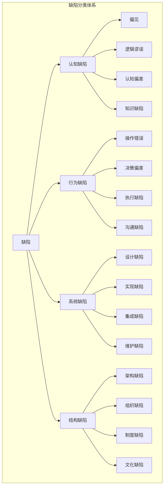
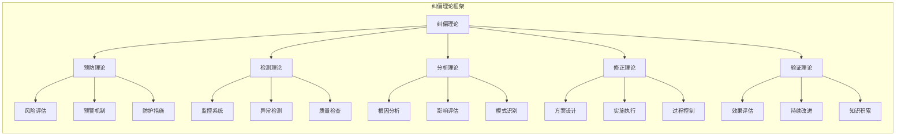
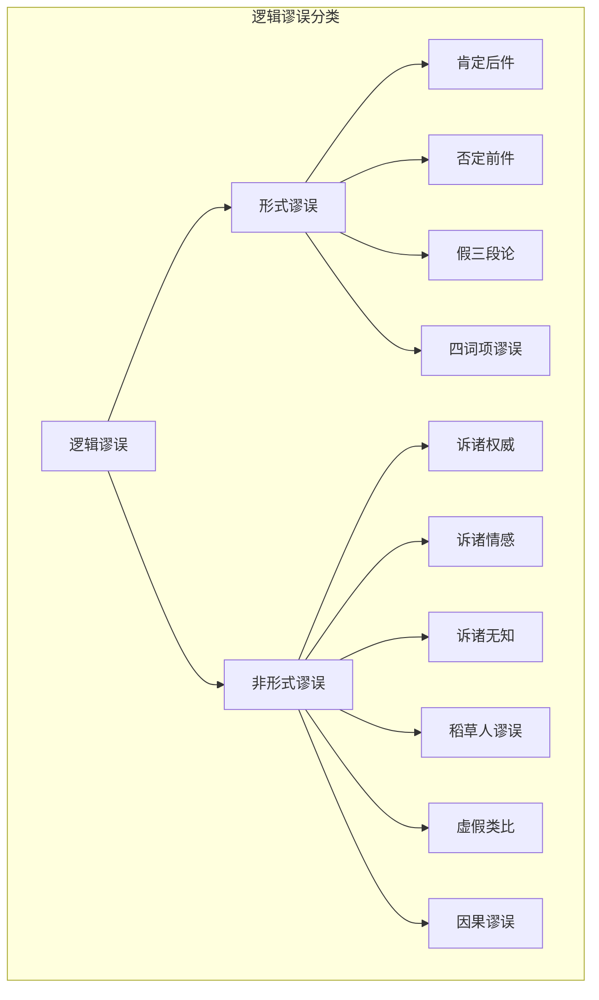
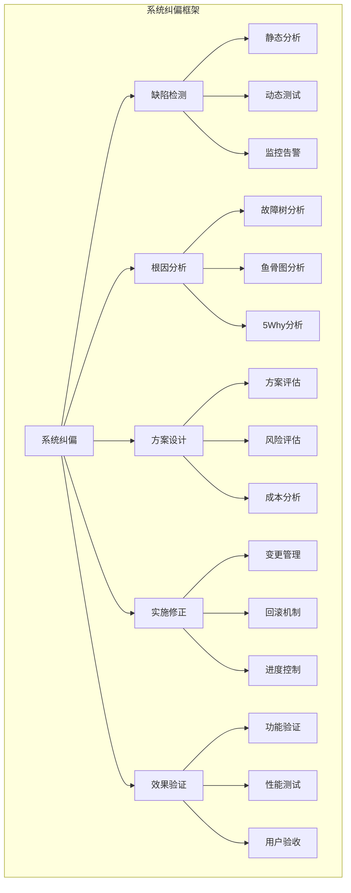
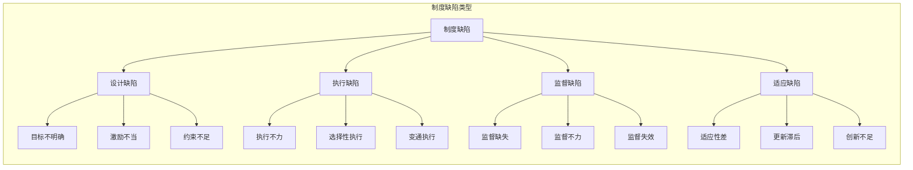
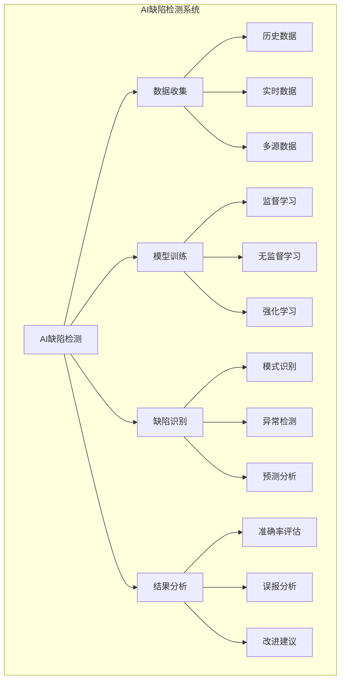
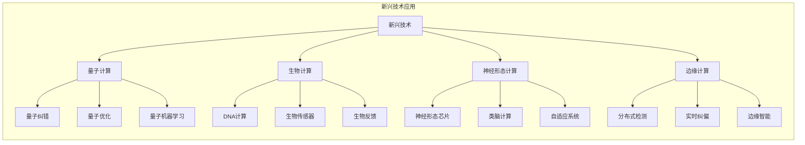

# 缺陷与纠偏哲学分析

## 概述

缺陷与纠偏（Defect and Correction）是哲学中关于错误、偏差、修正和优化的核心概念体系。这一领域探讨了认知、行为、系统和社会中的各种缺陷现象，以及相应的纠偏机制和方法论。在当代信息时代，这一主题具有重要的理论和实践意义。

## 核心概念体系

### 1. 缺陷的本质与分类

#### 1.1 缺陷的定义

**哲学定义**：

- 缺陷是相对于理想状态或标准状态的偏差
- 缺陷是系统、过程或结果中不符合预期或目标的部分
- 缺陷是导致功能失效或性能下降的因素

**形式化表达**：

```rust
struct Defect {
    id: DefectId,
    type_: DefectType,
    severity: Severity,
    location: Location,
    description: String,
    cause: Cause,
    impact: Impact
}

enum DefectType {
    Cognitive,     // 认知缺陷
    Behavioral,    // 行为缺陷
    Systemic,      // 系统缺陷
    Structural,    // 结构缺陷
    Functional,    // 功能缺陷
    Temporal       // 时间缺陷
}

enum Severity {
    Critical,      // 严重
    Major,         // 主要
    Minor,         // 次要
    Cosmetic       // 表面
}

impl Defect {
    fn is_correctable(&self) -> bool {
        matches!(self.severity, Severity::Minor | Severity::Major)
    }
    
    fn requires_immediate_attention(&self) -> bool {
        matches!(self.severity, Severity::Critical)
    }
}
```

#### 1.2 缺陷分类体系



### 2. 纠偏机制与理论

#### 2.1 纠偏的定义

**哲学定义**：

- 纠偏是识别、分析和修正缺陷的过程
- 纠偏是使系统或过程回归理想状态的活动
- 纠偏是持续改进和优化的方法论

**形式化表达**：

```rust
struct Correction {
    id: CorrectionId,
    defect_id: DefectId,
    method: CorrectionMethod,
    status: CorrectionStatus,
    effectiveness: Effectiveness,
    cost: Cost,
    timeline: Timeline
}

enum CorrectionMethod {
    Preventive,    // 预防性
    Reactive,      // 反应性
    Proactive,     // 主动性
    Adaptive,      // 适应性
    Transformative // 变革性
}

enum CorrectionStatus {
    Planned,       // 计划中
    InProgress,    // 进行中
    Completed,     // 已完成
    Failed,        // 失败
    Cancelled      // 取消
}

impl Correction {
    fn is_effective(&self) -> bool {
        self.effectiveness > 0.8
    }
    
    fn is_cost_effective(&self) -> bool {
        self.effectiveness / self.cost > 0.5
    }
}
```

#### 2.2 纠偏理论框架



## 认知缺陷与纠偏

### 1. 认知偏差理论

#### 1.1 主要认知偏差

| 偏差类型 | 定义 | 表现形式 | 纠偏方法 |
|---------|------|----------|----------|
| 确认偏差 | 倾向于寻找支持已有信念的信息 | 选择性注意、记忆偏差 | 主动寻找反例、多角度分析 |
| 锚定效应 | 过度依赖首次获得的信息 | 价格锚定、数字锚定 | 多基准比较、独立评估 |
| 可用性偏差 | 基于容易回忆的信息做判断 | 媒体报道影响、个人经验 | 数据驱动、统计分析 |
| 群体思维 | 群体中追求一致性的压力 | 从众行为、压制异议 | 鼓励异议、独立决策 |
| 过度自信 | 高估自己的能力和知识 | 预测偏差、风险评估错误 | 概率思维、外部验证 |

#### 1.2 认知纠偏机制

```rust
struct CognitiveCorrection {
    bias_type: CognitiveBias,
    detection_method: DetectionMethod,
    correction_strategy: CorrectionStrategy,
    effectiveness_measure: EffectivenessMeasure
}

enum CognitiveBias {
    ConfirmationBias,
    AnchoringBias,
    AvailabilityBias,
    Groupthink,
    Overconfidence
}

enum DetectionMethod {
    SelfReflection,
    PeerReview,
    DataAnalysis,
    ExpertConsultation,
    AlgorithmicDetection
}

enum CorrectionStrategy {
    DebiasingTraining,
    DecisionFrameworks,
    ExternalValidation,
    DeliberatePractice,
    FeedbackLoops
}

impl CognitiveCorrection {
    fn apply_correction(&self, decision: &mut Decision) {
        match self.correction_strategy {
            CorrectionStrategy::DebiasingTraining => {
                decision.apply_debiasing_techniques();
            },
            CorrectionStrategy::DecisionFrameworks => {
                decision.use_structured_framework();
            },
            CorrectionStrategy::ExternalValidation => {
                decision.seek_external_validation();
            },
            _ => {}
        }
    }
}
```

### 2. 逻辑谬误与纠偏

#### 2.1 常见逻辑谬误



#### 2.2 逻辑纠偏方法

```rust
struct LogicalCorrection {
    fallacy_type: LogicalFallacy,
    argument_structure: ArgumentStructure,
    correction_approach: CorrectionApproach
}

struct ArgumentStructure {
    premises: Vec<Premise>,
    conclusion: Conclusion,
    logical_form: LogicalForm
}

enum CorrectionApproach {
    RestructureArgument,
    AddMissingPremises,
    ClarifyDefinitions,
    IdentifyHiddenAssumptions,
    ProvideCounterExamples
}

impl LogicalCorrection {
    fn identify_fallacy(&self, argument: &Argument) -> Option<LogicalFallacy> {
        // 识别逻辑谬误
        argument.analyze_for_fallacies()
    }
    
    fn correct_argument(&self, argument: &mut Argument) {
        // 修正论证
        argument.restructure();
        argument.add_missing_premises();
        argument.clarify_definitions();
    }
}
```

## 系统缺陷与纠偏

### 1. 系统缺陷分析

#### 1.1 系统缺陷类型

| 缺陷层次 | 缺陷类型 | 特征 | 影响范围 |
|---------|----------|------|----------|
| 架构层 | 设计缺陷 | 结构不合理、扩展性差 | 全局性 |
| 实现层 | 编码缺陷 | 逻辑错误、性能问题 | 局部性 |
| 集成层 | 接口缺陷 | 兼容性问题、数据不一致 | 模块间 |
| 运维层 | 部署缺陷 | 配置错误、环境问题 | 运行环境 |

#### 1.2 系统纠偏框架



### 2. 质量保证体系

```rust
struct QualityAssurance {
    defect_prevention: DefectPrevention,
    defect_detection: DefectDetection,
    defect_correction: DefectCorrection,
    continuous_improvement: ContinuousImprovement
}

struct DefectPrevention {
    design_reviews: Vec<DesignReview>,
    coding_standards: CodingStandards,
    training_programs: Vec<TrainingProgram>
}

struct DefectDetection {
    static_analysis: StaticAnalysis,
    dynamic_testing: DynamicTesting,
    code_reviews: Vec<CodeReview>
}

struct DefectCorrection {
    root_cause_analysis: RootCauseAnalysis,
    correction_planning: CorrectionPlanning,
    implementation: Implementation
}

impl QualityAssurance {
    fn measure_defect_density(&self, code_base: &CodeBase) -> f64 {
        // 计算缺陷密度
        let total_defects = self.count_defects(code_base);
        let lines_of_code = code_base.total_lines();
        total_defects as f64 / lines_of_code as f64
    }
    
    fn calculate_detection_efficiency(&self) -> f64 {
        // 计算缺陷检测效率
        let detected_defects = self.count_detected_defects();
        let total_defects = self.count_total_defects();
        detected_defects as f64 / total_defects as f64
    }
}
```

## 社会缺陷与纠偏

### 1. 制度缺陷分析

#### 1.1 制度缺陷类型



#### 1.2 制度纠偏机制

```rust
struct InstitutionalCorrection {
    defect_identification: DefectIdentification,
    stakeholder_analysis: StakeholderAnalysis,
    reform_design: ReformDesign,
    implementation_strategy: ImplementationStrategy
}

struct DefectIdentification {
    performance_metrics: Vec<PerformanceMetric>,
    stakeholder_feedback: Vec<Feedback>,
    comparative_analysis: ComparativeAnalysis
}

struct ReformDesign {
    policy_changes: Vec<PolicyChange>,
    structural_reforms: Vec<StructuralReform>,
    procedural_improvements: Vec<ProceduralImprovement>
}

impl InstitutionalCorrection {
    fn assess_reform_impact(&self, reform: &Reform) -> ImpactAssessment {
        // 评估改革影响
        let economic_impact = self.assess_economic_impact(reform);
        let social_impact = self.assess_social_impact(reform);
        let political_impact = self.assess_political_impact(reform);
        
        ImpactAssessment {
            economic: economic_impact,
            social: social_impact,
            political: political_impact,
            overall: self.calculate_overall_impact(reform)
        }
    }
}
```

### 2. 文化缺陷与纠偏

#### 2.1 文化缺陷表现

| 缺陷类型 | 表现特征 | 负面影响 | 纠偏方向 |
|---------|----------|----------|----------|
| 封闭性 | 排斥异质文化、固步自封 | 创新不足、发展停滞 | 开放包容、文化交流 |
| 等级性 | 权力集中、等级森严 | 压抑活力、阻碍流动 | 平等参与、扁平化 |
| 保守性 | 抗拒变化、维护现状 | 适应能力差、竞争力弱 | 改革创新、与时俱进 |
| 排他性 | 歧视差异、排斥异己 | 社会分裂、冲突加剧 | 多元包容、和谐共生 |

#### 2.2 文化纠偏策略

```rust
struct CulturalCorrection {
    cultural_analysis: CulturalAnalysis,
    change_strategy: ChangeStrategy,
    implementation_plan: ImplementationPlan
}

struct CulturalAnalysis {
    dominant_values: Vec<Value>,
    behavioral_patterns: Vec<BehavioralPattern>,
    communication_styles: Vec<CommunicationStyle>
}

enum ChangeStrategy {
    Incremental,   // 渐进式
    Transformative, // 变革式
    Adaptive,      // 适应性
    Hybrid         // 混合式
}

impl CulturalCorrection {
    fn design_change_intervention(&self, cultural_defect: &CulturalDefect) -> Intervention {
        match cultural_defect.severity {
            Severity::Critical => Intervention::Transformative,
            Severity::Major => Intervention::Hybrid,
            Severity::Minor => Intervention::Incremental,
            _ => Intervention::Adaptive
        }
    }
}
```

## 现代技术与缺陷纠偏

### 1. 人工智能与缺陷检测

#### 1.1 AI辅助缺陷检测



#### 1.2 机器学习纠偏算法

```rust
struct MLDefectDetection {
    model: DefectDetectionModel,
    training_data: TrainingDataset,
    evaluation_metrics: EvaluationMetrics
}

struct DefectDetectionModel {
    algorithm: Algorithm,
    parameters: ModelParameters,
    performance: ModelPerformance
}

enum Algorithm {
    RandomForest,
    SupportVectorMachine,
    NeuralNetwork,
    DeepLearning,
    Ensemble
}

impl MLDefectDetection {
    fn train_model(&mut self, training_data: &TrainingDataset) {
        self.model.train(training_data);
        self.evaluate_performance();
    }
    
    fn predict_defects(&self, input_data: &InputData) -> Vec<DefectPrediction> {
        self.model.predict(input_data)
    }
    
    fn update_model(&mut self, new_data: &TrainingDataset) {
        self.model.retrain(new_data);
    }
}
```

### 2. 区块链与纠偏机制

#### 2.1 区块链纠偏特性

| 特性 | 描述 | 纠偏作用 | 应用场景 |
|------|------|----------|----------|
| 不可篡改性 | 数据一旦写入不可更改 | 防止数据篡改、确保真实性 | 审计追踪、证据保全 |
| 透明性 | 所有交易公开可见 | 增强监督、提高信任 | 供应链管理、投票系统 |
| 去中心化 | 无单一控制点 | 减少单点故障、提高韧性 | 分布式系统、共识机制 |
| 可追溯性 | 完整的历史记录 | 问题溯源、责任追究 | 质量追溯、合规监管 |

#### 2.2 智能合约纠偏

```rust
struct SmartContractCorrection {
    contract: SmartContract,
    defect_detection: DefectDetection,
    automatic_correction: AutomaticCorrection
}

struct SmartContract {
    code: ContractCode,
    state: ContractState,
    transactions: Vec<Transaction>
}

impl SmartContractCorrection {
    fn detect_contract_defects(&self) -> Vec<ContractDefect> {
        // 检测智能合约缺陷
        let security_vulnerabilities = self.detect_security_vulnerabilities();
        let logic_errors = self.detect_logic_errors();
        let performance_issues = self.detect_performance_issues();
        
        vec![security_vulnerabilities, logic_errors, performance_issues]
            .into_iter()
            .flatten()
            .collect()
    }
    
    fn apply_automatic_correction(&mut self, defect: &ContractDefect) {
        // 应用自动纠偏
        match defect.type_ {
            DefectType::Security => self.apply_security_patch(defect),
            DefectType::Logic => self.apply_logic_correction(defect),
            DefectType::Performance => self.apply_performance_optimization(defect),
            _ => {}
        }
    }
}
```

## 哲学反思与理论发展

### 1. 缺陷的哲学意义

#### 1.1 缺陷与完美性

**哲学思考**：

- 缺陷是相对于完美性的概念，但完美性本身可能是一个理想化的抽象
- 缺陷的存在揭示了现实的复杂性和不完整性
- 缺陷可能是进化和发展的动力源泉

**形式化表达**：

```rust
struct PerfectionTheory {
    ideal_state: IdealState,
    reality_state: RealityState,
    defect_gap: DefectGap,
    improvement_potential: ImprovementPotential
}

impl PerfectionTheory {
    fn calculate_defect_gap(&self) -> DefectGap {
        DefectGap {
            magnitude: self.ideal_state.distance_from(&self.reality_state),
            direction: self.ideal_state.direction_to(&self.reality_state),
            complexity: self.assess_complexity()
        }
    }
    
    fn is_improvement_possible(&self) -> bool {
        self.defect_gap.magnitude > 0.0 && self.improvement_potential > 0.0
    }
}
```

#### 1.2 缺陷与辩证法

**辩证关系**：

- 缺陷与完美性构成对立统一关系
- 缺陷的存在推动着向完美性的运动
- 纠偏过程体现了否定之否定的辩证规律

### 2. 纠偏的伦理维度

#### 2.1 纠偏的伦理原则

| 伦理原则 | 内容 | 应用场景 | 挑战 |
|---------|------|----------|------|
| 责任原则 | 对缺陷负有纠正责任 | 质量保证、安全管理 | 责任边界、成本分担 |
| 公正原则 | 纠偏过程应公平公正 | 制度设计、资源配置 | 利益冲突、价值权衡 |
| 透明原则 | 纠偏过程应公开透明 | 公共政策、企业治理 | 隐私保护、商业机密 |
| 效率原则 | 纠偏应追求效率最优 | 资源分配、时间管理 | 质量与效率平衡 |

#### 2.2 纠偏伦理框架

```rust
struct CorrectionEthics {
    principles: Vec<EthicalPrinciple>,
    stakeholders: Vec<Stakeholder>,
    decision_framework: DecisionFramework
}

struct EthicalPrinciple {
    name: String,
    description: String,
    weight: f64,
    conflicts: Vec<String>
}

impl CorrectionEthics {
    fn evaluate_correction_ethics(&self, correction: &Correction) -> EthicalAssessment {
        let responsibility_score = self.assess_responsibility(correction);
        let fairness_score = self.assess_fairness(correction);
        let transparency_score = self.assess_transparency(correction);
        let efficiency_score = self.assess_efficiency(correction);
        
        EthicalAssessment {
            overall_score: self.calculate_weighted_score(
                responsibility_score, fairness_score, 
                transparency_score, efficiency_score
            ),
            recommendations: self.generate_recommendations(correction)
        }
    }
}
```

## 未来发展趋势

### 1. 技术发展趋势

#### 1.1 新兴技术应用



#### 1.2 跨学科融合

| 学科领域 | 融合方向 | 应用前景 | 发展挑战 |
|---------|----------|----------|----------|
| 认知科学 | 认知缺陷建模 | 智能纠偏系统 | 认知复杂性 |
| 复杂系统 | 系统缺陷动力学 | 复杂系统优化 | 预测困难 |
| 社会网络 | 网络缺陷传播 | 社会纠偏机制 | 网络效应 |
| 生态学 | 生态缺陷修复 | 环境纠偏 | 生态平衡 |

### 2. 理论发展方向

#### 2.1 统一理论框架

```rust
struct UnifiedDefectTheory {
    cognitive_component: CognitiveComponent,
    systemic_component: SystemicComponent,
    social_component: SocialComponent,
    technological_component: TechnologicalComponent
}

struct CognitiveComponent {
    bias_models: Vec<BiasModel>,
    learning_theories: Vec<LearningTheory>,
    decision_frameworks: Vec<DecisionFramework>
}

struct SystemicComponent {
    complexity_theory: ComplexityTheory,
    emergence_theory: EmergenceTheory,
    resilience_theory: ResilienceTheory
}

impl UnifiedDefectTheory {
    fn integrate_perspectives(&self) -> IntegratedFramework {
        // 整合多学科视角
        IntegratedFramework {
            cognitive_integration: self.integrate_cognitive_perspectives(),
            systemic_integration: self.integrate_systemic_perspectives(),
            social_integration: self.integrate_social_perspectives(),
            technological_integration: self.integrate_technological_perspectives()
        }
    }
    
    fn generate_research_agenda(&self) -> ResearchAgenda {
        // 生成研究议程
        ResearchAgenda {
            theoretical_developments: self.identify_theoretical_gaps(),
            methodological_advances: self.identify_methodological_needs(),
            practical_applications: self.identify_practical_opportunities()
        }
    }
}
```

## 总结与展望

### 1. 核心贡献

1. **理论体系**：建立了缺陷与纠偏的完整理论框架
2. **分类体系**：提供了多维度、多层次的缺陷分类方法
3. **纠偏机制**：设计了系统性的纠偏机制和方法论
4. **形式化表达**：用现代符号系统表达了传统哲学概念
5. **跨学科整合**：融合了哲学、认知科学、系统科学等多学科视角

### 2. 实践意义

1. **认知提升**：帮助人们识别和纠正认知偏差
2. **系统优化**：为系统设计和优化提供理论指导
3. **社会改进**：为制度设计和社会治理提供参考
4. **技术发展**：为人工智能和自动化系统提供理论基础

### 3. 未来展望

1. **理论深化**：进一步完善和深化理论体系
2. **方法创新**：开发新的缺陷检测和纠偏方法
3. **技术应用**：推动理论在技术领域的应用
4. **跨文化研究**：探索不同文化背景下的缺陷与纠偏现象

---

*本文档提供了缺陷与纠偏哲学的全面分析，通过多种表征方式（思维导图、图表、表格、形式化表达）展现了这一领域的丰富内涵和现代意义。该分析既保持了哲学的深度和严谨性，又体现了与当代技术和社会的紧密联系。*
