# 缺陷与纠偏思维导图

## 核心概念思维导图

### 1. 主要概念关系图

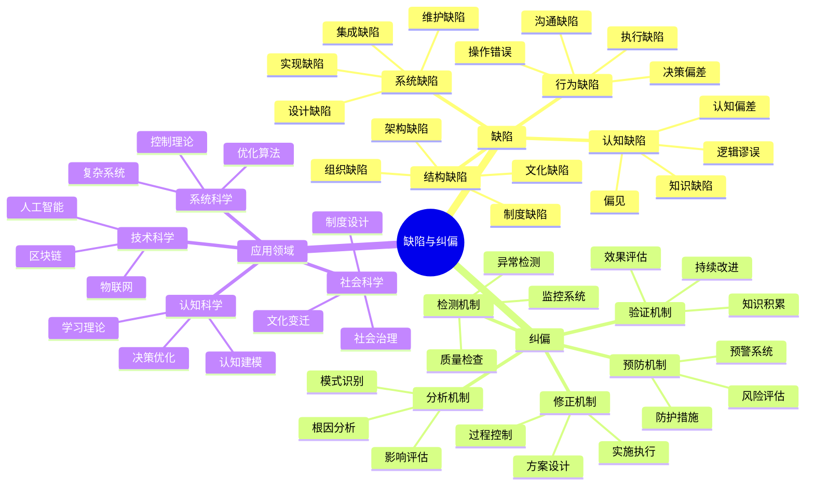

### 2. 缺陷分类层次图

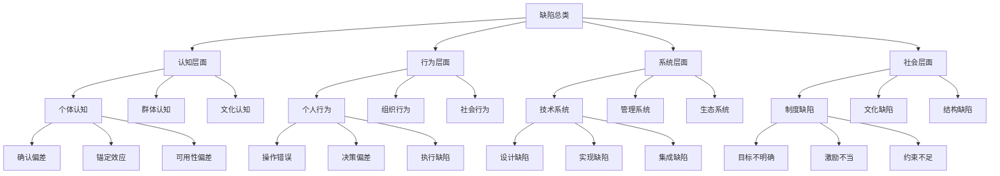

### 3. 纠偏流程思维导图

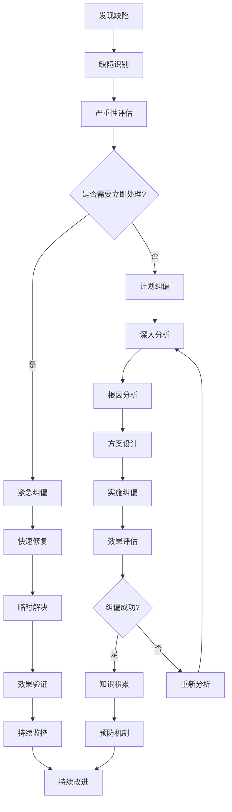

## 哲学理论框架图

### 1. 哲学基础关系图

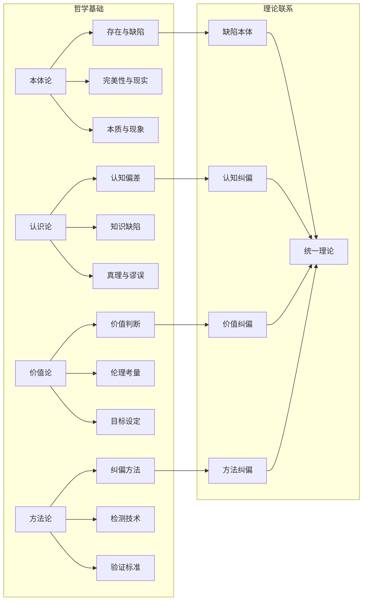

### 2. 辩证关系图

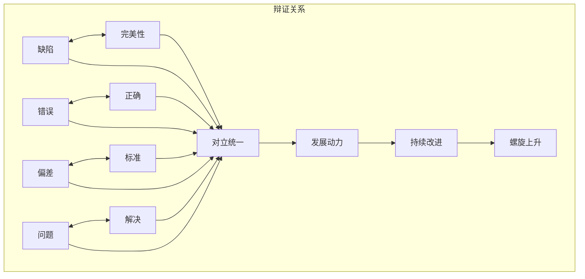

## 应用领域思维导图

### 1. 跨学科应用图

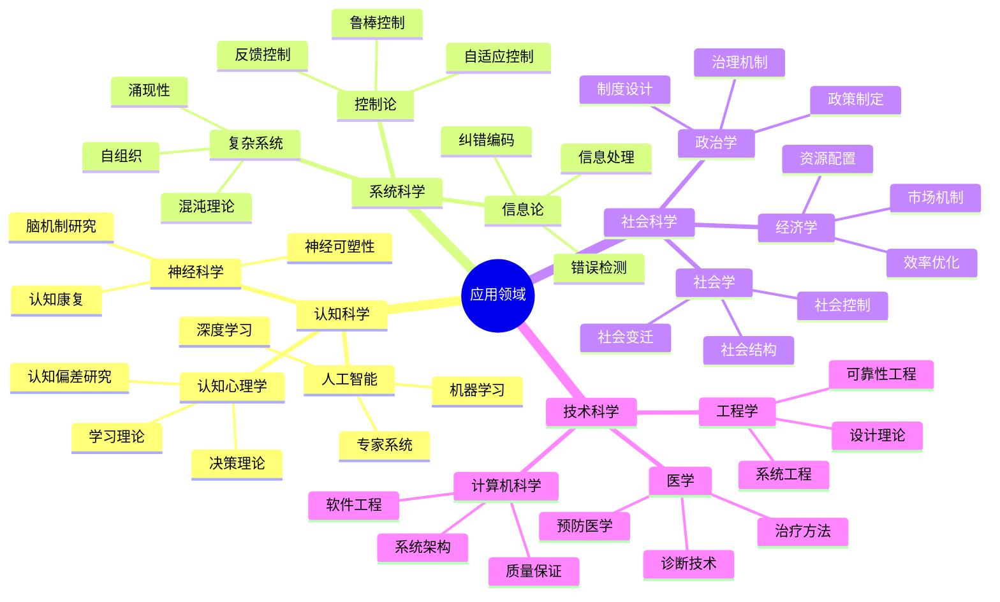

### 2. 技术应用层次图

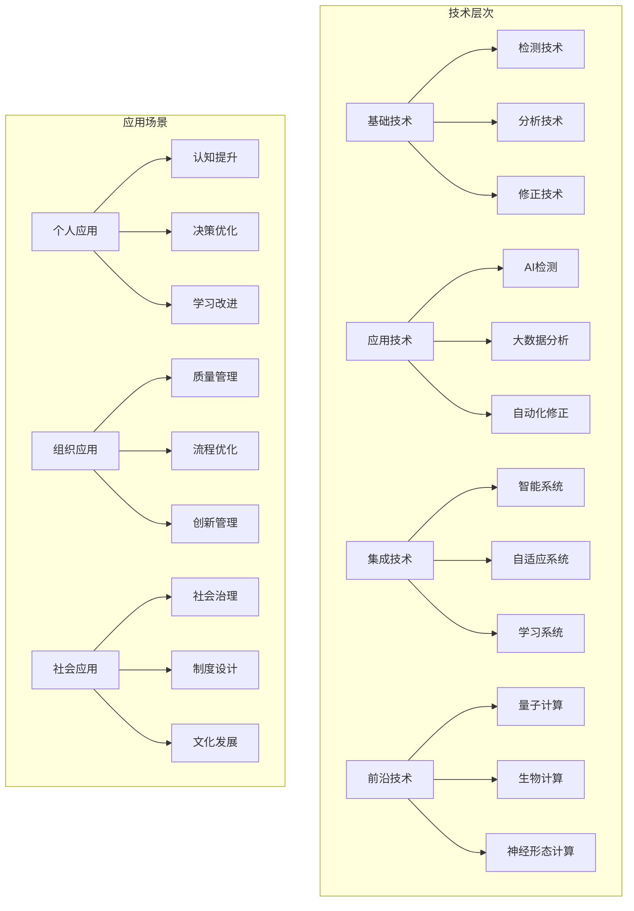

## 方法论思维导图

### 1. 纠偏方法论框架

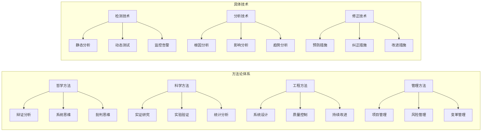

### 2. 质量保证体系图

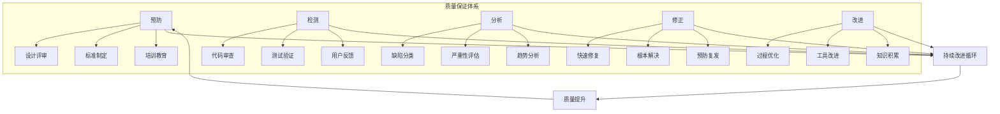

## 发展趋势思维导图

### 1. 未来发展方向

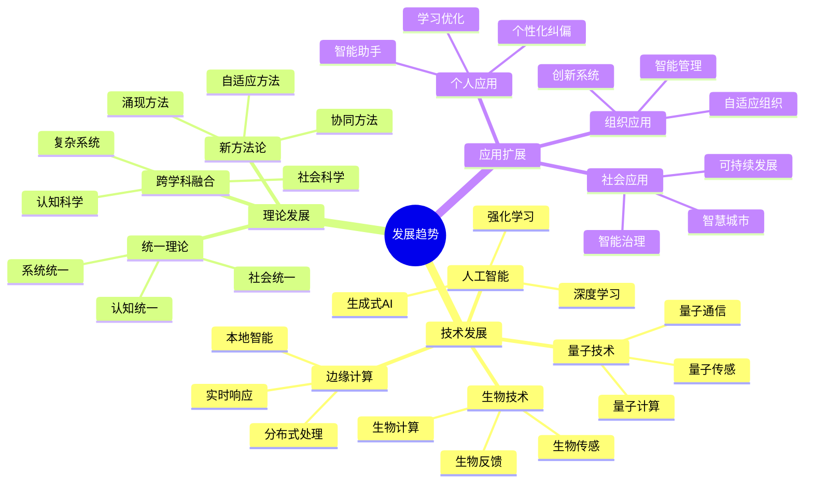

### 2. 挑战与机遇图

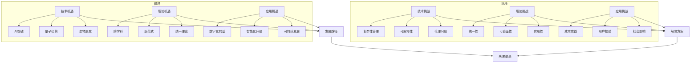

## 总结

本思维导图通过多种可视化方式展现了缺陷与纠偏哲学的完整体系：

1. **概念关系图**：清晰展示了核心概念之间的层次和关联关系
2. **流程思维导图**：描述了纠偏过程的完整流程和决策点
3. **哲学框架图**：体现了理论基础和辩证关系
4. **应用领域图**：展示了跨学科应用的广泛性
5. **方法论图**：提供了系统性的方法论指导
6. **发展趋势图**：展望了未来的发展方向和挑战

这些思维导图不仅提供了理论框架，也为实践应用提供了可视化的指导工具，有助于更好地理解和应用缺陷与纠偏哲学。
