# 缺陷与纠偏概念关系图

## 核心概念定义

### 1. 基础概念

#### 1.1 缺陷 (Defect)

**定义**：

- **哲学定义**：相对于理想状态或标准状态的偏差
- **系统定义**：系统、过程或结果中不符合预期或目标的部分
- **功能定义**：导致功能失效或性能下降的因素

**特征**：

- 相对性：缺陷总是相对于某种标准或理想状态
- 客观性：缺陷具有客观存在的特征
- 系统性：缺陷往往具有系统性影响
- 动态性：缺陷会随时间和发展而变化

**分类**：

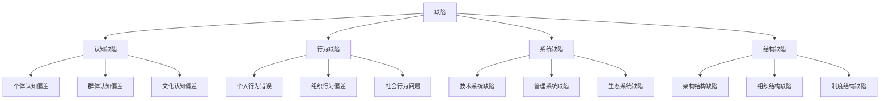

#### 1.2 纠偏 (Correction)

**定义**：

- **哲学定义**：识别、分析和修正缺陷的过程
- **系统定义**：使系统或过程回归理想状态的活动
- **功能定义**：持续改进和优化的方法论

**特征**：

- 目的性：纠偏具有明确的目标导向
- 系统性：纠偏需要系统性的方法
- 持续性：纠偏是一个持续的过程
- 反馈性：纠偏需要反馈机制

**分类**：

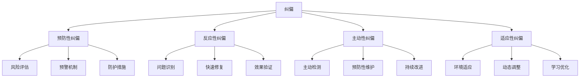

### 2. 相关概念

#### 2.1 完美性 (Perfection)

**定义**：

- **哲学定义**：理想化的状态或标准
- **系统定义**：系统的最佳状态或目标
- **功能定义**：功能的最优表现

**与缺陷的关系**：

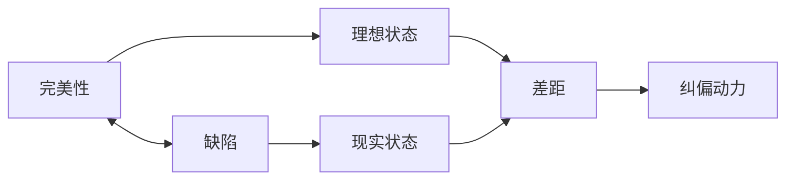

#### 2.2 错误 (Error)

**定义**：

- **哲学定义**：与正确或真理相背离的状态
- **系统定义**：系统运行中的偏差或失误
- **功能定义**：功能执行中的问题

**与缺陷的关系**：

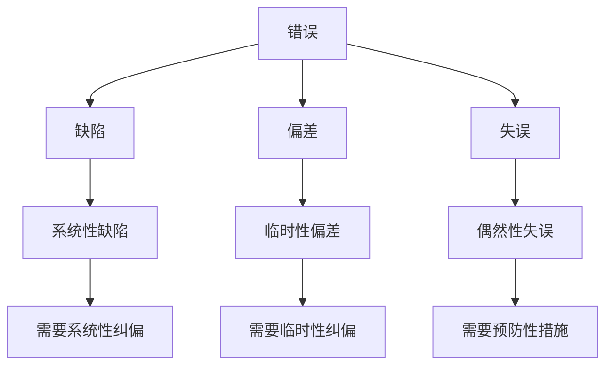

## 概念关系网络

### 1. 核心关系图

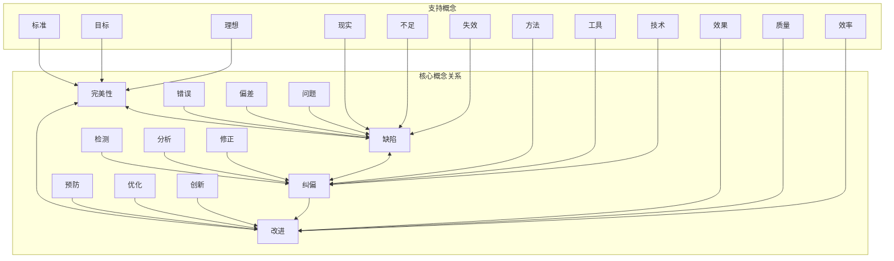

### 2. 层次关系图

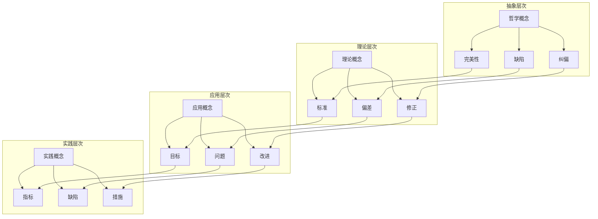

### 3. 动态关系图

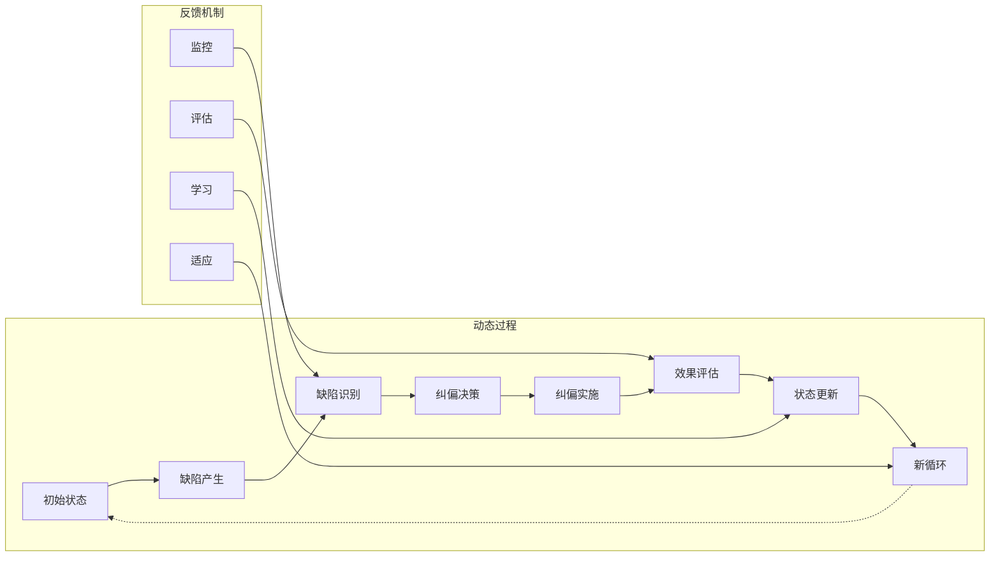

## 概念分类体系

### 1. 按性质分类

| 分类维度 | 缺陷类型 | 纠偏方法 | 特征描述 |
|---------|----------|----------|----------|
| **认知性** | 认知偏差、逻辑谬误 | 认知训练、逻辑分析 | 主观性、系统性 |
| **行为性** | 操作错误、决策偏差 | 行为矫正、决策优化 | 可观察、可测量 |
| **系统性** | 设计缺陷、实现缺陷 | 系统重构、过程改进 | 全局性、结构性 |
| **社会性** | 制度缺陷、文化缺陷 | 制度改革、文化变迁 | 复杂性、长期性 |

### 2. 按层次分类

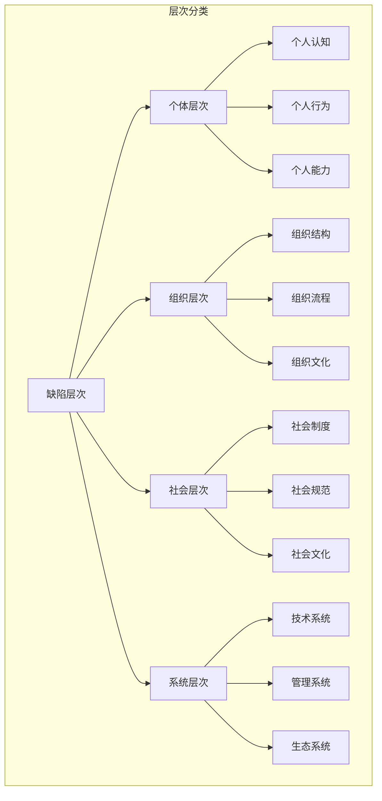

### 3. 按时间分类

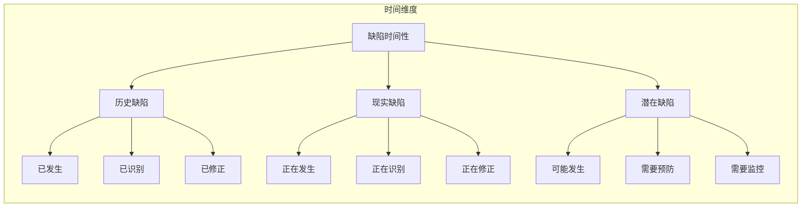

## 概念应用关系

### 1. 应用领域关系

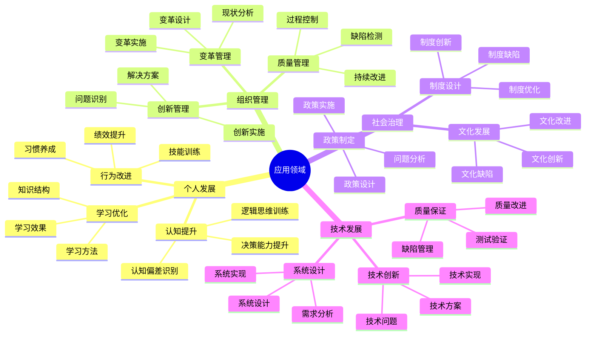

### 2. 方法工具关系

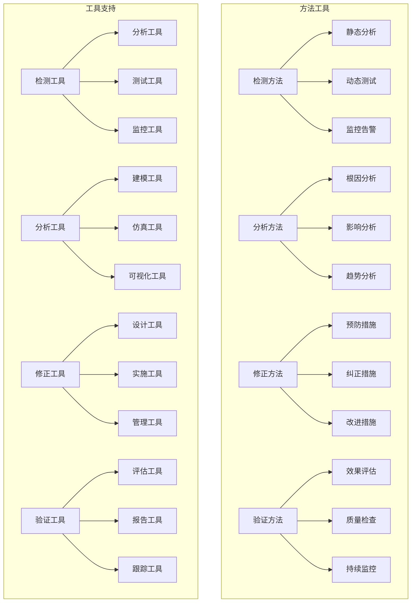

## 概念发展关系

### 1. 历史发展关系

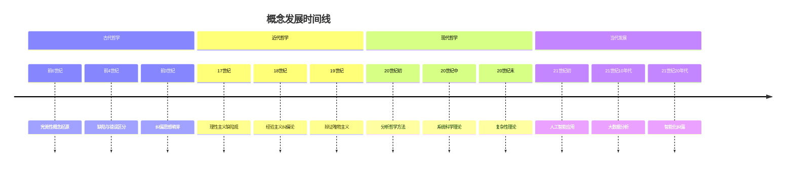

### 2. 理论发展关系

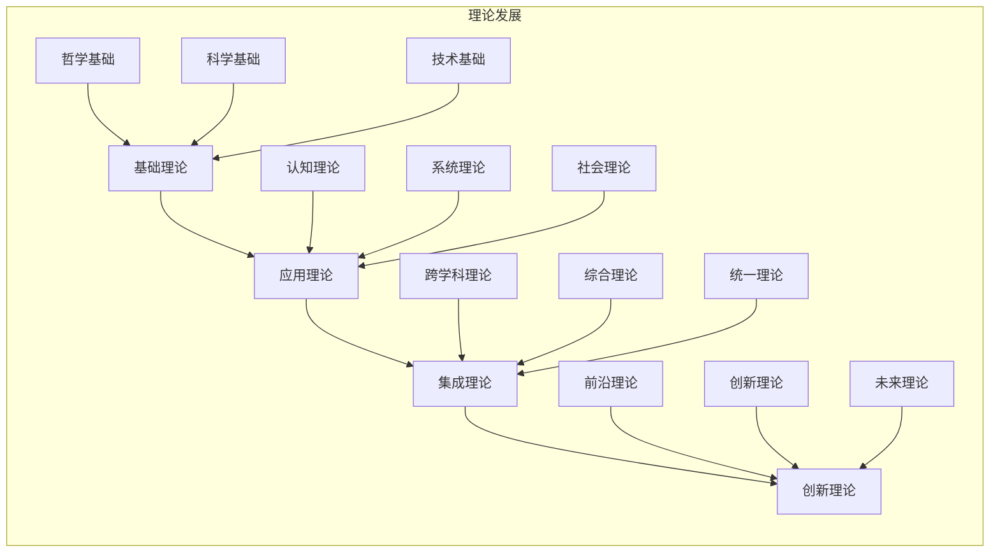

## 概念价值关系

### 1. 价值层次关系

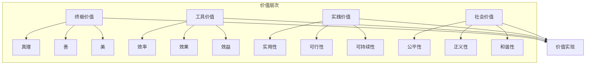

### 2. 价值冲突关系

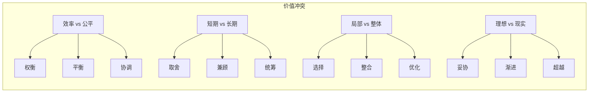

## 总结

本概念关系图通过多种维度展现了缺陷与纠偏概念的完整体系：

1. **概念定义**：提供了清晰的概念定义和特征描述
2. **关系网络**：展示了概念间的复杂关系网络
3. **分类体系**：建立了多维度、多层次的分类体系
4. **应用关系**：明确了概念在不同领域的应用关系
5. **发展关系**：描述了概念的历史发展和理论演进
6. **价值关系**：分析了概念的价值层次和冲突关系

这些关系图不仅有助于理解概念的内涵和外延，也为实践应用提供了概念指导，有助于更好地理解和应用缺陷与纠偏理论。
