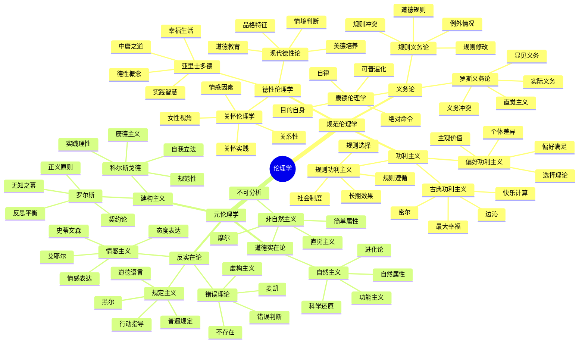

# 哲学概念思维导图

## 哲学体系总览

## 本体论详细分支

## 认识论详细分支

## 伦理学详细分支

## 逻辑学详细分支

## 形而上学详细分支

## 交叉领域哲学

## 哲学方法与应用

## 哲学发展趋势

## 哲学与时代对齐

这个思维导图展示了哲学体系的完整结构，从传统的本体论、认识论、伦理学、逻辑学、形而上学，到现代的交叉领域哲学，以及哲学方法的应用和发展趋势。每个分支都包含了核心概念、主要理论、代表人物和现代发展，体现了哲学与时代发展的紧密联系。
