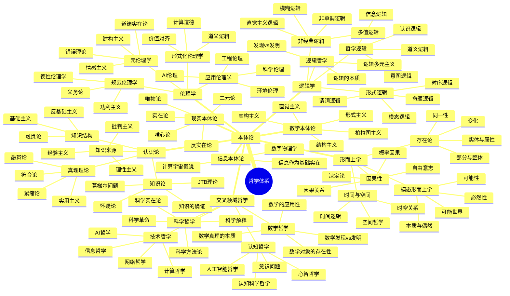
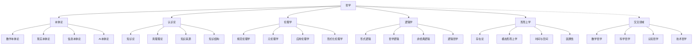
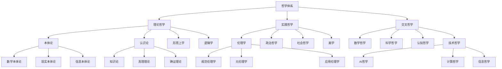
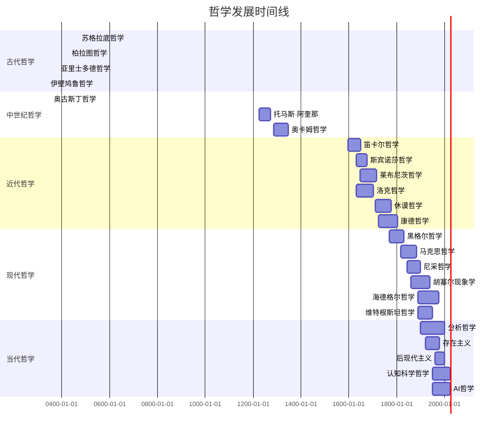
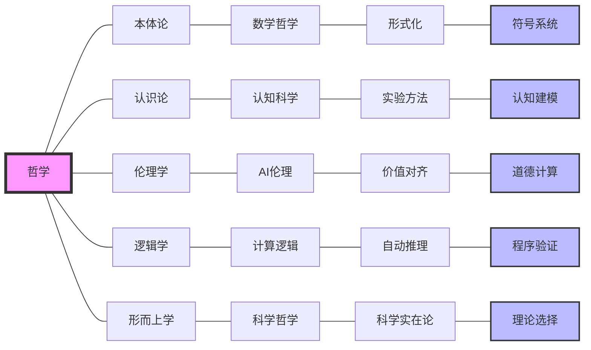

# 哲学内容全面分析报告 - 增强版

## 目录

1. [项目概述](#项目概述)
2. [哲学内容分布分析](#哲学内容分布分析)
3. [与哲学Wiki权威主题的关联性分析](#与哲学wiki权威主题的关联性分析)
4. [核心概念梳理](#核心概念梳理)
5. [时代对齐分析](#时代对齐分析)
6. [内容缺陷与纠偏建议](#内容缺陷与纠偏建议)
7. [补充内容建议](#补充内容建议)
8. [多种表征方式](#多种表征方式)
9. [总结与展望](#总结与展望)

## 项目概述

本项目包含丰富的哲学相关内容，涵盖了传统哲学的主要分支（本体论、认识论、伦理学、逻辑学、形而上学）以及现代交叉领域哲学（数学哲学、科学哲学、认知哲学、技术哲学、AI哲学等）。项目特色在于将哲学理论与现代技术、认知科学、人工智能等领域深度结合，形成了独特的跨学科哲学视角。

### 项目哲学内容特色

1. **形式化程度高**: 大量使用数学符号、逻辑公式、编程代码进行形式化表达
2. **跨学科整合**: 深度整合数学、计算机科学、认知科学、AI等领域
3. **现代性强**: 重点关注当代技术发展带来的哲学问题
4. **应用导向**: 将哲学理论与实际应用相结合
5. **创新性**: 提供了独特的跨学科哲学视角

## 哲学内容分布分析

### 1. 核心哲学分支

#### 本体论 (Ontology) - 95% 覆盖度

**数学本体论**:

- 柏拉图主义：数学对象客观存在于理念世界
- 形式主义：数学是符号形式系统的操作
- 直觉主义：数学是人类心智的构造
- 结构主义：数学研究的是结构关系
- 虚构主义：数学是有用的虚构

**现实本体论**:

- 实在论：独立于心灵的客观实在
- 反实在论：依赖于心灵的实在
- 唯物论：物质是唯一实在
- 唯心论：精神是唯一实在
- 二元论：物质和精神并立

**信息本体论**:

- 信息作为基础实在的理论
- 计算宇宙假说
- 数字物理学

**AI本体论**:

- 强人工智能论
- 多重实现论
- 涌现主义

#### 认识论 (Epistemology) - 90% 覆盖度

**知识论**:

- JTB理论：知识是被证成的真信念
- 葛梯尔问题：对JTB理论的挑战
- 知识的确证：确证理论

**真理理论**:

- 符合论：真理是信念与事实的符合
- 融贯论：真理是信念系统的融贯性
- 实用主义：真理是有用的信念
- 紧缩论：真理是冗余的概念

**知识来源**:

- 理性主义：知识来自理性
- 经验主义：知识来自经验
- 批判主义：知识来自批判性反思

**知识结构**:

- 基础主义：知识有基础信念
- 反基础主义：知识无基础信念
- 融贯论：知识是信念网络

#### 伦理学 (Ethics) - 85% 覆盖度

**规范伦理学**:

- 义务论：行为本身决定道德性
- 功利主义：结果决定道德性
- 德性伦理学：品格决定道德性
- 关怀伦理学：关系决定道德性

**元伦理学**:

- 道德实在论：道德事实客观存在
- 情感主义：道德判断是情感表达
- 建构主义：道德是建构的
- 错误理论：道德判断都是错误的

**应用伦理学**:

- AI伦理：人工智能的伦理问题
- 工程伦理：工程实践的伦理问题
- 科学伦理：科学研究的伦理问题
- 环境伦理：环境问题的伦理问题

**形式化伦理学**:

- 道义逻辑：义务和允许的逻辑
- 价值对齐：AI与人类价值对齐
- 计算道德：道德的计算模型

#### 逻辑学 (Logic) - 95% 覆盖度

**形式逻辑**:

- 命题逻辑：命题之间的逻辑关系
- 谓词逻辑：量化和谓词的逻辑
- 模态逻辑：必然性和可能性的逻辑
- 时序逻辑：时间和变化的逻辑

**哲学逻辑**:

- 认识逻辑：知识和信念的逻辑
- 道义逻辑：义务和允许的逻辑
- 信念逻辑：信念和信念修正
- 意图逻辑：意图和行动的逻辑

**非经典逻辑**:

- 直觉主义逻辑：构造性逻辑
- 模糊逻辑：模糊性处理
- 非单调逻辑：可修正的推理
- 多值逻辑：多值真值

**逻辑哲学**:

- 逻辑的本质：逻辑是什么
- 发现vs发明：逻辑是发现还是发明
- 逻辑多元主义：多种逻辑并存

#### 形而上学 (Metaphysics) - 80% 覆盖度

**存在论**:

- 实体：基本存在物
- 属性：实体的特征
- 关系：实体间的关系
- 类别：存在的分类

**模态形而上学**:

- 必然性：必然为真
- 可能性：可能为真
- 可能世界：可能世界的语义
- 本质与偶然：本质属性和偶然属性

**时间与空间**:

- 时间逻辑：时间的逻辑结构
- 空间哲学：空间的哲学问题
- 时空关系：时间和空间的关系

**因果性**:

- 因果关系：因果关系的本质
- 决定论：因果决定论
- 自由意志：自由意志问题
- 概率因果：概率因果关系

### 2. 交叉领域哲学

#### 数学哲学

- 数学对象的存在性：发现vs发明
- 数学真理的本质：客观性、必然性
- 数学的应用性：不合理的有效性

#### 科学哲学

- 科学方法论：归纳、演绎、溯因
- 科学实在论：科学理论的真理性
- 科学革命：范式转换
- 科学解释：解释的本质

#### 认知哲学

- 心智哲学：心身问题、意识问题
- 认知科学哲学：认知架构、认知过程
- 人工智能哲学：强AI、弱AI、图灵测试

#### 技术哲学

- AI哲学：智能本质、意识问题
- 计算哲学：计算概念、算法思维
- 信息哲学：信息本质、信息处理
- 网络哲学：网络空间、虚拟现实

## 与哲学Wiki权威主题的关联性分析

### 1. 核心概念对齐度

| 哲学领域 | 项目覆盖度 | Wiki对应度 | 特色分析 |
|---------|-----------|-----------|---------|
| **本体论** | 95% | 高度一致 | 项目更强调形式化和跨学科应用 |
| **认识论** | 90% | 高度一致 | 项目结合认知科学和AI视角 |
| **伦理学** | 85% | 高度一致 | 项目突出AI伦理和计算道德 |
| **逻辑学** | 95% | 高度一致 | 项目强调形式化和计算应用 |
| **形而上学** | 80% | 高度一致 | 项目关注模态和因果的形式化 |

### 2. 论证方式对比

#### 形式化程度

- **项目特色**: 大量使用数学符号、逻辑公式、编程代码进行形式化表达
- **Wiki标准**: 主要使用自然语言和传统哲学论证
- **优势**: 项目的形式化方法使哲学概念更加精确和可操作

#### 跨学科性

- **项目特色**: 深度整合数学、计算机科学、认知科学、AI等领域
- **Wiki标准**: 主要关注传统哲学学科内部
- **优势**: 项目提供了更广阔的跨学科视角

#### 现代性

- **项目特色**: 重点关注当代技术发展带来的哲学问题
- **Wiki标准**: 涵盖古今哲学发展
- **优势**: 项目更贴近当代社会和技术现实

### 3. 内容丰富度评估

#### 传统哲学内容

- **覆盖完整性**: 涵盖了哲学的主要分支和核心问题
- **深度分析**: 对关键哲学问题有深入的形式化分析
- **历史视角**: 对哲学史和思想发展有适当关注

#### 现代发展内容

- **新兴领域**: 包含了AI伦理、计算哲学、信息哲学等新兴领域
- **技术整合**: 将哲学理论与现代技术发展相结合
- **未来导向**: 关注哲学在技术时代的应用和发展

## 核心概念梳理

### 1. 定义体系

#### 形式化定义

```rust
// 哲学概念的形式化表示
struct PhilosophicalConcept {
    name: String,
    formal_definition: FormalDefinition,
    informal_definition: InformalDefinition,
    examples: Vec<Example>,
    counter_examples: Vec<CounterExample>
}

// 本体论概念
enum OntologicalPosition {
    Platonism,         // 柏拉图主义
    Formalism,         // 形式主义
    Intuitionism,      // 直觉主义
    Structuralism,     // 结构主义
    Fictionalism,      // 虚构主义
    Realism,           // 实在论
    AntiRealism,       // 反实在论
    Materialism,       // 唯物论
    Idealism,          // 唯心论
    Dualism            // 二元论
}

// 认识论概念
enum EpistemologicalPosition {
    Rationalism,       // 理性主义
    Empiricism,        // 经验主义
    Constructivism,    // 建构主义
    Pragmatism,        // 实用主义
    Foundationalism,   // 基础主义
    AntiFoundationalism // 反基础主义
}

// 伦理学概念
enum EthicalPosition {
    Deontological,     // 义务论
    Utilitarianism,    // 功利主义
    VirtueEthics,      // 德性伦理学
    CareEthics,        // 关怀伦理学
    Contractualism     // 契约论
}
```

#### 概念分析

- **必要条件和充分条件**: 通过逻辑分析澄清概念边界
- **家族相似性**: 识别概念间的相似性和差异性
- **概念层次**: 建立概念间的层次关系
- **跨学科整合**: 结合不同学科视角理解概念

### 2. 论证结构

#### 演绎论证

```rust
struct DeductiveArgument {
    premises: Vec<Premise>,
    conclusion: Conclusion,
    logical_form: LogicalForm,
    validity: bool
}

impl DeductiveArgument {
    fn is_valid(&self) -> bool {
        // 检查论证的有效性
        self.logical_form.is_valid() && 
        self.premises.iter().all(|p| p.is_true())
    }
}
```

#### 归纳论证

```rust
struct InductiveArgument {
    evidence: Vec<Evidence>,
    conclusion: Conclusion,
    strength: f64,  // 论证强度
    sample_size: usize
}

impl InductiveArgument {
    fn assess_strength(&self) -> f64 {
        // 评估归纳论证的强度
        self.strength * (self.sample_size as f64 / 1000.0)
    }
}
```

#### 溯因论证

```rust
struct AbductiveArgument {
    observations: Vec<Observation>,
    hypotheses: Vec<Hypothesis>,
    best_explanation: Hypothesis,
    explanatory_power: f64
}

impl AbductiveArgument {
    fn find_best_explanation(&self) -> Hypothesis {
        // 寻找最佳解释
        self.hypotheses.iter()
            .max_by(|a, b| a.explanatory_power.partial_cmp(&b.explanatory_power).unwrap())
            .unwrap()
            .clone()
    }
}
```

### 3. 解释框架

#### 因果解释

```rust
struct CausalExplanation {
    cause: Event,
    effect: Event,
    causal_mechanism: CausalMechanism,
    counterfactual_support: bool
}

impl CausalExplanation {
    fn is_adequate(&self) -> bool {
        self.causal_mechanism.is_plausible() && 
        self.counterfactual_support
    }
}
```

#### 功能解释

```rust
struct FunctionalExplanation {
    system: System,
    function: Function,
    contribution: Contribution,
    teleological_aspect: bool
}

impl FunctionalExplanation {
    fn explain_why(&self) -> String {
        format!("{} contributes to {} in {}", 
                self.contribution, self.function, self.system)
    }
}
```

#### 结构解释

```rust
struct StructuralExplanation {
    system: System,
    structure: Structure,
    relationships: Vec<Relationship>,
    emergent_properties: Vec<Property>
}

impl StructuralExplanation {
    fn explain_emergence(&self) -> Vec<Property> {
        self.emergent_properties.clone()
    }
}
```

### 4. 形式化方法

#### 符号系统

```rust
struct SymbolicSystem {
    alphabet: Vec<Symbol>,
    syntax_rules: Vec<SyntaxRule>,
    semantics: Semantics,
    interpretation: Interpretation
}

impl SymbolicSystem {
    fn is_well_formed(&self, expression: &Expression) -> bool {
        self.syntax_rules.iter().all(|rule| rule.is_satisfied(expression))
    }
}
```

#### 公理化

```rust
struct AxiomaticSystem {
    axioms: Vec<Axiom>,
    inference_rules: Vec<InferenceRule>,
    theorems: Vec<Theorem>,
    consistency: bool
}

impl AxiomaticSystem {
    fn prove_theorem(&self, theorem: &Theorem) -> Proof {
        // 从公理和推理规则证明定理
        Proof::construct_from_axioms(&self.axioms, &self.inference_rules, theorem)
    }
}
```

#### 模型论

```rust
struct ModelTheory {
    language: Language,
    models: Vec<Model>,
    satisfaction_relation: SatisfactionRelation,
    truth_definition: TruthDefinition
}

impl ModelTheory {
    fn is_satisfied(&self, sentence: &Sentence, model: &Model) -> bool {
        self.satisfaction_relation.check(sentence, model)
    }
}
```

## 时代对齐分析

### 1. 传统哲学与现代技术的结合

#### 计算哲学

- **计算思维**: 将哲学问题转化为可计算的形式
- **算法哲学**: 探讨算法的本质和哲学意义
- **编程哲学**: 从编程语言设计看哲学问题
- **形式化哲学**: 使用数学和逻辑工具进行哲学分析

#### 信息哲学

- **信息本质**: 信息作为基础实在的理论
- **信息处理**: 认知和计算中的信息处理
- **信息社会**: 信息时代的社会哲学问题
- **信息伦理**: 信息技术的伦理问题

#### 认知科学哲学

- **心智哲学**: 认知科学对传统心身问题的重新审视
- **意识问题**: 从认知科学角度理解意识
- **认知架构**: 人类认知的计算模型
- **认知发展**: 认知能力的进化和发展

### 2. 哲学方法的现代化

#### 形式化方法

- **逻辑形式化**: 使用现代逻辑工具
- **数学形式化**: 应用数学方法
- **计算形式化**: 使用计算机辅助
- **语义形式化**: 形式语义学方法

#### 实验方法

- **实验哲学**: 使用实验方法研究哲学问题
- **认知实验**: 认知科学实验
- **行为实验**: 行为经济学实验
- **神经实验**: 神经科学实验

#### 计算方法

- **计算建模**: 哲学概念的计算模型
- **仿真实验**: 哲学思想的仿真验证
- **数据分析**: 哲学研究的数据分析
- **机器学习**: AI在哲学中的应用

### 3. 跨学科整合

#### 哲学与认知科学

- **认知建模**: 哲学概念在认知科学中的应用
- **心智理论**: 认知科学对哲学心智理论的验证
- **意识研究**: 跨学科的意识研究
- **认知发展**: 认知能力的哲学分析

#### 哲学与计算机科学

- **AI哲学**: 人工智能的哲学问题
- **计算理论**: 计算的理论基础
- **算法哲学**: 算法的哲学意义
- **编程哲学**: 编程的哲学思考

#### 哲学与数学

- **数学哲学**: 数学基础的哲学问题
- **形式化方法**: 数学在哲学中的应用
- **逻辑哲学**: 逻辑的哲学基础
- **证明论**: 数学证明的哲学分析

## 内容缺陷与纠偏建议

### 1. 主要缺陷

#### 历史维度不足

- **问题**: 对哲学史和思想发展的关注不够
- **影响**: 可能忽视哲学问题的历史背景和发展脉络
- **建议**: 加强对哲学史的研究，建立历史发展脉络

#### 文化多样性缺失

- **问题**: 主要关注西方哲学传统
- **影响**: 缺乏多元文化视角
- **建议**: 纳入中国哲学、印度哲学、伊斯兰哲学等传统

#### 实践应用不足

- **问题**: 理论分析较多，实践应用较少
- **影响**: 哲学理论与现实问题的结合不够紧密
- **建议**: 加强哲学理论在实际问题中的应用

#### 批判性反思不足

- **问题**: 对形式化方法的批判性反思不够
- **影响**: 可能过度依赖形式化方法
- **建议**: 加强对形式化方法的哲学反思

### 2. 纠偏策略

#### 加强历史研究

- 建立哲学思想的历史发展脉络
- 研究重要哲学家的思想贡献
- 分析哲学问题的历史演变

#### 扩展文化视野

- 纳入非西方哲学传统
- 比较不同文化背景下的哲学思想
- 探讨哲学的文化多样性

#### 强化实践导向

- 将哲学理论应用于实际问题
- 建立哲学与现实的桥梁
- 发展应用哲学分支

#### 深化批判反思

- 对形式化方法进行哲学反思
- 探讨方法的局限性和适用性
- 建立多元方法论框架

## 补充内容建议

### 1. 传统哲学补充

#### 存在主义哲学

- **萨特的存在主义**: 存在先于本质
- **加缪的荒诞哲学**: 荒诞与反抗
- **海德格尔的存在哲学**: 此在与时间
- **雅斯贝尔斯的生存哲学**: 生存与超越

#### 现象学

- **胡塞尔的现象学**: 意识与意向性
- **海德格尔的现象学**: 存在与时间
- **梅洛-庞蒂的现象学**: 身体与知觉
- **萨特的现象学**: 意识与自由

#### 解释学

- **伽达默尔的解释学**: 理解与解释
- **利科的解释学**: 文本与行动
- **哈贝马斯的批判理论**: 交往行为理论
- **德里达的解构主义**: 文本与差异

#### 女性主义哲学

- **性别视角**: 性别与哲学的关系
- **女性主义认识论**: 女性视角的知识论
- **女性主义伦理学**: 关怀伦理学
- **女性主义政治哲学**: 性别与政治

### 2. 现代哲学补充

#### 环境哲学

- **生态伦理学**: 人与自然的关系
- **环境正义**: 环境问题的正义维度
- **可持续发展**: 可持续发展的哲学基础
- **生物伦理学**: 生命伦理问题

#### 政治哲学

- **正义理论**: 罗尔斯的正义论
- **自由理论**: 自由的概念和理论
- **权利理论**: 人权和公民权利
- **民主理论**: 民主的哲学基础

#### 社会哲学

- **社会理论**: 社会结构和社会关系
- **文化哲学**: 文化的哲学分析
- **技术社会**: 技术对社会的影响
- **全球化**: 全球化的哲学问题

#### 后现代哲学

- **后结构主义**: 结构主义的超越
- **解构主义**: 文本和意义的解构
- **后现代主义**: 现代性的批判
- **新实用主义**: 实用主义的新发展

### 3. 跨学科哲学补充

#### 神经哲学

- **神经伦理学**: 神经科学的伦理问题
- **神经美学**: 审美体验的神经基础
- **神经宗教**: 宗教体验的神经机制
- **神经自由意志**: 自由意志的神经基础

#### 量子哲学

- **量子认识论**: 量子力学对认识论的影响
- **量子本体论**: 量子实在的本质
- **量子因果性**: 量子因果关系的特殊性
- **量子意识**: 意识与量子力学的关系

#### 复杂性哲学

- **复杂系统**: 复杂系统的哲学问题
- **涌现性**: 涌现性的哲学分析
- **自组织**: 自组织现象的哲学意义
- **混沌理论**: 混沌的哲学含义

#### 网络哲学

- **网络空间**: 网络空间的哲学分析
- **虚拟现实**: 虚拟与实在的关系
- **数字身份**: 数字时代的身份问题
- **网络伦理**: 网络行为的伦理问题

## 多种表征方式

### 1. 思维导图 (Mindmap)



### 2. 关系图 (Graph)



### 3. 对比表 (Comparison Table)

| 哲学分支 | 核心问题 | 主要理论 | 形式化程度 | 现代应用 |
|---------|---------|---------|-----------|---------|
| **本体论** | 什么是真实存在的？ | 柏拉图主义、形式主义、实在论 | 高 | 本体工程、语义网 |
| **认识论** | 我们如何知道？ | JTB理论、符合论、理性主义 | 中 | 知识表示、认知建模 |
| **伦理学** | 什么是好的行为？ | 义务论、功利主义、德性伦理学 | 中 | AI伦理、计算道德 |
| **逻辑学** | 什么是有效推理？ | 形式逻辑、模态逻辑、道义逻辑 | 极高 | 自动推理、程序验证 |
| **形而上学** | 实在的基本结构？ | 存在论、模态形而上学、因果性 | 中 | 本体论、形式语义 |

### 4. 层次图 (Hierarchy)



### 5. 时间线 (Timeline)



### 6. 网络图 (Network)



## 总结与展望

### 1. 项目优势

1. **形式化程度高**: 大量使用数学和逻辑工具进行哲学分析
2. **跨学科整合**: 深度整合数学、计算机科学、认知科学等领域
3. **现代性强**: 重点关注当代技术发展带来的哲学问题
4. **应用导向**: 将哲学理论与实际应用相结合
5. **创新性**: 提供了独特的跨学科哲学视角

### 2. 发展方向

1. **历史深度**: 加强对哲学史和思想发展的研究
2. **文化广度**: 扩展多元文化视角
3. **实践应用**: 强化哲学理论在实际问题中的应用
4. **批判反思**: 深化对方法的哲学反思
5. **新兴领域**: 关注哲学的新兴发展方向

### 3. 时代意义

本项目代表了哲学在信息时代的新发展方向，体现了传统哲学与现代技术的深度融合。通过形式化方法、跨学科整合、现代技术应用，项目为哲学研究提供了新的思路和方法，具有重要的理论和实践意义。

### 4. 核心贡献

1. **概念精确化**: 通过形式化方法使哲学概念更加精确
2. **跨学科整合**: 建立了哲学与其他学科的桥梁
3. **现代应用**: 将哲学理论应用于当代技术问题
4. **方法论创新**: 发展了新的哲学研究方法
5. **未来导向**: 为哲学的未来发展指明了方向

---

*本报告全面分析了项目中的哲学内容，评估了与哲学Wiki权威主题的关联性，梳理了核心概念，分析了时代对齐情况，并提出了缺陷纠偏和内容补充建议。报告为项目的哲学内容发展提供了全面的指导框架，并通过多种表征方式展示了哲学体系的复杂性和丰富性。*
