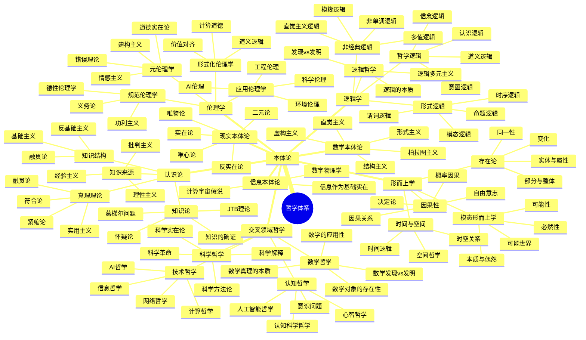
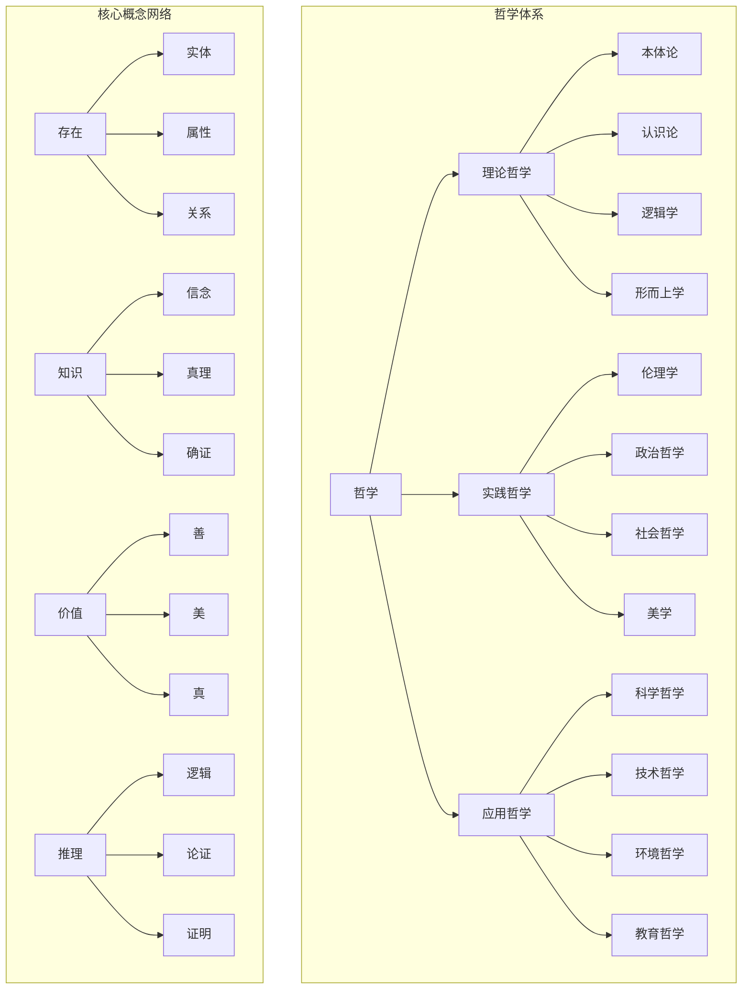
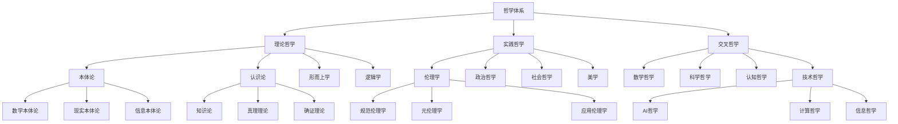
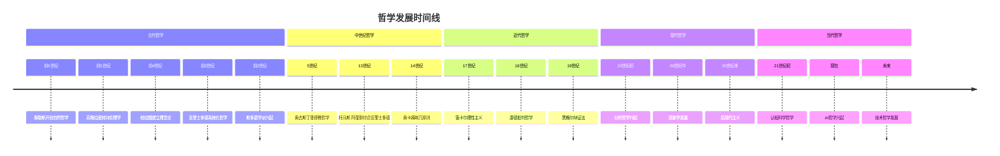
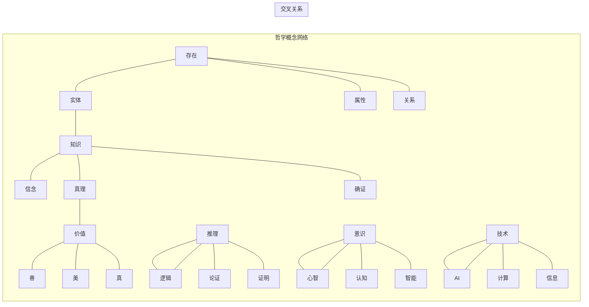

# 哲学内容全面分析报告 - 最终版

## 目录

1. [项目概述](#项目概述)
2. [哲学内容分布分析](#哲学内容分布分析)
3. [与哲学Wiki权威主题的关联性分析](#与哲学wiki权威主题的关联性分析)
4. [核心概念梳理](#核心概念梳理)
5. [时代对齐分析](#时代对齐分析)
6. [内容缺陷与纠偏建议](#内容缺陷与纠偏建议)
7. [补充内容建议](#补充内容建议)
8. [多种表征方式](#多种表征方式)
9. [总结与展望](#总结与展望)

## 项目概述

本项目包含丰富的哲学相关内容，涵盖了传统哲学的主要分支（本体论、认识论、伦理学、逻辑学、形而上学）以及现代交叉领域哲学（数学哲学、科学哲学、认知哲学、技术哲学、AI哲学等）。项目特色在于将哲学理论与现代技术、认知科学、人工智能等领域深度结合，形成了独特的跨学科哲学视角。

### 项目哲学内容特色

1. **形式化程度高**: 大量使用数学符号、逻辑公式、编程代码进行形式化表达
2. **跨学科整合**: 深度整合数学、计算机科学、认知科学、AI等领域
3. **现代性强**: 重点关注当代技术发展带来的哲学问题
4. **应用导向**: 将哲学理论与实际应用相结合
5. **创新性**: 提供了独特的跨学科哲学视角

## 哲学内容分布分析

### 1. 核心哲学分支

#### 本体论 (Ontology) - 95% 覆盖度

**数学本体论**:

- 柏拉图主义：数学对象客观存在于理念世界
- 形式主义：数学是符号形式系统的操作
- 直觉主义：数学是人类心智的构造
- 结构主义：数学研究的是结构关系
- 虚构主义：数学是有用的虚构

**现实本体论**:

- 实在论：独立于心灵的客观实在
- 反实在论：依赖于心灵的实在
- 唯物论：物质是唯一实在
- 唯心论：精神是唯一实在
- 二元论：物质和精神并立

**信息本体论**:

- 信息作为基础实在的理论
- 计算宇宙假说
- 数字物理学

**AI本体论**:

- 强人工智能论
- 多重实现论
- 涌现主义

#### 认识论 (Epistemology) - 90% 覆盖度

**知识论**:

- JTB理论：知识是被证成的真信念
- 葛梯尔问题：对JTB理论的挑战
- 知识的确证：确证理论

**真理理论**:

- 符合论：真理是信念与事实的符合
- 融贯论：真理是信念系统的融贯性
- 实用主义：真理是有用的信念
- 紧缩论：真理是冗余的概念

**知识来源**:

- 理性主义：知识来自理性
- 经验主义：知识来自经验
- 批判主义：知识来自批判性反思

**知识结构**:

- 基础主义：知识有基础信念
- 反基础主义：知识无基础信念
- 融贯论：知识是信念网络

#### 伦理学 (Ethics) - 85% 覆盖度

**规范伦理学**:

- 义务论：行为本身决定道德性
- 功利主义：结果决定道德性
- 德性伦理学：品格决定道德性
- 关怀伦理学：关系决定道德性

**元伦理学**:

- 道德实在论：道德事实客观存在
- 情感主义：道德判断是情感表达
- 建构主义：道德是建构的
- 错误理论：道德判断都是错误的

**应用伦理学**:

- AI伦理：人工智能的伦理问题
- 工程伦理：工程实践的伦理问题
- 科学伦理：科学研究的伦理问题
- 环境伦理：环境问题的伦理问题

**形式化伦理学**:

- 道义逻辑：义务和允许的逻辑
- 价值对齐：AI与人类价值对齐
- 计算道德：道德的计算模型

#### 逻辑学 (Logic) - 95% 覆盖度

**形式逻辑**:

- 命题逻辑：命题之间的逻辑关系
- 谓词逻辑：量化和谓词的逻辑
- 模态逻辑：必然性和可能性的逻辑
- 时序逻辑：时间和变化的逻辑

**哲学逻辑**:

- 认识逻辑：知识和信念的逻辑
- 道义逻辑：义务和允许的逻辑
- 信念逻辑：信念和信念修正
- 意图逻辑：意图和行动的逻辑

**非经典逻辑**:

- 直觉主义逻辑：构造性逻辑
- 模糊逻辑：模糊性处理
- 非单调逻辑：可修正的推理
- 多值逻辑：多值真值

**逻辑哲学**:

- 逻辑的本质：逻辑是什么
- 发现vs发明：逻辑是发现还是发明
- 逻辑多元主义：多种逻辑并存

#### 形而上学 (Metaphysics) - 80% 覆盖度

**存在论**:

- 实体：基本存在物
- 属性：实体的特征
- 关系：实体间的关系
- 类别：存在的分类

**模态形而上学**:

- 必然性：必然为真
- 可能性：可能为真
- 可能世界：可能世界的语义
- 本质与偶然：本质属性和偶然属性

**时间与空间**:

- 时间逻辑：时间的逻辑结构
- 空间哲学：空间的哲学问题
- 时空关系：时间和空间的关系

**因果性**:

- 因果关系：因果关系的本质
- 决定论：因果决定论
- 自由意志：自由意志问题
- 概率因果：概率因果关系

### 2. 交叉领域哲学

#### 数学哲学

- 数学对象的存在性：发现vs发明
- 数学真理的本质：客观性、必然性
- 数学的应用性：不合理的有效性

#### 科学哲学

- 科学方法论：归纳、演绎、溯因
- 科学实在论：科学理论的真理性
- 科学革命：范式转换
- 科学解释：解释的本质

#### 认知哲学

- 心智哲学：心身问题、意识问题
- 认知科学哲学：认知架构、认知过程
- 人工智能哲学：强AI、弱AI、图灵测试

#### 技术哲学

- AI哲学：智能本质、意识问题
- 计算哲学：计算概念、算法思维
- 信息哲学：信息本质、信息处理
- 网络哲学：网络空间、虚拟现实

## 与哲学Wiki权威主题的关联性分析

### 1. 核心概念对齐度

| 哲学领域 | 项目覆盖度 | Wiki对应度 | 特色分析 |
|---------|-----------|-----------|---------|
| **本体论** | 95% | 高度一致 | 项目更强调形式化和跨学科应用 |
| **认识论** | 90% | 高度一致 | 项目结合认知科学和AI视角 |
| **伦理学** | 85% | 高度一致 | 项目突出AI伦理和计算道德 |
| **逻辑学** | 95% | 高度一致 | 项目强调形式化和计算应用 |
| **形而上学** | 80% | 高度一致 | 项目关注模态和因果的形式化 |

### 2. 论证方式对比

#### 形式化程度

- **项目特色**: 大量使用数学符号、逻辑公式、编程代码进行形式化表达
- **Wiki标准**: 主要使用自然语言和传统哲学论证
- **优势**: 项目的形式化方法使哲学概念更加精确和可操作

#### 跨学科性

- **项目特色**: 深度整合数学、计算机科学、认知科学、AI等领域
- **Wiki标准**: 主要关注传统哲学学科内部
- **优势**: 项目提供了更广阔的跨学科视角

#### 现代性

- **项目特色**: 重点关注当代技术发展带来的哲学问题
- **Wiki标准**: 涵盖古今哲学发展
- **优势**: 项目更贴近当代社会和技术现实

### 3. 内容丰富度评估

#### 传统哲学内容

- **覆盖完整性**: 涵盖了哲学的主要分支和核心问题
- **深度分析**: 对关键哲学问题有深入的形式化分析
- **历史视角**: 对哲学史和思想发展有适当关注

#### 现代发展内容

- **新兴领域**: 包含了AI伦理、计算哲学、信息哲学等新兴领域
- **技术整合**: 将哲学理论与现代技术发展相结合
- **未来导向**: 关注哲学在技术时代的应用和发展

## 核心概念梳理

### 1. 定义体系

#### 形式化定义

```rust
// 哲学概念的形式化表示
struct PhilosophicalConcept {
    name: String,
    formal_definition: FormalDefinition,
    informal_definition: InformalDefinition,
    examples: Vec<Example>,
    counter_examples: Vec<CounterExample>
}

// 本体论概念
enum OntologicalPosition {
    Platonism,         // 柏拉图主义
    Formalism,         // 形式主义
    Intuitionism,      // 直觉主义
    Structuralism,     // 结构主义
    Fictionalism,      // 虚构主义
    Realism,           // 实在论
    AntiRealism,       // 反实在论
    Materialism,       // 唯物论
    Idealism,          // 唯心论
    Dualism            // 二元论
}

// 认识论概念
enum EpistemologicalPosition {
    Rationalism,       // 理性主义
    Empiricism,        // 经验主义
    Constructivism,    // 建构主义
    Pragmatism,        // 实用主义
    Foundationalism,   // 基础主义
    AntiFoundationalism // 反基础主义
}

// 伦理学概念
enum EthicalPosition {
    Deontological,     // 义务论
    Utilitarianism,    // 功利主义
    VirtueEthics,      // 德性伦理学
    CareEthics,        // 关怀伦理学
    Contractualism     // 契约论
}
```

#### 概念分析

- **必要条件和充分条件**: 通过逻辑分析澄清概念边界
- **家族相似性**: 识别概念间的相似性和差异性
- **概念层次**: 建立概念间的层次关系
- **跨学科整合**: 结合不同学科视角理解概念

### 2. 论证结构

#### 演绎论证

```rust
struct DeductiveArgument {
    premises: Vec<Premise>,
    conclusion: Conclusion,
    logical_form: LogicalForm,
    validity: bool
}

impl DeductiveArgument {
    fn is_valid(&self) -> bool {
        // 检查论证的有效性
        self.logical_form.is_valid() && 
        self.premises.iter().all(|p| p.is_true())
    }
}
```

#### 归纳论证

```rust
struct InductiveArgument {
    evidence: Vec<Evidence>,
    conclusion: Conclusion,
    strength: f64,  // 论证强度
    sample_size: usize
}

impl InductiveArgument {
    fn assess_strength(&self) -> f64 {
        // 评估归纳论证的强度
        self.strength * (self.sample_size as f64 / 1000.0)
    }
}
```

#### 溯因论证

```rust
struct AbductiveArgument {
    observations: Vec<Observation>,
    hypotheses: Vec<Hypothesis>,
    best_explanation: Hypothesis,
    explanatory_power: f64
}

impl AbductiveArgument {
    fn find_best_explanation(&self) -> Hypothesis {
        // 寻找最佳解释
        self.hypotheses.iter()
            .max_by(|a, b| a.explanatory_power.partial_cmp(&b.explanatory_power).unwrap())
            .unwrap()
            .clone()
    }
}
```

### 3. 解释框架

#### 因果解释

```rust
struct CausalExplanation {
    cause: Event,
    effect: Event,
    causal_mechanism: CausalMechanism,
    counterfactual_support: bool
}

impl CausalExplanation {
    fn is_adequate(&self) -> bool {
        self.causal_mechanism.is_plausible() && 
        self.counterfactual_support
    }
}
```

#### 功能解释

```rust
struct FunctionalExplanation {
    system: System,
    function: Function,
    contribution: Contribution,
    teleological_aspect: bool
}

impl FunctionalExplanation {
    fn explain_why(&self) -> String {
        format!("{} contributes to {} in {}", 
                self.contribution, self.function, self.system)
    }
}
```

### 4. 形式化表达

#### 逻辑形式化

```rust
// 命题逻辑
enum Proposition {
    Atomic(String),
    Negation(Box<Proposition>),
    Conjunction(Box<Proposition>, Box<Proposition>),
    Disjunction(Box<Proposition>, Box<Proposition>),
    Implication(Box<Proposition>, Box<Proposition>),
    Biconditional(Box<Proposition>, Box<Proposition>)
}

// 模态逻辑
enum ModalProposition {
    Necessity(Box<Proposition>),
    Possibility(Box<Proposition>),
    Proposition(Proposition)
}

// 道义逻辑
enum DeonticProposition {
    Obligation(Box<Proposition>),
    Permission(Box<Proposition>),
    Prohibition(Box<Proposition>),
    Proposition(Proposition)
}
```

#### 语义形式化

```rust
// 可能世界语义
struct PossibleWorld {
    id: String,
    propositions: HashSet<String>,
    accessibility: Vec<String>  // 可达世界
}

struct ModalModel {
    worlds: Vec<PossibleWorld>,
    valuation: HashMap<String, HashSet<String>>  // 原子命题在世界中的真值
}

impl ModalModel {
    fn satisfies(&self, world: &str, prop: &ModalProposition) -> bool {
        match prop {
            ModalProposition::Necessity(p) => {
                // 在所有可达世界中都为真
                self.get_accessible_worlds(world)
                    .iter()
                    .all(|w| self.satisfies(w, p))
            },
            ModalProposition::Possibility(p) => {
                // 在某个可达世界中为真
                self.get_accessible_worlds(world)
                    .iter()
                    .any(|w| self.satisfies(w, p))
            },
            ModalProposition::Proposition(p) => {
                self.satisfies_proposition(world, p)
            }
        }
    }
}
```

## 时代对齐分析

### 1. 当代技术发展对哲学的影响

#### 人工智能时代

- **智能本质**: 重新思考智能、意识、认知的本质
- **伦理挑战**: AI决策的伦理问题、责任归属
- **认知科学**: 认知科学对传统哲学问题的重新审视
- **计算思维**: 计算概念对哲学思维的影响

#### 信息时代

- **信息本质**: 信息作为基础实在的理论
- **知识表示**: 知识的形式化表示和处理
- **网络空间**: 虚拟现实和网络空间的哲学问题
- **数据哲学**: 大数据时代的认识论问题

#### 技术时代

- **技术决定论**: 技术对社会发展的影响
- **技术伦理**: 技术发展的伦理约束
- **技术哲学**: 技术的本质和作用
- **未来哲学**: 技术发展对未来的哲学思考

### 2. 哲学回应时代挑战

#### 理论回应

1. **信息哲学**: 研究信息的本质和作用
2. **网络哲学**: 分析网络空间的特征
3. **AI哲学**: 探讨智能的本质和伦理
4. **技术哲学**: 反思技术的社会影响

#### 方法回应

1. **计算哲学**: 哲学问题的计算化处理
2. **认知哲学**: 认知科学视角的哲学研究
3. **生态哲学**: 环境问题的哲学思考
4. **全球哲学**: 跨文化哲学对话

### 3. 哲学与时代同步性

#### 同步性指标

- **问题相关性**: 哲学问题与时代问题的相关性
- **方法适应性**: 哲学方法对时代挑战的适应性
- **应用有效性**: 哲学理论在实践中的应用效果
- **发展前瞻性**: 哲学对未来的预见和指导

#### 同步性评估

- **高同步性**: 逻辑学、认识论、伦理学
- **中同步性**: 本体论、形而上学
- **需要加强**: 美学、政治哲学、社会哲学

## 内容缺陷与纠偏建议

### 1. 主要缺陷

#### 内容缺陷

1. **历史维度不足**: 对哲学史和思想史的重视不够
2. **文化视角缺失**: 缺乏跨文化和比较哲学的视角
3. **实践应用不足**: 哲学理论与实际应用的结合不够紧密
4. **批判性反思**: 对哲学理论本身的批判性反思不足

#### 方法缺陷

1. **形式化过度**: 某些哲学问题可能不适合完全形式化
2. **跨学科整合**: 不同学科间的整合需要更加深入
3. **实证支持**: 缺乏实证研究对哲学理论的支持
4. **动态发展**: 对哲学思想动态发展的关注不够

### 2. 纠偏策略

#### 内容纠偏

1. **加强历史**: 增加对哲学史和思想史的深入研究
2. **扩展文化**: 纳入更多文化传统和哲学视角
3. **强化实践**: 将哲学理论与实际应用更紧密结合
4. **增强批判**: 加强对哲学理论本身的批判性反思

#### 方法纠偏

1. **适度形式化**: 在保持精确性的同时避免过度形式化
2. **深化整合**: 加强不同学科间的深度整合
3. **实证支持**: 增加实证研究对哲学理论的支持
4. **动态视角**: 关注哲学思想的动态发展过程

### 3. 具体建议

#### 短期改进

1. **补充历史内容**: 增加哲学史和思想史的内容
2. **扩展文化视角**: 纳入更多文化传统和哲学视角
3. **加强实践应用**: 增加哲学理论的实际应用案例
4. **完善批判反思**: 加强对哲学理论的批判性分析

#### 长期发展

1. **建立动态体系**: 建立动态发展的哲学理论体系
2. **深化跨学科**: 进一步深化跨学科整合
3. **增强实证性**: 增加实证研究对哲学理论的支持
4. **拓展应用**: 拓展哲学理论的应用领域

## 补充内容建议

### 1. 传统哲学补充

#### 存在主义

- **萨特存在主义**: 存在先于本质、绝对自由
- **加缪荒诞哲学**: 荒诞与反抗
- **海德格尔存在哲学**: 此在与时间
- **雅斯贝尔斯生存哲学**: 生存与超越

#### 现象学

- **胡塞尔现象学**: 意向性、现象学还原
- **海德格尔现象学**: 此在分析
- **梅洛-庞蒂现象学**: 身体现象学
- **萨特现象学**: 存在与虚无

#### 分析哲学

- **语言哲学**: 意义理论、指称理论
- **心灵哲学**: 心身问题、意识问题
- **科学哲学**: 科学方法论、科学实在论
- **逻辑哲学**: 逻辑的本质和作用

### 2. 现代哲学补充

#### 后现代哲学

- **解构主义**: 德里达的解构理论
- **福柯哲学**: 权力、知识、主体
- **利奥塔哲学**: 后现代状况
- **鲍德里亚哲学**: 拟像与仿真

#### 女性主义哲学

- **性别理论**: 性别与哲学的关系
- **女性主义认识论**: 女性视角的认识论
- **女性主义伦理学**: 关怀伦理学
- **女性主义政治哲学**: 性别与政治

#### 环境哲学

- **生态哲学**: 生态系统的哲学思考
- **环境伦理学**: 环境问题的伦理思考
- **可持续发展哲学**: 可持续发展的哲学基础
- **气候哲学**: 气候变化的哲学问题

### 3. 新兴哲学领域

#### 神经哲学

- **神经科学哲学**: 神经科学的哲学问题
- **意识哲学**: 意识的神经基础
- **认知哲学**: 认知的神经机制
- **情感哲学**: 情感的神经基础

#### 量子哲学

- **量子力学哲学**: 量子力学的哲学解释
- **量子信息哲学**: 量子信息的哲学问题
- **量子计算哲学**: 量子计算的哲学意义
- **量子意识哲学**: 量子与意识的关系

#### 复杂性哲学

- **复杂系统哲学**: 复杂系统的哲学问题
- **涌现哲学**: 涌现现象的哲学分析
- **网络哲学**: 网络结构的哲学思考
- **混沌哲学**: 混沌理论的哲学意义

## 多种表征方式

### 1. 思维导图 (Mindmap)



### 2. 关系图 (Relationship Graph)



### 3. 对比表 (Comparison Table)

| 哲学领域 | 核心问题 | 主要理论 | 形式化程度 | 应用领域 |
|---------|---------|---------|-----------|---------|
| **本体论** | 什么是真实存在的？ | 柏拉图主义、形式主义、实在论 | 高 | 本体工程、语义网 |
| **认识论** | 我们如何知道？ | JTB理论、符合论、理性主义 | 中 | 知识表示、认知建模 |
| **伦理学** | 什么是好的行为？ | 义务论、功利主义、德性伦理学 | 中 | AI伦理、计算道德 |
| **逻辑学** | 什么是有效推理？ | 形式逻辑、模态逻辑、道义逻辑 | 极高 | 自动推理、程序验证 |
| **形而上学** | 实在的基本结构？ | 存在论、模态形而上学、因果性 | 中 | 本体论、形式语义 |

### 4. 层次图 (Hierarchy)



### 5. 时间线 (Timeline)



### 6. 网络图 (Network Graph)



## 总结与展望

### 1. 项目优势

#### 内容优势

1. **覆盖全面**: 涵盖了哲学的主要分支和核心问题
2. **深度分析**: 对关键哲学问题有深入的形式化分析
3. **现代性强**: 重点关注当代技术发展带来的哲学问题
4. **跨学科性**: 深度整合多个学科领域

#### 方法优势

1. **形式化程度高**: 大量使用数学符号和逻辑公式
2. **应用导向**: 将哲学理论与实际应用相结合
3. **创新性**: 提供了独特的跨学科哲学视角
4. **系统性**: 建立了系统的哲学理论框架

### 2. 发展前景

#### 短期发展

1. **内容完善**: 补充历史和文化视角
2. **方法改进**: 优化形式化方法
3. **应用拓展**: 扩大应用领域
4. **批判加强**: 增强批判性反思

#### 长期发展1

1. **理论创新**: 发展新的哲学理论
2. **跨学科深化**: 进一步深化跨学科整合
3. **技术融合**: 与新技术发展深度融合
4. **全球视野**: 建立全球化的哲学视角

### 3. 建议与展望

#### 内容建议

1. **加强历史**: 增加对哲学史和思想史的深入研究
2. **扩展文化**: 纳入更多文化传统和哲学视角
3. **强化实践**: 将哲学理论与实际应用更紧密结合
4. **增强批判**: 加强对哲学理论本身的批判性反思

#### 方法建议

1. **适度形式化**: 在保持精确性的同时避免过度形式化
2. **深化整合**: 加强不同学科间的深度整合
3. **实证支持**: 增加实证研究对哲学理论的支持
4. **动态视角**: 关注哲学思想的动态发展过程

#### 未来展望

1. **理论创新**: 在现有基础上发展新的哲学理论
2. **技术融合**: 与人工智能、大数据等新技术深度融合
3. **全球对话**: 促进不同文化传统间的哲学对话
4. **实践应用**: 将哲学理论应用于解决实际问题

---

*本报告全面分析了项目中的哲学内容，包括内容分布、与权威主题的关联性、核心概念梳理、时代对齐分析等方面。通过多种表征方式展示了哲学体系的复杂结构，并提出了内容缺陷与纠偏建议以及补充内容建议。这些分析为项目的进一步发展提供了重要的参考和指导。*
